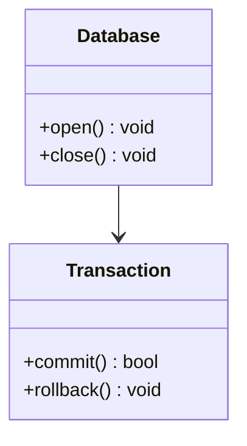
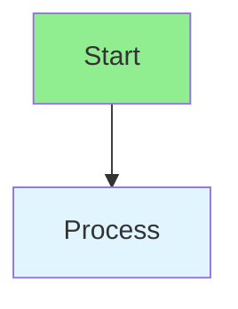

# CLAUDE.md

This file provides guidance to Claude Code (claude.ai/code) when working with code in this repository.

## Project Overview

Metrix is a high-performance, embeddable graph database engine written in C++20 with Cypher query support. It uses a
custom file-based storage system with segment-based architecture, ACID transactions via Write-Ahead Logging (WAL), and
supports advanced features like vector indexes.

## Build System

The project uses **Meson** as the build system with **Conan** for dependency management and **Ninja** as the backend.

### Essential Commands

```bash
# Full build with dependency installation, tests, and coverage
./scripts/run_tests.sh

# Quick build (skip Conan install if dependencies already exist)
./scripts/run_tests.sh --quick

# Generate HTML coverage report
./scripts/run_tests.sh --html

# Manual build steps
conan install . --output-folder=buildDir --build=missing -s build_type=Debug -s compiler.cppstd=20
meson setup buildDir --native-file buildDir/conan_meson_native.ini
meson compile -C buildDir

# Run specific test (tests are auto-discovered from test_*.cpp files)
meson test -C buildDir <test_name>

# Build release version
./scripts/build_release.sh
```

### Test Structure

- Tests use **Google Test** framework
- Test files follow naming pattern `test_*.cpp` and are automatically discovered by Meson
- Each test file builds as a separate executable
- Tests link against internal static library `metrix_core`
- Coverage uses LLVM instrumentation (`-fprofile-instr-generate -fcoverage-mapping`)

```bash
# View coverage details for a specific file
./scripts/run_tests.sh --quick --file xxx.cpp
```

### Unit Testing Requirements

**CRITICAL**: When working with unit tests, follow these principles:

1. **Root Cause Analysis**: Never blindly adjust test code just to make tests pass. Always analyze whether the issue
   lies in:
    - The source code (implementation bug, logic error, missing edge case)
    - The test code (incorrect assertion, wrong test setup, invalid test scenario)

2. **Fix the Root Cause**:
    - If the **source code** has a bug → Fix the source code
    - If the **test code** is wrong → Fix the test code
    - Ensure tests validate actual behavior, not work around bugs

3. **Test Validity**:
    - Tests should be meaningful and verify correct behavior
    - Tests should cover edge cases, error conditions, and boundary scenarios
    - Avoid tests that always pass regardless of implementation correctness
    - Each test should be independent and isolated

4. **Coverage Goals**:
    - Aim for 95%+ coverage across all metrics (line, branch, function, region)
    - Focus on branch coverage in particular
    - Add tests for uncovered branches, not just lines

### Test Requirement Extraction

When extracting test requirements from source code or user requests, follow this systematic approach:

#### 1. Understand the Testing Context

**Unit Tests vs Integration Tests:**

- **Unit Tests** (`tests/src/`): Test individual components in isolation
    - Mock external dependencies where appropriate
    - Test internal logic, edge cases, and error conditions
    - Focus on code paths and branch coverage
    - Located in `tests/src/<module>/` matching the source structure

- **Integration Tests** (`tests/integration/`): Test complete system workflows
    - Test real database operations end-to-end
    - Verify ACID properties, persistence, and data recovery
    - Test complex query workflows and multi-component interactions
    - Use real database instances with temporary files

#### 2. Extract Test Requirements from Code

When analyzing source code to identify test requirements:

**For Classes/Structures:**

- Public API methods → Functional tests
- Private/internal methods → Consider white-box testing if critical
- Constructors/destructors → Lifecycle tests
- Getters/setters → Property access tests

**For Control Flow:**

- `if/else` branches → Test both true and false paths
- `for/while` loops → Test with 0, 1, and N iterations
- Switch/case statements → Test each case
- Exception handling → Test error conditions

**For State Management:**

- State transitions → Test valid and invalid transitions
- Default values → Verify initialization
- State queries → Test state retrieval

**For Data Structures:**

- Empty collections → Test edge cases
- Single element → Test minimal case
- Multiple elements → Test normal operation
- Boundary conditions → Test limits (max size, etc.)

#### 3. Reference Contribution Guidelines

**IMPORTANT**: For testing standards, code patterns, and contribution guidelines, **always consult `CONTRIBUTING.md`**
in the project root directory.

Key requirements from CONTRIBUTING.md:

- Testing standards and best practices
- Temporary file handling for cross-platform compatibility
- **Enum naming guidelines for Windows macro conflict avoidance**
- Code style and formatting guidelines
- Pull request requirements

### ⚠️ Windows Platform Compatibility: Enum Naming

**CRITICAL**: This project must compile on Windows without requiring `#define NOMINMAX` workarounds.

**Problem**: Windows headers define macros that conflict with common enum member names:
- `min`, `max` - yes, lowercase (from `<windef.h>`)
- `AND`, `OR`, `XOR`, `NOT`
- `DELETE`, `CREATE`, `OPEN`, `MODIFY`
- `FILTER`, `EXTRACT`

**Solution**: All enum members use prefixes to avoid conflicts:

```cpp
// Binary operators: BOP_* prefix
BinaryOperatorType { BOP_ADD, BOP_AND, BOP_OR, BOP_XOR }

// Unary operators: UOP_* prefix
UnaryOperatorType { UOP_MINUS, UOP_NOT }

// Aggregate functions: AGG_* prefix
AggregateFunctionType { AGG_COUNT, AGG_MIN, AGG_MAX }

// Comprehensions: COMP_* prefix
ComprehensionType { COMP_FILTER, COMP_EXTRACT, COMP_REDUCE }
```

**When adding new enum types**: ALWAYS use descriptive prefixes (3-5 chars) followed by underscore.
This prevents Windows macro conflicts and improves code clarity.

## Git Commit Guidelines

**CRITICAL**: When creating git commits, you MUST strictly follow the guidelines in `CONTRIBUTING.md`. Failure to comply
will result in rejected commits.

### Mandatory Commit Message Requirements

When executing `git commit`, follow these rules from `CONTRIBUTING.md`:

1. **Use Imperative Mood**: "Fix bug" not "Fixed bug" or "Fixes bug"
2. **Be Specific**: Describe what was changed and why
3. **Keep it Focused**: One logical change per commit
4. **NO Co-Authored-By**: Do NOT include `Co-Authored-By` trailers in commit messages

## Architecture

### Layered Architecture

```
Applications (CLI, Benchmark)
         ↓
   Public API (C++ & C)
         ↓
   Query Engine (Parser → Planner → Executor)
         ↓
   Storage Layer (FileStorage, WAL, State Management)
         ↓
   Core (Database, Transaction, Entity Management)
```

### Key Components

#### Database (`include/graph/core/Database.hpp`)

- Main entry point for database operations
- Manages lifecycle: open, close, transactions
- Coordinates between storage engine and query engine
- Provides access to `FileStorage` and `QueryEngine`

#### Storage System (`include/graph/storage/FileStorage.hpp`)

- **Segment-based storage**: Custom file format with checksums and compression
- **Component hierarchy**:
    - `FileHeaderManager`: Manages file-level metadata
    - `SegmentTracker`: Tracks segment allocation and usage
    - `DataManager`: Handles node/edge/property data
    - `IndexManager`: Manages label and property indexes
    - `DeletionManager`: Tombstone management and space reclamation
    - `CacheManager`: LRU cache with dirty entity tracking
- **ACID compliance**: Full transaction support with WAL
- **State management**: Temporal state tracking via state chains

#### Query Engine (`include/graph/query/`)

- **Parser**: ANTLR4-based Cypher parser (generated code in `src/query/parser/cypher/`)
- **Planner**: Converts parsed Cypher to logical plans, optimizes with rule-based optimization
- **Executor**: Executes physical plans with various operators:
    - Scan operators: `NodeScanOperator`, traversal operations
    - Modification operators: `CreateNodeOperator`, `MergeNodeOperator`, `DeleteOperator`, etc.
    - Query operators: `FilterOperator`, `SortOperator`, `ProjectOperator`, etc.
    - Special operators: `VectorSearchOperator`, `TrainVectorIndexOperator` for vector indexes

#### Transaction System (`include/graph/core/Transaction.hpp`)

- ACID transactions with full rollback capabilities
- Optimistic locking with versioning
- Coordinates with WAL for durability

#### Configuration (`include/graph/config/SystemConfigManager.hpp`)

- Dynamic runtime configuration
- Entity observer pattern for reactive updates
- Per-module configurations (logging, memory, etc.)

### Data Flow

1. **Database open**: `Database::open()` → `FileStorage::open()` → Initialize all components
2. **Query execution**: Cypher string → Parser → QueryPlanner → Optimizer → QueryExecutor → Storage operations
3. **Transaction**: `beginTransaction()` → Operations in context → commit/rollback → WAL updates
4. **Persistence**: Entity changes → DirtyEntityRegistry → CacheManager → FileStorage write → WAL

### Public API

- **C++ API**: `include/metrix/metrix.hpp` - Embeddable interface for C++ applications
- **C API**: `include/metrix/metrix_c_api.h` - C-compatible interface for FFI
- **Types**: `include/metrix/value.hpp` - Data type definitions
- CLI tool: `buildDir/apps/cli/metrix-cli` - Interactive REPL

### Directory Structure

```
include/
├── metrix/              # Public headers (API)
└── graph/               # Internal headers
    ├── core/           # Database, Transaction, Entity, State, Index
    ├── storage/        # FileStorage, WAL, cache, deletion management
    ├── query/          # Query engine (parser, planner, executor)
    ├── traversal/      # Graph traversal algorithms
    ├── config/         # Configuration management
    └── cli/            # CLI-specific components

src/
├── core/               # Core implementation
├── storage/            # Storage layer implementation
├── query/              # Query engine implementation
├── traversal/          # Traversal implementation
├── api/                # C API implementation
├── cli/                # CLI implementation
└── query/parser/       # Query parser implementation
    ├── common/         # Parser common interfaces and infrastructure
    │   └── IQueryParser.hpp  # Base interface for all DSL parsers
    └── cypher/         # Cypher query language parser
        ├── *.g4        # ANTLR4 grammar files (lexer and parser)
        ├── helpers/    # AST extraction, expression building, pattern building utilities
        ├── clauses/    # Cypher clause handlers (reading, writing, result, admin)
        ├── generated/  # ANTLR4 auto-generated code (DO NOT EDIT)
        └── *.cpp/hpp   # Parser implementation and visitor

apps/
├── cli/                # CLI application
└── benchmark/          # Performance benchmarking

tests/
├── integration/        # Integration tests (end-to-end workflows)
│   ├── test_IntegrationDatabase.cpp
│   ├── test_IntegrationCrud.cpp
│   ├── test_IntegrationQuery.cpp
│   ├── test_IntegrationTransaction.cpp
│   └── test_IntegrationPersistence.cpp
└── src/                # Unit tests (organized by module)
    ├── core/           # Core component tests
    ├── storage/        # Storage layer tests
    ├── query/          # Query engine tests
    │   ├── execution/operators/    # Operator unit tests
    │   ├── parser/cypher/           # Cypher query tests
    │   └── planner/                 # Query planner tests
    ├── traversal/      # Traversal algorithm tests
    └── vector/         # Vector index tests

scripts/                # Build and utility scripts
```

### Dependencies (via Conan)

- **boost**: Filesystem, system utilities
- **zlib**: Compression
- **gtest/gmock**: Testing framework
- **cli11**: Command line interface
- **antlr4-cppruntime**: Cypher parser generation

### Important Implementation Notes

1. **Segment Architecture**: All data is stored in fixed-size segments with bitmap tracking for space management
2. **State Chains**: All persistent modifications go through state chains for versioning and rollback
3. **Dirty Tracking**: Modified entities are tracked via `DirtyEntityRegistry` for efficient persistence
4. **LRU Cache**: Hot entities are cached in memory with configurable eviction policy
5. **WAL Integration**: Write operations are logged to WAL before actual disk writes for durability
6. **Parser Generation**: ANTLR4 grammar files are in `src/query/parser/cypher/` - generated code should not be manually edited
   - **IMPORTANT**: When modifying `.g4` grammar files, you MUST regenerate the parser code
   - Use the provided script: `src/query/parser/cypher/generate.sh`
   - This script downloads ANTLR4 JAR if needed and regenerates all C++ parser files
   - Always run `bash src/query/parser/cypher/generate.sh` after modifying `CypherLexer.g4` or `CypherParser.g4`
   - The generated files are placed in `src/query/parser/cypher/generated/` directory

### Regenerating ANTLR4 Parser

When you modify the Cypher grammar files (`*.g4`), you MUST regenerate the parser code:

```bash
# Navigate to the cypher parser directory
cd src/query/parser/cypher

# Run the generation script
bash generate.sh
```

The `generate.sh` script will:
1. Download ANTLR4 JAR (version 4.13.1) if not present
2. Generate C++ lexer and parser from the grammar files
3. Generate visitor classes for AST traversal
4. Place all generated files in the `generated/` directory

**After regenerating**:
1. Review the generated files to ensure they look correct
2. Run tests to verify everything works: `./scripts/run_tests.sh --quick`
3. Commit both the grammar changes AND the generated files together

## Unsupported Cypher Features

**IMPORTANT**: For currently unsupported Cypher syntax features, see `UNSUPPORTED_CYHER_FEATURES.md` in the project root
directory.

### Library Build Outputs

- **`metrix_core`**: Internal static library for tests and CLI (not installed)
- **`libmetrix`**: Public shared library for embedding (installed to system)
- **pkg-config**: Generated for easy integration (`pkg-config --libs --cflags Metrix`)

## Documentation Standards

**CRITICAL**: When creating or modifying documentation, you MUST follow these standards strictly.

### Visual Diagrams

1. **NO ASCII ART**: Absolutely NO hand-drawn ASCII art diagrams using box-drawing characters (┌│└─│/\ etc.)
   - ASCII art is difficult to maintain, error-prone, and renders poorly
   - Always use proper diagramming tools instead

2. **Use Mermaid Diagrams**: All diagrams MUST use Mermaid syntax
   - **Supported types**: `classDiagram`, `flowchart TD/LR`, `graph TD/LR`
   - **State diagrams**: `stateDiagram-v2`
   - **Sequence diagrams**: `sequenceDiagram`
   - **Entity Relationship**: `erDiagram`

3. **Color Restrictions**: Mermaid diagrams MUST use ONLY black, white, and gray colors
   - **FORBIDDEN colors**: `fill:#90EE90`, `fill:#e1f5ff`, `fill:#ff0`, `fill:#f9f`, `fill:lightblue`, etc.
   - **ALLOWED colors**:
     - No color styling (default black/white) - **PREFERRED**
     - Grays only: `fill:#f0f0f0`, `fill:#e0e0e0`, `fill:#d0d0d0` - if necessary for contrast
   - **Rationale**: Colorful diagrams appear unprofessional and may not print well. Simple grayscale diagrams are cleaner and more publication-ready.

4. **Diagram Clarity**: Diagrams should be:
   - Simple and focused on the key concept
   - Professional and publication-ready
   - Easy to understand without excessive visual noise
   - Consistent in style across all documentation

### Code Examples

1. **Real Code Only**: All code examples MUST come from actual implementation
   - No hypothetical or pseudo-code
   - Copy directly from source files in the codebase
   - Include file paths for reference

2. **Code Formatting**:
   - Use proper Markdown code blocks with language tags (```cpp, ```bash, etc.)
   - Include necessary context and comments
   - Keep examples focused and concise

3. **Accuracy**: Verify all code examples are accurate and compile/test if possible

### Bilingual Documentation

1. **Chinese and English**: All documentation MUST exist in both languages
   - English files: `docs/en/...`
   - Chinese files: `docs/zh/...`
   - Both versions must be kept in sync

2. **Translation Quality**:
   - Chinese translations must be technically accurate, not machine-translated
   - Use proper technical terminology
   - Maintain consistency across documents

3. **File Organization**:
   - Mirror directory structure between `docs/en/` and `docs/zh/`
   - Same filenames in both languages
   - Consistent navigation and cross-references

### Content Structure

1. **Hierarchy**: Use clear section hierarchy (##, ###, ####)
2. **Cross-references**: Link to related documentation liberally
3. **Tables**: Use Markdown tables for comparisons and structured data
4. **Lists**: Use bullet points for clarity and readability

### VitePress Configuration

1. **Sidebar Updates**: When adding new documentation files:
   - Update both `docs/.vitepress/config/en.ts` and `docs/.vitepress/config/zh.ts`
   - Maintain parallel structure between configs
   - Add descriptive link text

2. **Navigation**: Ensure proper navigation highlighting using `activeMatch` with plain strings (not regex)

### Review Checklist

Before submitting documentation changes, verify:
- [ ] No ASCII art diagrams present
- [ ] All Mermaid diagrams use only black/white/gray colors
- [ ] Code examples are from actual implementation
- [ ] Both English and Chinese versions exist and are in sync
- [ ] VitePress config files updated (if adding new files)
- [ ] All links and cross-references work correctly
- [ ] Diagrams render correctly in the documentation site

### Examples

**GOOD - Clean Mermaid diagram:**


**BAD - ASCII art (FORBIDDEN):**
```
┌─────────────┐
│  Database   │
├─────────────┤
│  open()     │
│  close()    │
└─────────────┘
```

**BAD - Colorful Mermaid (FORBIDDEN):**

