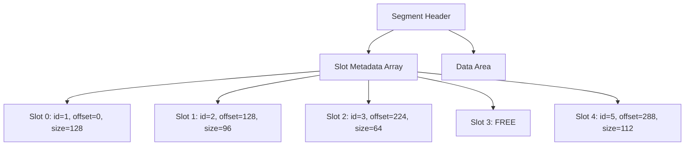

# Bitmap Indexing

ZYX uses bitmap structures to track free and used slots within segments. Each segment maintains metadata about which slots are occupied, enabling O(1) slot allocation checks and efficient space utilization tracking.

## How Slot Tracking Works

Each segment header records the total slot count and current data usage. Slot metadata is stored as an array within the segment, where each entry tracks:

- **Entity ID**: The ID assigned to the entity stored in this slot
- **Data offset**: Byte offset within the segment's data area
- **Data size**: Size of the entity data in bytes
- **Flags**: Active/inactive status and other per-slot flags

When an entity is written to a segment, a slot is claimed from the free pool. The `IDAllocator` determines the entity ID, and the segment records the slot metadata. When an entity is deleted, its slot is marked inactive, and the ID is returned to the allocator's volatile intervals.

## Allocation Strategy

ZYX uses a **first-available** slot allocation strategy within segments:

1. When a new entity is created, the system walks the segment chain for the appropriate entity type
2. The first segment with available slot capacity and sufficient data space is selected
3. If no existing segment has room, a new segment is allocated at the end of the file
4. The slot metadata entry is populated with the entity's ID and data location

This approach avoids fragmentation within segments because entity data is written sequentially into the data area, and slot metadata grows independently.

## Space Efficiency

Slot tracking adds minimal overhead:

| Component | Size | Notes |
|-----------|------|-------|
| Segment header | 40 bytes | Fixed per segment |
| Per-slot metadata | ~32 bytes | ID, offset, size, flags |
| Data area alignment | 8 bytes | Aligned for cross-platform access |

For a 128 KB segment, the typical slot capacity ranges from hundreds (for large entities like Blob) to thousands (for small entities like Property).

## Integration with IDAllocator

The bitmap/slot tracking works together with `IDAllocator`:

- **Allocation**: `IDAllocator` assigns an ID, segment allocator finds a slot, entity is written
- **Deallocation**: Slot is marked inactive, ID returned to `IDAllocator`'s volatile intervals
- **Recovery**: WAL replay rebuilds slot state by re-applying committed writes

See [Segment Allocation](segment-allocation) for details on the full allocation pipeline.

## Source Locations

| Component | Path |
|-----------|------|
| Segment headers | `include/graph/storage/StorageHeaders.hpp` |
| SegmentAllocator | `include/graph/storage/SegmentAllocator.hpp` |
| IDAllocator | `include/graph/core/IDAllocator.hpp` |
