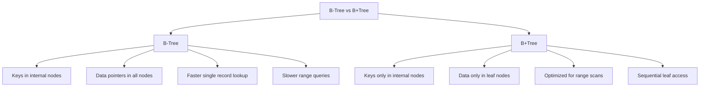
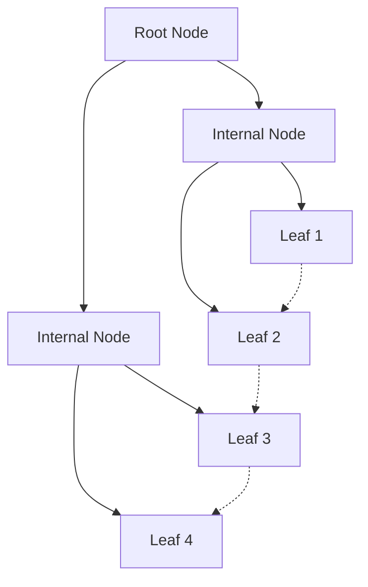
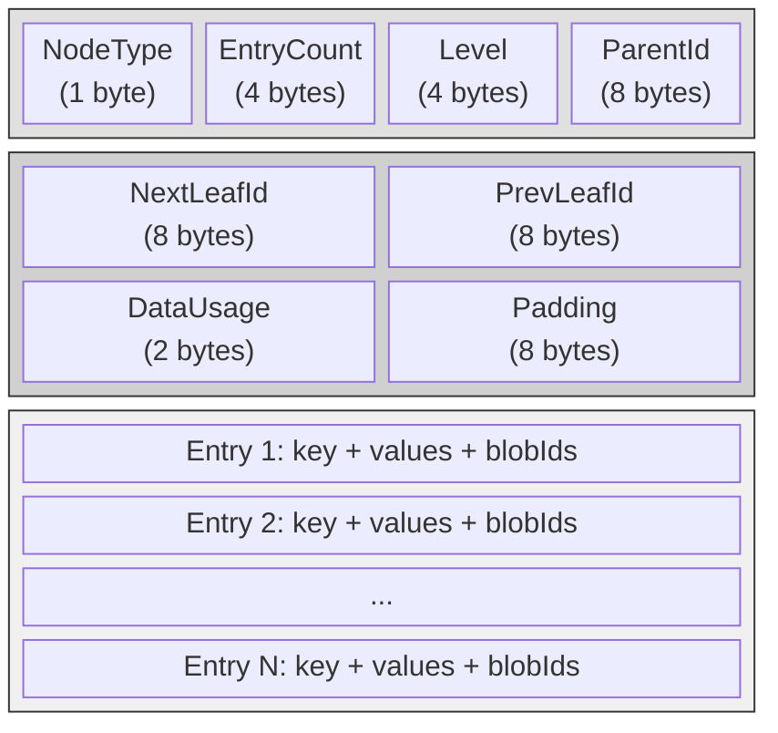
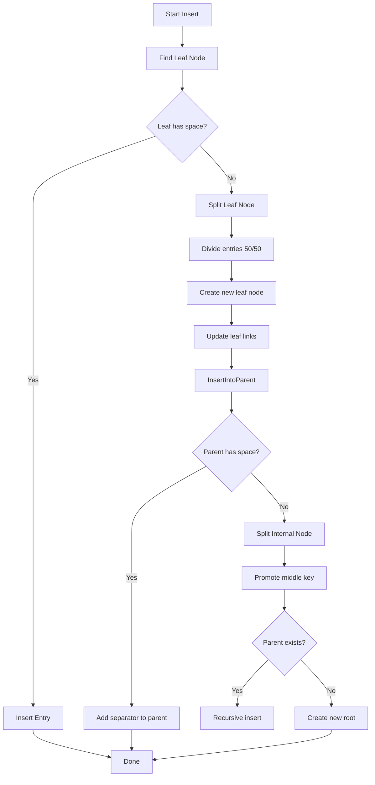
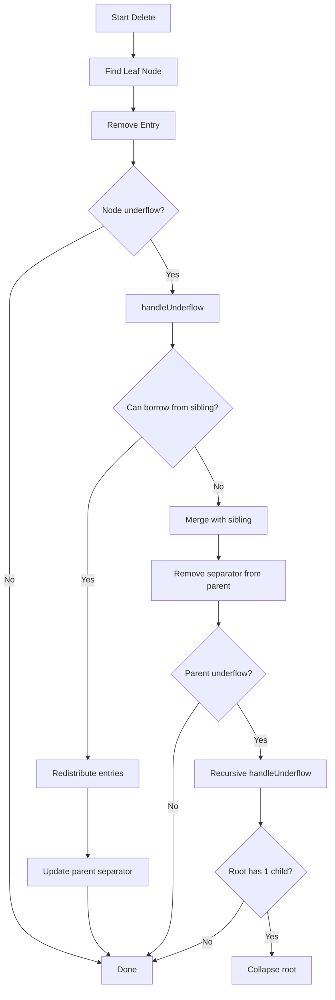
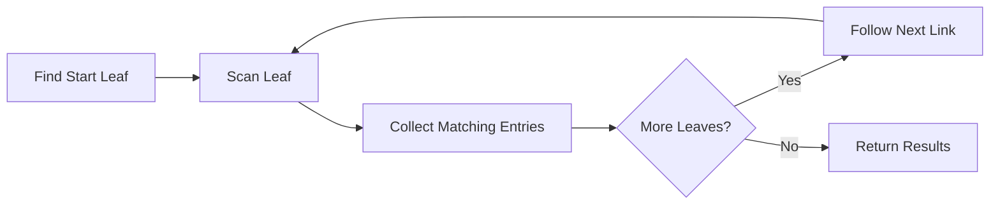

# B+Tree Indexing

ZYX uses B+Tree data structures for efficient indexing of labels and properties, providing fast lookups, range queries, and ordered traversal. The implementation is optimized for disk-based storage with support for large keys and values through blob storage.

## Overview

B+Tree is a self-balancing tree data structure that maintains sorted data and allows searches, sequential access, insertions, and deletions in logarithmic time. It is optimized for storage systems where data is stored on disk.

### Key Features

- **Balanced Structure**: All leaf nodes at the same level
- **Ordered Data**: Keys stored in sorted order for range queries
- **High Fanout**: Minimizes tree height for fewer disk I/Os
- **Leaf Linking**: Doubly-linked leaf nodes for sequential access
- **Node Splitting/Merging**: Automatic balancing on insert/delete
- **Blob Support**: Handles oversized keys and value lists

## B+Tree vs B-Tree

### Why B+Tree for Databases?



**Key Differences**:

| Feature | B-Tree | B+Tree |
|---------|--------|--------|
| Data Storage | All nodes | Leaf nodes only |
| Leaf Links | None | Doubly-linked |
| Range Queries | Slower (tree traversal) | Faster (sequential scan) |
| Fanout | Lower | Higher (more pointers) |
| Disk I/O | More for ranges | Optimized for sequential access |

## B+Tree Structure

### Node Layout



**B+Tree Structure:**
- Root Node: Level 2
- Internal Nodes: Level 1
- Leaf Nodes: Level 0 (all at same level)
- Doubly-linked leaf nodes for sequential access

### Internal Node Structure

Internal nodes contain separator keys and child pointers. Each child pointer is associated with a separator key that divides the key space. The first child has a dummy key (representing negative infinity) and subsequent children are paired with the key value that separates their key ranges.

```mermaid
classDiagram
    class InternalNode {
        +NodeType: INTERNAL
        +EntryCount: 3
        +ChildCount: 4
        +Level: 1
        +ParentId: 100
        +getChildren()
    }

    class ChildEntry {
        +Key: PropertyValue
        +ChildId: int64_t
    }

    InternalNode "1" --> "4" ChildEntry : contains
    ChildEntry : [DummyKey] -> ChildId: 200
    ChildEntry : [Key: 50] -> ChildId: 201
    ChildEntry : [Key: 100] -> ChildId: 202
    ChildEntry : [Key: 150] -> ChildId: 203
```

**Search Logic**: For a key K, find the largest separator key that is less than or equal to K, then traverse to that child.

### Leaf Node Structure

Leaf nodes contain the actual key-value pairs along with next and previous leaf pointers that form a doubly-linked list across all leaf nodes.

```mermaid
classDiagram
    class LeafNode {
        +NodeType: LEAF
        +EntryCount: 4
        +Level: 0
        +ParentId: 100
        +NextLeafId: 202
        +PrevLeafId: 200
        +getEntries()
    }

    class Entry {
        +Key: PropertyValue
        +Values: vector~int64_t~
        +KeyBlobId: int64_t
        +ValuesBlobId: int64_t
    }

    LeafNode "1" --> "4" Entry : contains
    Entry : [Key: 10] -> [Values: 1, 5, 8]
    Entry : [Key: 25] -> [Values: 3]
    Entry : [Key: 40] -> [Values: 7, 9]
    Entry : [Key: 45] -> [Values: 2, 4, 6]
```

**Entry Structure**: Each entry stores the indexed key, a vector of entity IDs that share that key value, and optional blob IDs. The `keyBlobId` field holds a reference to blob storage when the key itself exceeds the inline threshold. The `valuesBlobId` field holds a reference to blob storage when the list of entity IDs grows too large to fit inline.

### Node Memory Layout

Each B+Tree node occupies a fixed 256-byte block divided into two regions:



- **Metadata region** (43 bytes): Contains the node type (leaf or internal), entry count, tree level, parent pointer, and for leaf nodes the next/previous leaf pointers. This overhead is fixed regardless of content.
- **Data region** (213 bytes): Stores the actual entries (key-value pairs for leaves, separator-child pairs for internal nodes). Entries are packed sequentially; oversized data is offloaded to blob storage.

## Node Size and Capacity

### Storage Parameters

ZYX uses fixed-size 256-byte nodes to align with storage block boundaries. Each node dedicates 43 bytes to metadata (node type, level, parent ID, leaf link pointers, data usage tracking) and 213 bytes to actual entry data. This layout ensures predictable I/O behavior and simplifies space management.

### Capacity Calculations

**Leaf Node Entry Capacity**:
- Small inline entries: approximately 20-30 entries per node
- With blob storage for oversized data: effectively unlimited entries

**Internal Node Fanout**:
- Typical fanout: 40-50 children per internal node
- Tree height for 1M entries: log50(1,000,000) is approximately 3-4 levels

## Insertion Algorithm

### Process Flow



### Insert Walkthrough

When a property value is added to the index, the system routes it to the appropriate `IndexTreeManager` based on the value's type (integer, string, double, boolean). The tree manager then locates the correct leaf node by traversing from the root through internal nodes using the separator key comparison logic.

If the target leaf has sufficient space, the entry is inserted in sorted order and the operation completes. When the leaf is full, a 50/50 split occurs: a new sibling leaf node is created, entries are divided evenly between the original and new node, and the doubly-linked leaf chain is updated. The first key of the new (right) node becomes the separator key that is propagated up to the parent.

This propagation may cascade if the parent is also full, causing the parent to split in turn. In the worst case, splits propagate all the way to the root, at which point a new root is created with two children, increasing the tree height by one.

### Node Splitting (50/50 Distribution)

Leaf splitting divides entries evenly between two nodes. The original (left) node keeps the first half of entries, while the new (right) node receives the second half. After the split, the leaf chain is repaired: the left node's next pointer and the right node's previous pointer are updated to maintain the doubly-linked list. The separator key (the first key in the right node) is then inserted into the parent.

Internal node splitting follows the same 50/50 principle but includes an extra step: the middle key is promoted upward as the separator rather than remaining in either child.

## Deletion Algorithm

### Process Flow



### Underflow Detection

After removing an entry, the system checks whether the node has fallen below the underflow threshold. The threshold is set at 40% of the total node size (256 bytes), meaning a node is considered underfull when its data usage drops below approximately 102 bytes. An empty node is always treated as underfull regardless of the threshold.

The 40% ratio (defined by `UNDERFLOW_THRESHOLD_RATIO = 0.4`) balances two concerns: a lower threshold would tolerate more wasted space and trigger fewer merges, while a higher threshold would cause frequent merging and redistribution. The chosen value allows nodes to be moderately sparse without triggering excessive rebalancing.

### Redistribution

When a node underflows but one of its siblings has entries to spare, the system redistributes entries between them. For leaf nodes, the last entry from the left sibling (or the first entry from the right sibling) is moved to the underfull node. The parent's separator key is then updated to reflect the new boundary between the two nodes.

This is preferred over merging because it does not reduce the total number of nodes and avoids propagating changes further up the tree.

### Node Merging

When both the underfull node and its sibling are too sparse to allow redistribution, the two nodes are merged into one. For leaf nodes, all entries from the right node are appended to the left node, and the doubly-linked leaf chain is updated to skip the removed node. For internal nodes, the parent's separator key is pulled down into the merged node along with all child entries from both nodes.

After merging, the right node is deleted and the parent loses one separator-child pair. This may cause the parent itself to underflow, triggering recursive rebalancing up the tree. If rebalancing reaches the root and the root is left with only one child, the root is collapsed (replaced by its sole child), reducing the tree height by one.

## Search Operations

### Exact Match Search

Exact match search traverses the tree from root to leaf. At each internal node level, the algorithm locates the appropriate child by finding the largest separator key that is less than or equal to the search key. Once the leaf level is reached, the entries are scanned for an exact key match, and the associated vector of entity IDs is returned.

**Search Path**:
1. Start at root
2. At each internal node, find the appropriate child using separator keys
3. Traverse down to the leaf level
4. Scan the leaf for a matching key and return its values

**Time Complexity**: O(log_n N) where n is the fanout and N is the total number of entries.

### Range Query

Range queries leverage the doubly-linked leaf structure for efficient sequential scanning. The algorithm first descends the tree to find the leaf node containing the minimum key of the range. From that starting leaf, it scans entries sequentially, collecting all entity IDs whose keys fall within the specified range. When a leaf is exhausted, the algorithm follows the next-leaf pointer to continue scanning in the adjacent leaf. Scanning stops when a key exceeding the maximum bound is encountered or when no more leaves remain.



**Time Complexity**: O(log_n N + K) where K is the number of entries in the result range. The logarithmic term accounts for finding the starting leaf, and the linear term covers the sequential scan through linked leaves.

## Blob Storage for Large Data

### When Keys/Values Do Not Fit Inline

Each node has limited inline storage (213 bytes of data). When a key or a value list exceeds the 32-byte inline threshold, it is serialized to a separate blob storage area and only its blob ID is kept in the node entry.

**Inline Thresholds**:
- Internal keys: 32 bytes -- keys longer than this are stored as blobs
- Leaf keys: 32 bytes -- same threshold for leaf-level keys
- Leaf values: 32 bytes -- the serialized value list must fit within this limit

**Blob Storage Strategy**:

The `Entry` structure contains two blob ID fields alongside its inline data. The `keyBlobId` field is set to a non-zero value when the key has been offloaded to blob storage. Similarly, `valuesBlobId` is set when the entity ID list is too large. On read access, the system checks these blob IDs and retrieves the full data from blob storage when necessary. This two-tier approach keeps common (small) entries compact within the node while supporting arbitrarily large keys and value lists without sacrificing node capacity.

## Time and Space Complexity

### Time Complexity

| Operation | Average Case | Worst Case |
|-----------|--------------|------------|
| Search (exact) | O(log N) | O(log N) |
| Insert | O(log N) | O(log N) |
| Delete | O(log N) | O(log N) |
| Range Query | O(log N + K) | O(log N + K) |
| Sequential Scan | O(K) | O(K) |

Where:
- N = total number of entries
- K = number of entries in result/range

### Space Complexity

| Component | Space |
|-----------|-------|
| Node Size | 256 bytes (fixed) |
| Metadata per Node | 43 bytes |
| Data per Node | 213 bytes |
| Total Tree Size | O(N) |

**Fanout Calculation**:
- Pointer size: 8 bytes
- Key size: varies (typically 4-16 bytes)
- Child entry: approximately 16-24 bytes
- Fanout: 213 / 16 is approximately 13 children (conservative estimate)
- Actual fanout: 40-50 with optimization

## Disk I/O Characteristics

### I/O per Operation

| Operation | Disk Reads | Disk Writes |
|-----------|------------|-------------|
| Search | O(log_n N) | 0 |
| Insert | O(log_n N) | O(log_n N) |
| Delete | O(log_n N) | O(log_n N) |
| Range Query | O(log_n N + K/b) | 0 |

Where:
- n = fanout (number of children per internal node)
- N = total entries
- K = result size
- b = branching factor (entries per leaf node)

### Optimization Strategies

1. **High Fanout**: Minimizes tree height
2. **Node Size**: 256 bytes fits in disk blocks
3. **Sequential Scanning**: Leaf linking enables range queries without tree re-traversal
4. **Batch Operations**: Reduces I/O for bulk inserts

**Example**: For 1 million entries with fanout 50:
- Tree height: ceil(log50(1,000,000)) = 4 levels
- Max I/O per search: 4 disk reads

## Concurrent Operations

### Locking Strategy

The `IndexTreeManager` uses a `std::shared_mutex` to coordinate concurrent access. This reader-writer lock allows multiple threads to perform read operations simultaneously while ensuring that write operations have exclusive access.

**Lock Types**:
- **Shared Lock**: Acquired for read operations (exact match search, range query). Multiple readers can hold shared locks concurrently, allowing high throughput for lookup-heavy workloads.
- **Exclusive Lock**: Acquired for write operations (insert, remove, clear). Only one writer can hold the lock at a time, and all readers are blocked during writes.

This approach favors read-heavy access patterns, which are typical for graph database index lookups. Write operations are serialized but benefit from the fact that the tree structure changes (splits and merges) are relatively infrequent compared to the total number of operations.

## Use in ZYX

### Label Index

The label index maps label tokens to entity IDs using a B+Tree. Each unique label has its own tree root stored in an in-memory map. When a node is assigned a label, the node's ID is inserted into the tree rooted at that label's root. Lookups traverse the tree to find the label's entry and return all associated entity IDs.

### Property Index

The property index maintains separate `IndexTreeManager` instances for each property value type: string, integer, double, and boolean. This type-segregated approach ensures that comparisons within a tree are always type-consistent and avoids the complexity of cross-type ordering.

For each property name, a tree root is tracked per type. Exact match queries route to the appropriate tree manager and perform a standard B+Tree lookup. Range queries (applicable to numeric types) use the linked-leaf scan described earlier to collect all entity IDs whose property values fall within the specified bounds.

## Configuration Parameters

### Node Size

The total node size is fixed at 256 bytes. This value was chosen as a balance: larger nodes would provide higher fanout and shorter trees but would increase the I/O cost of reading and writing each node. Smaller nodes would reduce per-node I/O but require more levels in the tree. At 256 bytes, the node fits comfortably within typical storage block sizes while providing adequate fanout for most datasets.

### Underflow Threshold

The underflow threshold ratio is set to 0.4 (40%). This means a node is considered underfull when its data usage drops below 40% of the total node size. The trade-off is between merge frequency and space utilization: a lower threshold tolerates more wasted space but reduces rebalancing overhead, while a higher threshold keeps nodes dense at the cost of more frequent merges and redistributions. The 40% value provides a practical balance.

### Inline Thresholds

All inline thresholds (internal keys, leaf keys, and leaf values) are set to 32 bytes. Data within this limit is stored directly in the node entry. Data exceeding the threshold is offloaded to blob storage with only a blob ID retained inline. The 32-byte threshold accommodates most common property values (small integers, short strings, booleans) while keeping the node entry format compact.

## Performance Considerations

### Optimization Techniques

1. **Batch Insertion**: The `insertBatch` method accepts a collection of key-value pairs, sorts them, and coalesces duplicates before inserting them into the tree. This reduces the number of tree restructuring operations compared to inserting entries one at a time.

2. **Single-Pass Insert**: The `tryInsertEntry` method combines deserialization, insertion, and serialization into a single pass over the node data. This avoids the overhead of deserializing a node, modifying it, and re-serializing it as separate steps.

3. **Cached Nodes**: Frequently accessed nodes are cached in memory by the page buffer pool, reducing disk I/O for hot index data. This is especially effective for upper tree levels, which are accessed on every operation.

### Benchmarks

Typical performance characteristics:

| Metric | Value |
|--------|-------|
| Entries per Leaf | 20-30 |
| Fanout | 40-50 |
| Tree Height (1M entries) | 3-4 levels |
| Search Time | approximately 4 disk reads |
| Insert Time | approximately 4 disk reads + 4 disk writes |
| Range Query | O(log N + K/b) |

## Best Practices

1. **Index Selectively**: Only index frequently queried properties
2. **Use Appropriate Types**: Choose numeric types for range queries
3. **Batch Operations**: Use batch insertion for bulk loads
4. **Monitor Tree Height**: Rebuild if tree grows too tall
5. **Configure Thresholds**: Tune for workload characteristics

## Source

- Header: `include/graph/core/IndexTreeManager.hpp`
- Implementation: `src/core/IndexTreeManager.cpp`

## See Also

- [Storage System](/en/docs/zyx/architecture/storage) - Overall storage architecture
