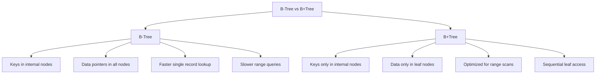
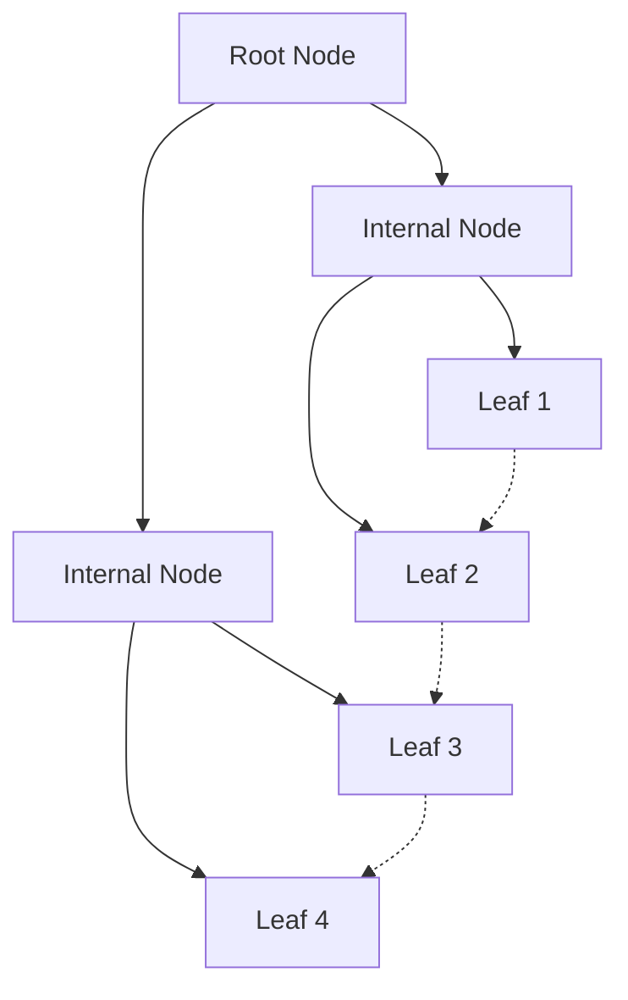
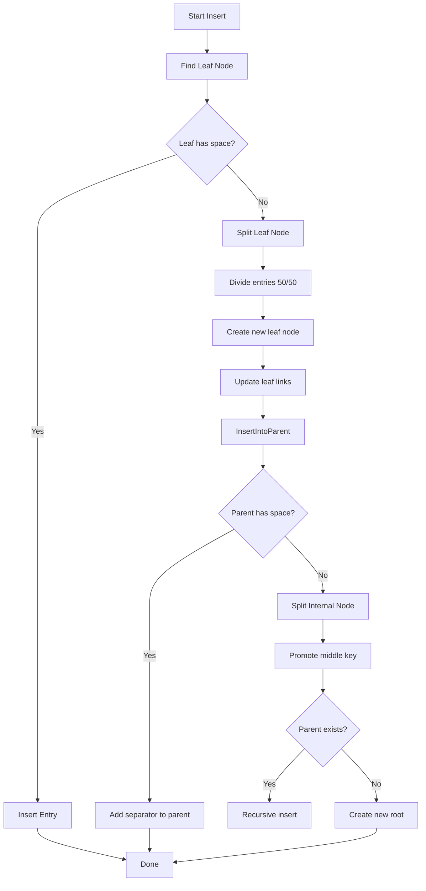
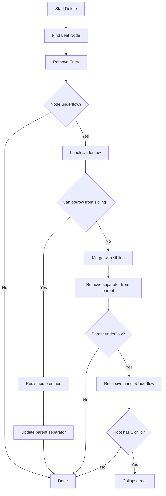
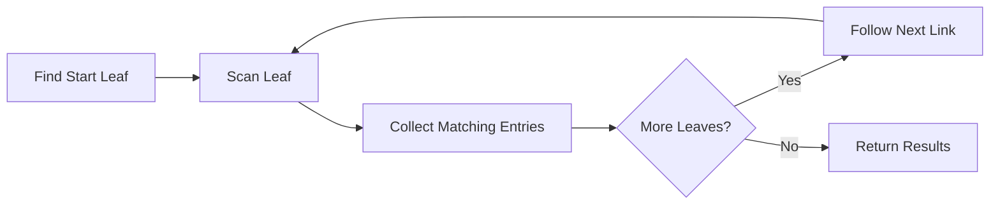

# B+Tree Indexing

ZYX uses B+Tree data structures for efficient indexing of labels and properties, providing fast lookups, range queries, and ordered traversal. The implementation is optimized for disk-based storage with support for large keys and values through blob storage.

## Overview

B+Tree is a self-balancing tree data structure that maintains sorted data and allows searches, sequential access, insertions, and deletions in logarithmic time. It is optimized for storage systems where data is stored on disk.

### Key Features

- **Balanced Structure**: All leaf nodes at the same level
- **Ordered Data**: Keys stored in sorted order for range queries
- **High Fanout**: Minimizes tree height for fewer disk I/Os
- **Leaf Linking**: Doubly-linked leaf nodes for sequential access
- **Node Splitting/Merging**: Automatic balancing on insert/delete
- **Blob Support**: Handles oversized keys and value lists

## B+Tree vs B-Tree

### Why B+Tree for Databases?



**Key Differences**:

| Feature | B-Tree | B+Tree |
|---------|--------|--------|
| Data Storage | All nodes | Leaf nodes only |
| Leaf Links | None | Doubly-linked |
| Range Queries | Slower (tree traversal) | Faster (sequential scan) |
| Fanout | Lower | Higher (more pointers) |
| Disk I/O | More for ranges | Optimized for sequential access |

## B+Tree Structure

### Node Layout



**B+Tree Structure:**
- Root Node: Level 2
- Internal Nodes: Level 1
- Leaf Nodes: Level 0 (all at same level)
- Doubly-linked leaf nodes for sequential access

### Internal Node Structure

Internal nodes contain separator keys and child pointers:

```mermaid
classDiagram
    class InternalNode {
        +NodeType: INTERNAL
        +EntryCount: 3
        +ChildCount: 4
        +Level: 1
        +ParentId: 100
        +getChildren()
    }

    class ChildEntry {
        +Key: PropertyValue
        +ChildId: int64_t
    }

    InternalNode "1" --> "4" ChildEntry : contains
    ChildEntry : [DummyKey] -> ChildId: 200
    ChildEntry : [Key: 50] -> ChildId: 201
    ChildEntry : [Key: 100] -> ChildId: 202
    ChildEntry : [Key: 150] -> ChildId: 203
```

**Search Logic**: For a key K, find the largest separator key ≤ K, traverse to that child.

### Leaf Node Structure

Leaf nodes contain actual key-value pairs with linked list pointers:

```mermaid
classDiagram
    class LeafNode {
        +NodeType: LEAF
        +EntryCount: 4
        +Level: 0
        +ParentId: 100
        +NextLeafId: 202
        +PrevLeafId: 200
        +getEntries()
    }

    class Entry {
        +Key: PropertyValue
        +Values: vector~int64_t~
        +KeyBlobId: int64_t
        +ValuesBlobId: int64_t
    }

    LeafNode "1" --> "4" Entry : contains
    Entry : [Key: 10] -> [Values: 1, 5, 8]
    Entry : [Key: 25] -> [Values: 3]
    Entry : [Key: 40] -> [Values: 7, 9]
    Entry : [Key: 45] -> [Values: 2, 4, 6]
```

**Entry Structure**:
```cpp
struct Entry {
    PropertyValue key;           // The indexed key
    std::vector<int64_t> values; // Entity IDs with this key
    int64_t keyBlobId;           // Blob ID for oversized keys
    int64_t valuesBlobId;        // Blob ID for oversized value lists
};
```

## Node Size and Capacity

### Storage Parameters

```cpp
constexpr size_t TOTAL_INDEX_SIZE = 256;  // Total node size in bytes
constexpr size_t METADATA_SIZE = 43;      // Metadata overhead
constexpr size_t DATA_SIZE = 213;         // Available data space
```

### Capacity Calculations

**Leaf Node Entry Capacity**:
- Small inline entries: ~20-30 entries per node
- With blob storage: Can store many more entries

**Internal Node Fanout**:
- Typical fanout: 40-50 children per internal node
- Tree height for 1M entries: log₅₀(1,000,000) ≈ 3-4 levels

## Insertion Algorithm

### Process Flow



### Insert Example

```cpp
// Insert property value into index
void PropertyIndex::addProperty(int64_t entityId,
                                const std::string& key,
                                const PropertyValue& value) {
    auto treeManager = getTreeManagerForType(value.getType());
    auto& rootId = getRootMapForType(value.getType())[key];

    // Insert into B+Tree
    rootId = treeManager->insert(rootId, value, entityId);
}
```

### Node Splitting

**Leaf Split** (50/50 distribution):
```cpp
void splitLeaf(Index& leaf, vector<Entry>& allEntries, int64_t& rootId) {
    // 1. Create sibling node
    int64_t newLeafId = createNewNode(NodeType::LEAF);
    Index newLeaf = dataManager_->getIndex(newLeafId);

    // 2. Split entries evenly
    size_t mid = allEntries.size() / 2;
    vector<Entry> leftEntries(allEntries.begin(), allEntries.begin() + mid);
    vector<Entry> rightEntries(allEntries.begin() + mid, allEntries.end());

    // 3. Update linked list
    newLeaf.setNextLeafId(leaf.getNextLeafId());
    newLeaf.setPrevLeafId(leaf.getId());
    leaf.setNextLeafId(newLeafId);

    // 4. Write data and propagate
    leaf.setAllEntries(leftEntries, dataManager_);
    newLeaf.setAllEntries(rightEntries, dataManager_);

    // 5. Insert separator key into parent
    PropertyValue separatorKey = rightEntries.front().key;
    insertIntoParent(leaf, separatorKey, newLeafId, rootId);
}
```

## Deletion Algorithm

### Process Flow



### Underflow Detection

```cpp
bool isUnderflow(double thresholdRatio) const {
    if (getEntryCount() == 0) return true;

    double currentUsage = static_cast<double>(metadata.dataUsage);
    double threshold = TOTAL_INDEX_SIZE * thresholdRatio;
    return currentUsage < threshold;
}
```

**Underflow Threshold**: 40% of node capacity

### Redistribution

Borrow entries from sibling to balance nodes:

```cpp
void redistribute(Index& node, Index& sibling, Index& parent, bool isLeftSibling) {
    if (node.isLeaf()) {
        // Borrow from left sibling
        auto nodeEntries = node.getAllEntries(dataManager_);
        auto siblingEntries = sibling.getAllEntries(dataManager_);

        // Move last entry from sibling to front of node
        Entry borrowed = std::move(siblingEntries.back());
        siblingEntries.pop_back();
        nodeEntries.insert(nodeEntries.begin(), std::move(borrowed));

        // Update parent separator
        parentChildren[nodeIdx].key = nodeEntries.front().key;

        node.setAllEntries(nodeEntries, dataManager_);
        sibling.setAllEntries(siblingEntries, dataManager_);
    }
}
```

### Node Merging

When siblings are both underfull, merge them:

```cpp
void mergeNodes(Index& leftNode, Index& rightNode,
                Index& parent, const PropertyValue& separatorKey,
                int64_t& rootId) {
    if (leftNode.isLeaf()) {
        // Merge leaf entries
        auto leftEntries = leftNode.getAllEntries(dataManager_);
        auto rightEntries = rightNode.getAllEntries(dataManager_);

        leftEntries.insert(leftEntries.end(),
                          std::make_move_iterator(rightEntries.begin()),
                          std::make_move_iterator(rightEntries.end()));

        leftNode.setAllEntries(leftEntries, dataManager_);

        // Update linked list
        leftNode.setNextLeafId(rightNode.getNextLeafId());
    } else {
        // Merge internal nodes with separator
        auto leftChildren = leftNode.getAllChildren(dataManager_);
        auto rightChildren = rightNode.getAllChildren(dataManager_);

        ChildEntry separatorChildEntry{separatorKey, rightChildren.front().childId, 0};
        rightChildren.erase(rightChildren.begin());

        leftChildren.push_back(std::move(separatorChildEntry));
        leftChildren.insert(leftChildren.end(),
                           std::make_move_iterator(rightChildren.begin()),
                           std::make_move_iterator(rightChildren.end()));

        leftNode.setAllChildren(leftChildren, dataManager_);
    }

    // Remove right node and update parent
    dataManager_->deleteIndex(rightNode);
    // Check parent for underflow...
}
```

## Search Operations

### Exact Match Search

```cpp
std::vector<int64_t> PropertyIndex::findExactMatch(
    const std::string& key,
    const PropertyValue& value) const {

    auto treeManager = getTreeManagerForType(value.getType());
    const auto& rootId = getRootMapForType(value.getType()).at(key);

    return treeManager->find(rootId, value);
}
```

**Search Path**:
1. Start at root
2. At each internal node, find appropriate child
3. Traverse to leaf level
4. Scan leaf for matching key

**Time Complexity**: O(logₙ N) where n is fanout, N is total entries

### Range Query

```cpp
std::vector<int64_t> IndexTreeManager::findRange(
    int64_t rootId,
    const PropertyValue& minKey,
    const PropertyValue& maxKey) const {

    std::vector<int64_t> results;

    // 1. Find starting leaf node
    int64_t startLeafId = findLeafNode(rootId, minKey);
    int64_t currentLeafId = startLeafId;

    // 2. Scan linked leaf nodes
    while (currentLeafId != 0) {
        auto currentLeaf = dataManager_->getIndex(currentLeafId);
        auto entries = currentLeaf.getAllEntries(dataManager_);

        // 3. Collect matching entries
        for (const auto& entry : entries) {
            if (!keyComparator_(entry.key, maxKey)) {
                // Entry key > maxKey, done scanning
                return results;
            }
            if (!keyComparator_(entry.key, minKey)) {
                // Entry key >= minKey, add values
                results.insert(results.end(), entry.values.begin(), entry.values.end());
            }
        }

        // 4. Move to next leaf
        currentLeafId = currentLeaf.getNextLeafId();
    }

    return results;
}
```

**Range Query Traversal**:



## Blob Storage for Large Data

### When Keys/Values Don't Fit Inline

**Thresholds**:
- Internal keys: 32 bytes inline
- Leaf keys: 32 bytes inline
- Leaf values: 32 bytes inline

**Blob Storage Strategy**:

```cpp
struct Entry {
    PropertyValue key;
    std::vector<int64_t> values;
    int64_t keyBlobId = 0;      // Blob for oversized key
    int64_t valuesBlobId = 0;   // Blob chain for oversized values
};
```

When data exceeds thresholds:
1. Serialize data to blob storage
2. Store blob ID in entry
3. Retrieve from blob on access

## Time and Space Complexity

### Time Complexity

| Operation | Average Case | Worst Case |
|-----------|--------------|------------|
| Search (exact) | O(log N) | O(log N) |
| Insert | O(log N) | O(log N) |
| Delete | O(log N) | O(log N) |
| Range Query | O(log N + K) | O(log N + K) |
| Sequential Scan | O(K) | O(K) |

Where:
- N = total number of entries
- K = number of entries in result/range

### Space Complexity

| Component | Space |
|-----------|-------|
| Node Size | 256 bytes (fixed) |
| Metadata per Node | 43 bytes |
| Data per Node | 213 bytes |
| Total Tree Size | O(N) |

**Fanout Calculation**:
- Pointer size: 8 bytes
- Key size: varies (typically 4-16 bytes)
- Child entry: ~16-24 bytes
- Fanout: 213 / 16 ≈ 13 children (conservative)
- Actual fanout: 40-50 with optimization

## Disk I/O Characteristics

### I/O per Operation

| Operation | Disk Reads | Disk Writes |
|-----------|------------|-------------|
| Search | O(logₙ N) | 0 |
| Insert | O(logₙ N) | O(logₙ N) |
| Delete | O(logₙ N) | O(logₙ N) |
| Range Query | O(logₙ N + K/b) | 0 |

Where:
- n = fanout (number of children per internal node)
- N = total entries
- K = result size
- b = branching factor (entries per leaf node)

### Optimization Strategies

1. **High Fanout**: Minimizes tree height
2. **Node Size**: 256 bytes fits in disk blocks
3. **Sequential Scanning**: Leaf linking enables range queries
4. **Batch Operations**: Reduces I/O for bulk inserts

**Example**: For 1 million entries with fanout 50:
- Tree height: ⌈log₅₀(1,000,000)⌉ = 4 levels
- Max I/O per search: 4 disk reads

## Concurrent Operations

### Locking Strategy

```cpp
class IndexTreeManager {
    mutable std::shared_mutex mutex_;  // Reader-writer lock
};
```

**Lock Types**:
- **Shared Lock**: For read operations (find, findRange)
- **Exclusive Lock**: For write operations (insert, remove, clear)

### Concurrency Control

```cpp
// Read operations - shared lock
std::vector<int64_t> find(int64_t rootId, const PropertyValue& key) const {
    std::shared_lock lock(mutex_);  // Allow concurrent readers
    // ... search logic
}

// Write operations - exclusive lock
int64_t insert(int64_t rootId, const PropertyValue& key, int64_t value) {
    std::unique_lock lock(mutex_);  // Exclusive access
    // ... insert logic
}
```

**Benefits**:
- Multiple concurrent readers
- Single writer with exclusive access
- No deadlocks with proper locking order

## Use in ZYX

### Label Index

Maps label tokens to entity IDs:

```cpp
class LabelIndex {
    std::shared_ptr<IndexTreeManager> treeManager_;
    std::unordered_map<LabelToken, int64_t> labelRoots_;

    void addLabel(LabelToken label, int64_t entityId);
    std::vector<int64_t> findEntities(LabelToken label);
};
```

### Property Index

Maps property values to entity IDs:

```cpp
class PropertyIndex {
    // Separate tree managers for each property type
    std::shared_ptr<IndexTreeManager> stringTreeManager_;
    std::shared_ptr<IndexTreeManager> intTreeManager_;
    std::shared_ptr<IndexTreeManager> doubleTreeManager_;
    std::shared_ptr<IndexTreeManager> boolTreeManager_;

    void addProperty(int64_t entityId, const std::string& key,
                    const PropertyValue& value);
    std::vector<int64_t> findExactMatch(const std::string& key,
                                       const PropertyValue& value);
    std::vector<int64_t> findRange(const std::string& key,
                                  double minValue, double maxValue);
};
```

## Configuration Parameters

### Node Size

```cpp
constexpr size_t TOTAL_INDEX_SIZE = 256;
```

**Trade-offs**:
- Larger nodes: Higher fanout, shorter tree, but more disk I/O per node
- Smaller nodes: Less disk I/O per node, but taller tree
- 256 bytes: Balanced for typical disk block sizes

### Underflow Threshold

```cpp
static constexpr double UNDERFLOW_THRESHOLD_RATIO = 0.4;
```

**Trade-offs**:
- Lower threshold: More aggressive merging, less space waste
- Higher threshold: Fewer merges, but more empty space
- 0.4 (40%): Balanced between merge frequency and space utilization

### Inline Thresholds

```cpp
constexpr size_t INTERNAL_KEY_INLINE_THRESHOLD = 32;
constexpr size_t LEAF_KEY_INLINE_THRESHOLD = 32;
constexpr size_t LEAF_VALUES_INLINE_THRESHOLD = 32;
```

**Trade-offs**:
- Larger thresholds: Fewer blob reads, but larger nodes
- Smaller thresholds: Smaller nodes, but more blob overhead
- 32 bytes: Balanced for typical property values

## Performance Considerations

### Optimization Techniques

1. **Batch Insertion**:
   ```cpp
   int64_t insertBatch(int64_t rootId,
                      const vector<pair<PropertyValue, int64_t>>& entries);
   ```
   - Sorts and coalesces entries before insertion
   - Reduces tree restructuring overhead

2. **Single-Pass Insert**:
   ```cpp
   InsertResult tryInsertEntry(const PropertyValue& key, int64_t value);
   ```
   - Combines deserialize + insert + serialize
   - Prevents double deserialization

3. **Cached Nodes**:
   - Frequently accessed nodes cached in memory
   - Reduces disk I/O for hot data

### Benchmarks

Typical performance characteristics:

| Metric | Value |
|--------|-------|
| Entries per Leaf | 20-30 |
| Fanout | 40-50 |
| Tree Height (1M entries) | 3-4 levels |
| Search Time | ~4 disk reads |
| Insert Time | ~4 disk reads + ~4 disk writes |
| Range Query | O(log N + K/b) |

## Best Practices

1. **Index Selectively**: Only index frequently queried properties
2. **Use Appropriate Types**: Choose numeric types for range queries
3. **Batch Operations**: Use batch insertion for bulk loads
4. **Monitor Tree Height**: Rebuild if tree grows too tall
5. **Configure Thresholds**: Tune for workload characteristics

## See Also

- [Storage System](/en/docs/zyx/architecture/storage) - Overall storage architecture
