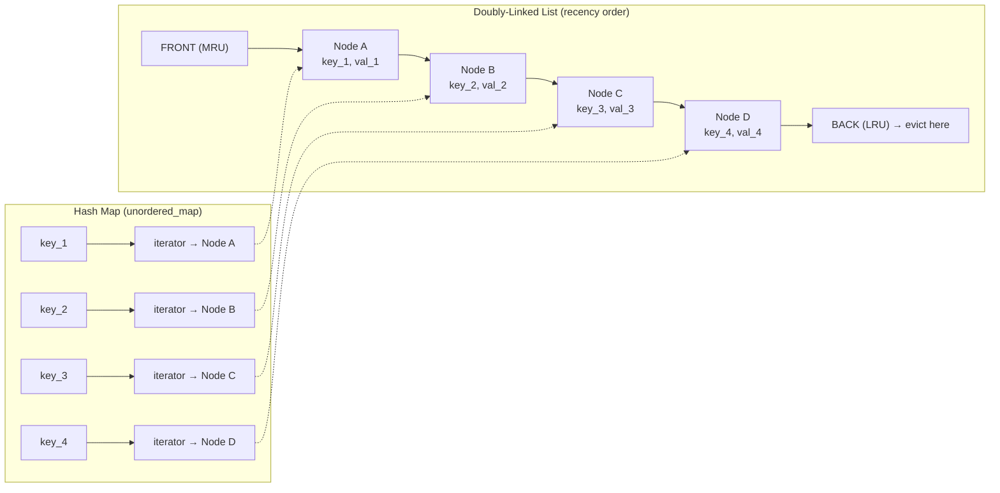
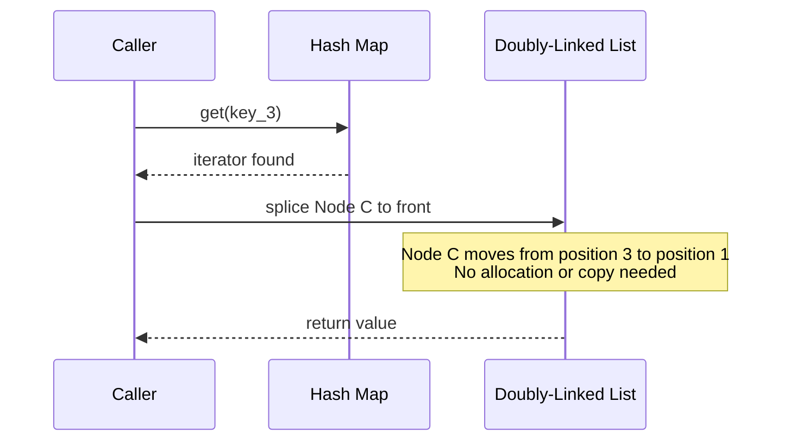
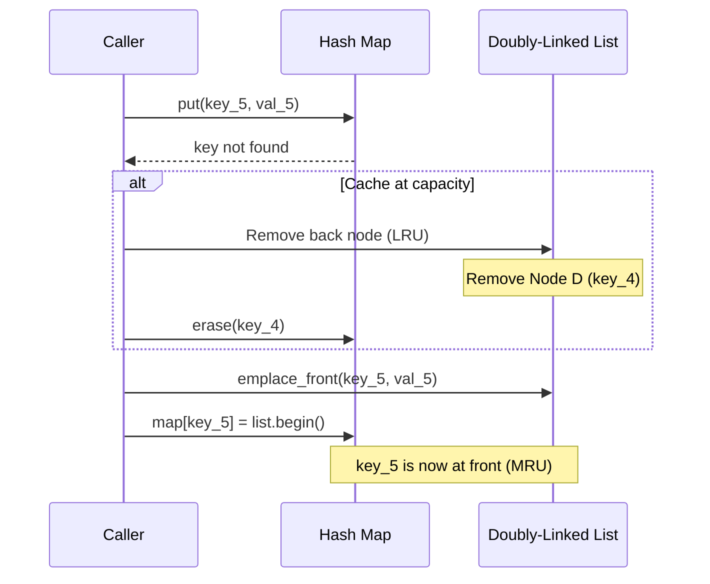
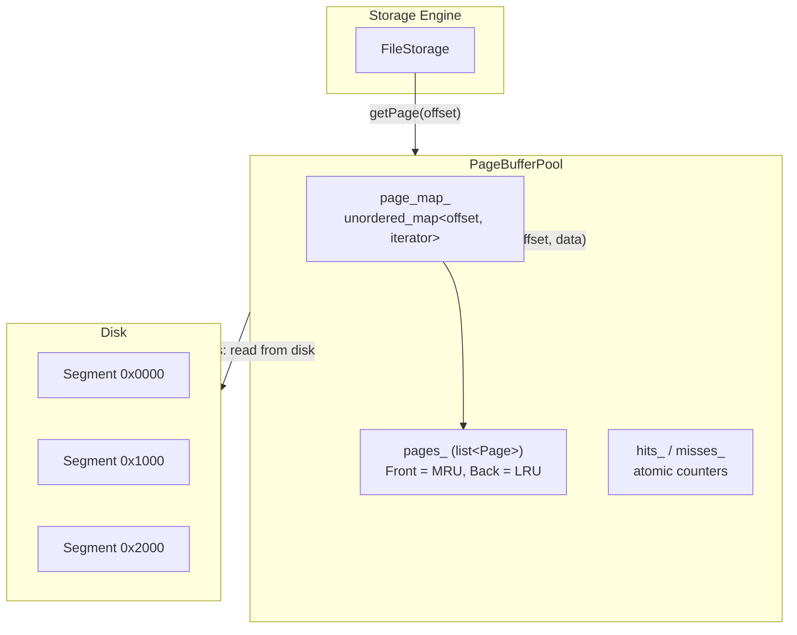
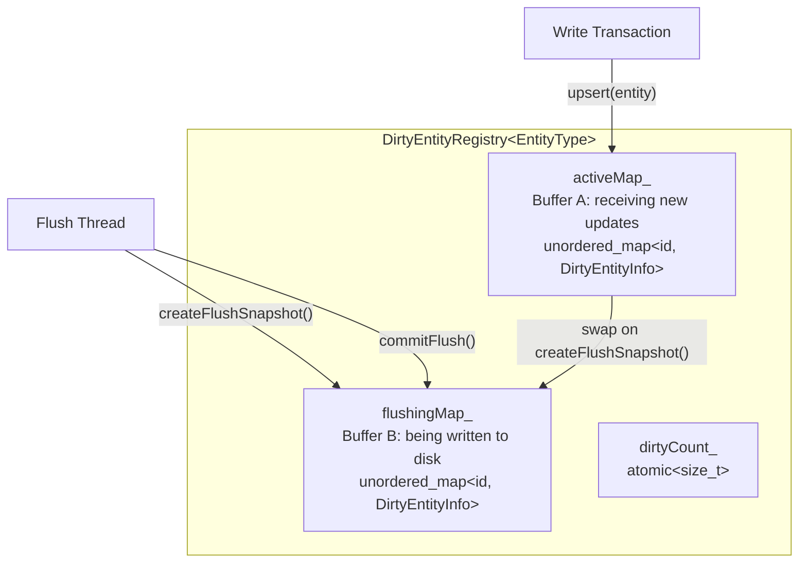

# Cache Eviction Algorithm

ZYX uses an LRU (Least Recently Used) cache eviction strategy for its in-memory caches. The core `LRUCache` template provides O(1) lookups and updates, while the `PageBufferPool` applies this strategy at the storage segment level. Modified entities are tracked separately through a double-buffered `DirtyEntityRegistry` that allows non-blocking writes during flush operations.

## Overview

The cache system is built on three components:

- **LRUCache** -- a generic template class using a hash map plus doubly-linked list, providing O(1) get, put, and eviction
- **PageBufferPool** -- a segment-level LRU cache backed internally by the same hash-map-plus-list pattern, caching entire storage segments as raw byte pages
- **DirtyEntityRegistry** -- a double-buffered registry that tracks modified (dirty) entities across two maps (active and flushing) to enable non-blocking concurrent writes during I/O

Source locations:

- `LRUCache`: `include/graph/storage/CacheManager.hpp`
- `PageBufferPool`: `include/graph/storage/PageBufferPool.hpp`
- `DirtyEntityRegistry`: `include/graph/storage/DirtyEntityRegistry.hpp`

## LRU Cache Data Structure

The `LRUCache<K, V>` template combines two standard containers:

1. A `std::list<std::pair<K, V>>` (doubly-linked list) ordered by recency -- most recently used at the front, least recently used at the back
2. A `std::unordered_map<K, iterator>` (hash map) mapping each key directly to its list iterator for O(1) lookup

This combination allows every operation to complete in constant time:

| Operation | Time Complexity | Notes |
|---|---|---|
| `get(key)` | O(1) | Hash map lookup + `splice` to list front |
| `put(key, value)` | O(1) | Hash map lookup + list insert or update |
| `remove(key)` | O(1) | Hash map lookup + list erase |
| `evict()` | O(1) | Remove back of list + erase from map |
| `peek(key)` | O(1) | Hash map lookup, no order change |
| `contains(key)` | O(1) | Hash map lookup only |

The following diagram shows the internal layout of the data structure:

## LRU Operations

### Get Operation

When `get(key)` is called:

1. Look up the key in the hash map
2. If not found, increment the miss counter and return a default-constructed `V`
3. If found, increment the hit counter, move the node to the front of the list via `splice`, and return the value

The `splice` operation detaches the list node from its current position and reinserts it at the front in O(1) time without any memory allocation or copy.

### Put Operation

When `put(key, value)` is called:

1. If capacity is 0, return immediately (caching disabled)
2. Look up the key in the hash map
3. If the key exists, update the value in place and `splice` the node to the front
4. If the key is new and the cache is at capacity, evict the least recently used item (back of list), then insert the new entry at the front

### Eviction

Eviction happens inline during `put` when the cache is full. The least recently used entry is always the back element of the list:

1. Access `list.back()` to get the LRU key-value pair
2. Erase the key from the hash map
3. Pop the back element from the list

The eviction is pure LRU -- there is no weighted scoring, no frequency tracking, and no adaptive tuning. Items are evicted strictly in the order they were last accessed.

### Additional Operations

Beyond the core get/put/evict cycle, `LRUCache` provides:

- **`tryPut(key, value)`** -- a non-blocking variant that attempts to acquire the write lock with `std::try_to_lock`. If the lock is contended, it silently returns `false` rather than blocking. This is used in parallel scan paths where waiting on cache insertion would be more costly than a cache miss.
- **`peek(key)`** -- returns the value without moving the node to the front. Takes a shared lock, so it does not disrupt the recency order.
- **`remove(key)`** -- explicitly removes a specific entry regardless of its position in the LRU list.
- **`snapshot()`** -- takes a shared lock and returns a vector copy of all key-value pairs in recency order.
- **`contains(key)`** -- checks for key existence without affecting order (shared lock).

## Thread Safety Model

`LRUCache` uses a `std::shared_mutex` for read-write locking:

| Operation | Lock Type | Rationale |
|---|---|---|
| `get(key)` | Exclusive (`unique_lock`) | Mutates list order via `splice` |
| `put(key, value)` | Exclusive (`unique_lock`) | Mutates both map and list |
| `tryPut(key, value)` | Exclusive (`try_to_lock`) | Non-blocking attempt; skips if contended |
| `peek(key)` | Shared (`shared_lock`) | Read-only; no order change |
| `contains(key)` | Shared (`shared_lock`) | Read-only; hash map lookup only |
| `size()` | Shared (`shared_lock`) | Read-only |
| `snapshot()` | Shared (`shared_lock`) | Read-only copy |

Note that `get` requires an exclusive lock because it calls `splice`, which mutates the list. Operations that are truly read-only (`peek`, `contains`, `size`, `snapshot`) use shared locks, allowing concurrent reads.

Hit and miss statistics are tracked via `std::atomic<uint64_t>` counters with `std::memory_order_relaxed`, so they never contend with the mutex.

## Cache Statistics

Both `LRUCache` and `PageBufferPool` track hit and miss counts:

- **Hits**: incremented every time `get` or `getPage` finds the requested entry
- **Misses**: incremented every time the lookup fails
- **Reset**: `resetStats()` zeroes both counters

The hit rate is computed as `hits / (hits + misses)`. These counters are atomic and can be read without acquiring the mutex.

## PageBufferPool

The `PageBufferPool` is a segment-level cache that stores entire storage segments as raw byte buffers. It implements the same LRU pattern as `LRUCache` but is specialized for page-level I/O:

- **Key**: segment offset (`uint64_t`) identifying the on-disk location
- **Value**: `Page` struct containing the segment offset and a `std::vector<uint8_t>` of raw data
- **Capacity**: measured in number of pages, not bytes

### Architecture

### Operations

**getPage(segmentOffset)**: Looks up the segment offset in the hash map. On a hit, the page is moved to the front of the list and a pointer to the cached data is returned. On a miss, `nullptr` is returned and the caller (typically `FileStorage`) must read the segment from disk and insert it via `putPage`.

**putPage(segmentOffset, data)**: If the page already exists, its data is updated in place and it is moved to the front. If the cache is full, the LRU page is evicted (removed from both the list and the map). The new page is then inserted at the front.

**invalidate(segmentOffset)**: Removes a specific page from the cache. This is used after write operations that modify a segment on disk, ensuring the cached copy does not become stale.

**clear()**: Removes all pages from both the map and the list.

## Dirty Entity Tracking

The `DirtyEntityRegistry` tracks which entities (nodes and edges) have been modified but not yet persisted to disk. Unlike a simple set, it uses a double-buffered design to allow writes to continue while a flush is in progress.

### Double-Buffer Design

### How Double-Buffering Works

Each entity is wrapped in a `DirtyEntityInfo<EntityType>` struct that records:

- **EntityChangeType**: one of `CHANGE_ADDED`, `CHANGE_MODIFIED`, or `CHANGE_DELETED`
- **Backup**: an optional copy of the original entity state (used for rollback)

The flush cycle proceeds as follows:

1. **createFlushSnapshot()** -- The calling thread acquires an exclusive lock and swaps the active map into the flushing map. A new empty active map is created. This "freezes" the current set of dirty entities for the I/O thread to write while new updates flow into the fresh active map.

2. **I/O write** -- The flushing map is iterated and each entity is written to disk. This happens outside the registry lock, so new updates are not blocked.

3. **commitFlush()** -- After all writes succeed, the flushing map is cleared under an exclusive lock.

If a second `createFlushSnapshot()` is called before `commitFlush()` (which should not happen in normal operation), the active map entries are merged into the existing flushing map rather than overwriting it.

### Concurrent Access Safety

The registry uses `std::shared_mutex` for thread safety:

| Operation | Lock Type | Notes |
|---|---|---|
| `upsert()` | Exclusive | Writes to active map |
| `remove()` | Exclusive | Checks flushing map first; refuses if entity is being flushed |
| `getInfo()` | Shared | Checks active map, then flushing map |
| `getAllDirtyInfos()` | Shared | Merges both maps (active takes priority) |
| `copyMergedMap()` | Shared | Returns merged copy for snapshot isolation |
| `contains()` | Shared | Checks both maps |
| `createFlushSnapshot()` | Exclusive | Swaps buffers |
| `commitFlush()` | Exclusive | Clears flushing buffer |

The `remove()` operation has a safety check: if the entity is currently in the flushing map, removal is refused because the I/O thread is about to write it to disk. Removing it at that point would cause a memory-disk inconsistency.

## Complexity Analysis

| Component | Operation | Time | Space |
|---|---|---|---|
| LRUCache | get | O(1) | O(capacity) |
| LRUCache | put | O(1) | O(capacity) |
| LRUCache | evict | O(1) | -- |
| LRUCache | peek | O(1) | -- |
| LRUCache | tryPut | O(1) | -- |
| PageBufferPool | getPage | O(1) | O(capacity pages) |
| PageBufferPool | putPage | O(1) | O(capacity pages) |
| PageBufferPool | invalidate | O(1) | -- |
| DirtyEntityRegistry | upsert | O(1) amortized | O(dirty entity count) |
| DirtyEntityRegistry | getInfo | O(1) | -- |
| DirtyEntityRegistry | createFlushSnapshot | O(1) swap | -- |
| DirtyEntityRegistry | commitFlush | O(n) where n = flushing count | -- |

## Best Practices

1. **Size the cache appropriately**: The `LRUCache` capacity is set at construction time. For `PageBufferPool`, the capacity is measured in pages. Choose a size that fits the working set without exceeding available memory.
2. **Monitor hit rate**: Use `hits()` and `misses()` to compute the hit rate. A well-sized cache should achieve a hit rate above 80% for most workloads.
3. **Use tryPut in parallel paths**: When multiple threads are scanning and populating the cache, `tryPut` avoids blocking a scan thread on a contended lock.
4. **Invalidate after writes**: After modifying a segment on disk, call `invalidate()` on the `PageBufferPool` to prevent stale reads.
5. **Let the flush cycle complete**: Do not call `createFlushSnapshot()` a second time before `commitFlush()` finishes, as this forces an unnecessary merge.

## See Also

- [Cache Management](/en/docs/zyx/architecture/cache) - Overall cache architecture
- [Storage System](/en/docs/zyx/architecture/storage) - Persistent storage
- [Performance Optimization](/en/docs/zyx/architecture/optimization) - Performance tuning
