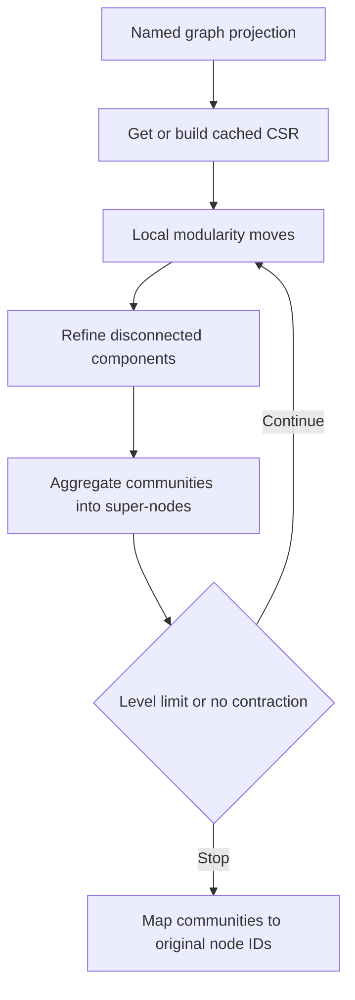

# Leiden Community Detection

ZYX implements hierarchical Leiden community detection over named GDS graph projections. Leiden greedily improves modularity, refines disconnected pieces, and contracts communities into super-nodes for the next level.

For social or similarity graphs, create an `UNDIRECTED` projection so each stored relationship contributes both directions. Property and constant weights configured on the projection flow into modularity optimization.

## Run Leiden

Create the projection first, then call `gds.leiden.stream` with an options map:

```cypher
CALL gds.graph.project('social', {
    nodeLabels: 'Person',
    relationships: {
        KNOWS: {
            orientation: 'UNDIRECTED',
            weightProperty: 'strength',
            defaultWeight: 1.0
        }
    }
})
```

```cypher
CALL gds.leiden.stream('social', {
    maxIterations: 20,
    maxLevels: 10,
    resolution: 1.0,
    refinementThreshold: 0.01,
    concurrency: 0
})
YIELD nodeId, communityId
RETURN nodeId, communityId
ORDER BY communityId, nodeId
```

The procedure returns one row per projected node:

| Field | Type | Meaning |
|---|---|---|
| `nodeId` | Integer | Original database node ID |
| `communityId` | Integer | Dense community ID produced by this run |

Community IDs identify a partition within one result. Do not treat their numeric values as stable identifiers across projection rebuilds or runs.

## Options

| Option | Default | Validation | Meaning |
|---|---:|---|---|
| `maxIterations` | `20` | Positive integer | Maximum local-moving iterations per hierarchy level |
| `maxLevels` | `10` | Positive integer | Maximum number of hierarchy levels |
| `resolution` | `1.0` | Positive finite number | Higher values favor smaller communities |
| `refinementThreshold` | `0.01` | Non-negative finite number | Minimum split gain accepted during refinement; `0` disables refinement |
| `concurrency` | `0` | Non-negative integer | Worker count; `0` uses the runtime default and `1` forces serial execution |

`threadCount` is accepted as an alias for `concurrency`. Snake-case option names are also accepted. Prefer the options map because it remains readable and extensible as new controls are added.

The positional form is supported as `gds.leiden.stream(graphName[, maxIterations, resolution[, threadCount[, maxLevels[, refinementThreshold]]]])`, but the options map is the primary API.

## Execution Pipeline



### Local Moving

Each node evaluates neighboring communities and moves when modularity gain is positive. Parallel workers read the latest community labels through atomic values, so local moving uses asynchronous updates without concurrent read/write undefined behavior. Per-community degree totals also use atomic updates.

Graphs with fewer than 1,024 nodes take the serial executor path to avoid partitioning overhead. Larger workloads are partitioned across the procedure's thread pool.

### Refinement

ZYX finds connected components inside each current community with Union-Find. The largest component keeps the parent label. Other components split only when their modularity gain reaches `refinementThreshold`; setting the threshold to zero disables this phase.

### Aggregation

Communities are contracted into a weighted super-node CSR. Inter-community arcs are combined by weight, the algorithm repeats on the smaller graph, and level assignments are chained back to original node IDs.

## CSR Cache and Memory

Leiden requests a compact CSR representation from the projection catalog. The first Leiden call builds it lazily; later calls for the same named projection reuse it. Inspect the cache state and memory estimate with:

```cypher
CALL gds.graph.list('social')
YIELD name, nodeCount, edgeCount, hasCsr, memoryBytes, csrMemoryBytes, stale
RETURN name, nodeCount, edgeCount, hasCsr, memoryBytes, csrMemoryBytes, stale
```

The main storage and time characteristics are:

| Phase | Time | Additional space |
|---|---|---|
| CSR build | Linear in projected nodes and arcs | Linear in projected nodes and arcs |
| Local moving per iteration | Linear in traversed projected arcs | Linear in projected nodes |
| Refinement | Near-linear Union-Find traversal | Linear in projected nodes |
| Aggregation | Linear in projected nodes and arcs | Linear in the contracted graph |

Reuse a projection for parameter tuning to amortize the CSR build. Drop the projection when analysis is complete to release both adjacency and CSR memory.

## Snapshot Semantics

A named projection is an immutable snapshot. Database mutations after projection creation mark it `stale` but do not change the data seen by Leiden. Rebuild stale projections when current graph data is required:

```cypher
CALL gds.graph.drop('social')
```

Parallel asynchronous moves can produce different numeric community IDs or equivalent partitions across runs. Compare partition quality and membership, not raw `communityId` values.

## Tuning Guidance

- Start with defaults and an `UNDIRECTED` projection for symmetric community structure.
- Increase `resolution` to prefer smaller communities; decrease it to prefer larger communities.
- Increase `maxIterations` only when local moving stops because of the iteration limit.
- Increase `maxLevels` when large graphs continue contracting at the configured limit.
- Set `concurrency: 1` for the lowest-overhead serial path on small graphs or for debugging.
- Keep refinement enabled unless the use case explicitly accepts disconnected pieces remaining under one label.

## See Also

- [GDS Graph Projections](/en/docs/zyx/algorithms/graph-projections) - Projection schema, catalog, weights, and lifecycle
- [Advanced Queries](/en/docs/zyx/user-guide/advanced-queries) - Built-in procedure overview
- [Relationship Traversal](/en/docs/zyx/algorithms/relationship-traversal) - Persistent graph traversal internals
