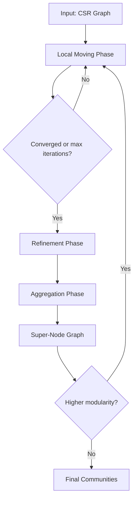

# Community Detection Algorithms

Community detection algorithms identify groups of nodes that are densely connected within the group but sparser between groups. These algorithms are fundamental to graph analytics, enabling tasks such as social network analysis, fraud detection, and biological network interpretation.

## Overview

ZYX implements the **Leiden algorithm** for community detection, which builds upon the classic Louvain method with additional refinement guarantees. The implementation uses a compact Compressed Sparse Row (CSR) representation for efficient graph traversal and supports both single-threaded and parallel execution via thread pools.

### Core Features

- **Leiden Algorithm**: Extends Louvain with a refinement phase ensuring communities are internally connected
- **Level Lifting**: Hierarchical clustering by aggregating communities into super-nodes
- **CSR Projection**: Memory-efficient (~16 bytes/edge) graph representation
- **Parallel Execution**: BSP (Bulk Synchronous Parallel) model with adaptive worker selection
- **Modularity Optimization**: Quality metric (Q ∈ [-0.5, 1]) guiding community formation

## Mathematical Foundation

### Modularity

Modularity measures the quality of a community partition by comparing edge density within communities to expected density in a random graph:

$$
Q = \sum_c \left( \frac{E_c}{m} - \gamma \left( \frac{D_c}{2m} \right)^2 \right)
$$

Where:
- $E_c$ = total edge weight within community $c$
- $D_c$ = sum of node degrees in community $c$
- $m$ = total edge weight in the graph
- $\gamma$ = resolution parameter (default 1.0)
- Higher values indicate better community structure

### Resolution Parameter

The resolution parameter $\gamma$ controls community size:
- $\gamma < 1$: Larger, more general communities
- $\gamma > 1$: Smaller, more fine-grained communities
- Default $\gamma = 1.0$ provides balanced results

## Algorithm Design

### Leiden Pipeline

The Leiden algorithm executes a three-phase pipeline at each hierarchical level:



#### Phase 1: Local Moving (Modularity Optimization)

Each node evaluates moving to neighboring communities to maximize modularity gain:

$$
\Delta Q = \frac{2m}{k_i} \left( \sum_{in} - \gamma \frac{\sigma_{tot}^c}{2m} k_i \right)
$$

Where:
- $k_i$ = weighted degree of node $i$
- $\sum_{in}$ = sum of edge weights from node $i$ to community $c$
- $\sigma_{tot}^c$ = total edge weight incident on community $c$

The algorithm uses a **BSP (Bulk Synchronous Parallel)** model:
1. All workers read a consistent snapshot of community degree sums ($\sigma_{tot}$)
2. Workers independently compute optimal moves for their node partition
3. Atomic updates apply moves back to shared state
4. Repeat until convergence or max iterations

#### Phase 2: Refinement (Connectivity Guarantee)

After local moving converges, the refinement phase ensures each community is internally connected:

1. Perform Union-Find on edges within each community
2. Split disconnected components into separate communities
3. Apply a threshold $\theta$ (default 0.01) to control splitting aggressiveness

This guarantees that communities at every level are **locally connected** — a key advantage over Louvain, which can produce disconnected communities.

#### Phase 3: Aggregation (Level Lifting)

Communities become super-nodes in a contracted graph:

1. Map original nodes to their community IDs
2. Aggregate inter-community edges as weighted sums
3. Build new CSR projection for the super-node graph
4. Repeat the three-phase pipeline on the contracted graph
5. Chain community IDs back to original nodes

### CSR Projection

The implementation uses a compact CSR (Compressed Sparse Row) representation:

| Array | Size | Description |
|-------|------|-------------|
| `rowPtr_` | n+1 | Row offsets into colIdx |
| `colIdx_` | E | Target node indices |
| `weights_` | E | Edge weights (default 1.0) |
| `nodeIds_` | n | Original node IDs |

Memory footprint: ~16 bytes per edge (versus 40-80 bytes for adjacency lists).

**Parallel CSR Build**:
- Nodes are partitioned across workers
- Each worker builds a thread-local edge list for its partition
- A single compactification pass assembles the final CSR
- Atomic cursors handle mirror writes (both directions of undirected edges)

### Parallel Execution Model

The implementation uses an adaptive parallelization strategy:

1. **Small graphs** (< 1024 nodes): Serial execution avoids thread overhead
2. **Large graphs**: Parallel via `ParallelOperatorExecutor::runRangePartitions`
3. **Adaptive worker selection**: `decideParallelExecution` chooses optimal thread count based on workload

**BSP Synchronization Points**:
- `sigmaTot` snapshot: one per local-moving iteration
- Atomic updates ensure correct aggregation of move counts
- Refinement and aggregation run serially after parallel local moving

## Configuration Parameters

| Parameter | Default | Range | Description |
|-----------|---------|-------|-------------|
| `maxIterations` | 20 | 1-100 | Maximum local-moving iterations per level |
| `maxLevels` | 10 | 1-100 | Maximum refinement/moving cycles |
| `resolution` | 1.0 | 0.0-10.0 | Modularity resolution parameter |
| `refinementThreshold` | 0.01 | -1.0 to 1.0 | Theta for refinement phase |

### Parameter Guidance

- **Small graphs** (< 1K nodes): defaults work well
- **Large graphs** (> 100K nodes): consider increasing `maxLevels` for better quality
- **Dense graphs**: lower `resolution` (e.g., 0.8) to find larger communities
- **Sparse graphs**: higher `resolution` (e.g., 1.5) to find more communities

## Usage

### Cypher GDS API

```cypher
// Create a graph projection
CALL gds.graph.project("myGraph", "Person", "KNOWS")

// Run Leiden community detection
CALL gds.leiden.stream("myGraph", {
    maxIterations: 20,
    maxLevels: 10,
    resolution: 1.0,
    refinementThreshold: 0.01
})
YIELD nodeId, communityId
RETURN nodeId, communityId
ORDER BY communityId, nodeId
```

### Python API

```python
from zyx import Graph

g = Graph("my.db")
# Project graph
g.run("CALL gds.graph.project('social', 'Person', 'KNOWS')")

# Run Leiden
result = g.run("""
    CALL gds.leiden.stream('social', {maxIterations: 20})
    YIELD nodeId, communityId
    RETURN nodeId, communityId
    ORDER BY communityId
""")
for row in result:
    print(f"Node {row['nodeId']}: Community {row['communityId']}")
```

### C++ API

```cpp
#include "graph/query/algorithm/LeidenEngine.hpp"
#include "graph/query/algorithm/CsrProjection.hpp"

using namespace graph::query::algorithm;

// Build CSR from graph projection
auto csr = CsrProjection::build(graphProjection, threadPool.get());

// Run Leiden
LeidenOptions opts{
    .maxIterations = 20,
    .maxLevels = 10,
    .resolution = 1.0,
    .refinementThreshold = 0.01
};

auto communities = LeidenEngine::run(*csr, opts, threadPool.get());

// Check modularity quality
double q = LeidenEngine::modularity(*csr, communityOf, 1.0);
printf("Modularity Q = %.4f\n", q);
```

## Performance Characteristics

### Time Complexity

| Phase | Complexity |
|-------|------------|
| CSR Build | O(n + m) |
| Local Moving (per iteration) | O(n + m) |
| Refinement | O(n + m) α(n) |
| Aggregation | O(n + m) |

Where $n$ = nodes, $m$ = edges, α = inverse Ackermann (effectively constant).

### Space Complexity

| Component | Space |
|-----------|-------|
| CSR | O(n + m) |
| Community assignment | O(n) |
| sigmaTot (atomic) | O(n) |

Total: O(n + m) ≈ ~16 bytes per edge

### Benchmark Results

Based on internal benchmarks (refer to commit `b6311b2c`):

| Graph Size | Local Moving Speedup | CSR Build Speedup |
|------------|---------------------|-------------------|
| Small (<1K) | ~1x (serial) | ~1x (serial) |
| Medium (10K-100K) | ~1.27-1.35x | ~1.1x |
| Large (>100K) | ~1.35x | ~1.1x |

Results collected on auto-threaded systems with adaptive parallelism.

## Advantages and Limitations

### Advantages

- **Quality guarantee**: Refinement ensures internally connected communities
- **Hierarchical**: Level lifting reveals multi-scale community structure
- **Efficient**: CSR representation minimizes memory and traversal cost
- **Scalable**: Parallel BSP model handles large graphs
- **Tunable**: Resolution parameter controls community granularity

### Limitations

- **Non-deterministic**: Different runs may yield different partitions (though similar quality)
- **Local optimum**: Greedy local moving may miss global optimum
- **Memory intensive**: Full CSR requires graph to fit in memory
- **Resolution trade-off**: Single resolution parameter may not suit all community structures

## See Also

- [Query Optimization](/en/docs/zyx/algorithms/query-optimization) - Algorithm execution context
- [Relationship Traversal](/en/docs/zyx/algorithms/relationship-traversal) - Graph traversal internals
- [User Guide: Advanced Queries](/en/docs/zyx/user-guide/advanced-queries) - GDS procedure reference