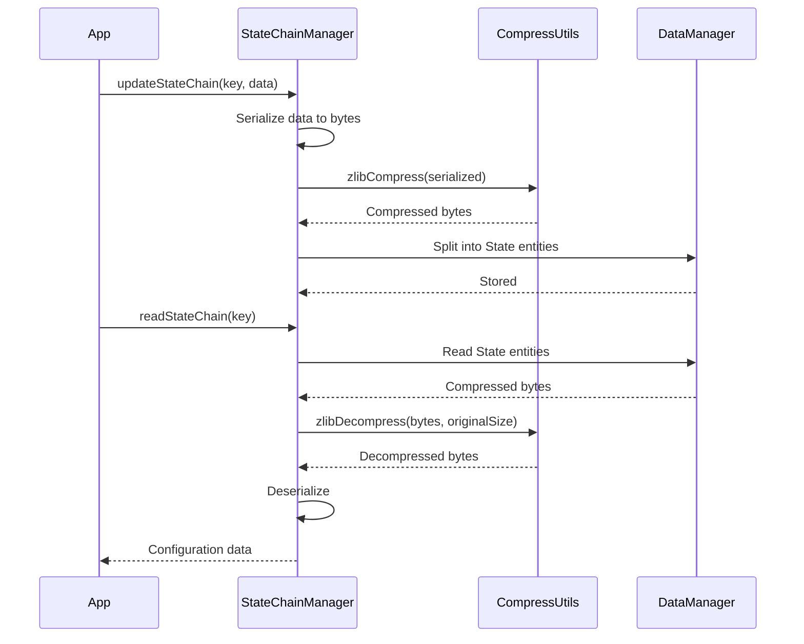

# Compression

ZYX uses **zlib (DEFLATE)** for lossless compression of state chains and large data segments. Compression reduces storage footprint and I/O bandwidth while preserving data integrity.

## When Compression Is Applied

Compression is used in two main scenarios:

- **State chains**: Configuration data managed by `StateChainManager` (index metadata, root ID maps, key type mappings) is serialized and compressed before storage. On read, data is decompressed and deserialized.
- **Large data segments**: Data that exceeds a practical inline threshold is stored externally in Blob entities, which may be compressed.

## Compression API

The compression layer provides two functions:

| Function | Purpose |
|----------|---------|
| `zlibCompress(data)` | Compresses raw bytes using zlib DEFLATE |
| `zlibDecompress(data, originalSize)` | Decompresses back to original bytes |

Both functions handle memory allocation internally and validate the compression/decompression result. On failure, an exception is thrown (unless running in coverage mode, where errors are logged instead).

## State Chain Compression Flow

When `StateChainManager` writes configuration data:

1. **Serialize**: The configuration object (root IDs, key type mappings, enabled flags) is serialized into a binary byte stream
2. **Compress**: The serialized bytes are compressed using `zlibCompress()`
3. **Split**: If the compressed data exceeds a single State entity's capacity, it is split across multiple State entities forming a chain
4. **Store**: Each State entity is written to the storage layer via `DataManager`

On read, the process is reversed: State entities are read, their data concatenated, decompressed, and deserialized.

## Performance Characteristics

| Metric | Typical Value |
|--------|--------------|
| Compression ratio (index metadata) | 60-80% size reduction |
| Compression speed | ~100 MB/s |
| Decompression speed | ~200 MB/s |
| State chain overhead | One segment per chain (128 KB) |

Compression is applied at write time and decompression at read time. Since state chains are configuration data (not query result data), the performance impact is negligible — state chains are read at startup and written during index lifecycle changes.

## Source Locations

| Component | Path |
|-----------|------|
| CompressUtils | `include/graph/utils/CompressUtils.hpp` |
| StateChainManager | `include/graph/core/StateChainManager.hpp` |
