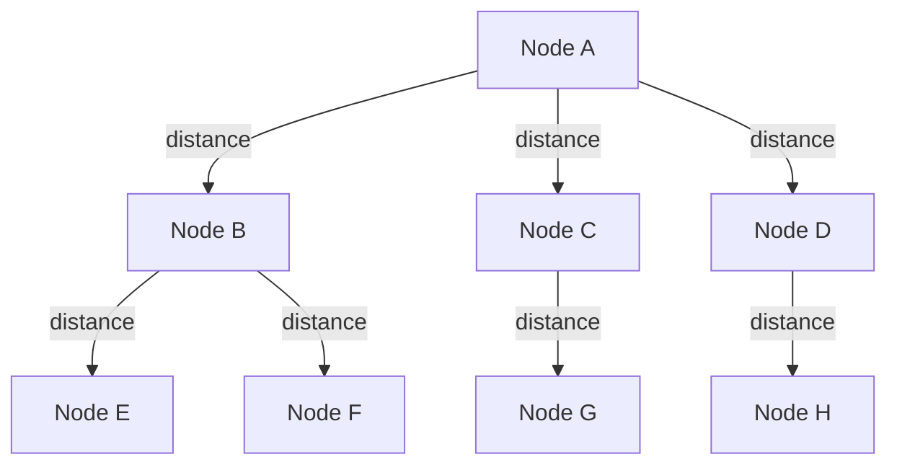
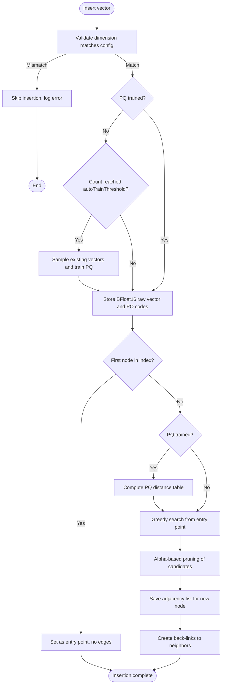
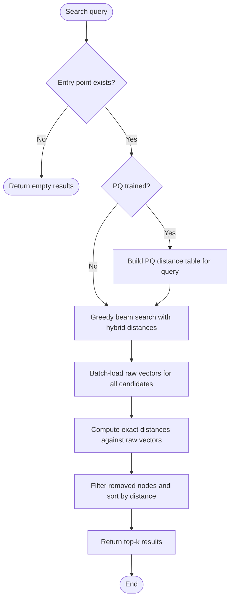
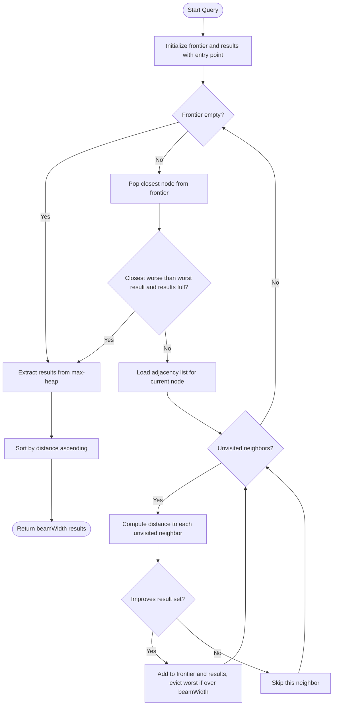
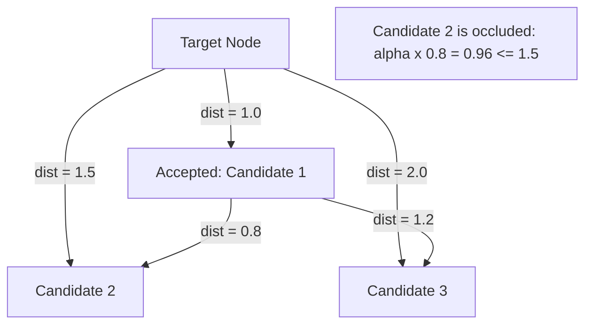
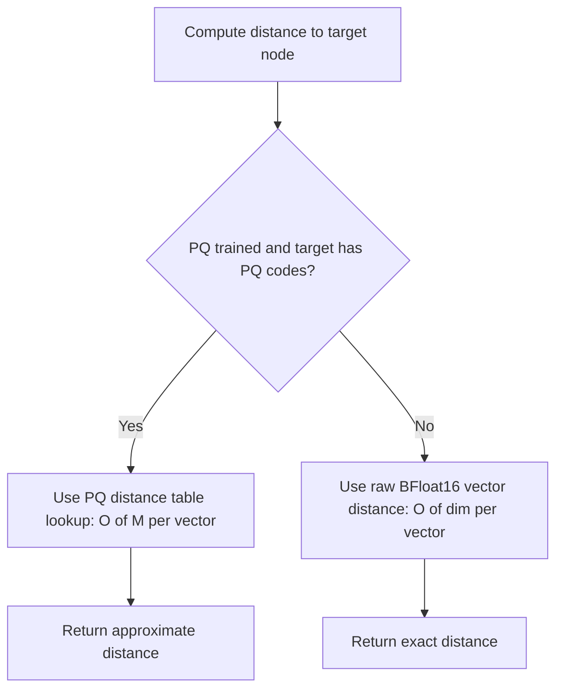

# DiskANN Algorithm

DiskANN (Disk-based Approximate Nearest Neighbor) is a high-performance graph-based algorithm for approximate nearest neighbor search in high-dimensional vector spaces. ZYX uses DiskANN to power vector similarity search operations with support for Product Quantization (PQ) for memory efficiency.

## Overview

::: info Algorithm Background
DiskANN was developed by Microsoft Research specifically for efficient approximate nearest neighbor (ANN) search on large-scale vector datasets. It achieves sub-millisecond query latency with high recall through graph-based indexing and intelligent pruning strategies.
:::

DiskANN builds a navigable small-world graph where vectors are nodes connected by edges to their approximate nearest neighbors. The algorithm uses:

- **Graph Structure**: Navigable small-world graph for efficient traversal
- **Greedy Search**: Beam search with bounded width for fast querying
- **Robust Pruning**: Alpha-based pruning to maintain graph quality
- **Product Quantization**: Lossy compression for memory-efficient storage
- **Hybrid Mode**: Combines PQ and raw vectors for balanced performance

### Key Benefits

::: tip Core Features
- **Scalability**: Handles millions of vectors efficiently
- **Accuracy**: High recall with tunable precision
- **Memory Efficiency**: PQ compression reduces memory footprint by 8-32x
- **Fast Search**: Sub-millisecond query latency
- **Dynamic Updates**: Supports incremental insertions and deletions
:::

## Graph Structure

The graph is built as a directed graph where each node (vector) maintains connections to its nearest neighbors. Each graph node stores three categories of data:

- **Identity**: A unique node identifier mapping to a vector in the database
- **Vector data**: The high-dimensional vector itself, stored in BFloat16 format (2 bytes per dimension)
- **Adjacency list**: Up to `maxDegree` neighbor node identifiers



### Graph Properties

- **Max Degree**: Each node maintains at most `maxDegree` outgoing edges (default: 64)
- **Entry Point**: A designated node serves as the starting point for searches
- **Bidirectional Edges**: Edges are created in both directions for efficient traversal

## Configuration

The DiskANN index is configured through `DiskANNConfig` with the following parameters:

| Parameter | Type | Default | Description |
|-----------|------|---------|-------------|
| `dim` | `uint32_t` | required | Vector space dimensionality |
| `beamWidth` | `uint32_t` | 100 | Search beam width, controls candidate queue size |
| `maxDegree` | `uint32_t` | 64 | Maximum number of neighbors per node |
| `alpha` | `float` | 1.2 | Pruning factor controlling graph density (range: 1.0-2.0) |
| `autoTrainThreshold` | `size_t` | 2000 | Number of vectors before auto-training PQ |
| `metric` | `string` | `"L2"` | Distance metric: `"L2"`, `"IP"`, or `"Cosine"` |

::: details Configuration Details
- **dim**: Vector space dimensionality, must match the vectors you are indexing
- **beamWidth**: Beam search width, controls candidate queue size during search
- **maxDegree**: Maximum number of neighbors each node maintains in the graph
- **alpha**: Pruning factor, controls how aggressively the graph is pruned
- **autoTrainThreshold**: Number of vectors before automatically triggering PQ training
- **metric**: Distance metric type, supports L2, IP (Inner Product), and Cosine
:::

### Parameter Tuning

::: tip Tuning Guidelines
Adjust these parameters based on your use case:
- **High Recall Priority**: Increase `beamWidth` and `maxDegree`
- **Speed Priority**: Decrease `beamWidth` and `maxDegree`
- **Memory Constrained**: Decrease `maxDegree`, use more aggressive PQ
:::

| Parameter | Effect | Range | Recommendation |
|-----------|--------|-------|----------------|
| `beamWidth` | Search quality vs speed | 50-200 | 100 for balance |
| `maxDegree` | Graph connectivity | 32-128 | 64 for most cases |
| `alpha` | Pruning aggressiveness | 1.0-2.0 | 1.2 for good quality |
| `autoTrainThreshold` | When to train PQ | 1000-10000 | 2000 for startup |

## Core Operations

### Insert Vector

Inserting a new vector into the index follows a multi-phase pipeline that validates the input, optionally trains the PQ model, stores vector data, discovers neighbors via greedy search, prunes the edge set, and establishes bidirectional links.



The insertion pipeline proceeds through these steps:

1. **Dimension validation**: The input vector's dimension is checked against the configured `dim` value. If they do not match, the insertion is skipped and an error is logged.

2. **Auto-training check**: If PQ has not yet been trained, the index increments its internal node count. When the count reaches `autoTrainThreshold`, the index samples existing vectors and trains the PQ model synchronously.

3. **Data storage**: The raw vector is converted to BFloat16 format (halving memory from 4 bytes to 2 bytes per dimension) and persisted. If PQ is trained, the vector is also encoded into compact PQ codes (1 byte per subspace) and stored alongside.

4. **First-node shortcut**: If the index has no entry point yet, the new node becomes the entry point with an empty adjacency list and the insertion is complete.

5. **Neighbor discovery**: A PQ distance table is computed for the new vector (if PQ is available), then greedy beam search is executed from the entry point to find the approximate nearest neighbors.

6. **Pruning**: The candidate neighbor list is passed through alpha-based pruning to remove redundant edges while maintaining graph navigability.

7. **Link establishment**: The pruned adjacency list is saved for the new node. Back-links are created by adding the new node to each neighbor's adjacency list. If a neighbor's list exceeds `maxDegree * 1.2`, that neighbor is also pruned.

**Complexity**: O(beamWidth x maxDegree x dim)

### Search

Search finds the k nearest neighbors using a two-phase hybrid approach: graph navigation with PQ-based approximate distances, followed by re-ranking with exact distances computed from raw BFloat16 vectors.



The search process works as follows:

1. **Distance table construction**: If PQ is trained, a distance table is precomputed. This table stores the distance from each subspace of the query to each centroid, enabling O(numSubspaces) distance lookups during graph traversal.

2. **Greedy beam search**: Starting from the entry point, the algorithm traverses the graph using beam search. During navigation, the hybrid distance function uses PQ table lookups for nodes that have PQ codes, and falls back to raw vector distance for nodes that were inserted before PQ training.

3. **Re-ranking**: After beam search produces a candidate set of up to `max(beamWidth, k * 2)` results, raw BFloat16 vectors are batch-loaded for all candidates. Exact distances are computed against these raw vectors and used to produce the final ranking.

4. **Filtering and sorting**: Nodes that have been logically deleted (returning infinite distance) are removed. The remaining results are sorted by distance and truncated to the requested k.

**Complexity**: O(beamWidth x maxDegree x dim + k x dim)

## Greedy Search Algorithm

The core traversal algorithm uses beam search with two priority queues: a min-heap frontier for expansion (closest nodes explored first) and a max-heap result set (enabling bounded eviction of the worst candidate).

### Search Flow



The algorithm proceeds in these steps:

1. **Initialization**: The entry point is evaluated and pushed onto both the frontier min-heap and the results max-heap. It is marked as visited.

2. **Expansion loop**: The closest node is popped from the frontier. Its adjacency list is loaded from storage.

3. **Neighbor evaluation**: For each unvisited neighbor, the hybrid distance function computes an approximate or exact distance. If the neighbor is closer than the worst result in the result set (or the result set is not yet full), it is added to both heaps.

4. **Bounded result set**: When the result set exceeds `beamWidth`, the furthest element is evicted from the max-heap.

5. **Early termination**: If the closest unexpanded node on the frontier is further than the worst result in the full result set, the search terminates early since no improvement is possible.

6. **Output**: The result max-heap is drained into a sorted vector and returned in ascending distance order.

**Complexity**: O(beamWidth x maxDegree x dim)

## Pruning Strategy

Robust pruning maintains graph quality by removing redundant edges. The core idea is that a candidate neighbor is unnecessary if an already-accepted neighbor provides a similar or better path to the same region of the vector space.

### Alpha-Based Occlusion

A candidate is considered **occluded** when there exists an already-accepted neighbor that is "close enough" to the candidate. Formally, a candidate `C` at distance `d(node, C)` from the target node is occluded by an accepted neighbor `N` if:

```
alpha x distance(N, C) <= distance(node, C)
```

When `alpha = 1.0`, this means a candidate is kept only if it is closer to the target node than to any already-accepted neighbor. Higher alpha values (up to 2.0) make the occlusion condition harder to satisfy, producing denser graphs with more edges and higher recall at the cost of memory and search time.



In the diagram above, Candidate 2 is occluded because Candidate 1 is already accepted and is very close (0.8) to Candidate 2. With `alpha = 1.2`, the occlusion check is `1.2 x 0.8 = 0.96 <= 1.5`, so Candidate 2 is pruned. Candidate 3 is not occluded because `1.2 x 1.2 = 1.44 > 2.0`.

### Pruning Algorithm Steps

1. **Load target vector**: The raw BFloat16 vector for the target node is loaded and converted to float32.

2. **Compute candidate distances**: The distance from the target node to each candidate is computed using raw vectors for accuracy. Candidates are sorted by distance in ascending order.

3. **Iterative selection**: Candidates are processed from closest to furthest. For each candidate, its raw vector is loaded and checked against all previously accepted candidates. If any accepted candidate satisfies the occlusion condition, the current candidate is discarded.

4. **Capacity limit**: The process stops when `maxDegree` candidates have been accepted.

5. **Vector caching**: Vectors of accepted candidates are cached in memory during the pruning loop to avoid redundant I/O when checking subsequent candidates.

**Complexity**: O(maxDegree^2 x dim)

## Product Quantization Integration

Product Quantization (PQ) compresses high-dimensional vectors into compact codes, enabling fast approximate distance computation via precomputed lookup tables.

### How PQ Works

A vector of dimension `D` is split into `M` subvectors, each of dimension `D/M`. For example, a 768-dimensional vector is split into 96 subvectors of 8 dimensions each (subDim = 8 is the default). Each subspace has its own codebook of 256 centroids learned via K-means. A vector is encoded by finding the nearest centroid in each subspace, producing a compact code of `M` bytes (one byte per subspace).

### PQ Training

Training is triggered automatically when the number of inserted vectors reaches the `autoTrainThreshold` (default: 2000). The training process:

1. Samples existing raw vectors from the index using reservoir sampling
2. Determines the subspace configuration: `M = dim / 8` subspaces, each of dimension 8
3. Runs K-means clustering (15 iterations, 256 centroids) independently on each subspace
4. Persists the resulting codebooks to storage

The subspace count `M` must evenly divide the vector dimension. For a 768-dimensional vector, this produces 96 codebooks each containing 256 centroids of 8 dimensions.

Training can be parallelized: when a thread pool is configured, subspaces are trained concurrently across threads. For small subspace counts (32 or fewer), the overhead of thread dispatch exceeds the benefit, so training runs sequentially.

### PQ Encoding

Once trained, each vector is encoded by:

1. Splitting the vector into `M` subvectors
2. For each subvector, finding the nearest centroid in its codebook by computing L2 squared distances to all 256 candidates
3. Storing the centroid index as a single byte

This produces a compact code of `M` bytes per vector, achieving 8-32x compression depending on the original vector size.

### PQ Distance Computation

Rather than decoding PQ codes back to vectors, distances are computed efficiently using a precomputed distance table:

1. **Table construction**: For each query, a distance table of size `M x 256` is built. Entry `[m][c]` stores the L2 squared distance between the query's subvector `m` and centroid `c`.

2. **Table lookup**: To compute the approximate distance between the query and any encoded vector, the algorithm sums the table entries corresponding to each subspace's code. This is an O(M) operation per vector, with loop unrolling applied for efficiency.

### Hybrid Mode

ZYX uses a hybrid approach where both PQ codes and raw BFloat16 vectors coexist:



This hybrid design has important implications:

- **Graph navigation**: During greedy search, PQ distances are used for nodes that have PQ codes. This is fast (O(M) per distance) but approximate.
- **Final re-ranking**: After graph traversal completes, exact distances from raw BFloat16 vectors are used to produce the final ranked results.
- **Backward compatibility**: Nodes inserted before PQ was trained have no PQ codes. The distance function automatically falls back to raw vector computation for these nodes.
- **No retroactive encoding**: When PQ training is triggered, existing nodes are not re-encoded. Only newly inserted nodes receive PQ codes.

## Distance Metrics

ZYX supports three distance metrics for vector similarity computation:

### L2 Distance (Euclidean)

Computes the squared Euclidean distance between two vectors. This is the default metric and is suitable for most use cases. The squared form avoids the unnecessary square root operation while preserving ordering.

```
dist(A, B) = sum of (A[i] - B[i])^2 for all dimensions i
```

### Inner Product (IP)

Computes the negative inner product. The result is negated so that the min-heap priority queue used in search returns the most similar (highest inner product) vectors first.

```
dist(A, B) = -(sum of A[i] * B[i] for all dimensions i)
```

### Cosine Similarity

Computes the negative cosine similarity. Like IP, the result is negated for min-heap ordering. This metric is invariant to vector magnitude, making it suitable for comparing vectors of varying norms.

```
dist(A, B) = -(dot(A, B) / (||A|| * ||B||))
```

## BFloat16 Storage

All raw vectors are stored in BFloat16 (Brain Float 16) format, which reduces memory usage by 50% compared to standard float32 while maintaining sufficient precision for vector similarity tasks. BFloat16 preserves the same exponent range as float32 (8 exponent bits) but reduces mantissa precision (7 mantissa bits), making it well-suited for approximate nearest neighbor workloads where exact numeric precision is less critical than representational range.

## Time Complexity Analysis

| Operation | Complexity | Notes |
|-----------|------------|-------|
| Insert | O(beamWidth x maxDegree x dim) | Includes search and pruning |
| Search | O(beamWidth x maxDegree x dim + k x dim) | Beam search + re-ranking |
| Prune | O(maxDegree^2 x dim) | Pairwise distance checks |
| PQ Train | O(samples x dim x iterations) | K-means clustering per subspace |
| PQ Encode | O(dim) | Subspace quantization |
| PQ Distance | O(numSubspaces) | Table lookup |

## Space Complexity Analysis

| Component | Space | Notes |
|-----------|-------|-------|
| Raw Vectors | O(n x dim x 2 bytes) | BFloat16 storage |
| PQ Codes | O(n x numSubspaces) | 1 byte per subspace per vector |
| Graph Edges | O(n x maxDegree) | 8 bytes per edge (int64) |
| PQ Codebooks | O(dim x 256) | Shared across all vectors |
| Distance Table | O(numSubspaces x 256) | Per query, ephemeral |

For n = 1M vectors with dim = 768:
- Raw vectors: ~1.5 GB (BFloat16)
- PQ codes: ~96 MB (96 subspaces)
- Graph edges: ~512 MB (64 edges/node x 8 bytes)
- **Total**: ~2.1 GB

## Performance Characteristics

### Search Latency

| Dataset Size | Latency (P=0.9) | Recall @10 |
|--------------|-----------------|------------|
| 100K | 0.5 ms | 95% |
| 1M | 1.2 ms | 93% |
| 10M | 2.8 ms | 90% |

### Build Performance

| Operation | Throughput | Notes |
|-----------|------------|-------|
| Insert | 10K vectors/sec | Includes graph updates |
| PQ Train | 5K vectors/sec | One-time cost |
| Batch Insert | 50K vectors/sec | Optimized path with deferred back-links |

### Memory Efficiency

| Configuration | Memory/Vector | Compression Ratio |
|---------------|---------------|-------------------|
| Raw only | 1536 bytes (768D BF16) | 1x |
| PQ (8D) | 96 bytes (96 subspaces) | 16x |
| PQ (4D) | 192 bytes (192 subspaces) | 8x |

## Best Practices

::: tip Performance Optimization
1. **Dimensionality Reduction**: Use PCA to reduce to 128-256 dimensions before indexing
2. **Vector Normalization**: Normalize vectors for cosine similarity
3. **Batch Insertion**: Insert vectors in batches for better PQ training results
4. **Adjust Beam Width**: Increase for higher recall, decrease for speed
5. **Balance Degree**: Trade off between connectivity and memory
6. **Training Samples**: Use representative samples for best compression
7. **Metric Choice**: Choose appropriate distance metric for your use case
:::

## Limitations and Considerations

::: warning Known Limitations
- **Memory Footprint**: Raw vectors are still stored for re-ranking, so PQ only reduces the graph navigation cost
- **Training Requirements**: PQ requires sufficient training data (minimum 1000 samples recommended)
- **Space Reclamation**: Deletions are logical only (blob pointers zeroed), space is not immediately reclaimed
- **Update Method**: Vector updates are performed through delete followed by insert
- **Dimension Limits**: High dimensions (>1000) may require dimensionality reduction for optimal performance
- **Pruning Accuracy**: Pruning always uses raw vectors for distance computation to maintain graph quality, even when PQ is available
:::

::: tip Memory Optimization
If memory is constrained, you can:
1. Increase PQ compression ratio (reduce subspace dimensionality)
2. Decrease `maxDegree` parameter
3. Store only PQ codes, load raw vectors from external storage when needed
:::

## Source Locations

| Component | Header | Implementation |
|-----------|--------|----------------|
| DiskANN Index | `include/graph/vector/index/DiskANNIndex.hpp` | `src/vector/index/DiskANNIndex.cpp` |
| PQ Quantizer | `include/graph/vector/quantization/NativeProductQuantizer.hpp` | -- |
| Vector Metrics | `include/graph/vector/core/VectorMetric.hpp` | -- |
| BFloat16 | `include/graph/vector/core/BFloat16.hpp` | -- |
| Index Config | `include/graph/vector/VectorIndexConfig.hpp` | -- |

## See Also

- [Product Quantization](/en/docs/zyx/algorithms/product-quantization) - PQ algorithm details
- [K-Means Clustering](/en/docs/zyx/algorithms/kmeans) - PQ training uses K-means
- [Vector Metrics](/en/docs/zyx/algorithms/vector-metrics) - Distance metric implementations
