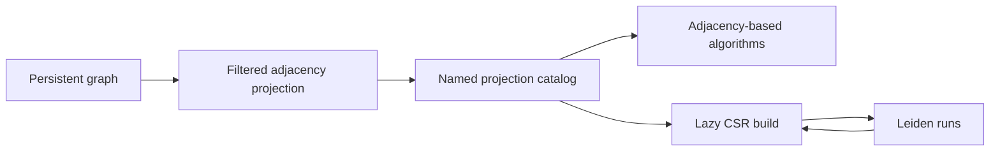

# GDS Graph Projections

ZYX graph algorithms run against named, in-memory projections instead of reading storage records during every algorithm step. A projection selects nodes and relationships once, applies orientation and weight rules, and keeps an algorithm-friendly adjacency representation in a thread-safe catalog.

Projections are not persisted in the database file. They remain available until they are dropped or the database instance is closed.

## Create a Projection

The recommended API uses a single extensible configuration map:

```cypher
CALL gds.graph.project('social', {
    nodeLabels: ['Person', 'Organization'],
    relationships: {
        KNOWS: {
            orientation: 'UNDIRECTED',
            weightProperty: 'strength',
            defaultWeight: 1.0
        },
        WORKS_AT: {
            orientation: 'NATURAL',
            weight: 0.5
        }
    }
})
YIELD name, nodeCount, edgeCount
RETURN name, nodeCount, edgeCount
```

`gds.graph.project` returns one row with `name`, `nodeCount`, and `edgeCount`. A duplicate projection name is rejected; drop the existing projection before rebuilding it.

### Projection Configuration

| Field | Accepted value | Default | Meaning |
|---|---|---|---|
| `nodeLabels` | String, list of strings, or node projection map | All labels | Include nodes carrying any selected label |
| `relationships` | String, list of strings, or relationship projection map | All types | Select relationship types and per-type behavior |
| `relationshipTypes` | String or list of strings | All types | Short form for unconfigured relationship types |
| `orientation` | `NATURAL`, `REVERSE`, or `UNDIRECTED` | `NATURAL` | Default orientation for relationship entries |
| `relationshipWeightProperty` | String | None | Default property-backed weight for relationship entries |
| `defaultWeight` | Non-negative finite number | `1.0` | Weight used when the selected property is missing or null |

Use `'*'` for all labels or all relationship types. Omitting `nodeLabels` or relationship selection fields has the same effect.

The native three-part form is also useful when node and relationship projections are supplied separately:

```cypher
CALL gds.graph.project(
    'code',
    ['Function', 'Method', 'Class'],
    {
        CALLS: {weight: 8.0},
        IMPORTS: {weight: 2.0},
        DECLARES: {orientation: 'REVERSE', weight: 4.0}
    },
    {orientation: 'UNDIRECTED'}
)
```

Its signature is `gds.graph.project(name, nodeProjection, relationshipProjection[, config])`. For a single label and type, strings are valid node and relationship projections.

### Node Selection

When multiple labels are selected, a node is included if it has at least one of them. A projected relationship is included only when both endpoints are in the projected node set.

Node projection maps can assign projection names to one or more storage labels:

```cypher
CALL gds.graph.project(
    'callables',
    {
        functions: {label: 'Function'},
        methods: {labels: ['Method', 'Constructor']}
    },
    'CALLS'
)
```

### Relationship Orientation

| Orientation | Projected arcs |
|---|---|
| `NATURAL` | One arc from the stored source to target |
| `REVERSE` | One arc from the stored target to source |
| `UNDIRECTED` | One arc in each direction; a self-loop remains one arc |

`edgeCount` reports projected arcs, not stored relationships. An undirected non-self relationship therefore contributes two to `edgeCount`.

### Relationship Weights

A relationship entry can be unweighted, use one constant, or read a property:

```cypher
CALL gds.graph.project('routes', {
    nodeLabels: 'City',
    relationships: {
        ROAD: {weightProperty: 'distance', defaultWeight: 1.0},
        FERRY: {weight: 12.5}
    }
})
```

Weights must be non-negative finite numbers. A missing or null property uses `defaultWeight`; an existing non-numeric or invalid property rejects the projection build. Per-relationship settings override global orientation and weight defaults.

## Projection Catalog

### Inspect and Check

```cypher
CALL gds.graph.exists('social')
```

```cypher
CALL gds.graph.list()
```

```cypher
CALL gds.graph.list('social')
```

```cypher
CALL gds.graph.schema('social')
```

`gds.graph.exists` always returns `name` and `exists`. `gds.graph.list()` returns all descriptors sorted by name; `gds.graph.list(name)` returns zero rows when the projection is absent. `gds.graph.schema(name)` rejects an unknown name.

`gds.graph.list` exposes these fields:

| Field | Meaning |
|---|---|
| `name` | Projection name |
| `nodeCount`, `edgeCount` | Projected node and arc counts |
| `isWeighted` | Whether any relationship projection uses weights |
| `createdAtMillis` | Creation time as Unix epoch milliseconds |
| `buildMillis` | Projection build duration in milliseconds |
| `memoryBytes` | Estimated adjacency-projection memory |
| `hasCsr`, `csrMemoryBytes` | Whether a lazy CSR cache exists and its estimated memory |
| `sourceRevision`, `currentRevision` | Graph revisions at build time and inspection time |
| `stale` | Whether the two revisions differ |
| `nodeLabels`, `relationships` | Normalized projection schema |

Each item in `relationships` contains `type`, `orientation`, `weightKind`, `weightProperty`, `constantWeight`, and `defaultWeight`. An empty `type` means all relationship types.

`gds.graph.schema` returns the smaller schema view: `name`, `nodeLabels`, `relationships`, and `stale`.

### Staleness

Every graph mutation advances the database graph revision. A projection is marked `stale` when its build revision differs from the current revision. ZYX does not silently rebuild it: algorithms continue to see the immutable projected snapshot. Drop and recreate a stale projection when the algorithm must observe new graph data.

```cypher
CALL gds.graph.drop('social')
```

```cypher
CALL gds.graph.dropAll()
```

`gds.graph.drop` returns the removed `name` and rejects an unknown projection. `gds.graph.dropAll` returns `droppedCount` and also releases any associated CSR caches.

## Performance Model

Projection construction performs a storage scan and builds incoming and outgoing adjacency lists. Algorithms then traverse in-memory data without storage I/O. Algorithms that use CSR, currently including Leiden, build that compact representation lazily on first use and reuse it on later runs.



For repeated analysis, create one projection, run multiple algorithms, inspect `memoryBytes` and `csrMemoryBytes`, then drop it explicitly. Prefer a bounded label and relationship selection for large databases to reduce build time and memory.

## See Also

- [Community Detection](/en/docs/zyx/algorithms/community-detection) - Leiden procedure, options, and execution model
- [Advanced Queries](/en/docs/zyx/user-guide/advanced-queries) - Built-in procedure overview
- [Relationship Traversal](/en/docs/zyx/algorithms/relationship-traversal) - Persistent graph traversal internals
