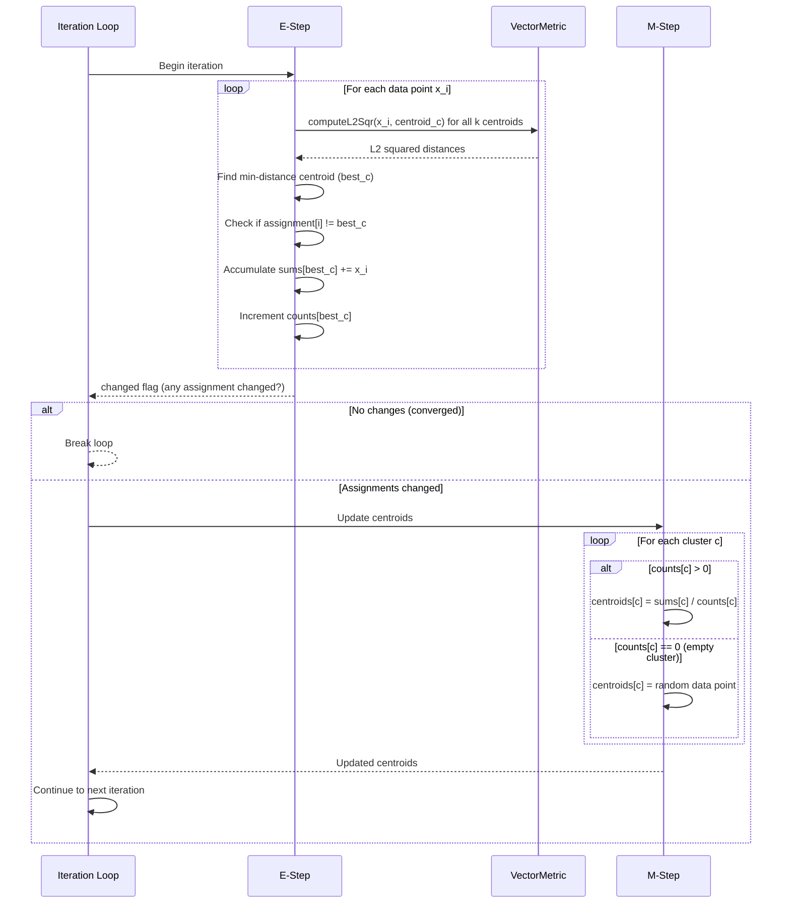
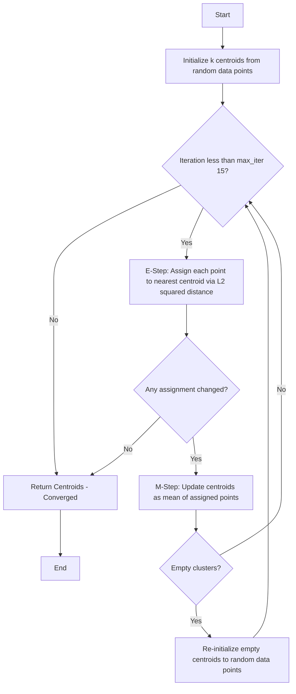
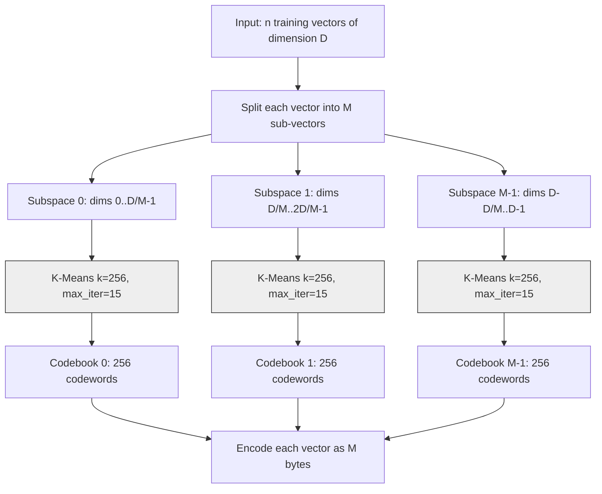

# K-Means Clustering Algorithm

K-Means is a fundamental unsupervised machine learning algorithm used for clustering data points into groups based on similarity. In ZYX, K-Means is specifically used for training Product Quantization (PQ) codebooks, which are essential for efficient vector similarity search and compression.

## Overview

K-Means partitions a set of n data points into k clusters, where each data point belongs to the cluster with the nearest mean (centroid). The algorithm iteratively refines cluster assignments to minimize the within-cluster sum of squares (WCSS), also known as inertia.

### Key Characteristics

- **Partitioning Clustering**: Divides data into non-overlapping clusters
- **Centroid-based**: Each cluster represented by its mean point
- **Iterative Optimization**: Converges to local minimum through EM algorithm
- **L2 Distance**: Uses squared Euclidean distance as similarity metric

## Mathematical Foundation

### Objective Function

K-Means optimizes the following objective function:

```
J = Sum(i=1..n) Sum(j=1..k) ||x_i - mu_j||^2
```

Where:
- `J` = Objective function (within-cluster sum of squares)
- `n` = Number of data points
- `k` = Number of clusters
- `x_i` = i-th data point
- `mu_j` = Centroid of cluster j
- `||.||` = L2 norm (Euclidean distance)

### Convergence Properties

- **Monotonic Convergence**: Objective function never increases
- **Local Minimum**: Converges to local, not necessarily global, optimum
- **Finite Convergence**: Guaranteed convergence in finite iterations
- **Linear Convergence**: Typically converges in O(log n) iterations

## Algorithm Steps

The K-Means algorithm follows an iterative Expectation-Maximization (EM) approach. ZYX uses the classic Lloyd's algorithm with random initialization, a fixed seed for reproducibility, and a maximum of 15 iterations.

### 1. Initialization

The algorithm selects k random data points as initial centroids using a Mersenne Twister random number generator (`std::mt19937`) seeded with the fixed value **42**. This deterministic seeding ensures reproducible results across runs -- given the same input data, K-Means always produces identical centroids.

For each of the k centroids, a random index is drawn uniformly from the range `[0, n-1]`, and the corresponding data point is copied as the initial centroid. This is standard random initialization, not K-Means++.

### 2. E-Step (Expectation)

In each iteration, every data point is assigned to the cluster whose centroid is closest under L2 squared distance. For each point, the algorithm computes the distance to all k centroids and selects the one with the minimum distance.

The distance computation uses `VectorMetric::computeL2Sqr`, which employs 4-way loop unrolling: the inner loop processes four dimensions per iteration, accumulating partial sums in four separate temporaries before combining them. This reduces loop overhead and aids compiler auto-vectorization. Any remaining dimensions (when the vector length is not a multiple of four) are handled in a separate scalar tail loop.

After computing the new assignment, the algorithm checks whether it differs from the previous iteration's assignment. A `changed` flag tracks whether any point switched clusters, which is used for convergence detection.

While performing assignments, the algorithm also accumulates per-cluster sums and counts, so that the subsequent M-step can reuse this work without a second pass over the data.

### 3. M-Step (Maximization)

For each cluster with at least one assigned point, the centroid is updated to the mean of all points assigned to it. The mean is computed by multiplying the accumulated sum by the reciprocal of the count (`1.0f / count`), avoiding repeated division.

For empty clusters (those with zero assigned points), the centroid is re-initialized to a new random data point drawn from the same uniform distribution. This prevents the cluster from remaining permanently empty and potentially degrading quantization quality.

### 4. Convergence Check

After the E-step, if no data point changed its cluster assignment (`changed` is false), the algorithm has converged and terminates early. Otherwise, it continues until the maximum iteration count (15) is reached.

### One EM Iteration in Detail

The following sequence diagram illustrates the detailed flow of a single EM iteration:



## Algorithm Flowchart



**K-Means Algorithm Flow:**
- Initialize: Random selection of k centroids from data
- E-Step: Assign each point to nearest centroid
- M-Step: Recompute centroids as mean of assigned points
- Check for convergence or max iterations
- Handle empty clusters by re-initialization

## Handling Empty Clusters

When a cluster becomes empty (no assigned points during the E-step), the algorithm re-initializes its centroid to a randomly selected data point. This strategy is simple and effective for the PQ use case, where the training data is typically large enough that empty clusters are rare. Alternative strategies (such as splitting the largest cluster) are not used in ZYX.

## Distance Computation: L2 Squared

K-Means uses the L2 squared distance rather than the full Euclidean distance. This is an optimization with no impact on correctness:

- **No sqrt required**: The square root is expensive and unnecessary for comparison -- the ordering of distances is preserved without it.
- **Same argmin**: Because sqrt is monotonic, `argmin ||a - b||^2 == argmin ||a - b||`.
- **Faster computation**: Each distance check saves one floating-point square root operation.

The implementation in `VectorMetric::computeL2Sqr` uses 4-way loop unrolling: it processes four dimension differences per loop iteration, squaring and summing them together. This reduces loop overhead and creates opportunities for SIMD auto-vectorization by the compiler. A scalar tail loop handles any remaining dimensions when the vector length is not a multiple of four.

## Time and Space Complexity

### Time Complexity

**Per Iteration:**
- Assignment step: O(n x k x d)
  - n data points
  - k centroids
  - d dimensions
- Update step: O(n x d)
- **Total per iteration**: O(n x k x d)

**Overall:**
- **Worst case**: O(n x k x d x I)
  - I = number of iterations (typically 10-50)
- **Average case**: O(n x k x d x log I)
- **Typical**: O(n x k x d x 15) [default max iterations]

### Space Complexity

- **Centroids**: O(k x d)
- **Assignments**: O(n)
- **Accumulators**: O(k x d)
- **Total**: O(k x d + n)

### Complexity Comparison

| Component | Space | Time (per iter) |
|-----------|-------|-----------------|
| Centroids | O(k x d) | - |
| Assignments | O(n) | - |
| E-Step | - | O(n x k x d) |
| M-Step | - | O(n x d) |
| **Total** | **O(n + k x d)** | **O(n x k x d)** |

## Integration with Product Quantization

K-Means is not a general-purpose clustering tool in ZYX. It exists specifically to train PQ codebooks. The Product Quantizer splits each input vector into sub-vectors (one per subspace) and runs K-Means independently on each subspace to produce a codebook of 256 centroids. Each centroid is a codeword, and the K-Means training ensures that codewords minimize the quantization error within their subspace.

### PQ Codebook Training Flow

The following diagram shows how K-Means integrates into the PQ training pipeline:



### How It Works

1. **Subspace extraction**: Each training vector of dimension D is split into M equal-length sub-vectors. For example, a 128-dimensional vector with M=8 subspaces produces 8 sub-vectors of 16 dimensions each.

2. **Independent K-Means per subspace**: For each subspace, all n sub-vectors are collected and passed to K-Means with k=256. This produces a codebook of 256 codewords (centroids) per subspace. The value 256 is chosen so that each codeword index fits in a single byte (8 bits).

3. **Encoding**: After training, any vector is encoded as a sequence of M bytes. For each subspace, the nearest codeword in the corresponding codebook is found (again using L2 squared distance), and its index (0-255) is stored as a `uint8_t`.

4. **Parallelism across subspaces**: The PQ trainer can run K-Means for different subspaces in parallel using a thread pool (outer parallelism). Additionally, each individual K-Means run can use the thread pool for inner parallelism during the E-step, using thread-local accumulators to avoid contention.

### PQ Encoding

After codebooks are trained, encoding a vector involves finding the nearest codeword in each subspace. For each of the M sub-vectors, the algorithm computes the L2 squared distance to all 256 codewords in the corresponding codebook and stores the index of the closest one. The result is a compact M-byte representation of the original D-dimensional vector.

## Configuration Parameters

### Key Parameters

| Parameter | Default | Range | Description |
|-----------|---------|-------|-------------|
| `k` | 256 (for PQ) | 2 to sqrt(n) | Number of clusters (codewords per subspace) |
| `max_iter` | 15 | 1-1000 | Maximum iterations |
| `seed` | 42 | Fixed | Random seed for initialization (not configurable) |

### Parameter Selection

**k = 256 for PQ**: This value is fixed for Product Quantization because each codeword index must fit in a single byte (8 bits = 256 values). This provides a good balance between quantization accuracy and compression ratio.

**max_iter = 15**: Empirically sufficient for PQ codebook training. The algorithm typically converges within 10-15 iterations on subspace data. Increasing this value rarely improves codebook quality significantly.

## Performance Optimization

### Optimization Techniques

1. **Fixed Seed (42)**: Deterministic initialization ensures reproducible results and simplifies testing and debugging.
2. **4-Way Loop Unrolling**: The L2 squared distance computation processes four dimensions per iteration, reducing loop overhead and enabling compiler auto-vectorization.
3. **Single-Pass E-Step**: Cluster assignment and accumulator updates happen in the same loop over the data, avoiding a second pass.
4. **Early Convergence**: The algorithm terminates immediately when no point changes cluster, avoiding unnecessary iterations.
5. **Multiplicative Inverse**: Centroid updates use `sum * (1.0f / count)` instead of `sum / count`, replacing repeated division with a single division and multiplication.

### Thread Pool Parallelism

When a thread pool is provided and the dataset contains at least 256 points, the E-step runs in parallel across multiple threads. Each thread maintains its own local accumulators (sums and counts) to avoid contention. After all threads complete, the thread-local accumulators are merged into global sums and counts before the M-step updates centroids. The parallel path uses relaxed atomic operations for the `changed` flag.

### Memory Efficiency

- **In-place updates**: Centroids are updated directly without allocating new storage each iteration.
- **Contiguous storage**: Data and centroids use `std::vector<std::vector<float>>` for cache-friendly sequential access.
- **Minimal overhead**: Only essential data structures are allocated -- centroids, assignments, sums, and counts.

## Use Cases in ZYX

### Product Quantization Codebook Training

The sole purpose of K-Means in ZYX is to train PQ codebooks. Each subspace gets its own independent K-Means run with k=256, producing 256 codewords that minimize quantization error within that subspace.

## Advantages and Limitations

### Advantages

- **Simple**: Easy to understand and implement
- **Efficient**: Linear scaling with data size
- **Effective**: Works well for PQ subspace clustering
- **Fast convergence**: Typically converges within 10-15 iterations
- **Deterministic**: Fixed seed ensures reproducible results

### Limitations

- **Local Optima**: Sensitive to random initialization; different seeds may produce different results
- **Fixed k**: The number of clusters must be known in advance
- **Spherical Clusters**: Assumes isotropic (round) cluster shapes
- **Outlier Sensitivity**: The mean is sensitive to outliers, which can pull centroids away from the cluster center

## Source Locations

- **KMeans**: `include/graph/vector/quantization/KMeans.hpp`
- **VectorMetric** (L2 distance): `include/graph/vector/core/VectorMetric.hpp`
- **ProductQuantizer** (caller): `include/graph/vector/quantization/NativeProductQuantizer.hpp`

## See Also

- [Product Quantization](/en/docs/zyx/algorithms/product-quantization) - Vector compression using K-Means
- [Vector Metrics](/en/docs/zyx/algorithms/vector-metrics) - Distance computation details
- [DiskANN](/en/docs/zyx/algorithms/diskann) - Graph-based vector search algorithm
