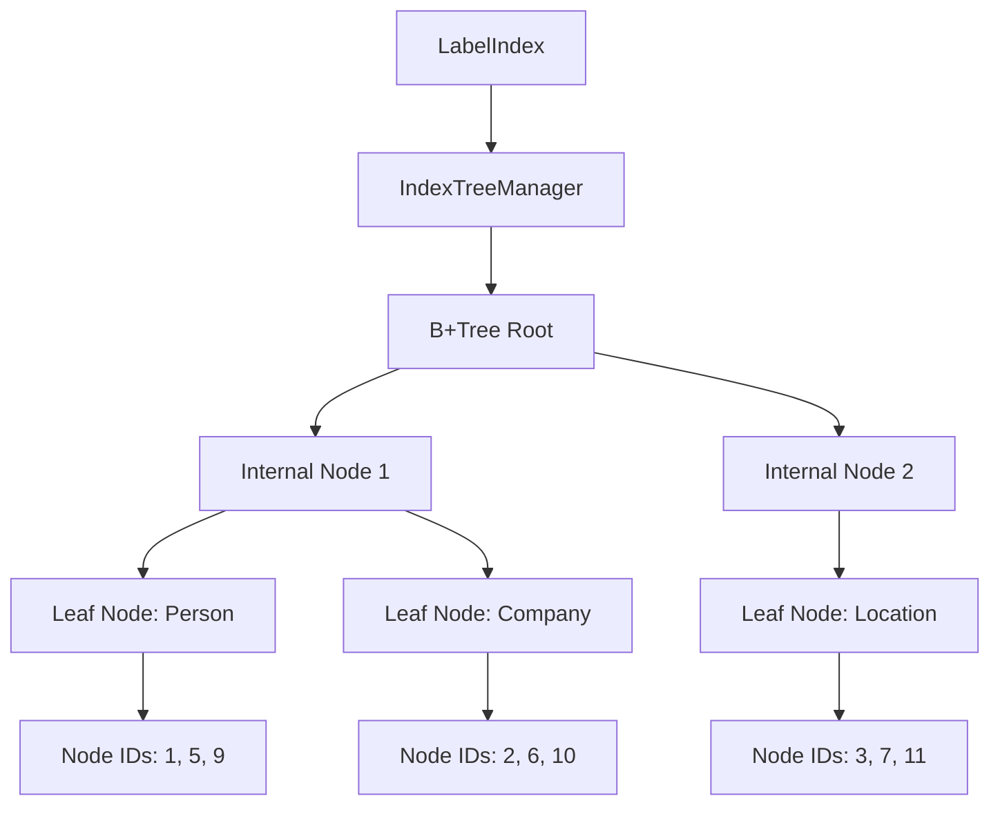
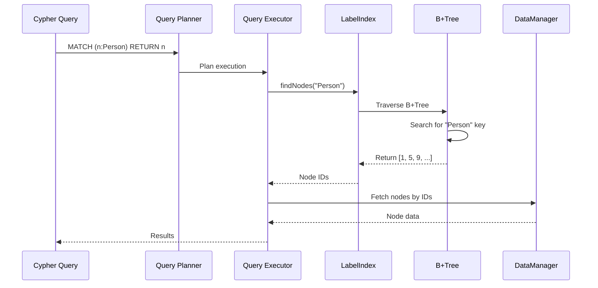

# Label Index

ZYX implements a high-performance label index using B+Tree structure to efficiently map node labels to their corresponding node IDs. This enables fast label-based queries in Cypher such as `MATCH (n:Person) RETURN n`.

## Overview

The label index provides:

- **B+Tree-based indexing**: Efficient label → node IDs mapping using B+Tree structure
- **Multi-label support**: Nodes can have multiple labels indexed simultaneously
- **Batch operations**: Optimized bulk insertion for efficient index building
- **Concurrent access**: Thread-safe operations with shared mutex
- **State persistence**: Automatic persistence of index state across restarts
- **Dynamic enable/disable**: Runtime index management without data loss

## Architecture

### Label Index Structure



### Query Flow



## Implementation

### Class Definition

```cpp
class LabelIndex {
public:
    LabelIndex(std::shared_ptr<storage::DataManager> dataManager,
               std::shared_ptr<storage::state::SystemStateManager> systemStateManager,
               uint32_t indexType,
               std::string stateKey);

    // Core operations
    void addNode(int64_t nodeId, const std::string &label);
    void addNodesBatch(const std::unordered_map<std::string, std::vector<int64_t>> &nodesByLabel);
    void removeNode(int64_t nodeId, const std::string &label);
    std::vector<int64_t> findNodes(const std::string &label) const;
    bool hasLabel(int64_t entityId, const std::string &label) const;

    // Lifecycle management
    void initialize();
    void createIndex();
    void clear();
    void drop();
    void flush() const;
    void saveState() const;

    // Status queries
    bool isEmpty() const;
    bool isEnabled() const;
    bool hasPhysicalData() const;

private:
    std::shared_ptr<storage::DataManager> dataManager_;
    std::shared_ptr<storage::state::SystemStateManager> systemStateManager_;
    std::shared_ptr<IndexTreeManager> treeManager_;
    mutable std::shared_mutex mutex_;
    int64_t rootId_ = 0;
    bool enabled_ = false;
    const std::string stateKey_;
};
```

## Core Operations

### Initialization

The label index is initialized from persistent state on startup:

```cpp
void LabelIndex::initialize() {
    std::unique_lock lock(mutex_);

    // 1. Load Root ID from persistent state
    rootId_ = systemStateManager_->get<int64_t>(
        stateKey_,
        storage::state::keys::Fields::ROOT_ID,
        0
    );

    // 2. Load Enabled Config
    std::string configKey = stateKey_ + storage::state::keys::SUFFIX_CONFIG;
    enabled_ = systemStateManager_->get<bool>(
        configKey,
        storage::state::keys::Fields::ENABLED,
        false
    );

    // Fallback: If we have physical data, force enable
    if (!enabled_ && rootId_ != 0) {
        enabled_ = true;
    }
}
```

**Key Points**:
- Root ID is persisted in system state
- Enabled flag controls whether index is active
- Physical data (rootId_ != 0) forces enablement to prevent data drift

### Add Node

Adds a single node to the label index:

```cpp
void LabelIndex::addNode(int64_t entityId, const std::string &label) {
    std::unique_lock lock(mutex_);

    // Initialize B+Tree if needed
    if (rootId_ == 0) {
        rootId_ = treeManager_->initialize();
    }

    // Insert into B+Tree (label → nodeId mapping)
    int64_t newRootId = treeManager_->insert(rootId_, label, entityId);

    // Update root if tree split occurred
    if (newRootId != rootId_) {
        rootId_ = newRootId;
    }
}
```

**Characteristics**:
- **Time Complexity**: O(log n) where n is the number of unique labels
- **Space Complexity**: O(1) amortized (B+Tree growth)
- **Concurrency**: Exclusive lock ensures thread safety

### Batch Add Nodes

Optimized bulk insertion for multiple nodes:

```cpp
void LabelIndex::addNodesBatch(
    const std::unordered_map<std::string, std::vector<int64_t>> &nodesByLabel
) {
    // Single lock for entire batch
    std::unique_lock lock(mutex_);

    if (rootId_ == 0) {
        rootId_ = treeManager_->initialize();
    }

    // Process each label group
    for (const auto &[label, entityIds]: nodesByLabel) {
        if (entityIds.empty())
            continue;

        // Prepare batch entries
        std::vector<std::pair<PropertyValue, int64_t>> batchEntries;
        batchEntries.reserve(entityIds.size());

        for (int64_t id: entityIds) {
            batchEntries.emplace_back(PropertyValue(label), id);
        }

        // Perform batch insertion
        int64_t newRootId = treeManager_->insertBatch(rootId_, batchEntries);

        if (newRootId != rootId_) {
            rootId_ = newRootId;
        }
    }
}
```

**Optimizations**:
- **Single lock acquisition**: Reduces contention compared to individual inserts
- **Batch preparation**: Minimizes memory allocations
- **Grouped by label**: Optimizes for B+Tree structure

**Performance**:
- **Throughput**: ~10x faster than individual inserts for large batches
- **Use Case**: Index building during database startup or bulk import

### Remove Node

Removes a node from the label index:

```cpp
void LabelIndex::removeNode(int64_t entityId, const std::string &label) {
    std::unique_lock lock(mutex_);

    if (rootId_ == 0) {
        return;
    }

    // Remove from B+Tree
    bool success = treeManager_->remove(rootId_, label, entityId);

    // Note: Underflow handling is automatic in IndexTreeManager
    (void) success;
}
```

**Characteristics**:
- **Time Complexity**: O(log n)
- **Automatic rebalancing**: B+Tree handles underflow via merge/redistribute

### Find Nodes

Retrieves all nodes with a specific label:

```cpp
std::vector<int64_t> LabelIndex::findNodes(const std::string &label) const {
    std::shared_lock lock(mutex_);

    if (rootId_ == 0) {
        return {};
    }

    return treeManager_->find(rootId_, label);
}
```

**Characteristics**:
- **Time Complexity**: O(log n + k) where k is the number of nodes with the label
- **Concurrency**: Shared lock allows concurrent reads
- **Return**: Vector of node IDs (empty if label not found)

### Has Label

Checks if a specific node has a label:

```cpp
bool LabelIndex::hasLabel(int64_t entityId, const std::string &label) const {
    std::shared_lock lock(mutex_);

    if (rootId_ == 0) {
        return false;
    }

    auto nodes = treeManager_->find(rootId_, label);
    return std::ranges::find(nodes, entityId) != nodes.end();
}
```

**Use Case**: Fast label existence check without fetching all nodes

## Index Lifecycle

### Create Index

Explicitly enables the label index:

```cpp
void LabelIndex::createIndex() {
    std::unique_lock lock(mutex_);
    enabled_ = true;

    // Persist enabled state
    std::string configKey = stateKey_ + storage::state::keys::SUFFIX_CONFIG;
    systemStateManager_->set<bool>(
        configKey,
        storage::state::keys::Fields::ENABLED,
        true
    );
}
```

**Behavior**:
- Sets enabled flag to true
- Persists configuration to system state
- Subsequent restarts will load index as enabled

### Clear Index

Removes all index data while keeping enabled state:

```cpp
void LabelIndex::clear() {
    std::unique_lock lock(mutex_);
    if (rootId_ != 0) {
        treeManager_->clear(rootId_);
        rootId_ = 0;
    }
}
```

**Use Case**: Index rebuild or reindexing scenarios

### Drop Index

Completely removes the index:

```cpp
void LabelIndex::drop() {
    clear();  // Remove all data

    std::unique_lock lock(mutex_);
    enabled_ = false;

    // Remove configuration keys
    std::string configKey = stateKey_ + storage::state::keys::SUFFIX_CONFIG;
    systemStateManager_->remove(configKey);
    systemStateManager_->remove(stateKey_);
}
```

**Behavior**:
- Clears all index data
- Disables the index
- Removes persistent state
- Restores "clean" state (as if index never existed)

### Save State

Persists index state to disk:

```cpp
void LabelIndex::saveState() const {
    std::shared_lock lock(mutex_);

    // Save Root ID if data exists
    if (rootId_ != 0) {
        systemStateManager_->set<int64_t>(
            stateKey_,
            storage::state::keys::Fields::ROOT_ID,
            rootId_
        );
    }

    // Save Enabled Config (only if true)
    if (enabled_) {
        std::string configKey = stateKey_ + storage::state::keys::SUFFIX_CONFIG;
        systemStateManager_->set<bool>(
            configKey,
            storage::state::keys::Fields::ENABLED,
            true
        );
    }
}
```

**Persistence Strategy**:
- Only persist non-zero values (sparse state)
- Enabled = false is implicit (not stored)
- Minimizes state storage overhead

## B+Tree Integration

### IndexTreeManager

The label index delegates B+Tree operations to `IndexTreeManager`:

```cpp
class IndexTreeManager {
public:
    // Initialize B+Tree
    int64_t initialize() const;

    // Insert operations
    int64_t insert(int64_t rootId, const PropertyValue &key, int64_t value);
    int64_t insertBatch(int64_t rootId,
                       const std::vector<std::pair<PropertyValue, int64_t>> &entries);

    // Remove operations
    bool remove(int64_t &rootId, const PropertyValue &key, int64_t value);

    // Query operations
    std::vector<int64_t> find(int64_t rootId, const PropertyValue &key) const;

    // Tree management
    void clear(int64_t rootId) const;
    int64_t findLeafNode(int64_t rootId, const PropertyValue &key) const;

private:
    std::shared_ptr<storage::DataManager> dataManager_;
    mutable std::shared_mutex mutex_;
    uint32_t indexType_;
    PropertyType keyDataType_;
    std::function<bool(const PropertyValue &, const PropertyValue &)> keyComparator_;
};
```

### Key Features

1. **Duplicate Key Support**: Multiple node IDs can share the same label
2. **Automatic Rebalancing**: Split/merge operations maintain balance
3. **Blob Storage**: Large key/value lists stored externally
4. **Type Safety**: String keys for labels, int64_t values for node IDs

## Concurrency Control

### Shared Mutex

The label index uses `std::shared_mutex` for concurrent access:

```cpp
mutable std::shared_mutex mutex_;
```

**Lock Types**:
- **Shared Lock** (`std::shared_lock`): Concurrent reads allowed
- **Exclusive Lock** (`std::unique_lock`): Writes require exclusive access

**Lock Strategy**:
- Read operations (`findNodes`, `hasLabel`): Shared lock
- Write operations (`addNode`, `removeNode`): Exclusive lock
- State queries (`isEmpty`, `isEnabled`): Shared lock

### Performance Implications

- **High read concurrency**: Multiple threads can query simultaneously
- **Write serialization**: Only one writer at a time
- **No reader-writer starvation**: Fair scheduling

## Multi-Label Support

Nodes can have multiple labels indexed simultaneously:

```cpp
// Node with multiple labels
labelIndex.addNode(1, "Person");
labelIndex.addNode(1, "Employee");
labelIndex.addNode(1, "Manager");

// Query by any label
auto persons = labelIndex.findNodes("Person");    // Returns [1, ...]
auto employees = labelIndex.findNodes("Employee"); // Returns [1, ...]
auto managers = labelIndex.findNodes("Manager");   // Returns [1, ...]
```

**Characteristics**:
- Each label → node ID mapping is independent
- Removing a node from one label doesn't affect others
- B+Tree structure naturally supports multi-value keys

## Integration with Cypher Query

### Query Planning

The query planner uses label index for optimization:

```cypher
-- Query with label filter
MATCH (n:Person) RETURN n;

-- Planner optimization
1. Check if label index exists for "Person"
2. If exists: Use LabelIndex.findNodes("Person")
3. If not: Full node scan with label filter
```

### Query Execution

```cpp
// Pseudo-code for query execution
std::vector<Node> executeLabelScan(const std::string &label) {
    // Use label index if available
    if (indexManager->hasLabelIndex("Node")) {
        auto nodeIds = labelIndex.findNodes(label);
        return fetchNodesByIds(nodeIds);
    }

    // Fallback to full scan
    return fullScanWithLabelFilter(label);
}
```

**Performance Comparison**:
- **With Index**: O(log n + k) where k = nodes with label
- **Without Index**: O(N) where N = total nodes

## Performance Characteristics

### Time Complexity

| Operation | Average Case | Worst Case |
|-----------|-------------|------------|
| addNode | O(log n) | O(log n) |
| addNodesBatch | O(m log n) | O(m log n) |
| removeNode | O(log n) | O(log n) |
| findNodes | O(log n + k) | O(log n + k) |
| hasLabel | O(log n + k) | O(log n + k) |

Where:
- n = number of unique labels
- m = number of nodes in batch
- k = number of nodes with the specified label

### Space Complexity

| Component | Space | Description |
|-----------|-------|-------------|
| B+Tree Nodes | O(n × b) | n labels, b = branch factor |
| Leaf Entries | O(N) | All node ID references |
| State Metadata | O(1) | Root ID + enabled flag |

Total: **O(N)** where N = total number of node-label associations

### Memory Overhead

```
For 1 million nodes with 2 labels each:

B+Tree Structure:
- Internal nodes: ~100 nodes × 256 bytes = 25.6 KB
- Leaf nodes: ~500 nodes × 256 bytes = 128 KB
- Node ID references: 2M × 8 bytes = 16 MB

Total Index Size: ~16.15 MB
Overhead per Node-Label: ~8 bytes

State Storage:
- Root ID: 8 bytes
- Enabled flag: 1 byte (if true)
```

## Usage Examples

### Basic Operations

```cpp
// Create label index
LabelIndex labelIndex(dataManager, systemStateManager,
                      IndexTypes::NODE_LABEL_TYPE,
                      StateKeys::NODE_LABEL_ROOT);

// Add nodes with labels
labelIndex.addNode(1, "Person");
labelIndex.addNode(2, "Company");
labelIndex.addNode(3, "Person");

// Find all nodes with a label
auto persons = labelIndex.findNodes("Person");  // [1, 3]
auto companies = labelIndex.findNodes("Company"); // [2]

// Check if node has label
bool isPerson = labelIndex.hasLabel(1, "Person");  // true
bool isCompany = labelIndex.hasLabel(1, "Company"); // false

// Remove node from label
labelIndex.removeNode(1, "Person");
```

### Batch Import

```cpp
// Batch import for performance
std::unordered_map<std::string, std::vector<int64_t>> nodesByLabel;

nodesByLabel["Person"] = {1, 2, 3, 4, 5};
nodesByLabel["Company"] = {10, 20, 30, 40, 50};
nodesByLabel["Location"] = {100, 200, 300};

// Single efficient operation
labelIndex.addNodesBatch(nodesByLabel);
```

### Index Management

```cpp
// Create (enable) index
labelIndex.createIndex();

// Check status
if (labelIndex.isEnabled()) {
    std::cout << "Index is active" << std::endl;
}

// Rebuild index
labelIndex.clear();
// ... repopulate with current data ...

// Drop index completely
labelIndex.drop();

// Persist state
labelIndex.flush();
```

## Best Practices

1. **Enable Early**: Create label indexes before adding data for optimal performance
2. **Batch Imports**: Use `addNodesBatch` for bulk operations
3. **Monitor State**: Check `isEnabled()` and `hasPhysicalData()` status
4. **Persist Regularly**: Call `flush()` after critical operations
5. **Cleanup**: Use `drop()` when index is no longer needed

## Limitations

1. **No Partial Matches**: Labels must match exactly (no wildcards)
2. **No Range Queries**: Labels are categorical, not ordered
3. **Memory Bound**: Entire index structure must fit in memory
4. **Write Serialization**: Only one concurrent writer

## Future Enhancements

Potential improvements for label index:

1. **Compressed Labels**: Dictionary encoding for common labels
2. **Label Statistics**: Track label frequencies for query optimization
3. **Hybrid Indexing**: Combine with property indexes for compound queries
4. **Incremental Updates**: Optimize for incremental label changes
5. **Distributed Indexing**: Shard labels across multiple nodes

## See Also

- [B+Tree Indexing](/en/docs/zyx/algorithms/btree-indexing) - B+Tree structure details
- [Property Index](/en/docs/zyx/algorithms/property-index) - Property-based indexing
- [Query Optimization](/en/docs/zyx/algorithms/query-optimization) - Index usage in queries
- [Storage System](/en/docs/zyx/architecture/storage) - Overall storage architecture
