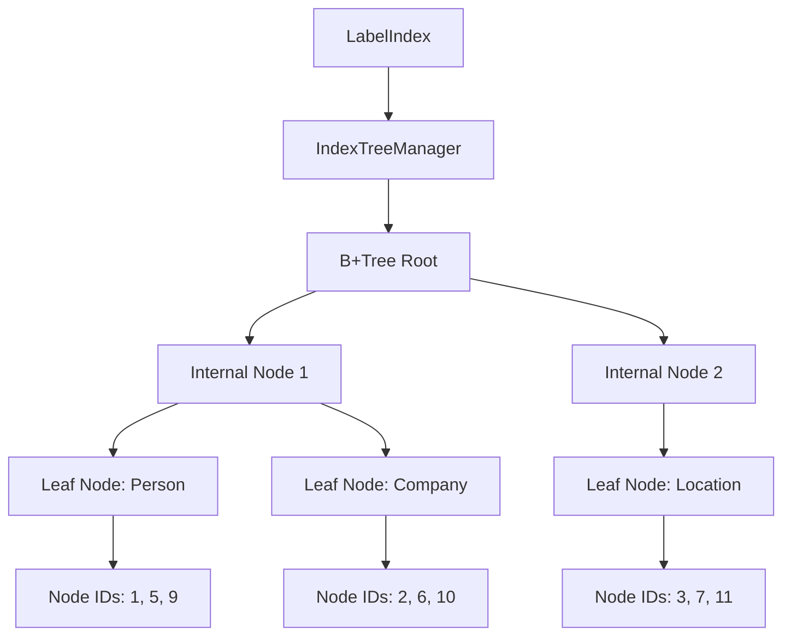
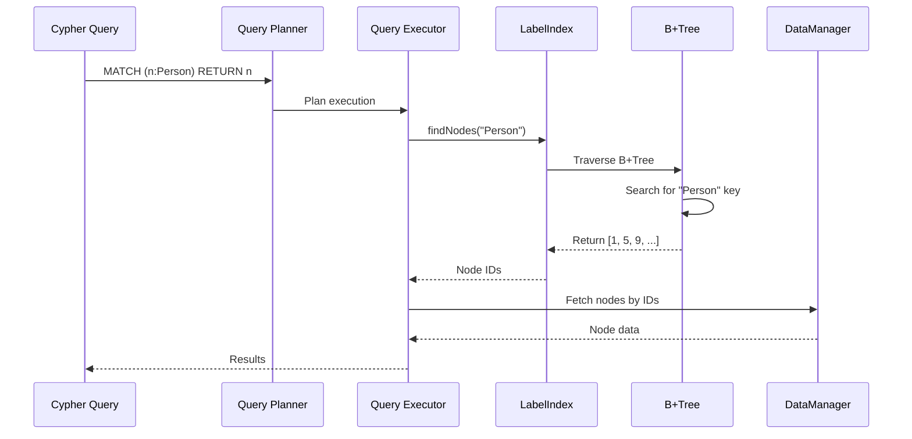
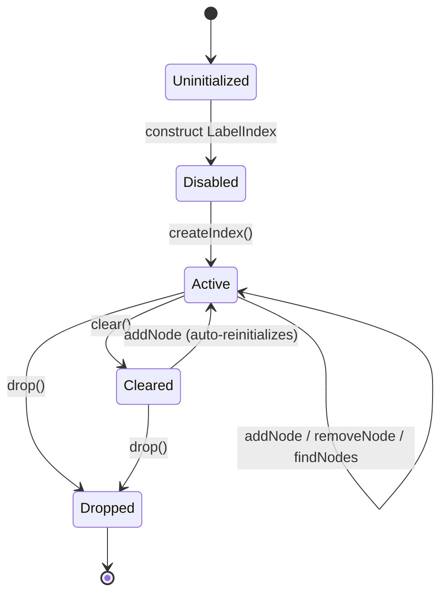
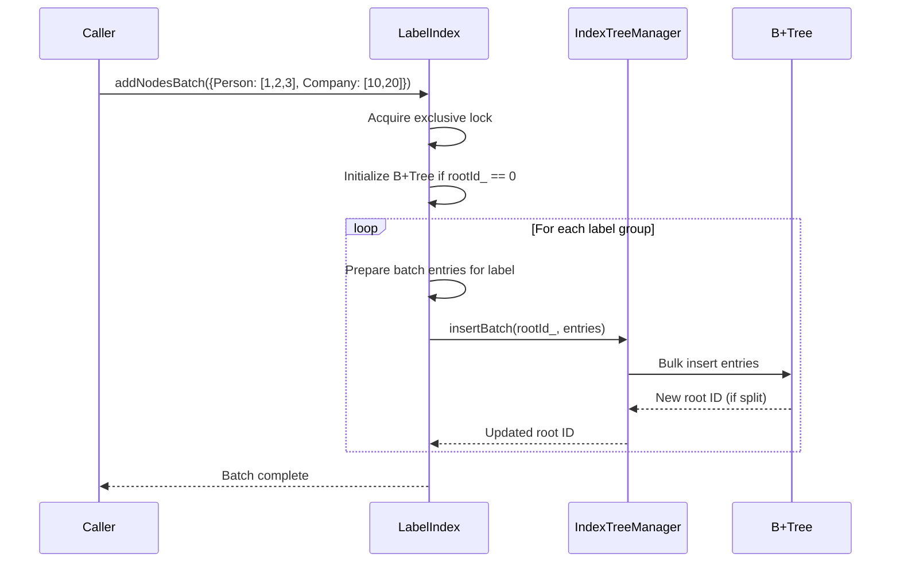

# Label Index

ZYX implements a high-performance label index using B+Tree structure to efficiently map node labels to their corresponding node IDs. This enables fast label-based queries in Cypher such as `MATCH (n:Person) RETURN n`.

## Overview

The label index provides:

- **B+Tree-based indexing**: Efficient label-to-node-IDs mapping using a single B+Tree via IndexTreeManager
- **Multi-label support**: Nodes can have multiple labels indexed simultaneously
- **Batch operations**: Optimized bulk insertion for efficient index building
- **Concurrent access**: Thread-safe operations with shared mutex
- **State persistence**: Automatic persistence of index state across restarts
- **Dynamic enable/disable**: Runtime index management without data loss

## Architecture

### Label Index Structure



LabelIndex owns a single IndexTreeManager instance, which manages one B+Tree. The tree uses label strings as keys and node IDs as values. Because the B+Tree supports duplicate keys, multiple node IDs can be stored under the same label. Each label-to-node-ID mapping is independent: adding or removing a node from one label has no effect on other labels.

### Query Flow



When the query planner encounters a label filter such as `MATCH (n:Person)`, it checks whether the label index is available and enabled. If so, the executor calls `findNodes("Person")` to retrieve matching node IDs directly from the B+Tree, then fetches the full node data from storage. Without the index, a full node scan with a label filter would be required.

## Index Lifecycle

The label index transitions through several states during its lifetime. State is persisted via `SystemStateManager`, which stores the B+Tree root ID and an enabled flag as key-value pairs.

### Lifecycle State Diagram



### Initialization

When a `LabelIndex` is constructed, it calls `initialize()` automatically. This method loads two pieces of persistent state from `SystemStateManager`:

1. **Root ID** -- the segment ID of the B+Tree root node. A value of 0 means no B+Tree has been created yet.
2. **Enabled flag** -- stored under a config key derived from the state key with a config suffix. Defaults to false if absent.

A safety fallback prevents data drift: if the root ID is non-zero but the enabled flag is false, the index forces `enabled_` to true. This ensures that any physical B+Tree data present on disk is never orphaned by a stale enabled flag.

### createIndex()

Calling `createIndex()` sets `enabled_` to true and immediately persists the enabled flag to `SystemStateManager`. This guarantees that after a restart, `initialize()` will read the flag as true and the index will be active.

### clear()

The `clear()` method removes all B+Tree data by delegating to `IndexTreeManager::clear(rootId_)`, then resets the in-memory root ID to 0. Importantly, the enabled flag remains true. This makes `clear()` suitable for index rebuild scenarios where the index will be repopulated immediately.

### drop()

The `drop()` method performs a full teardown: it calls `clear()` to remove all B+Tree data, sets `enabled_` to false, and removes both the config key and the root ID key from `SystemStateManager`. After `drop()`, the index is in a clean state as if it never existed.

### saveState()

During normal operation, `saveState()` persists the current root ID (if non-zero) and the enabled flag (if true) to `SystemStateManager`. It uses a sparse persistence strategy: only non-default values are written, minimizing state storage overhead. The `flush()` method delegates directly to `saveState()`.

## Core Operations

### addNode

Adds a single node-to-label mapping to the index. The operation acquires an exclusive lock, initializes the B+Tree on first use (when root ID is 0), then inserts the label-to-node-ID pair via `IndexTreeManager::insert()`. If the B+Tree root splits during insertion, the in-memory root ID is updated to the new root.

- **Time complexity**: O(log n) where n is the number of unique labels
- **Space complexity**: O(1) amortized per insertion (B+Tree growth)
- **Concurrency**: Exclusive lock

### addNodesBatch

Accepts a map of label strings to vectors of node IDs and inserts them in bulk. The operation acquires a single exclusive lock for the entire batch, initializes the B+Tree if needed, then iterates over each label group. For each label, it prepares a vector of `PropertyValue`-to-node-ID pairs and calls `IndexTreeManager::insertBatch()`.

This grouping by label is important for B+Tree efficiency: all entries sharing the same key are inserted together, reducing the number of tree traversals and node splits.

### Batch Insert Flow



**Optimizations**:

- **Single lock acquisition**: Reduces contention compared to individual inserts
- **Grouped by label**: Minimizes B+Tree traversals and node splits
- **Pre-allocated vectors**: Batch entry vectors are reserved to the exact size needed

### removeNode

Removes a node-to-label mapping. If the B+Tree has not been initialized (root ID is 0), the operation returns immediately. Otherwise it delegates to `IndexTreeManager::remove()`, which handles underflow automatically through redistribution or merging of B+Tree nodes.

- **Time complexity**: O(log n)
- **Automatic rebalancing**: B+Tree handles underflow via merge or redistribute

### findNodes

Retrieves all node IDs associated with a given label. Returns an empty vector if the B+Tree has not been initialized. The operation acquires a shared lock, allowing concurrent reads from multiple threads.

- **Time complexity**: O(log n + k) where k is the number of nodes with the label
- **Concurrency**: Shared lock
- **Return**: Vector of node IDs

### hasLabel

Checks whether a specific node ID is associated with a given label. Internally it calls `findNodes()` and searches the result for the target ID. Returns false if the B+Tree has not been initialized.

- **Time complexity**: O(log n + k) where k is the number of nodes with the label
- **Concurrency**: Shared lock
- **Use case**: Fast label existence check without fetching full node data

## B+Tree Integration

LabelIndex delegates all B+Tree operations to `IndexTreeManager` (source: `include/graph/core/IndexTreeManager.hpp`). The manager provides the following capabilities:

| Method | Description |
|--------|-------------|
| `initialize()` | Creates a new empty B+Tree root node and returns its ID |
| `insert(rootId, key, value)` | Inserts a single key-value pair; returns the (possibly new) root ID |
| `insertBatch(rootId, entries)` | Bulk-inserts multiple key-value pairs; returns the (possibly new) root ID |
| `remove(rootId, key, value)` | Removes a specific key-value pair; handles rebalancing automatically |
| `find(rootId, key)` | Returns all values associated with the given key |
| `clear(rootId)` | Deletes the entire B+Tree rooted at the given ID |
| `findLeafNode(rootId, key)` | Locates the leaf node that would contain the given key |

Key features of the B+Tree layer:

1. **Duplicate key support**: Multiple node IDs can share the same label key
2. **Automatic rebalancing**: Split and merge operations maintain tree balance
3. **Blob storage**: Large value lists are stored externally when they exceed node capacity
4. **Type safety**: LabelIndex configures the tree with `PropertyType::STRING` keys and `int64_t` values for node IDs

## Concurrency Control

LabelIndex uses `std::shared_mutex` for thread-safe access:

| Lock Type | Operations | Behavior |
|-----------|-----------|----------|
| Shared lock | `findNodes`, `hasLabel`, `isEmpty`, `isEnabled`, `hasPhysicalData`, `saveState` | Multiple readers can proceed concurrently |
| Exclusive lock | `addNode`, `addNodesBatch`, `removeNode`, `createIndex`, `clear`, `drop`, `initialize` | Only one writer at a time; blocks all readers |

This allows high read concurrency: multiple threads can query the index simultaneously. Write operations are serialized, and a writer blocks all readers until it completes.

## Status Queries

LabelIndex exposes three methods for inspecting index state:

| Method | Description |
|--------|-------------|
| `isEmpty()` | Returns true if the index is not enabled (checks the enabled flag, not physical data) |
| `isEnabled()` | Returns the enabled flag directly |
| `hasPhysicalData()` | Returns true if the root ID is non-zero (B+Tree exists on disk) |

Note that `isEmpty()` and `hasPhysicalData()` can return different results. An index that has been `clear()`ed is still enabled (so `isEmpty()` returns false) but has no physical data (so `hasPhysicalData()` returns false).

## Multi-Label Support

Nodes can have multiple labels indexed simultaneously. Each label-to-node-ID mapping is stored as an independent entry in the B+Tree. Adding a node under the "Person" label, then under the "Employee" label, creates two separate entries. Querying by either label returns the node. Removing a node from one label does not affect its presence under other labels.

## Performance Characteristics

### Time Complexity

| Operation | Average Case | Worst Case |
|-----------|-------------|------------|
| addNode | O(log n) | O(log n) |
| addNodesBatch | O(m log n) | O(m log n) |
| removeNode | O(log n) | O(log n) |
| findNodes | O(log n + k) | O(log n + k) |
| hasLabel | O(log n + k) | O(log n + k) |

Where:

- n = number of unique labels in the B+Tree
- m = number of nodes in the batch
- k = number of nodes with the specified label

### Space Complexity

| Component | Space | Description |
|-----------|-------|-------------|
| B+Tree Nodes | O(n x b) | n labels, b = branch factor |
| Leaf Entries | O(N) | All node ID references |
| State Metadata | O(1) | Root ID + enabled flag |

Total: **O(N)** where N = total number of node-label associations

### Memory Overhead

```
For 1 million nodes with 2 labels each:

B+Tree Structure:
- Internal nodes: ~100 nodes x 256 bytes = 25.6 KB
- Leaf nodes: ~500 nodes x 256 bytes = 128 KB
- Node ID references: 2M x 8 bytes = 16 MB

Total Index Size: ~16.15 MB
Overhead per Node-Label: ~8 bytes

State Storage:
- Root ID: 8 bytes
- Enabled flag: 1 byte (if true)
```

## Limitations

1. **No partial matches**: Labels must match exactly (no wildcards or prefix searches)
2. **No range queries**: Labels are categorical, not ordered
3. **Memory bound**: Entire index structure must fit in memory during operations
4. **Write serialization**: Only one concurrent writer at a time

## Source Locations

- `include/graph/storage/indexes/LabelIndex.hpp` -- LabelIndex class definition
- `src/storage/indexes/LabelIndex.cpp` -- LabelIndex implementation
- `include/graph/core/IndexTreeManager.hpp` -- B+Tree manager used by LabelIndex

## See Also

- [B+Tree Indexing](/en/docs/zyx/algorithms/btree-indexing) - B+Tree structure details
- [Property Index](/en/docs/zyx/algorithms/property-index) - Property-based indexing
- [Query Optimization](/en/docs/zyx/algorithms/query-optimization) - Index usage in queries
- [Storage System](/en/docs/zyx/architecture/storage) - Overall storage architecture
