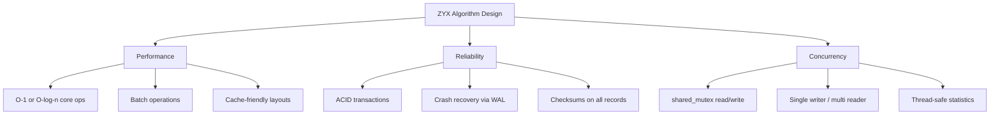

# Algorithms Overview

ZYX employs a range of algorithms across indexing, storage, query processing, vector search, and concurrency control. This section documents each algorithm's design, data flow, and performance characteristics.

## Algorithm Categories

### Storage Algorithms

Algorithms managing persistent data storage and allocation:

- **[Segment Allocation](segment-allocation)** — How segments are allocated, linked into chains, and tracked per entity type
- **[Segment Compaction](segment-compaction)** — Multi-phase compaction that reclaims fragmented space after deletions
- **[Bitmap Indexing](bitmap-indexing)** — Free slot tracking within segments using bitmap structures
- **[Compression](compression)** — Zlib-based lossless compression for state chains and large data

### Transaction & Concurrency

Algorithms ensuring ACID properties and crash recovery:

- **[State Chain & Optimistic Locking](state-chain-optimistic-locking)** — Version-chain configuration storage with atomic read/write
- **[WAL Recovery](wal-recovery)** — 4-phase crash recovery: scan, deduplicate, replay, finalize

### Indexing Algorithms

Algorithms for fast data lookup:

- **[B+Tree Indexing](btree-indexing)** — B+Tree structure for label and property indexes
- **[Label Index](label-index)** — Label-to-node-ID mapping using B+Tree
- **[Property Index](property-index)** — Type-specific B+Tree indexes for property values

### Query Algorithms

Algorithms for efficient query execution:

- **[Query Optimization](query-optimization)** — Multi-rule optimizer with fixed-point iteration
- **[Relationship Traversal](relationship-traversal)** — Doubly-linked adjacency list for edge traversal

### Caching

- **[Cache Eviction](cache-eviction)** — LRU cache with hit/miss statistics and thread-safe operations

### Vector Search

Algorithms for high-dimensional vector similarity search:

- **[Vector Metrics](vector-metrics)** — Optimized L2 and IP distance with mixed-precision support
- **[Product Quantization](product-quantization)** — Vector compression via subspace quantization
- **[K-Means Clustering](kmeans)** — Lloyd's algorithm for PQ codebook training
- **[DiskANN](diskann)** — Navigable small-world graph for approximate nearest neighbor search

## Design Principles

All algorithms share these properties:

- **Thread safety**: `std::shared_mutex` for concurrent read access, exclusive write access
- **Batch operations**: Optimized bulk paths for index building and data import
- **Lazy initialization**: Components (QueryEngine, ThreadPool, WAL) initialized on first use
- **Segment-based storage**: All data stored in fixed-size segments with linked-list chains

## Complexity Summary

| Category | Key Operation | Complexity |
|----------|--------------|------------|
| Segment Allocation | Allocate entity slot | O(1) amortized |
| B+Tree Index | Search / Insert | O(log n) |
| Label Index | Find nodes by label | O(log n + k) |
| Property Index | Exact match | O(log n + k) |
| Property Index | Range query | O(log n + k) |
| Relationship Traversal | Get outgoing/incoming edges | O(k) |
| LRU Cache | Get / Put | O(1) |
| DiskANN Search | K-nearest neighbors | O(beamWidth × maxDegree × dim) |
| PQ Distance | Approximate distance | O(numSubspaces) |

Where n = entries in index, k = result count, dim = vector dimensionality.
