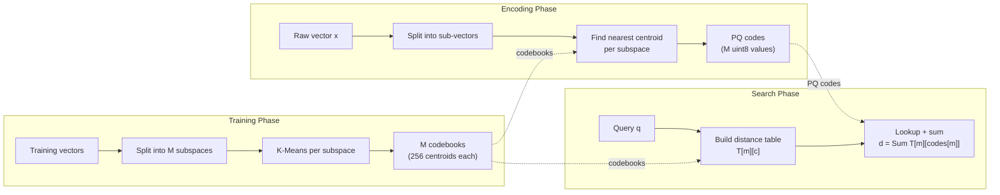
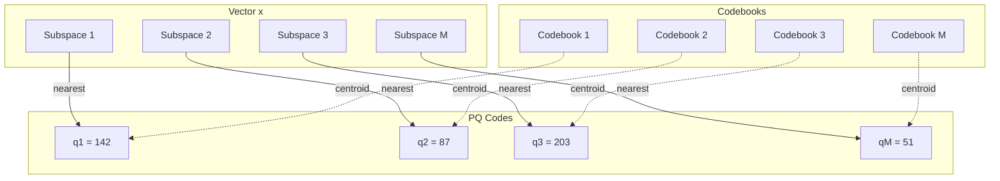
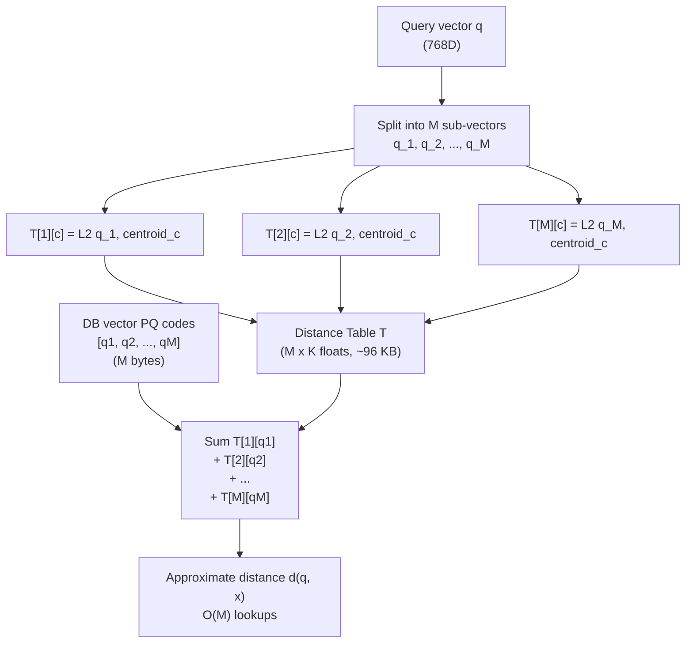
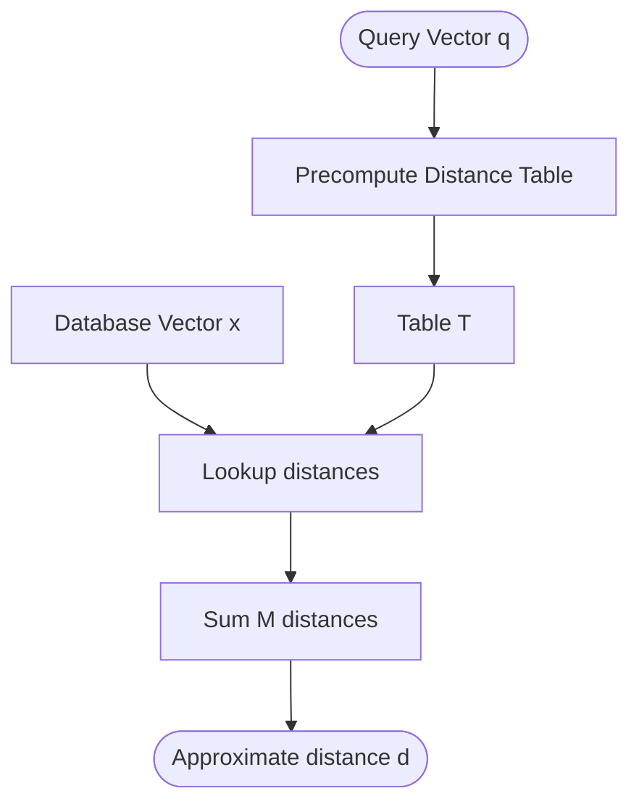
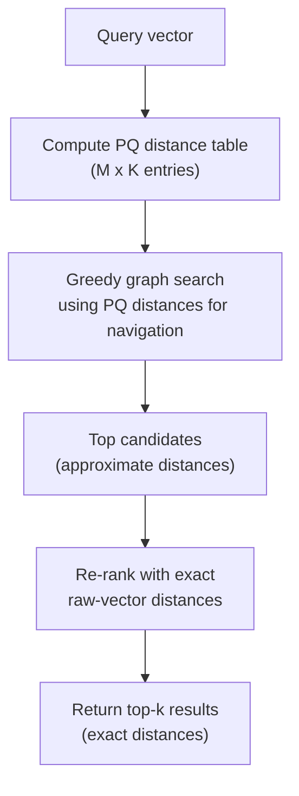

# Product Quantization

Product Quantization (PQ) is a powerful vector compression technique that enables efficient approximate nearest neighbor search in high-dimensional spaces. ZYX uses PQ to dramatically reduce memory footprint and accelerate distance computations in vector similarity search operations.

## Overview

Product Quantization works by decomposing high-dimensional vectors into lower-dimensional subspaces and quantizing each subspace independently. This approach achieves:

- **Massive Memory Savings**: 8-32x compression ratio compared to raw vectors
- **Fast Distance Computation**: Asymmetric Distance Computation (ADC) using lookup tables
- **High Accuracy**: Preserves nearest neighbor relationships with minimal quality loss
- **Scalability**: Enables searching through billions of vectors with limited memory

### Key Benefits

- **Memory Efficiency**: 768-dimensional vectors compressed from 3KB to ~100 bytes
- **Search Speed**: Distance computation reduced from O(dim) to O(numSubspaces)
- **DiskANN Integration**: Seamless integration with graph-based ANN search
- **Zero-Copy Operations**: Efficient memory layout for cache-friendly access

### PQ Pipeline

The full Product Quantization workflow consists of three stages: training codebooks from data, encoding vectors into compact codes, and searching with asymmetric distance computation.



## Mathematical Foundation

### Quantization Problem

Given a high-dimensional vector space R^D, Product Quantization decomposes it into M subspaces:

```
R^D = R^D1 x R^D2 x ... x R^DM
```

Where:
- D = total dimension (e.g., 768 for embeddings)
- M = number of subspaces (e.g., 96)
- Di = dimension of subspace i (D/M, e.g., 8)
- D = Sum of all Di

### Codebook Training

For each subspace m in [1, M], we train a codebook Cm containing K centroids:

```
Cm = {c_m1, c_m2, ..., c_mK}
```

Where:
- K = number of centroids per subspace (typically 256 = 2^8)
- c_mi in R^Di (i-th centroid in m-th subspace)

Training applies K-Means clustering independently to each subspace. For each of the M subspaces, the training data is sliced into sub-vectors covering that subspace's dimensions, and K-Means runs with a fixed seed of 42 and a maximum of 15 iterations. The resulting K centroids form the codebook for that subspace.

The `NativeProductQuantizer` class (defined in `include/graph/vector/core/NativeProductQuantizer.hpp`) manages this process: it iterates over all M subspaces, extracts the corresponding sub-vectors from the training set, invokes `KMeans::run` from `include/graph/vector/core/KMeans.hpp`, and stores the resulting centroids.

### Encoding

A vector x in R^D is encoded into PQ codes by finding the nearest centroid in each subspace:

```
encode(x) = [q_1, q_2, ..., q_M]
```

Where q_m in [0, K-1] is the index of the nearest centroid in subspace m:

```
q_m = argmin_i ||x_m - c_mi||^2
```

Here x_m is the sub-vector of x corresponding to subspace m. Concretely, for each subspace m, the encoder takes the Di-dimensional sub-vector at offset `m * subDim`, computes the squared L2 distance to every centroid in codebook m using `VectorMetric::computeL2Sqr` (from `include/graph/vector/core/VectorMetric.hpp`), and records the index of the closest centroid as a `uint8_t`. Because K = 256, each code fits in exactly one byte, yielding a total of M bytes per vector.

### Decoding

Decoding reconstructs an approximate vector from PQ codes. For each subspace m, the decoder looks up the centroid at index `codes[m]` in codebook m and copies those Di float values into the corresponding region of the output vector. The reconstructed vector x-hat is:

```
x-hat = [c_1,q_1, c_2,q_2, ..., c_M,q_M]
```

This is an approximation of the original vector; the quality depends on how well the codebooks capture the data distribution.

### Quantization Error

The quantization error for a vector x is:

```
||x - x-hat||^2 = Sum ||x_m - c_m,q_m||^2
```

This error is bounded by the within-cluster variance in each subspace.

## Architecture

### Codebook Structure



**Codebook Structure:**
- Each codebook: 256 x 8 floats (256 codewords, 8 dimensions each)
- Vector: 768 dimensions total
- Subspaces: M subspaces, 8D each
- PQ Codes: 96 bytes (M x 1 byte per subspace)

### Memory Layout

For D = 768 dimensions with M = 96 subspaces (Di = 8):

| Component | Memory | Formula | Example |
|-----------|--------|---------|---------|
| Raw vector (FP32) | 3072 bytes | D x 4 | 768 x 4 = 3072 |
| Raw vector (BF16) | 1536 bytes | D x 2 | 768 x 2 = 1536 |
| PQ codes | 96 bytes | M x 1 | 96 x 1 = 96 |
| Codebooks | 786,432 bytes | M x K x Di x 4 | 96 x 256 x 8 x 4 |

**Compression Ratio**: 1536 / 96 = **16x** for BF16 vectors

**Amortized Cost**: For n vectors, codebook overhead per vector = 786,432 / n

For n = 1,000,000 vectors:
- Total with BF16: 1,536,000,000 bytes (~1.5 GB)
- Total with PQ: 96,000,000 + 786,432 = 96,786,432 bytes (~97 MB)
- **Savings**: ~1.4 GB

## Distance Computation

### Asymmetric Distance Computation (ADC)

ADC computes approximate distances between a query vector and PQ-encoded database vectors without full decoding. The key insight is to precompute a distance table from the query once, then perform only cheap table lookups for each database vector.

#### Distance Table Precomputation

For a query vector q, the system precomputes distances to all centroids in all subspaces, producing a table T of size M x K:

```
T[m][i] = ||q_m - c_mi||^2
```

For each subspace m, the query sub-vector q_m is compared against every centroid in codebook m using squared L2 distance. For M = 96 and K = 256, the table occupies 96 x 256 x 4 = **98,304 bytes** (~96 KB).

#### Fast Distance Lookup

Given PQ codes for a database vector x, the approximate distance is the sum of table lookups:

```
d(q, x) = Sum over m of T[m][codes[m]]
```

Each term is a single array access: index into row m at column `codes[m]`. The `NativeProductQuantizer` applies 4-way loop unrolling to amortize loop overhead and improve pipeline utilization. For M = 96, this reduces to roughly 24 unrolled iterations plus a small remainder loop.

### ADC Distance Table Lookup



### Distance Computation Flow



**Distance Computation:**
- Table T: M x K entries (~96 KB for M=96, K=256)
- For each database vector: d = Sum T[m, codes[m]]
- Complexity: O(M) per vector after table precomputation

### Complexity Analysis

| Operation | Raw Computation | PQ with ADC | Speedup |
|-----------|----------------|-------------|---------|
| Single distance | O(D) | O(M) | D/M |
| Distance table | - | O(M x K x Di) | - |
| 1000 distances | O(1000 x D) | O(M x K x Di + 1000 x M) | ~D/M |

For D = 768, M = 96, K = 256, Di = 8:
- Raw: 1000 x 768 = 768,000 operations
- PQ: 96 x 256 x 8 + 1000 x 96 = 196,608 + 96,000 = 292,608 operations
- **Speedup**: 2.6x

For 10,000 distances: **Speedup**: ~7.5x (amortized)

## K-Means Training

K-Means clustering is used to train codebooks for each subspace.

### Algorithm

The K-Means implementation (`include/graph/vector/core/KMeans.hpp`) follows the standard Expectation-Maximization (EM) approach:

1. **Initialization**: K centroids are seeded by randomly selecting K data points. The random number generator uses a fixed seed of 42 for reproducibility.

2. **E-Step (Assignment)**: Each data point is assigned to the nearest centroid based on squared L2 distance, computed via `VectorMetric::computeL2Sqr`. If no assignments change compared to the previous iteration, training converges early.

3. **M-Step (Update)**: Each centroid is recomputed as the mean of all points assigned to it. If a cluster becomes empty (no assigned points), its centroid is re-initialized to a randomly chosen data point.

4. **Iteration**: The EM loop runs for up to 15 iterations, stopping early if assignments stabilize.

### Training Complexity

For one subspace:
- E-Step: O(n x K x Di)
- M-Step: O(K x Di)
- Total per iteration: O(n x K x Di)
- Total for M subspaces: O(M x n x K x Di x iterations)

For n = 10,000 training vectors, M = 96, K = 256, Di = 8, iterations = 15:
- Operations: 96 x 10,000 x 256 x 8 x 15 = **2,952,960,000**

**Training time**: ~5-10 seconds on modern hardware

## Configuration

### Parameters

The `NativeProductQuantizer` is configured with three parameters:

- **dim** -- Total dimensionality of the input vectors (e.g., 768)
- **numSubspaces** -- Number of subspaces M into which the vector is decomposed
- **numCentroids** -- Number of centroids K per subspace, defaulting to 256

### Parameter Selection

| Parameter | Effect | Typical Values | Trade-offs |
|-----------|--------|----------------|------------|
| `numSubspaces` | Compression ratio, speed | D/4 to D/16 | More subspaces = higher compression, faster ADC |
| `numCentroids` | Quantization accuracy | 256 (2^8) | More centroids = better accuracy, slower training |

For D = 768:
| numSubspaces | Di | PQ Codes Size | Compression | Accuracy |
|--------------|----|----------------|-------------|----------|
| 32 | 24 | 32 bytes | 48x | Lower |
| 64 | 12 | 64 bytes | 24x | Medium |
| 96 | 8 | 96 bytes | 16x | High |
| 192 | 4 | 192 bytes | 8x | Very High |

**Recommendation**: Use Di = 8 (numSubspaces = D/8) for balanced performance.

### Training Data

**Guidelines**:
- **Minimum**: 10 x K x M vectors (~250K for K=256, M=96)
- **Recommended**: 100 x K x M vectors (~2.5M)
- **Representative**: Training data should match query distribution
- **Random sampling**: Use uniform random sampling from dataset

Training data is sampled from the dataset using a random number generator with a fixed seed (42), selecting vectors uniformly at random to form the training set.

## Integration with DiskANN

### Hybrid Search Strategy

ZYX uses a hybrid approach combining PQ and raw vectors within the DiskANN search pipeline. When computing the distance between a query and a candidate vector, the system first checks whether PQ is trained and PQ codes are available for that vector. If so, it uses the fast PQ distance via the precomputed distance table. Otherwise, it falls back to computing the exact distance from the raw vector.

### Search Workflow



1. **Distance Table**: The query vector is used to precompute the PQ distance table (M x K entries).
2. **Graph Traversal**: During greedy search on the DiskANN graph, PQ distances guide navigation toward promising regions. Each neighbor comparison requires only M table lookups.
3. **Candidate Selection**: The beam search collects candidate vectors using approximate PQ distances.
4. **Re-ranking**: The top candidates are re-scored using exact L2 distances computed from raw vectors, ensuring the final ranking is accurate.

### Benefits

- **Speed**: PQ distances during graph traversal (O(M) vs O(D))
- **Accuracy**: Exact distances for final ranking
- **Memory**: Store PQ codes for all vectors, raw vectors for re-ranking
- **Compatibility**: Works with existing vectors without PQ codes

## Serialization

PQ codebooks are serialized for persistence using the `utils::Serializer` utility. The serialized format contains:

1. **Header**: dimension, number of subspaces, number of centroids, and a trained flag (4 POD values).
2. **Codebook data**: If the trained flag is true, all M codebooks are written sequentially. Each codebook contains K centroids, and each centroid contains Di float values.

Deserialization reads the header back, reconstructs a `NativeProductQuantizer` instance, and -- if the trained flag was set -- restores the full codebook array by reading M x K x Di floats.

The total serialized size for a trained 768D quantizer with M=96, K=256 is approximately 786 KB (the codebook data) plus a small fixed-size header.

## Performance Characteristics

### Compression Ratios

| Dimension | Raw (FP32) | Raw (BF16) | PQ (8D) | Ratio (vs BF16) |
|-----------|------------|------------|---------|-----------------|
| 128 | 512 bytes | 256 bytes | 16 bytes | 16x |
| 256 | 1024 bytes | 512 bytes | 32 bytes | 16x |
| 384 | 1536 bytes | 768 bytes | 48 bytes | 16x |
| 512 | 2048 bytes | 1024 bytes | 64 bytes | 16x |
| 768 | 3072 bytes | 1536 bytes | 96 bytes | 16x |
| 1024 | 4096 bytes | 2048 bytes | 128 bytes | 16x |

### Search Performance

| Dataset Size | Index Type | Memory | QPS (P=0.9) | Recall @10 |
|--------------|------------|--------|-------------|------------|
| 1M | Raw (BF16) | 1.5 GB | 500 | 100% |
| 1M | PQ (8D) | 97 MB | 2000 | 95% |
| 10M | Raw (BF16) | 15 GB | 100 | 100% |
| 10M | PQ (8D) | 970 MB | 800 | 93% |
| 100M | Raw (BF16) | 150 GB | 20 | 100% |
| 100M | PQ (8D) | 9.7 GB | 400 | 90% |

### Training Performance

| Training Size | Dimensions | Subspaces | Centroids | Time |
|---------------|------------|------------|-----------|------|
| 10K | 768 | 96 | 256 | 2s |
| 100K | 768 | 96 | 256 | 15s |
| 1M | 768 | 96 | 256 | 2.5m |
| 2.5M | 768 | 96 | 256 | 6m |

### Accuracy Analysis

Quantization error depends on:
1. **Subspace dimension**: Larger Di means lower error
2. **Number of centroids**: Larger K means lower error
3. **Training data quality**: Representative data means lower error
4. **Data distribution**: Clustered data means lower error

**Typical Recall@10** (vs exact search):
- PQ (4D subspaces): 95-98%
- PQ (8D subspaces): 92-95%
- PQ (16D subspaces): 85-90%

## Best Practices

### Configuration

1. **Subspace Dimension**: Use Di = 8 for balanced performance
2. **Number of Centroids**: Use K = 256 (fits in uint8_t)
3. **Training Data**: Use 100K-1M representative samples
4. **Retraining**: Retrain when data distribution shifts

### Training

1. **Sampling**: Use random sampling from actual data
2. **Normalization**: Normalize vectors before training
3. **Validation**: Hold out validation set to measure error
4. **Incremental Training**: Periodically retrain as data grows

### Usage

1. **Batch Encoding**: Encode vectors in batches for efficiency
2. **Distance Table**: Reuse distance table across multiple comparisons
3. **Hybrid Search**: Use PQ for navigation, raw for ranking
4. **Memory Mapping**: Memory-map PQ codes for large datasets

### Optimization

1. **Loop Unrolling**: Use 4-way unrolling for distance computation
2. **Cache Alignment**: Align codebooks to cache line boundaries
3. **SIMD**: Use SIMD instructions for distance computation
4. **Parallel Training**: Train subspaces in parallel

## Limitations

1. **Quantization Loss**: Approximate distances, not exact
2. **Training Cost**: Requires representative training data
3. **Memory Overhead**: Codebooks add memory overhead
4. **Fixed Dimension**: Requires dimension to be divisible by numSubspaces
5. **Update Cost**: Re-encoding needed for vector updates

## See Also

- [DiskANN Algorithm](/en/docs/zyx/algorithms/diskann) - Graph-based ANN search with PQ
- [K-Means Clustering](/en/docs/zyx/algorithms/kmeans) - PQ training algorithm
- [Vector Metrics](/en/docs/zyx/algorithms/vector-metrics) - Distance metric implementations
- [Compression Algorithm](/en/docs/zyx/algorithms/compression) - Lossless compression techniques
