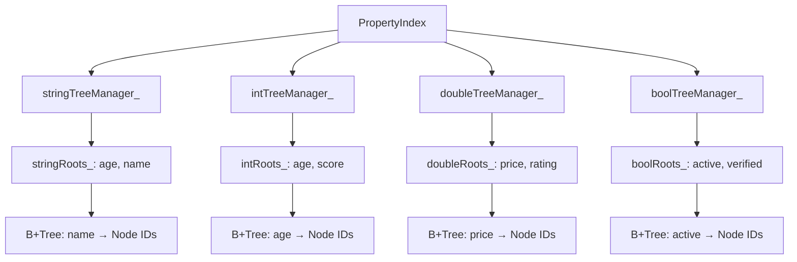
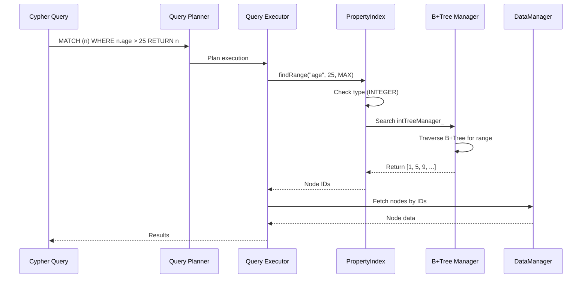

# Property Index

ZYX implements a high-performance property index system using type-specific B+Tree structures to efficiently map property values to their corresponding entity IDs. This enables fast property-based queries in Cypher such as `MATCH (n) WHERE n.age > 25 RETURN n` or `MATCH (n) WHERE n.name = 'Alice' RETURN n`.

## Overview

The property index provides:

- **Type-specific indexing**: Separate B+Trees for string, integer, double, and boolean property types
- **Multi-key indexing**: Support for indexing multiple property keys simultaneously
- **Automatic type inference**: Determines property type from first inserted value
- **Batch operations**: Optimized bulk insertion for efficient index building
- **Concurrent access**: Thread-safe operations with shared mutex
- **State persistence**: Automatic persistence of index metadata across restarts
- **Dynamic index management**: Runtime index creation, clearing, and dropping

## Architecture

### Multi-Type Index Structure



### Property-Based Query Flow



## Implementation

### Class Definition

```cpp
class PropertyIndex {
public:
    PropertyIndex(std::shared_ptr<storage::DataManager> dataManager,
                  std::shared_ptr<storage::state::SystemStateManager> systemStateManager,
                  uint32_t indexType,
                  std::string baseStateKey);

    // Core operations
    void addProperty(int64_t entityId, const std::string &key, const PropertyValue &value);
    void addPropertiesBatch(const std::vector<std::tuple<int64_t, std::string, PropertyValue>> &properties);
    void removeProperty(int64_t entityId, const std::string &key, const PropertyValue &value);
    std::vector<int64_t> findExactMatch(const std::string &key, const PropertyValue &value) const;
    std::vector<int64_t> findRange(const std::string &key, double minValue, double maxValue) const;

    // Index lifecycle
    void createIndex(const std::string &key);
    void clearIndexData(const std::string &key);
    void clearKey(const std::string &key);
    void dropKey(const std::string &key);
    void clear();
    void drop();
    void flush() const;
    void saveState() const;

    // Status queries
    bool isEmpty() const;
    bool hasKeyIndexed(const std::string &key) const;
    const std::vector<std::string> &getIndexedKeys() const;
    PropertyType getIndexedKeyType(const std::string &key) const;

private:
    std::shared_ptr<storage::DataManager> dataManager_;
    std::shared_ptr<storage::state::SystemStateManager> systemStateManager_;

    // Type-specific tree managers
    std::shared_ptr<IndexTreeManager> stringTreeManager_;
    std::shared_ptr<IndexTreeManager> intTreeManager_;
    std::shared_ptr<IndexTreeManager> doubleTreeManager_;
    std::shared_ptr<IndexTreeManager> boolTreeManager_;

    mutable std::shared_mutex mutex_;
    const std::string baseStateKey_;

    // Root IDs for different property types
    std::unordered_map<std::string, int64_t> stringRoots_;
    std::unordered_map<std::string, int64_t> intRoots_;
    std::unordered_map<std::string, int64_t> doubleRoots_;
    std::unordered_map<std::string, int64_t> boolRoots_;

    // Type mapping for each indexed key
    std::unordered_map<std::string, PropertyType> indexedKeyTypes_;
    std::vector<std::string> indexedKeysList_;
};
```

## Core Operations

### Initialization

The property index is initialized from persistent state on startup:

```cpp
void PropertyIndex::initialize() {
    std::unique_lock lock(mutex_);

    // 1. Load root maps for all types
    deserializeRootMap();

    // 2. Load key type mappings
    deserializeKeyTypeMap();

    // 3. Rebuild indexed keys list cache
    indexedKeysList_.clear();
    indexedKeysList_.reserve(indexedKeyTypes_.size());
    for (const auto &key: indexedKeyTypes_ | std::views::keys) {
        indexedKeysList_.push_back(key);
    }
}
```

**Key Points**:
- Separate root maps for each property type (string, int, double, bool)
- Key type mapping tracks which type each property key uses
- Indexed keys list cache for fast enumeration
- All metadata persisted across restarts

### Create Index

Registers a property key for indexing:

```cpp
void PropertyIndex::createIndex(const std::string &key) {
    std::unique_lock lock(mutex_);
    if (!indexedKeyTypes_.contains(key)) {
        indexedKeyTypes_[key] = PropertyType::UNKNOWN;
        indexedKeysList_.push_back(key);
    }
}
```

**Characteristics**:
- **Immediate registration**: Key is visible to `listIndexes()` even before data insertion
- **Type inference**: Type starts as UNKNOWN, determined from first inserted value
- **Idempotent**: Safe to call multiple times for same key
- **No data structures created**: B+Tree initialized only on first data insertion

**Use Case**: Pre-declare indexes before bulk data loading

### Add Property

Adds a single property value to the index:

```cpp
void PropertyIndex::addProperty(int64_t entityId, const std::string &key,
                                const PropertyValue &value) {
    std::unique_lock lock(mutex_);

    // 1. Validate value type
    PropertyType valueType = getPropertyType(value);
    if (valueType == PropertyType::UNKNOWN || valueType == PropertyType::NULL_TYPE) {
        return;
    }

    // 2. Check or register key type
    auto it = indexedKeyTypes_.find(key);
    if (it == indexedKeyTypes_.end()) {
        // Auto-creation: register key with inferred type
        indexedKeyTypes_[key] = valueType;
    } else if (it->second == PropertyType::UNKNOWN) {
        // Transition from UNKNOWN to concrete type
        it->second = valueType;
    } else if (it->second != valueType) {
        // Type mismatch: ignore value
        return;
    }

    // 3. Get type-specific tree manager and root map
    auto treeManager = getTreeManagerForType(valueType);
    auto &rootMap = getRootMapForType(valueType);

    // 4. Initialize B+Tree if needed
    if (!rootMap.contains(key)) {
        rootMap[key] = treeManager->initialize();
    }

    // 5. Insert into B+Tree
    rootMap[key] = treeManager->insert(rootMap[key], value, entityId);
}
```

**Characteristics**:
- **Time Complexity**: O(log n) where n is the number of unique property values
- **Space Complexity**: O(1) amortized (B+Tree growth)
- **Auto-creation**: Automatically creates index if key not registered
- **Type validation**: Enforces type consistency for existing indexes

**Type Inference Rules**:
1. First insertion determines the type
2. Subsequent insertions must match type
3. Type mismatches are silently ignored
4. NULL and UNKNOWN values are never indexed

### Batch Add Properties

Optimized bulk insertion for multiple properties:

```cpp
void PropertyIndex::addPropertiesBatch(
    const std::vector<std::tuple<int64_t, std::string, PropertyValue>> &properties
) {
    if (properties.empty())
        return;

    std::unique_lock lock(mutex_);

    // Structure: Type -> Key -> List of {Value, EntityID} pairs
    std::map<PropertyType, std::map<std::string, std::vector<std::pair<PropertyValue, int64_t>>>> groupedBatch;

    // 1. Classification & Filtering Phase
    for (const auto &[entityId, key, value]: properties) {
        PropertyType valueType = getPropertyType(value);
        if (valueType == PropertyType::UNKNOWN || valueType == PropertyType::NULL_TYPE) {
            continue;
        }

        // Check if key is registered (NO auto-creation in batch mode)
        auto it = indexedKeyTypes_.find(key);
        if (it == indexedKeyTypes_.end()) {
            continue;
        }

        PropertyType registeredType = it->second;

        if (registeredType == PropertyType::UNKNOWN) {
            // First time seeing data, set the type
            indexedKeyTypes_[key] = valueType;
            registeredType = valueType;
        } else if (registeredType != valueType) {
            // Type mismatch, skip this property
            continue;
        }

        // Add to grouped batch
        groupedBatch[registeredType][key].emplace_back(value, entityId);
    }

    // 2. Batch Insertion Phase
    for (auto &[type, keyMap]: groupedBatch) {
        auto treeManager = getTreeManagerForType(type);
        auto &rootMap = getRootMapForType(type);

        if (!treeManager)
            continue;

        for (auto &[key, entries]: keyMap) {
            if (entries.empty())
                continue;

            // Ensure root exists
            if (!rootMap.contains(key)) {
                rootMap[key] = treeManager->initialize();
            }

            int64_t currentRootId = rootMap[key];

            // Execute batch insert on B+Tree
            int64_t newRootId = treeManager->insertBatch(currentRootId, entries);

            // Update root if tree grew
            if (newRootId != currentRootId) {
                rootMap[key] = newRootId;
            }
        }
    }
}
```

**Optimizations**:
- **Single lock acquisition**: Reduces contention vs individual inserts
- **Type-based grouping**: Minimizes tree manager switches
- **Key-based grouping**: Optimizes B+Tree batch insertion
- **No auto-creation**: Prevents accidental index explosion in bulk loads

**Performance**:
- **Throughput**: ~10x faster than individual inserts for large batches
- **Memory**: Groups entries in memory before insertion
- **Use Case**: Index building during database startup or bulk import

### Remove Property

Removes a property value from the index:

```cpp
void PropertyIndex::removeProperty(int64_t entityId, const std::string &key,
                                   const PropertyValue &value) {
    std::unique_lock lock(mutex_);

    // 1. Find registered type for key
    const auto it = indexedKeyTypes_.find(key);
    if (it == indexedKeyTypes_.end()) {
        return; // Key not indexed
    }

    const PropertyType registeredType = it->second;
    const PropertyType valueType = getPropertyType(value);

    // 2. Validate type match
    if (registeredType != valueType) {
        return;
    }

    // 3. Get type-specific structures
    const auto treeManager = getTreeManagerForType(registeredType);
    auto &rootMap = getRootMapForType(registeredType);
    const auto rootIt = rootMap.find(key);

    if (rootIt == rootMap.end()) {
        return; // No root for this key
    }

    // 4. Remove from B+Tree
    (void) treeManager->remove(rootMap.at(key), value, entityId);
}
```

**Characteristics**:
- **Time Complexity**: O(log n)
- **Automatic rebalancing**: B+Tree handles underflow via merge/redistribute
- **Type validation**: Only removes if type matches registered type

### Find Exact Match

Retrieves entities with exact property value match:

```cpp
std::vector<int64_t> PropertyIndex::findExactMatch(
    const std::string &key,
    const PropertyValue &value
) const {
    std::shared_lock lock(mutex_);

    // 1. Get value type
    const PropertyType valueType = getPropertyType(value);

    // 2. Check if key is indexed with matching type
    if (const auto it = indexedKeyTypes_.find(key);
        it == indexedKeyTypes_.end() || it->second != valueType) {
        return {};
    }

    // 3. Get type-specific root map
    const auto &rootMap = getRootMapForType(valueType);
    const auto rootIt = rootMap.find(key);

    if (rootIt == rootMap.end()) {
        return {};
    }

    // 4. Search B+Tree
    return getTreeManagerForType(valueType)->find(rootIt->second, value);
}
```

**Characteristics**:
- **Time Complexity**: O(log n + k) where k is the number of matching entities
- **Concurrency**: Shared lock allows concurrent reads
- **Type validation**: Returns empty if type mismatch
- **Return**: Vector of entity IDs (empty if not found)

**Use Case**: Queries like `WHERE n.name = 'Alice'`

### Find Range

Retrieves entities with property values in a numeric range:

```cpp
std::vector<int64_t> PropertyIndex::findRange(
    const std::string &key,
    double minValue,
    double maxValue
) const {
    std::shared_lock lock(mutex_);

    // 1. Get key type
    PropertyType type = getIndexedKeyType(key);

    // 2. Validate numeric type
    if (type != PropertyType::INTEGER && type != PropertyType::DOUBLE) {
        return {};
    }

    // 3. Get type-specific root map
    const auto &rootMap = getRootMapForType(type);
    auto rootIt = rootMap.find(key);

    if (rootIt == rootMap.end()) {
        return {};
    }

    // 4. Convert to appropriate type
    PropertyValue minKey, maxKey;
    if (type == PropertyType::INTEGER) {
        minKey = static_cast<int64_t>(std::ceil(minValue));
        maxKey = static_cast<int64_t>(std::floor(maxValue));
    } else {
        minKey = minValue;
        maxKey = maxValue;
    }

    // 5. Search B+Tree range
    return getTreeManagerForType(type)->findRange(rootIt->second, minKey, maxKey);
}
```

**Characteristics**:
- **Time Complexity**: O(log n + k) where k is the number of entities in range
- **Numeric only**: Only supports INTEGER and DOUBLE types
- **Type conversion**: Automatically converts doubles to integers for INTEGER indexes
- **Use Case**: Queries like `WHERE n.age > 25 AND n.age < 65`

## Type System

### Property Types

The property index supports four indexed property types:

| Type | Description | Example Values | Range Queries |
|------|-------------|----------------|---------------|
| STRING | Text strings | "Alice", "Bob" | No |
| INTEGER | 64-bit integers | 25, -10, 1000 | Yes |
| DOUBLE | Floating-point numbers | 3.14, -0.5, 1e6 | Yes |
| BOOLEAN | True/false values | true, false | No |

### Type Inference

Types are inferred from the first inserted value:

```cpp
// First insertion determines type
propertyIndex.addProperty(1, "age", PropertyValue(25));  // Type: INTEGER
propertyIndex.addProperty(2, "age", PropertyValue(30));  // OK: matches INTEGER
propertyIndex.addProperty(3, "age", PropertyValue("25")); // Ignored: type mismatch

// Explicit creation allows deferred type inference
propertyIndex.createIndex("salary");  // Type: UNKNOWN
propertyIndex.addProperty(1, "salary", PropertyValue(50000.50));  // Type: DOUBLE
```

### Type Validation

```cpp
// Type validation ensures consistency
propertyIndex.addProperty(1, "name", PropertyValue("Alice"));  // Type: STRING
propertyIndex.addProperty(2, "name", PropertyValue(123));       // Ignored: INTEGER != STRING
propertyIndex.addProperty(3, "name", PropertyValue(true));      // Ignored: BOOLEAN != STRING
```

## Index Lifecycle

### Clear Index Data

Clears B+Tree data while keeping index definition:

```cpp
void PropertyIndex::clearIndexData(const std::string &key) {
    std::unique_lock lock(mutex_);

    if (!indexedKeyTypes_.contains(key)) {
        return;
    }

    // Clear roots for all types (defense in depth)
    auto clearRoot = [&](auto &rootMap, auto &treeManager) {
        if (auto rootIt = rootMap.find(key); rootIt != rootMap.end()) {
            treeManager->clear(rootIt->second);
            rootMap.erase(rootIt);
        }
    };

    clearRoot(stringRoots_, stringTreeManager_);
    clearRoot(intRoots_, intTreeManager_);
    clearRoot(doubleRoots_, doubleTreeManager_);
    clearRoot(boolRoots_, boolTreeManager_);

    // Reset type to UNKNOWN for rebuild
    indexedKeyTypes_[key] = PropertyType::UNKNOWN;
}
```

**Use Case**: Index rebuilding scenarios

### Clear Key

Removes both data and definition for a specific key:

```cpp
void PropertyIndex::clearKey(const std::string &key) {
    std::unique_lock lock(mutex_);

    auto it = indexedKeyTypes_.find(key);
    if (it == indexedKeyTypes_.end()) {
        return;
    }

    PropertyType type = it->second;

    // Handle UNKNOWN type (no B+Tree to clear)
    if (type == PropertyType::UNKNOWN) {
        indexedKeyTypes_.erase(it);
        return;
    }

    // Clear B+Tree for concrete type
    auto &rootMap = getRootMapForType(type);
    auto rootIt = rootMap.find(key);

    if (rootIt != rootMap.end()) {
        auto treeManager = getTreeManagerForType(type);
        treeManager->clear(rootIt->second);
        rootMap.erase(rootIt);
    }

    // Remove type mapping
    indexedKeyTypes_.erase(it);
    std::erase(indexedKeysList_, key);
}
```

### Drop Key

Completely removes a key and its persistent state:

```cpp
void PropertyIndex::dropKey(const std::string &key) {
    // Clear data and definition
    clearKey(key);

    // Remove persistent state if maps are empty
    if (stringRoots_.empty()) {
        systemStateManager_->remove(baseStateKey_ + storage::state::keys::SUFFIX_STRING_ROOTS);
    }
    if (intRoots_.empty()) {
        systemStateManager_->remove(baseStateKey_ + storage::state::keys::SUFFIX_INT_ROOTS);
    }
    if (doubleRoots_.empty()) {
        systemStateManager_->remove(baseStateKey_ + storage::state::keys::SUFFIX_DOUBLE_ROOTS);
    }
    if (boolRoots_.empty()) {
        systemStateManager_->remove(baseStateKey_ + storage::state::keys::SUFFIX_BOOL_ROOTS);
    }

    if (indexedKeyTypes_.empty()) {
        systemStateManager_->remove(baseStateKey_ + storage::state::keys::SUFFIX_KEY_TYPES);
    }
}
```

### Clear All

Removes all index data:

```cpp
void PropertyIndex::clear() {
    std::unique_lock lock(mutex_);

    auto clearAllRoots = [&](auto &rootMap, auto &treeManager) {
        for (const auto &rootId: rootMap | std::views::values) {
            treeManager->clear(rootId);
        }
        rootMap.clear();
    };

    clearAllRoots(stringRoots_, stringTreeManager_);
    clearAllRoots(intRoots_, intTreeManager_);
    clearAllRoots(doubleRoots_, doubleTreeManager_);
    clearAllRoots(boolRoots_, boolTreeManager_);

    indexedKeyTypes_.clear();
    indexedKeysList_.clear();
}
```

### Drop All

Completely removes the index:

```cpp
void PropertyIndex::drop() {
    clear();

    // Remove all persistent state
    systemStateManager_->remove(baseStateKey_ + storage::state::keys::SUFFIX_STRING_ROOTS);
    systemStateManager_->remove(baseStateKey_ + storage::state::keys::SUFFIX_INT_ROOTS);
    systemStateManager_->remove(baseStateKey_ + storage::state::keys::SUFFIX_DOUBLE_ROOTS);
    systemStateManager_->remove(baseStateKey_ + storage::state::keys::SUFFIX_BOOL_ROOTS);
    systemStateManager_->remove(baseStateKey_ + storage::state::keys::SUFFIX_KEY_TYPES);
}
```

## State Persistence

### Save State

Persists index metadata to disk:

```cpp
void PropertyIndex::saveState() const {
    std::shared_lock lock(mutex_);

    // Save all root maps
    serializeRootMap();

    // Save key type mappings
    serializeKeyTypeMap();
}

void PropertyIndex::serializeRootMap() const {
    if (!stringRoots_.empty()) {
        systemStateManager_->setMap(baseStateKey_ + storage::state::keys::SUFFIX_STRING_ROOTS, stringRoots_);
    }
    if (!intRoots_.empty()) {
        systemStateManager_->setMap(baseStateKey_ + storage::state::keys::SUFFIX_INT_ROOTS, intRoots_);
    }
    if (!doubleRoots_.empty()) {
        systemStateManager_->setMap(baseStateKey_ + storage::state::keys::SUFFIX_DOUBLE_ROOTS, doubleRoots_);
    }
    if (!boolRoots_.empty()) {
        systemStateManager_->setMap(baseStateKey_ + storage::state::keys::SUFFIX_BOOL_ROOTS, boolRoots_);
    }
}

void PropertyIndex::serializeKeyTypeMap() const {
    if (!indexedKeyTypes_.empty()) {
        std::unordered_map<std::string, int64_t> rawTypeMap;
        for (const auto &[k, v]: indexedKeyTypes_) {
            rawTypeMap[k] = static_cast<int64_t>(v);
        }
        systemStateManager_->setMap(baseStateKey_ + storage::state::keys::SUFFIX_KEY_TYPES, rawTypeMap);
    }
}
```

**Persistence Strategy**:
- Only persist non-empty maps (sparse state)
- Type enums stored as int64_t for serialization
- Root IDs map property keys to B+Tree roots

### Load State

Restores index metadata from disk:

```cpp
void PropertyIndex::deserializeRootMap() {
    stringRoots_ = systemStateManager_->getMap<int64_t>(baseStateKey_ + storage::state::keys::SUFFIX_STRING_ROOTS);
    intRoots_ = systemStateManager_->getMap<int64_t>(baseStateKey_ + storage::state::keys::SUFFIX_INT_ROOTS);
    doubleRoots_ = systemStateManager_->getMap<int64_t>(baseStateKey_ + storage::state::keys::SUFFIX_DOUBLE_ROOTS);
    boolRoots_ = systemStateManager_->getMap<int64_t>(baseStateKey_ + storage::state::keys::SUFFIX_BOOL_ROOTS);
}

void PropertyIndex::deserializeKeyTypeMap() {
    auto rawTypeMap = systemStateManager_->getMap<int64_t>(baseStateKey_ + storage::state::keys::SUFFIX_KEY_TYPES);
    indexedKeyTypes_.clear();
    for (const auto &[k, v]: rawTypeMap) {
        indexedKeyTypes_[k] = static_cast<PropertyType>(v);
    }
}
```

## Concurrency Control

### Shared Mutex

The property index uses `std::shared_mutex` for concurrent access:

```cpp
mutable std::shared_mutex mutex_;
```

**Lock Types**:
- **Shared Lock** (`std::shared_lock`): Concurrent reads allowed
- **Exclusive Lock** (`std::unique_lock`): Writes require exclusive access

**Lock Strategy**:
- Read operations (`findExactMatch`, `findRange`, `getIndexedKeys`): Shared lock
- Write operations (`addProperty`, `removeProperty`, `addPropertiesBatch`): Exclusive lock
- State queries (`isEmpty`, `hasKeyIndexed`, `getIndexedKeyType`): Shared lock

### Performance Implications

- **High read concurrency**: Multiple threads can query simultaneously
- **Write serialization**: Only one writer at a time
- **Fair scheduling**: No reader-writer starvation
- **Fine-grained locking**: Separate locks per PropertyIndex instance

## Integration with Cypher Query

### Query Planning

The query planner uses property indexes for optimization:

```cypher
-- Exact match query
MATCH (n) WHERE n.name = 'Alice' RETURN n;

-- Planner optimization
1. Check if property index exists for "name"
2. If exists: Use PropertyIndex.findExactMatch("name", "Alice")
3. If not: Full node scan with property filter
```

```cypher
-- Range query
MATCH (n) WHERE n.age > 25 AND n.age < 65 RETURN n;

-- Planner optimization
1. Check if property index exists for "age"
2. If exists and type is numeric: Use PropertyIndex.findRange("age", 25, 65)
3. If not: Full node scan with property filter
```

### Query Execution

```cpp
// Pseudo-code for property-based query execution
std::vector<Node> executePropertyFilter(
    const std::string &key,
    const PropertyValue &value
) {
    // Use property index if available
    if (indexManager->hasPropertyIndex("Node", key)) {
        auto entityIds = propertyIndex.findExactMatch(key, value);
        return fetchNodesByIds(entityIds);
    }

    // Fallback to full scan
    return fullScanWithPropertyFilter(key, value);
}
```

**Performance Comparison**:
- **With Index**: O(log n + k) where k = matching entities
- **Without Index**: O(N) where N = total entities

## Performance Characteristics

### Time Complexity

| Operation | Average Case | Worst Case |
|-----------|-------------|------------|
| createIndex | O(1) | O(1) |
| addProperty | O(log n) | O(log n) |
| addPropertiesBatch | O(m log n) | O(m log n) |
| removeProperty | O(log n) | O(log n) |
| findExactMatch | O(log n + k) | O(log n + k) |
| findRange | O(log n + k) | O(log n + k) |
| clearKey | O(1) | O(1) |
| dropKey | O(1) | O(1) |

Where:
- n = number of unique property values for a key
- m = number of properties in batch
- k = number of entities matching the query

### Space Complexity

| Component | Space | Description |
|-----------|-------|-------------|
| B+Tree Nodes (per key) | O(n × b) | n values, b = branch factor |
| Root Maps | O(k) | k = number of indexed keys |
| Type Map | O(k) | k = number of indexed keys |
| Key List | O(k) | Cached key list |

Total: **O(N)** where N = total number of property-value-entity associations

### Memory Overhead

```
For 1 million nodes with 5 indexed properties each:

B+Tree Structures (per property key):
- Internal nodes: ~100 nodes × 256 bytes = 25.6 KB
- Leaf nodes: ~500 nodes × 256 bytes = 128 KB
- Entity ID references: 1M × 8 bytes = 8 MB

Total per property key: ~8.15 MB
Total for 5 properties: ~40.75 MB
Overhead per property-value-entity: ~8 bytes

State Metadata:
- Root maps (4 types): ~1 KB
- Type map: ~500 bytes
- Key list: ~500 bytes
```

## Multi-Key Indexing

### Multiple Properties Per Entity

Entities can have multiple indexed properties:

```cpp
// Entity with multiple indexed properties
propertyIndex.addProperty(1, "name", PropertyValue("Alice"));
propertyIndex.addProperty(1, "age", PropertyValue(30));
propertyIndex.addProperty(1, "active", PropertyValue(true));

// Query by any property
auto alice = propertyIndex.findExactMatch("name", PropertyValue("Alice"));
auto thirty = propertyIndex.findExactMatch("age", PropertyValue(30));
auto active = propertyIndex.findExactMatch("active", PropertyValue(true));
```

**Characteristics**:
- Each property key maintains independent B+Tree
- No cross-property indexes (no compound indexes)
- Multiple queries can be combined via intersection

### Type-Specific Indexes

Each property type has dedicated B+Tree structures:

```cpp
// String property
propertyIndex.addProperty(1, "name", PropertyValue("Alice"));
// Uses: stringTreeManager_, stored in stringRoots_["name"]

// Integer property
propertyIndex.addProperty(1, "age", PropertyValue(30));
// Uses: intTreeManager_, stored in intRoots_["age"]

// Double property
propertyIndex.addProperty(1, "salary", PropertyValue(50000.50));
// Uses: doubleTreeManager_, stored in doubleRoots_["salary"]

// Boolean property
propertyIndex.addProperty(1, "active", PropertyValue(true));
// Uses: boolTreeManager_, stored in boolRoots_["active"]
```

**Benefits**:
- **Type safety**: Prevents type mixing in indexes
- **Optimization**: Each B+Tree optimized for its type
- **Range queries**: Only numeric types support range queries

## Usage Examples

### Basic Operations

```cpp
// Create property index
PropertyIndex propertyIndex(dataManager, systemStateManager,
                            IndexTypes::NODE_PROPERTY_TYPE,
                            StateKeys::NODE_PROPERTY_ROOT);

// Add properties
propertyIndex.addProperty(1, "name", PropertyValue("Alice"));
propertyIndex.addProperty(2, "name", PropertyValue("Bob"));
propertyIndex.addProperty(1, "age", PropertyValue(30));
propertyIndex.addProperty(2, "age", PropertyValue(25));

// Find exact matches
auto alice = propertyIndex.findExactMatch("name", PropertyValue("Alice"));
auto thirty = propertyIndex.findExactMatch("age", PropertyValue(30));

// Find range (numeric only)
auto adults = propertyIndex.findRange("age", 18.0, 65.0);

// Remove property
propertyIndex.removeProperty(1, "name", PropertyValue("Alice"));
```

### Batch Import

```cpp
// Prepare batch data
std::vector<std::tuple<int64_t, std::string, PropertyValue>> properties;

properties.emplace_back(1, "name", PropertyValue("Alice"));
properties.emplace_back(1, "age", PropertyValue(30));
properties.emplace_back(2, "name", PropertyValue("Bob"));
properties.emplace_back(2, "age", PropertyValue(25));
properties.emplace_back(3, "name", PropertyValue("Charlie"));
properties.emplace_back(3, "age", PropertyValue(35));

// Create indexes first
propertyIndex.createIndex("name");
propertyIndex.createIndex("age");

// Batch insert for performance
propertyIndex.addPropertiesBatch(properties);
```

### Index Management

```cpp
// Create index explicitly
propertyIndex.createIndex("email");

// Check if key is indexed
if (propertyIndex.hasKeyIndexed("email")) {
    std::cout << "Email is indexed" << std::endl;
}

// Get indexed keys
auto keys = propertyIndex.getIndexedKeys();
for (const auto &key : keys) {
    PropertyType type = propertyIndex.getIndexedKeyType(key);
    std::cout << key << " (" << propertyTypeToString(type) << ")" << std::endl;
}

// Clear index data (keep definition)
propertyIndex.clearIndexData("email");

// Drop specific key
propertyIndex.dropKey("email");

// Clear all indexes
propertyIndex.clear();

// Drop all indexes
propertyIndex.drop();

// Persist state
propertyIndex.flush();
```

### Type Inference

```cpp
// Type is inferred from first insertion
propertyIndex.addProperty(1, "score", PropertyValue(100));
// "score" is now INTEGER type

// Subsequent insertions must match type
propertyIndex.addProperty(2, "score", PropertyValue(200));  // OK
propertyIndex.addProperty(3, "score", PropertyValue("100")); // Ignored: type mismatch

// Explicit creation defers type inference
propertyIndex.createIndex("rating");  // Type: UNKNOWN
propertyIndex.addProperty(1, "rating", PropertyValue(4.5));  // Type: DOUBLE
```

## Best Practices

1. **Explicit Index Creation**: Use `createIndex()` before bulk loads for predictable behavior
2. **Batch Operations**: Use `addPropertiesBatch()` for bulk data loading
3. **Type Consistency**: Ensure property values have consistent types across entities
4. **Selective Indexing**: Only index frequently queried properties
5. **Numeric for Ranges**: Use numeric types (INTEGER, DOUBLE) for range queries
6. **Monitor State**: Check `hasKeyIndexed()` and `getIndexedKeyType()` status
7. **Persist Regularly**: Call `flush()` after critical operations
8. **Cleanup**: Use `dropKey()` when index is no longer needed

## Limitations

1. **No Compound Indexes**: Each property indexed independently (no multi-column indexes)
2. **No Partial Matches**: String properties require exact match (no wildcards/prefixes)
3. **No Range for Strings**: Only numeric types support range queries
4. **Type Strictness**: Type mismatches silently ignored (no error reporting)
5. **Memory Bound**: Entire index structure must fit in memory
6. **Write Serialization**: Only one concurrent writer per PropertyIndex instance
7. **No Auto-Removal**: Removing entity doesn't automatically update property indexes

## Future Enhancements

Potential improvements for property index:

1. **Compound Indexes**: Multi-property indexes for complex queries
2. **Full-Text Search**: Advanced string indexing with partial matches
3. **Hash Indexes**: O(1) exact match lookups for specific use cases
4. **Covering Indexes**: Include additional properties in index for faster queries
5. **Partial Indexes**: Index only subsets of data (e.g., WHERE active = true)
6. **Automatic Indexing**: AI-driven index suggestion based on query patterns
7. **Distributed Indexing**: Shard properties across multiple nodes
8. **Compression**: Compress property values in index for space efficiency

## See Also

- [B+Tree Indexing](/en/zyx/algorithms/btree-indexing) - B+Tree structure details
- [Label Index](/en/zyx/algorithms/label-index) - Label-based indexing
- [Query Optimization](/en/zyx/algorithms/query-optimization) - Index usage in queries
- [Storage System](/en/zyx/architecture/storage) - Overall storage architecture
