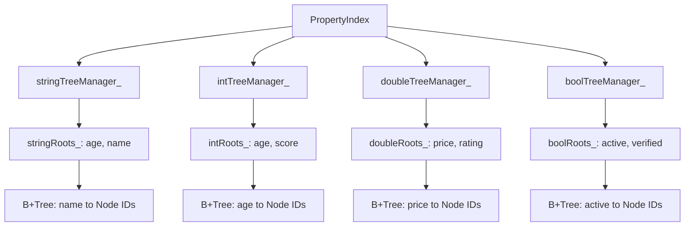
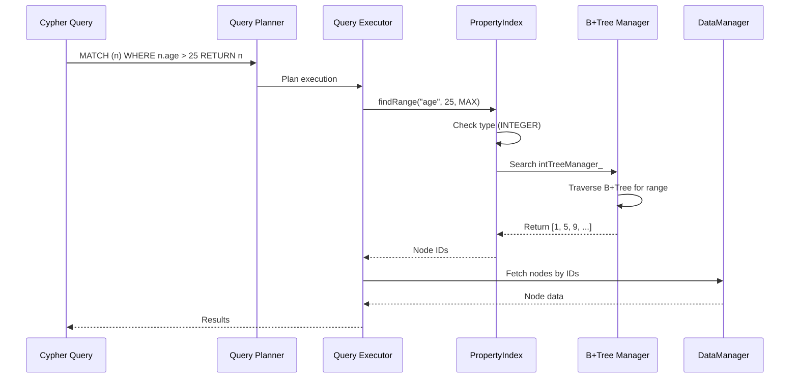
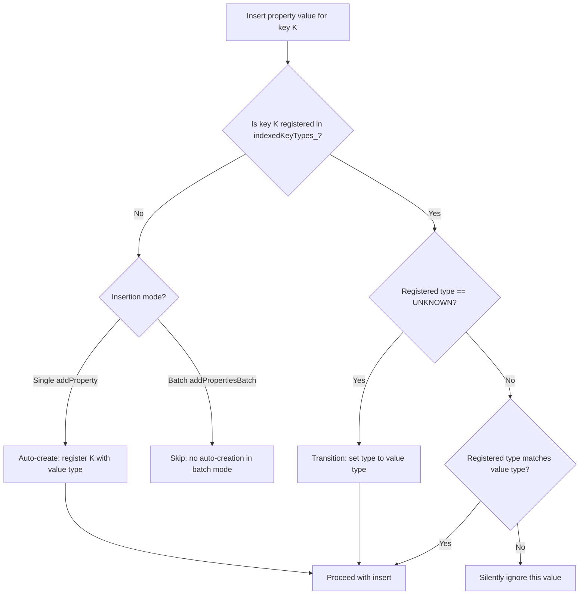
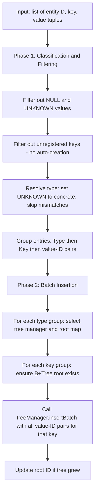
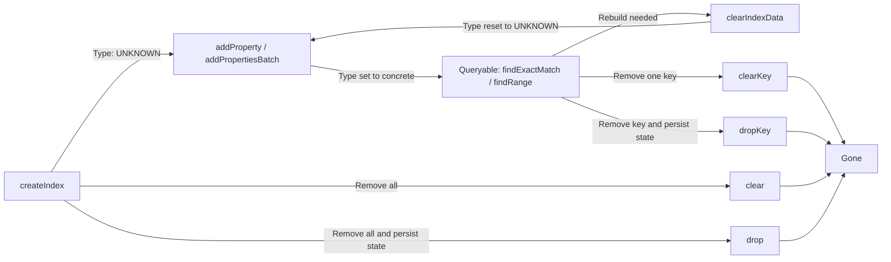

# Property Index

ZYX implements a high-performance property index system using type-specific B+Tree structures to efficiently map property values to their corresponding entity IDs. This enables fast property-based queries in Cypher such as `MATCH (n) WHERE n.age > 25 RETURN n` or `MATCH (n) WHERE n.name = 'Alice' RETURN n`.

## Overview

The property index provides:

- **Type-specific indexing**: Separate B+Trees for string, integer, double, and boolean property types
- **Multi-key indexing**: Support for indexing multiple property keys simultaneously
- **Automatic type inference**: Determines property type from first inserted value
- **Batch operations**: Optimized bulk insertion for efficient index building
- **Concurrent access**: Thread-safe operations with shared mutex
- **State persistence**: Automatic persistence of index metadata across restarts
- **Dynamic index management**: Runtime index creation, clearing, and dropping

## Architecture

### Multi-Type Index Structure

The `PropertyIndex` class maintains four separate `IndexTreeManager` instances, one per supported property type. Each tree manager owns a root map that maps property key names to B+Tree root IDs. A shared `indexedKeyTypes_` map records the declared type for each property key.

At construction, the `PropertyIndex` creates all four `IndexTreeManager` instances -- each configured with its corresponding `PropertyType` for key comparison -- and calls `initialize()` to restore persisted state. Source: `include/graph/storage/indexes/PropertyIndex.hpp`.

### Property-Based Query Flow

When a Cypher query contains a property-based filter, the query planner decides whether the property index can satisfy it. If an index exists for the filtered property key, the planner emits an index lookup instead of a full node scan.

The executor retrieves entity IDs from the index, then fetches the full entity data from the `DataManager`.

## Core Operations

### Initialization

On startup, `initialize()` loads persisted index metadata under an exclusive lock. The process has three steps:

1. **Deserialize root maps**: Load the four root maps (string, int, double, bool) from `SystemStateManager`. Each map associates a property key name with a B+Tree root ID.
2. **Deserialize key type map**: Load the map of property key names to their `PropertyType` values. Types are stored as `int64_t` in persistent state and cast back to the enum on load.
3. **Rebuild key list cache**: Populate `indexedKeysList_` from the keys of `indexedKeyTypes_` to provide fast enumeration of indexed keys.

All metadata is restored atomically under a single lock acquisition.

### Create Index

The `createIndex(key)` operation registers a property key for indexing before any data is inserted. It acquires an exclusive lock and, if the key is not already registered, adds it to `indexedKeyTypes_` with type `UNKNOWN` and appends it to `indexedKeysList_`.

Key characteristics:

- **Immediate registration**: The key becomes visible to `getIndexedKeys()` even before any data insertion.
- **Deferred type**: The type starts as `UNKNOWN` and is determined from the first value inserted for that key.
- **Idempotent**: Calling `createIndex` multiple times for the same key is safe; subsequent calls are no-ops.
- **No B+Tree allocation**: No tree nodes are created until the first value is actually inserted.

This operation is typically used to pre-declare indexes before a bulk data load.

### Type Inference

Type inference determines the property type from the first inserted value and enforces type consistency for all subsequent insertions.

The inference rules apply identically to both `addProperty` and `addPropertiesBatch`, with one critical difference: batch mode never auto-creates a new key registration. Values whose type is `UNKNOWN` or `NULL_TYPE` are always rejected and never indexed.

### Add Property

The `addProperty(entityId, key, value)` operation adds a single property entry to the index. It acquires an exclusive lock and performs the following steps:

1. **Validate value type**: Determine the `PropertyType` of the incoming value. If it is `UNKNOWN` or `NULL_TYPE`, return immediately.
2. **Resolve key type**: Look up the key in `indexedKeyTypes_`. If not found, auto-create an entry with the inferred type. If found with `UNKNOWN`, transition to the concrete type. If the registered type does not match the value type, silently ignore the value.
3. **Locate tree structures**: Use `getTreeManagerForType` and `getRootMapForType` to select the correct `IndexTreeManager` and root map for the resolved type.
4. **Initialize B+Tree if needed**: If the root map does not contain an entry for this key, create a new B+Tree via `treeManager->initialize()` and store the root ID.
5. **Insert into B+Tree**: Call `treeManager->insert(rootId, value, entityId)` and update the stored root ID in case the tree grew due to a root split.

Time complexity: O(log n) where n is the number of unique property values. Space complexity: O(1) amortized per insertion.

### Batch Add Properties

The `addPropertiesBatch(properties)` operation provides optimized bulk insertion. It receives a flat list of (entity ID, key, value) tuples and processes them in two phases.

**Phase 1 -- Classification and Filtering**: Each tuple is examined. Values with `UNKNOWN` or `NULL_TYPE` are skipped. Keys not found in `indexedKeyTypes_` are skipped (no auto-creation in batch mode). Keys with `UNKNOWN` type are transitioned to the concrete value type. Entries that survive filtering are placed into a nested grouping structure: `PropertyType -> key name -> list of (value, entityId) pairs`.

**Phase 2 -- Batch Insertion**: For each type group, the corresponding `IndexTreeManager` and root map are selected. For each key within a type group, the B+Tree root is initialized if it does not exist, then `insertBatch` is called with the entire list of entries for that key. The root ID is updated if the tree grew.

Optimizations:

- **Single lock acquisition**: The entire batch runs under one exclusive lock, reducing contention compared to individual inserts.
- **Type-based grouping**: Minimizes tree manager switches by processing all entries of the same type together.
- **Key-based grouping**: Each key's entries are passed to `insertBatch` in a single call, allowing the B+Tree to optimize internal node splitting.
- **No auto-creation**: Prevents accidental index explosion during bulk loads. Keys must be registered via `createIndex` beforehand.

Throughput is approximately 10x faster than individual inserts for large batches.

### Remove Property

The `removeProperty(entityId, key, value)` operation removes a specific property entry from the index. It acquires an exclusive lock and:

1. Looks up the registered type for the key. If the key is not indexed, returns immediately.
2. Checks that the value's type matches the registered type. If not, returns immediately.
3. Selects the appropriate tree manager and root map, locates the B+Tree root for the key, and calls `treeManager->remove(rootId, value, entityId)`.

The B+Tree handles any necessary rebalancing (merge or redistribute) after the removal. Time complexity: O(log n).

### Find Exact Match

The `findExactMatch(key, value)` operation retrieves all entity IDs that have an exact property value match. It acquires a shared lock and:

1. Determines the value's type and checks that the key is indexed with a matching type. Returns an empty vector on mismatch.
2. Looks up the root ID in the appropriate type-specific root map.
3. Calls `treeManager->find(rootId, value)` to traverse the B+Tree and collect all entity IDs at the matching leaf.

Returns a vector of entity IDs. Time complexity: O(log n + k) where k is the number of matching entities. The shared lock allows concurrent reads.

Use case: Cypher queries with equality predicates such as `WHERE n.name = 'Alice'`.

### Find Range

The `findRange(key, minValue, maxValue)` operation retrieves entity IDs whose property value falls within a numeric or string range. It acquires a shared lock and:

1. Looks up the indexed type for the key. Only `INTEGER`, `DOUBLE`, and `STRING` types support range queries. Returns empty for other types.
2. Performs type promotion on the bounds to match the indexed type:
   - If the index type is `INTEGER` and a bound is `DOUBLE`, the bound is converted using `ceil` for the lower bound and `floor` for the upper bound.
   - If the index type is `DOUBLE` and a bound is `INTEGER`, the bound is promoted to `DOUBLE`.
   - If the bound is `NULL_TYPE`, it is treated as unbounded.
   - Incompatible type combinations return empty.
3. Calls `treeManager->findRange(rootId, minKey, maxKey)` to scan the B+Tree for all entries in the range.

Returns a vector of entity IDs. Time complexity: O(log n + k) where k is the number of entities in the range.

Use case: Cypher range queries such as `WHERE n.age > 25 AND n.age < 65`.

## Type System

### Property Types

The property index supports four indexed property types:

| Type | Description | Example Values | Range Queries |
|------|-------------|----------------|---------------|
| STRING | Text strings | "Alice", "Bob" | Yes |
| INTEGER | 64-bit integers | 25, -10, 1000 | Yes |
| DOUBLE | Floating-point numbers | 3.14, -0.5, 1e6 | Yes |
| BOOLEAN | True/false values | true, false | No |

### Type Validation

Type validation enforces consistency within a single property key's index:

- The first value inserted for a key determines the type for that key's entire index.
- Subsequent insertions must provide a value whose type matches the registered type.
- Values that do not match the registered type are silently ignored -- no error is raised.
- `NULL_TYPE` and `UNKNOWN` values are never indexed under any circumstances.

This design means that a property key like `"age"` can only ever be `INTEGER` or `DOUBLE` or `STRING` -- never a mix. If a key was initially registered via `createIndex` (type `UNKNOWN`), the first concrete value settles the type permanently.

## Index Lifecycle

### Clear Index Data

The `clearIndexData(key)` operation removes all B+Tree data for a key while preserving the key definition in `indexedKeyTypes_`. It acquires an exclusive lock and:

1. Checks that the key exists in `indexedKeyTypes_`. Returns immediately if not.
2. Clears the root entry from all four root maps (string, int, double, bool) as a defensive measure, even though logically only one type map should contain the key.
3. Resets the key's type to `UNKNOWN` in `indexedKeyTypes_`, allowing the type to be re-determined during a subsequent rebuild.

This operation is used by the index builder when rebuilding indexes from scratch.

### Clear Key

The `clearKey(key)` operation removes both the B+Tree data and the key definition for a specific property key. It acquires an exclusive lock and:

1. If the key's type is `UNKNOWN` (no B+Tree was ever created), simply removes it from `indexedKeyTypes_` and returns.
2. For concrete types, selects the appropriate root map and tree manager, clears the B+Tree, removes the root entry from the root map, removes the key from `indexedKeyTypes_`, and removes it from `indexedKeysList_`.

### Drop Key

The `dropKey(key)` operation extends `clearKey` by additionally removing persistent state. After calling `clearKey(key)`, it checks each root map and the type map. If any of these maps are now empty, it removes the corresponding entry from `SystemStateManager` to clean up persistent storage.

### Clear All

The `clear()` operation removes all index data for every key. It acquires an exclusive lock and iterates over all four root maps, clearing every B+Tree via its tree manager. It then clears `indexedKeyTypes_` and `indexedKeysList_`.

### Drop All

The `drop()` operation calls `clear()` to remove all in-memory data, then removes all five persistent state entries (four root maps and the key type map) from `SystemStateManager`.

## State Persistence

Index metadata is persisted through `SystemStateManager`, which stores key-value maps to durable storage.

### Save State

The `saveState()` operation acquires a shared lock and serializes two categories of data:

- **Root maps**: Each non-empty root map (string, int, double, bool) is written as a `string -> int64_t` map, keyed by a base state key plus a type-specific suffix.
- **Key type map**: The `indexedKeyTypes_` map is serialized by casting each `PropertyType` enum value to `int64_t` and storing as a `string -> int64_t` map.

Only non-empty maps are persisted, resulting in sparse state that avoids writing unnecessary data.

### Load State

The `deserializeRootMap()` and `deserializeKeyTypeMap()` methods load the root maps and key type map from `SystemStateManager`. The type map is deserialized by casting each `int64_t` back to `PropertyType`.

### Flush

The `flush()` method is a convenience wrapper that calls `saveState()` to persist current metadata to durable storage.

## Concurrency Control

The property index uses a single `std::shared_mutex` per `PropertyIndex` instance to coordinate concurrent access.

**Lock strategy**:

- **Shared lock** (`std::shared_lock`): Used by all read operations -- `findExactMatch`, `findRange`, `isEmpty`, `hasKeyIndexed`, `getIndexedKeyType`, `getIndexedKeys`, and `saveState`. Multiple threads can hold shared locks simultaneously.
- **Exclusive lock** (`std::unique_lock`): Used by all write operations -- `addProperty`, `addPropertiesBatch`, `removeProperty`, `createIndex`, `clearIndexData`, `clearKey`, `clear`, and `initialize`. Only one thread can hold an exclusive lock, and it blocks all shared locks.

This strategy provides high read concurrency with write serialization. Each `PropertyIndex` instance (typically one for nodes and one for edges) has its own independent mutex, so node property lookups do not block edge property lookups.

## Performance Characteristics

### Time Complexity

| Operation | Average Case | Worst Case |
|-----------|-------------|------------|
| createIndex | O(1) | O(1) |
| addProperty | O(log n) | O(log n) |
| addPropertiesBatch | O(m log n) | O(m log n) |
| removeProperty | O(log n) | O(log n) |
| findExactMatch | O(log n + k) | O(log n + k) |
| findRange | O(log n + k) | O(log n + k) |
| clearKey | O(1) | O(1) |
| dropKey | O(1) | O(1) |

Where:
- n = number of unique property values for a key
- m = number of properties in the batch
- k = number of entities matching the query

### Space Complexity

| Component | Space | Description |
|-----------|-------|-------------|
| B+Tree Nodes (per key) | O(n x b) | n values, b = branch factor |
| Root Maps | O(k) | k = number of indexed keys |
| Type Map | O(k) | k = number of indexed keys |
| Key List | O(k) | Cached key list |

Total: O(N) where N = total number of property-value-entity associations.

### Memory Overhead

For 1 million nodes with 5 indexed properties each:

- B+Tree structures (per property key): internal nodes ~25.6 KB, leaf nodes ~128 KB, entity ID references ~8 MB, totaling ~8.15 MB per key.
- Total for 5 properties: ~40.75 MB.
- Overhead per property-value-entity association: ~8 bytes.
- State metadata (root maps, type map, key list): ~2 KB total.

## Multi-Key Indexing

Entities can have multiple indexed properties, each maintained in its own independent B+Tree. There are no cross-property compound indexes in the single-property API; each property key is indexed separately. Multiple index results can be combined via set intersection at the query execution layer.

Each property type is routed to its dedicated tree manager: string values go to `stringTreeManager_` with roots stored in `stringRoots_`, integer values to `intTreeManager_` with `intRoots_`, and so on. This type separation ensures type safety within each B+Tree and allows the tree manager to use type-optimized comparison functions. Only numeric types (INTEGER, DOUBLE) and STRING support range queries via `findRange`.

## Composite Indexes

In addition to single-property indexes, `PropertyIndex` supports composite indexes over multiple property keys. A composite index encodes multiple property values into a single string key using null-byte separators, then stores the encoded key in a dedicated `compositeTreeManager_` B+Tree.

Key operations:

- **createCompositeIndex(keys)**: Registers a composite index for an ordered list of property keys. Creates a new B+Tree root.
- **addCompositeEntry(entityId, keys, values)**: Encodes the values into a composite key and inserts the entity ID.
- **findCompositeExact(keys, values)**: Finds entity IDs matching all values exactly.
- **findCompositePrefix(prefixKeys, prefixValues)**: Finds entity IDs matching a leading subset of the composite key, using a range scan from the encoded prefix to a high sentinel.

Composite index definitions and roots are persisted alongside single-property state.

## Best Practices

1. **Explicit index creation**: Use `createIndex()` before bulk loads for predictable behavior.
2. **Batch operations**: Use `addPropertiesBatch()` for bulk data loading -- approximately 10x faster than individual inserts.
3. **Type consistency**: Ensure property values have consistent types across all entities sharing a key.
4. **Selective indexing**: Only index frequently queried properties to avoid unnecessary memory and write overhead.
5. **Numeric types for ranges**: Use INTEGER or DOUBLE types for properties that need range queries.
6. **Monitor state**: Check `hasKeyIndexed()` and `getIndexedKeyType()` to verify index status.
7. **Persist regularly**: Call `flush()` after critical operations to ensure metadata durability.
8. **Cleanup**: Use `dropKey()` when an index is no longer needed to reclaim both memory and persistent state.

## Limitations

1. **No partial string matches**: String property lookups require exact match or range; no wildcard or prefix search on single-property indexes.
2. **Type strictness**: Type mismatches are silently ignored with no error reporting.
3. **Memory bound**: The entire index structure must fit in memory.
4. **Write serialization**: Only one concurrent writer per `PropertyIndex` instance.
5. **No automatic removal**: Deleting an entity does not automatically remove its entries from property indexes; the caller must explicitly invoke `removeProperty`.

## See Also

- [B+Tree Indexing](/en/docs/zyx/algorithms/btree-indexing) - B+Tree structure details
- [Label Index](/en/docs/zyx/algorithms/label-index) - Label-based indexing
- [Query Optimization](/en/docs/zyx/algorithms/query-optimization) - Index usage in queries
- [Storage System](/en/docs/zyx/architecture/storage) - Overall storage architecture
