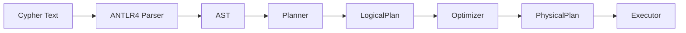
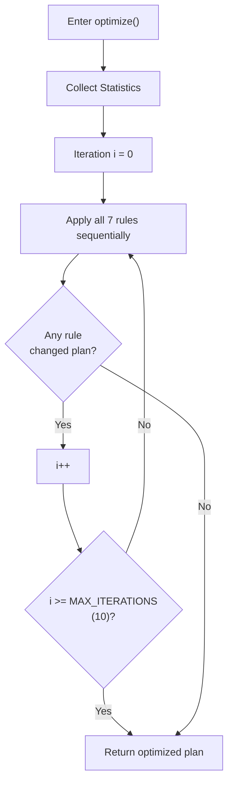
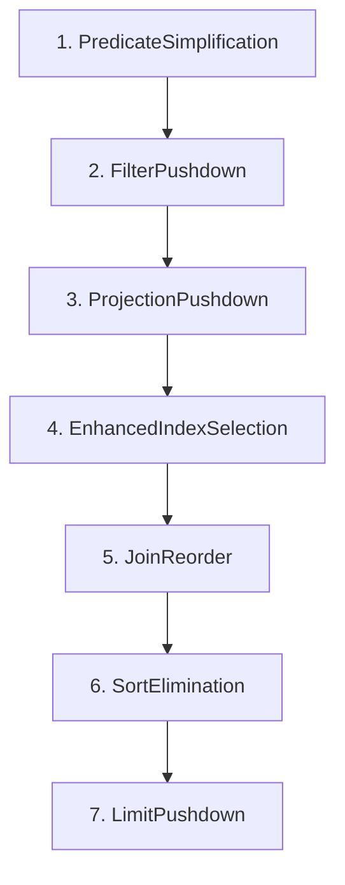
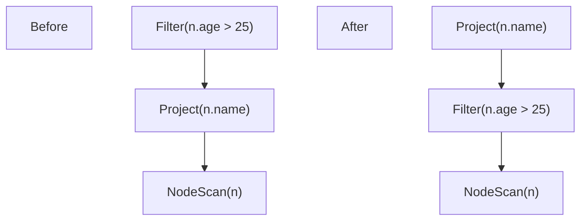
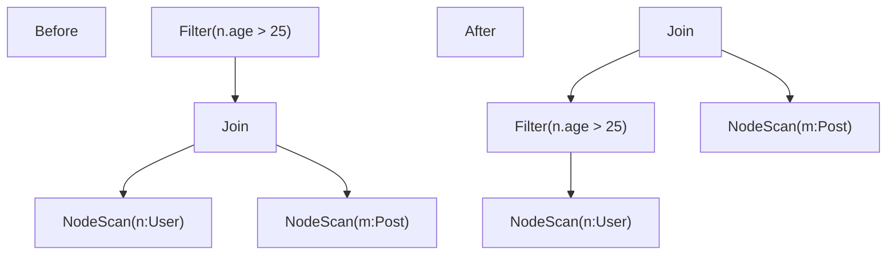
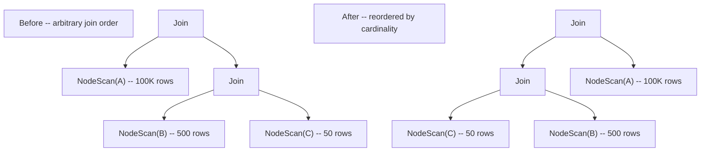
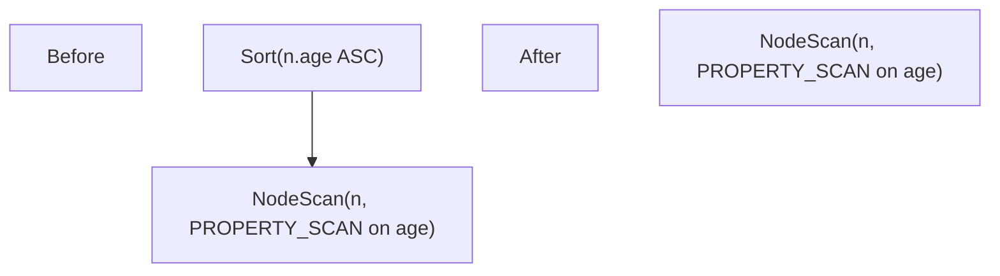
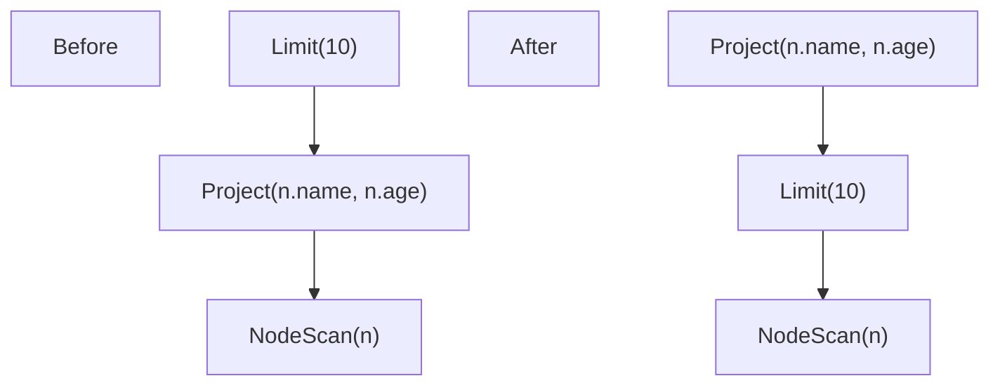

# Query Optimization Algorithm

ZYX uses a multi-rule query optimizer that transforms logical plans into efficient execution plans using fixed-point iteration over a set of transformation rules, guided by database statistics and a cost model.

## Query Processing Pipeline

Every Cypher query passes through a four-stage pipeline before producing results:

1. **Parse**: ANTLR4 converts the Cypher text into an Abstract Syntax Tree (AST).
2. **Plan**: The Planner translates the AST into a tree of logical operators (`LogicalNodeScan`, `LogicalFilter`, `LogicalJoin`, `LogicalProject`, `LogicalSort`, `LogicalLimit`, `LogicalAggregate`, and others).
3. **Optimize**: The Optimizer applies a set of transformation rules repeatedly until the plan stabilizes or a maximum iteration count is reached.
4. **Execute**: The PhysicalPlanConverter maps each logical operator to a physical execution operator that reads data from storage.

## Fixed-Point Iteration Algorithm

The optimizer runs all registered rules in a loop. In each iteration, every rule is applied to the plan tree. If any rule modifies the plan (detected by comparing the plan's string representation before and after), another iteration begins. The loop terminates when a full pass produces no changes, or when `MAX_ITERATIONS` (10) is reached.

**Termination guarantee**: Because each rule either simplifies the plan or leaves it unchanged, the plan must stabilize within a finite number of iterations. The `MAX_ITERATIONS = 10` cap prevents pathological cases.

**Source**: `include/graph/query/optimizer/Optimizer.hpp`

## Optimization Rules

Seven rules are registered in a specific order. The order matters because earlier rules produce a canonical form that later rules rely on.

### Rule 1: Predicate Simplification

**Goal**: Simplify boolean predicates and merge redundant filter nodes.

**Source**: `include/graph/query/optimizer/rules/PredicateSimplificationRule.hpp`

This rule performs two categories of transformation:

**Expression simplification** -- constant folding on logical operators:

| Input | Output |
|-------|--------|
| `true AND x` | `x` |
| `x AND true` | `x` |
| `false AND x` | `false` |
| `x AND false` | `false` |
| `true OR x` | `true` |
| `x OR true` | `true` |
| `false OR x` | `x` |
| `x OR false` | `x` |
| `NOT (NOT x)` | `x` |

**Filter tree simplification** -- structural merges on adjacent filter nodes:

- **Adjacent-filter merging**: Two consecutive `LogicalFilter` nodes are merged into one filter whose predicate is the AND of both original predicates. Before: `Filter(pred_a, Filter(pred_b, child))`. After: `Filter(pred_a AND pred_b, child)`.
- **Duplicate-filter elimination**: If two consecutive filters have syntactically identical predicates (compared by string representation), the outer filter is dropped.
- **Trivial-filter removal**: If simplification reduces a predicate to the boolean literal `true`, the filter node is removed entirely and its child takes its place.

This rule runs first so that downstream rules see a canonical, simplified plan.

### Rule 2: Filter Pushdown

**Goal**: Push `WHERE` filter predicates as close to data sources as possible, reducing the number of rows that upstream operators must process.

**Source**: `include/graph/query/optimizer/rules/FilterPushdownRule.hpp`

The rule performs a bottom-up recursive walk of the plan tree. At each `LogicalFilter` node, it applies the first applicable transformation:

**Conjunct splitting**: Conjunctive (AND) predicates are split into independent filters, one per conjunct. For example, `WHERE n.age > 25 AND n.active = true` becomes two stacked filters, each of which can then be pushed independently.

**Push past Project**: If a filter's predicate only references variables available below a `LogicalProject`, the filter moves below the project.

**Push past Join**: If a filter references variables from only one side of a `LogicalJoin`, the filter moves into that side.

**Merge into NodeScan -- equality**: If the predicate is a simple property equality (`n.name = "Alice"`), it is merged directly into the `LogicalNodeScan`'s property predicates map, and the filter node is eliminated. The scan operator can then use a property index lookup.

**Merge into NodeScan -- range**: If the predicate is a range comparison (`n.age > 25`), it is merged into the scan's range predicates list. Multiple range bounds on the same property are tightened to the most restrictive combination. The scan operator can then use a range index scan.

### Rule 3: Projection Pushdown

**Goal**: Annotate `LogicalProject` nodes with the set of columns actually required by their ancestors, enabling physical operators to avoid materializing unused columns.

**Source**: `include/graph/query/optimizer/rules/ProjectionPushdownRule.hpp`

The rule performs a top-down propagation of required-column sets through the plan tree:

1. At a `LogicalProject` node: the required set from ancestors is stored on the node. The child's required set is computed as all variables referenced by the project's expressions, plus any pass-through columns.
2. At a `LogicalFilter` node: the child's required set includes everything the parent needs plus variables referenced by the filter's predicate.
3. At a `LogicalAggregate` node: the child's required set includes the grouping keys and aggregate function arguments.
4. At other nodes: the parent's required set is passed through unchanged.

This rule does not change the plan structure; it annotates `LogicalProject` nodes with `setRequiredColumns()` so that physical operators can skip materializing unused properties.

### Rule 4: Enhanced Index Selection

**Goal**: Use the cost model and database statistics to choose the cheapest scan strategy for each `LogicalNodeScan`.

**Source**: `include/graph/query/optimizer/rules/EnhancedIndexSelectionRule.hpp`

For each `LogicalNodeScan` in the plan, the rule estimates the cost of every applicable scan strategy using the `CostModel` class and selects the cheapest:

| Strategy | Description | Cost Estimate |
|----------|-------------|---------------|
| `FULL_SCAN` | Scan all nodes | `totalNodeCount * 1.0` |
| `LABEL_SCAN` | Use label index | `labelNodeCount * 1.0` |
| `PROPERTY_SCAN` | Use property index for equality | `labelNodeCount * selectivity * 0.2` |
| `RANGE_SCAN` | Use property index for range | `labelNodeCount * 0.3 * 0.2` |
| `COMPOSITE_SCAN` | Use composite index for multi-field equality | `labelNodeCount * 0.1^fields * 0.2` |

The rule also checks whether multiple equality predicates on the same scan can be served by a composite index, and if so, records the composite equality on the scan node.

The selected strategy is stored on the `LogicalNodeScan` via `setPreferredScanType()`, which the `PhysicalPlanConverter` reads when building the physical plan.

**Priority order when costs are equal**: composite scan > property scan > range scan > label scan > full scan.

### Rule 5: Join Reorder

**Goal**: Reorder chains of cross-join operations so that smaller relations are joined first, minimizing intermediate result sizes.

**Source**: `include/graph/query/optimizer/rules/JoinReorderRule.hpp`

The algorithm uses a greedy left-deep strategy:

1. **Flatten**: Recursively collect all leaf inputs from a chain of `LogicalJoin` nodes into a flat list.
2. **Estimate**: Compute the cardinality of each input using `CostModel::estimateScanCardinality`. For `LogicalNodeScan` inputs, the estimate uses label statistics. For other inputs, the estimate uses the product of child cardinalities (cross-join cardinality).
3. **Sort**: Sort inputs by estimated cardinality in ascending order.
4. **Rebuild**: Reassemble into a left-deep join tree: `Join(Join(Join(smallest, next), ...), largest)`.

Dynamic-programming enumeration is deliberately avoided to keep compile times and code complexity manageable.

### Rule 6: Sort Elimination

**Goal**: Remove `LogicalSort` operators when the underlying scan already provides data in the required order.

**Source**: `include/graph/query/optimizer/rules/SortEliminationRule.hpp`

The rule identifies and eliminates redundant sorts under specific conditions:

- The sort has a single sort key in ascending order.
- The sort key is a property access expression (e.g., `n.age`).
- The child is a `LogicalNodeScan` on the same variable.
- The child's preferred scan type is `PROPERTY_SCAN` or `RANGE_SCAN` on the same property.

When these conditions hold, the property index already returns results in sorted order, making the `LogicalSort` redundant. The sort node is removed and replaced by its child.

### Rule 7: Limit Pushdown

**Goal**: Push `LIMIT` operations below `LogicalProject` nodes to reduce the number of rows that the project operator must process.

**Source**: `include/graph/query/optimizer/rules/LimitPushdownRule.hpp`

The rule performs a bottom-up recursive walk. At each `LogicalLimit` node whose child is a non-DISTINCT `LogicalProject`, it swaps the order:

The DISTINCT check is critical: if the project is `DISTINCT`, it can reduce the row count, so pushing `LIMIT` below it would change query semantics. In that case, the rule leaves the plan unchanged.

## Statistics and Cost Model

### Statistics Collection

**Source**: `include/graph/query/optimizer/Statistics.hpp`, `include/graph/query/optimizer/StatisticsCollector.hpp`

The optimizer relies on database statistics for cost-based decisions. Statistics are collected lazily and cached:

- **`Statistics`**: The global statistics structure. Contains `totalNodeCount`, `totalEdgeCount`, and a map of `LabelStatistics` keyed by label name.
- **`LabelStatistics`**: Per-label statistics including `nodeCount` and a map of `PropertyStatistics` keyed by property name.
- **`PropertyStatistics`**: Per-property statistics including `distinctValueCount` (NDV), `minValue`, `maxValue`, and `nullCount`. Provides `equalitySelectivity()` (returns `1.0 / NDV`) and `rangeSelectivity()` (returns a fixed `0.33`).

The `StatisticsCollector` gathers statistics from storage using reservoir sampling (with `MAX_SAMPLE_SIZE = 10000`) to avoid full scans of large datasets. It scans label indexes to count nodes per label and samples property values to estimate NDV, min/max, and null counts. Statistics are cached and only re-collected when explicitly invalidated (e.g., after data modifications).

### Cost Model

**Source**: `include/graph/query/optimizer/CostModel.hpp`

The `CostModel` class provides cost estimates using abstract cost units where only relative comparisons matter:

| Constant | Value | Meaning |
|----------|-------|---------|
| `SCAN_COST_PER_ROW` | 1.0 | Cost to process one row in a full scan |
| `INDEX_LOOKUP_COST` | 0.2 | Cost per row for an index-based lookup (5x cheaper than full scan) |
| `FILTER_COST_PER_ROW` | 0.5 | Cost to apply a filter predicate to one row |
| `JOIN_COST_PER_ROW` | 2.0 | Cost per row pair in a cross join |

Key cost estimation methods:

- **`fullScanCost`**: `totalNodeCount * SCAN_COST_PER_ROW`
- **`labelScanCost`**: `labelNodeCount * SCAN_COST_PER_ROW`
- **`propertyIndexCost`**: `labelNodeCount * selectivity * INDEX_LOOKUP_COST`, where selectivity is `1.0 / NDV` for equality predicates or `0.33` for range predicates
- **`rangeIndexCost`**: `labelNodeCount * 0.3 * INDEX_LOOKUP_COST` (rough 30% range selectivity)
- **`compositeIndexCost`**: `labelNodeCount * 0.1^matchedFields * INDEX_LOOKUP_COST` (exponentially decreasing with more matched fields)
- **`crossJoinCost`**: `leftCardinality * rightCardinality * JOIN_COST_PER_ROW`
- **`estimateScanCardinality`**: For multi-label scans, uses the most selective label's count

## Complexity Analysis

### Optimizer Loop

- **Worst case**: `MAX_ITERATIONS * number_of_rules` rule applications = `10 * 7 = 70` passes over the plan tree.
- **Typical case**: Most plans stabilize after 1-3 iterations. Each rule does a single tree walk, so per-iteration cost is `O(n)` where `n` is the number of nodes in the plan tree.

### Individual Rule Complexity

| Rule | Time Complexity | Notes |
|------|----------------|-------|
| PredicateSimplification | `O(n)` | Single bottom-up pass, constant-time per node |
| FilterPushdown | `O(n * p)` | `p` = number of predicates; conjunct splitting may re-enter |
| ProjectionPushdown | `O(n * v)` | `v` = number of variables per node |
| EnhancedIndexSelection | `O(n)` | Visits each NodeScan once, constant candidates per scan |
| JoinReorder | `O(j * log j)` | `j` = number of join inputs; dominated by sorting |
| SortElimination | `O(n)` | Single bottom-up pass |
| LimitPushdown | `O(n)` | Single bottom-up pass |

### Statistics Collection

- **Full collection**: `O(totalNodeCount)` with reservoir sampling limiting memory to `MAX_SAMPLE_SIZE = 10000` samples per property.
- **Cache hit**: `O(1)` after initial collection.

## Performance Tips

### For Users

1. **Create indexes on filtered properties**: Property indexes enable `PROPERTY_SCAN` and `RANGE_SCAN` strategies, which are 5x cheaper per row than full scans.
2. **Use labels on nodes**: Label scans reduce the working set from all nodes to nodes with a specific label.
3. **Apply filters early**: The optimizer pushes filters down automatically, but writing queries with selective filters helps the planner choose better scan strategies.
4. **Use LIMIT**: The `LimitPushdownRule` reduces the number of rows processed by project operators.
5. **Compound predicates on the same node**: Multiple equality predicates on a single node can leverage composite indexes for exponential selectivity improvement.

### For Developers

1. **Rule ordering matters**: The current order is designed so that simplification precedes pushdown, which precedes cost-based decisions. Changing the order may reduce optimization quality.
2. **Custom rules can be added**: Use `Optimizer::addRule()` to inject custom rules (primarily for testing or experimental optimizations).
3. **Statistics staleness**: Statistics are only re-collected on explicit invalidation. Stale statistics produce suboptimal but correct plans.
4. **Fixed-point convergence**: When writing new rules, ensure they are idempotent (applying the same rule twice produces the same result) to guarantee convergence.

## Source Locations

| Component | File |
|-----------|------|
| Optimizer engine | `include/graph/query/optimizer/Optimizer.hpp` |
| Rule registration | `src/query/optimizer/Optimizer.cpp` |
| Rule interface | `include/graph/query/optimizer/OptimizerRule.hpp` |
| FilterPushdown | `include/graph/query/optimizer/rules/FilterPushdownRule.hpp` |
| LimitPushdown | `include/graph/query/optimizer/rules/LimitPushdownRule.hpp` |
| IndexPushdown (legacy) | `include/graph/query/optimizer/rules/IndexPushdownRule.hpp` |
| ProjectionPushdown | `include/graph/query/optimizer/rules/ProjectionPushdownRule.hpp` |
| JoinReorder | `include/graph/query/optimizer/rules/JoinReorderRule.hpp` |
| EnhancedIndexSelection | `include/graph/query/optimizer/rules/EnhancedIndexSelectionRule.hpp` |
| PredicateSimplification | `include/graph/query/optimizer/rules/PredicateSimplificationRule.hpp` |
| SortElimination | `include/graph/query/optimizer/rules/SortEliminationRule.hpp` |
| Statistics | `include/graph/query/optimizer/Statistics.hpp` |
| StatisticsCollector | `include/graph/query/optimizer/StatisticsCollector.hpp` |
| CostModel | `include/graph/query/optimizer/CostModel.hpp` |

## See Also

- [Query Engine](/en/docs/zyx/architecture/query-engine) - Query execution pipeline
- [B-Tree Indexing](/en/docs/zyx/algorithms/btree-indexing) - B-tree index structure used by property indexes
- [Label Index](/en/docs/zyx/algorithms/label-index) - Label index structure
- [Performance Optimization](/en/docs/zyx/architecture/optimization) - System-level performance tuning
