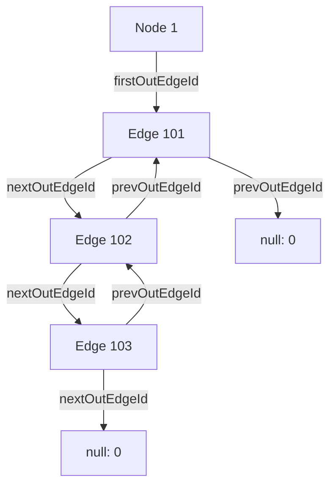
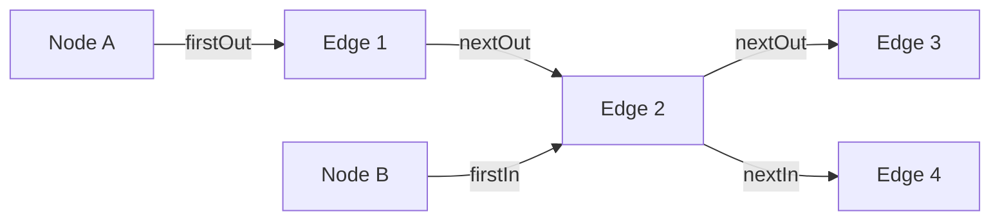
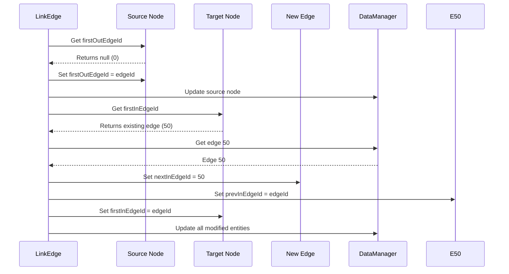
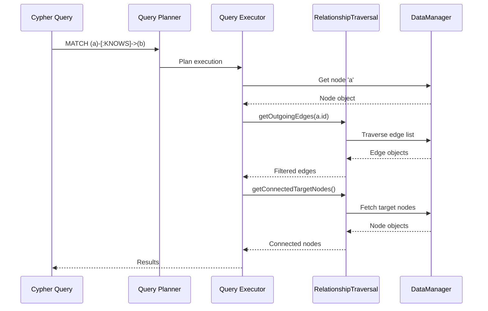

# Relationship Traversal

ZYX implements a high-performance relationship traversal system using a linked-list based adjacency structure. This enables efficient navigation of graph relationships for Cypher queries like `MATCH (a)-[:KNOWS]->(b)` and provides O(1) access to connected nodes and edges.

## Overview

Relationship traversal provides:

- **Linked-list adjacency structure**: Efficient edge storage using doubly-linked lists
- **Bidirectional traversal**: Fast access to both outgoing and incoming edges
- **Connected node retrieval**: Direct access to neighbors without full graph scans
- **Cycle detection**: Automatic detection of corrupted edge chains
- **Active edge filtering**: Automatically skips deleted/inactive edges during traversal
- **O(1) edge linking**: Constant time edge insertion and deletion

## Architecture

### Adjacency Structure

ZYX uses a linked-list based adjacency structure where each node maintains pointers to its first outgoing and incoming edges:



### Bidirectional Edge Linking

Each edge maintains four pointers for traversal in both directions:



**Bidirectional Edge Linking:**
- Node A (Source): outgoing edges list
- Node B (Target): incoming edges list
- Edge 2 appears in both lists for efficient bidirectional traversal

**Key Point**: The same edge (Edge 2) appears in both Node A's outgoing list and Node B's incoming list, enabling efficient bidirectional traversal.

## Implementation

### Class Definition

```cpp
class RelationshipTraversal {
public:
    explicit RelationshipTraversal(const std::shared_ptr<storage::DataManager> &dataManager);

    // Edge retrieval
    std::vector<Edge> getOutgoingEdges(int64_t nodeId) const;
    std::vector<Edge> getIncomingEdges(int64_t nodeId) const;
    std::vector<Edge> getAllConnectedEdges(int64_t nodeId) const;

    // Node retrieval
    std::vector<Node> getConnectedTargetNodes(int64_t nodeId) const;
    std::vector<Node> getConnectedSourceNodes(int64_t nodeId) const;
    std::vector<Node> getAllConnectedNodes(int64_t nodeId) const;

    // Edge management
    void linkEdge(Edge &edge) const;
    void unlinkEdge(Edge &edge) const;

private:
    std::weak_ptr<storage::DataManager> dataManager_;
};
```

### Data Structures

#### Node Structure

Each node maintains pointers to the head of its edge lists:

```cpp
struct Node::Metadata {
    int64_t id = 0;
    int64_t firstOutEdgeId = 0;  // Head of outgoing edge list
    int64_t firstInEdgeId = 0;   // Head of incoming edge list
    int64_t propertyEntityId = 0;
    int64_t labelId = 0;
    uint32_t propertyStorageType = 0;
    bool isActive = true;
};
```

#### Edge Structure

Each edge maintains four pointers for doubly-linked list traversal:

```cpp
struct Edge::Metadata {
    int64_t id = 0;
    int64_t sourceNodeId = 0;     // Source node
    int64_t targetNodeId = 0;     // Target node
    int64_t nextOutEdgeId = 0;    // Next outgoing from source
    int64_t prevOutEdgeId = 0;    // Previous outgoing from source
    int64_t nextInEdgeId = 0;     // Next incoming to target
    int64_t prevInEdgeId = 0;     // Previous incoming to target
    int64_t propertyEntityId = 0;
    int64_t labelId = 0;
    uint32_t propertyStorageType = 0;
    bool isActive = true;
};
```

## Core Operations

### Get Outgoing Edges

Retrieves all outgoing edges from a node by traversing the outgoing edge list:

```cpp
std::vector<Edge> RelationshipTraversal::getOutgoingEdges(int64_t nodeId) const {
    std::vector<Edge> outEdges;
    const auto dataManager = dataManager_.lock();
    if (!dataManager) {
        return outEdges;
    }

    const Node node = dataManager->getNode(nodeId);
    int64_t currentEdgeId = node.getFirstOutEdgeId();

    // Keep track of visited edge IDs to detect cycles in the linked list.
    std::unordered_set<int64_t> visitedEdgeIds;

    while (currentEdgeId != 0) {
        // Cycle detected in the edge linked-list. Abort traversal.
        if (visitedEdgeIds.contains(currentEdgeId)) {
            throw std::runtime_error("Cycle detected in outgoing edges linked-list for node " +
                                     std::to_string(nodeId));
        }
        visitedEdgeIds.insert(currentEdgeId);

        Edge edge = dataManager->getEdge(currentEdgeId);
        if (edge.isActive()) {
            outEdges.push_back(edge);
        }
        currentEdgeId = edge.getNextOutEdgeId();
    }
    return outEdges;
}
```

**Algorithm**:
1. Start with the node's `firstOutEdgeId`
2. Traverse the linked list using `nextOutEdgeId` pointers
3. Track visited edges to detect cycles (data corruption)
4. Only include active edges (skip deleted edges)
5. Stop when `nextOutEdgeId` is 0 (end of list)

**Characteristics**:
- **Time Complexity**: O(k) where k = number of outgoing edges
- **Space Complexity**: O(k) for result vector + O(k) for cycle detection
- **Cycle Detection**: Prevents infinite loops on corrupted data
- **Active Filtering**: Automatically excludes deleted edges

### Get Incoming Edges

Retrieves all incoming edges to a node by traversing the incoming edge list:

```cpp
std::vector<Edge> RelationshipTraversal::getIncomingEdges(int64_t nodeId) const {
    std::vector<Edge> inEdges;
    const auto dataManager = dataManager_.lock();
    if (!dataManager) {
        return inEdges;
    }

    const Node node = dataManager->getNode(nodeId);
    int64_t currentEdgeId = node.getFirstInEdgeId();

    // Keep track of visited edge IDs to detect cycles in the linked list.
    std::unordered_set<int64_t> visitedEdgeIds;

    while (currentEdgeId != 0) {
        // Cycle detected in the edge linked-list. Abort traversal.
        if (visitedEdgeIds.contains(currentEdgeId)) {
            throw std::runtime_error("Cycle detected in incoming edges linked-list for node " +
                                     std::to_string(nodeId));
        }
        visitedEdgeIds.insert(currentEdgeId);

        Edge edge = dataManager->getEdge(currentEdgeId);
        if (edge.isActive()) {
            inEdges.push_back(edge);
        }
        currentEdgeId = edge.getNextInEdgeId();
    }
    return inEdges;
}
```

**Characteristics**: Same as `getOutgoingEdges`, but for incoming relationships.

### Get All Connected Edges

Combines both outgoing and incoming edges:

```cpp
std::vector<Edge> RelationshipTraversal::getAllConnectedEdges(int64_t nodeId) const {
    std::vector<Edge> outEdges = getOutgoingEdges(nodeId);
    std::vector<Edge> inEdges = getIncomingEdges(nodeId);

    // Combine the two vectors
    outEdges.insert(outEdges.end(), inEdges.begin(), inEdges.end());
    return outEdges;
}
```

**Use Case**: Finding all relationships connected to a node regardless of direction.

### Get Connected Target Nodes

Retrieves all nodes reachable via outgoing edges:

```cpp
std::vector<Node> RelationshipTraversal::getConnectedTargetNodes(int64_t nodeId) const {
    std::vector<Node> targetNodes;
    std::vector<Edge> outEdges = getOutgoingEdges(nodeId);

    targetNodes.reserve(outEdges.size());
    const auto dataManager = dataManager_.lock();
    if (!dataManager) {
        return targetNodes;
    }

    for (const auto &edge: outEdges) {
        targetNodes.push_back(dataManager->getNode(edge.getTargetNodeId()));
    }
    return targetNodes;
}
```

**Use Case**: Cypher queries like `MATCH (a)-[:KNOWS]->(b) RETURN b`

### Get Connected Source Nodes

Retrieves all nodes that point to this node via incoming edges:

```cpp
std::vector<Node> RelationshipTraversal::getConnectedSourceNodes(int64_t nodeId) const {
    std::vector<Node> sourceNodes;
    std::vector<Edge> inEdges = getIncomingEdges(nodeId);

    sourceNodes.reserve(inEdges.size());
    const auto dataManager = dataManager_.lock();
    if (!dataManager) {
        return sourceNodes;
    }

    for (const auto &edge: inEdges) {
        sourceNodes.push_back(dataManager->getNode(edge.getSourceNodeId()));
    }
    return sourceNodes;
}
```

**Use Case**: Cypher queries like `MATCH (a)-[:KNOWS]->(b) RETURN a` where `b` is fixed.

### Get All Connected Nodes

Retrieves all neighbors (both sources and targets) with deduplication:

```cpp
std::vector<Node> RelationshipTraversal::getAllConnectedNodes(int64_t nodeId) const {
    std::vector<Node> connectedNodes;

    const auto dataManager = dataManager_.lock();
    if (!dataManager) {
        return connectedNodes;
    }

    std::unordered_set<int64_t> nodeIds;
    for (const auto &edge: getOutgoingEdges(nodeId)) {
        int64_t targetId = edge.getTargetNodeId();
        if (nodeIds.insert(targetId).second) {
            connectedNodes.push_back(dataManager->getNode(targetId));
        }
    }

    for (const auto &edge: getIncomingEdges(nodeId)) {
        int64_t sourceId = edge.getSourceNodeId();
        if (nodeIds.insert(sourceId).second) {
            connectedNodes.push_back(dataManager->getNode(sourceId));
        }
    }
    return connectedNodes;
}
```

**Key Feature**: Uses `std::unordered_set` to deduplicate nodes that are connected via both incoming and outgoing edges.

**Use Case**: Finding all neighbors of a node in undirected traversals.

## Edge Linking Operations

### Link Edge

Inserts a new edge into the adjacency structure:

```cpp
void RelationshipTraversal::linkEdge(Edge &edge) const {
    int64_t edgeId = edge.getId();
    int64_t sourceNodeId = edge.getSourceNodeId();
    int64_t targetNodeId = edge.getTargetNodeId();

    auto dataManager = dataManager_.lock();
    if (!dataManager) {
        return;
    }

    // Link to source node's outgoing list
    Node sourceNode = dataManager->getNode(sourceNodeId);
    int64_t firstOutEdgeId = sourceNode.getFirstOutEdgeId();

    if (firstOutEdgeId == 0) {
        // Source has no outgoing edges yet
        sourceNode.setFirstOutEdgeId(edgeId);
        dataManager->updateNode(sourceNode);
    } else {
        // Insert at head of source's outgoing list
        Edge firstOutEdge = dataManager->getEdge(firstOutEdgeId);
        edge.setNextOutEdgeId(firstOutEdgeId);
        firstOutEdge.setPrevOutEdgeId(edgeId);

        sourceNode.setFirstOutEdgeId(edgeId);

        dataManager->updateEdge(firstOutEdge);
        dataManager->updateNode(sourceNode);
    }

    // Link to target node's incoming list
    Node targetNode = dataManager->getNode(targetNodeId);
    int64_t firstInEdgeId = targetNode.getFirstInEdgeId();

    if (firstInEdgeId == 0) {
        // Target has no incoming edges yet
        targetNode.setFirstInEdgeId(edgeId);
        dataManager->updateNode(targetNode);
    } else {
        // Insert at head of target's incoming list
        Edge firstInEdge = dataManager->getEdge(firstInEdgeId);
        edge.setNextInEdgeId(firstInEdgeId);
        firstInEdge.setPrevInEdgeId(edgeId);

        targetNode.setFirstInEdgeId(edgeId);

        dataManager->updateEdge(firstInEdge);
        dataManager->updateNode(targetNode);
    }

    dataManager->updateEdge(edge);
}
```

**Algorithm**:
1. **Source Node Linking**:
   - If source has no outgoing edges: Set `firstOutEdgeId` to new edge
   - Otherwise: Insert new edge at head of outgoing list
2. **Target Node Linking**:
   - If target has no incoming edges: Set `firstInEdgeId` to new edge
   - Otherwise: Insert new edge at head of incoming list
3. **Persistence**: Update all modified nodes and edges

**Characteristics**:
- **Time Complexity**: O(1) - constant time regardless of graph size
- **Insertion Strategy**: Always insert at head of list (no traversal needed)
- **Doubly-Linked**: Maintains both `next` and `prev` pointers for efficient deletion

**Visual Example**:



### Unlink Edge

Removes an edge from the adjacency structure:

```cpp
void RelationshipTraversal::unlinkEdge(Edge &edge) const {
    auto dataManager = dataManager_.lock();
    if (!dataManager) {
        return;
    }

    int64_t sourceNodeId = edge.getSourceNodeId();
    int64_t targetNodeId = edge.getTargetNodeId();

    int64_t prevOutEdgeId = edge.getPrevOutEdgeId();
    int64_t nextOutEdgeId = edge.getNextOutEdgeId();

    // Remove from source's outgoing list
    if (prevOutEdgeId == 0) {
        // Edge is at head of source's outgoing list
        Node sourceNode = dataManager->getNode(sourceNodeId);
        sourceNode.setFirstOutEdgeId(nextOutEdgeId);
        dataManager->updateNode(sourceNode);
    } else {
        // Bypass edge in the middle of list
        Edge prevOutEdge = dataManager->getEdge(prevOutEdgeId);
        prevOutEdge.setNextOutEdgeId(nextOutEdgeId);
        dataManager->updateEdge(prevOutEdge);
    }

    if (nextOutEdgeId != 0) {
        // Update next edge's prev pointer
        Edge nextOutEdge = dataManager->getEdge(nextOutEdgeId);
        nextOutEdge.setPrevOutEdgeId(prevOutEdgeId);
        dataManager->updateEdge(nextOutEdge);
    }

    int64_t prevInEdgeId = edge.getPrevInEdgeId();
    int64_t nextInEdgeId = edge.getNextInEdgeId();

    // Remove from target's incoming list
    if (prevInEdgeId == 0) {
        // Edge is at head of target's incoming list
        Node targetNode = dataManager->getNode(targetNodeId);
        targetNode.setFirstInEdgeId(nextInEdgeId);
        dataManager->updateNode(targetNode);
    } else {
        // Bypass edge in the middle of list
        Edge prevInEdge = dataManager->getEdge(prevInEdgeId);
        prevInEdge.setNextInEdgeId(nextInEdgeId);
        dataManager->updateEdge(prevInEdge);
    }

    if (nextInEdgeId != 0) {
        // Update next edge's prev pointer
        Edge nextInEdge = dataManager->getEdge(nextInEdgeId);
        nextInEdge.setPrevInEdgeId(prevInEdgeId);
        dataManager->updateEdge(nextInEdge);
    }

    // Clear edge pointers
    edge.setNextOutEdgeId(0);
    edge.setPrevOutEdgeId(0);
    edge.setNextInEdgeId(0);
    edge.setPrevInEdgeId(0);
}
```

**Algorithm**:
1. **Source Node Unlinking**:
   - If edge is at head of outgoing list: Update source's `firstOutEdgeId`
   - Otherwise: Update previous edge's `nextOutEdgeId` to bypass
   - If next edge exists: Update its `prevOutEdgeId`
2. **Target Node Unlinking**:
   - If edge is at head of incoming list: Update target's `firstInEdgeId`
   - Otherwise: Update previous edge's `nextInEdgeId` to bypass
   - If next edge exists: Update its `prevInEdgeId`
3. **Cleanup**: Clear all edge pointers

**Characteristics**:
- **Time Complexity**: O(1) - constant time
- **Doubly-Linked Benefit**: No traversal needed to find previous edge
- **Safe Unlinking**: Properly handles head, middle, and tail positions

**Visual Example**:


**Edge Unlinking:**
- Bypass the edge to remove by connecting previous to next
- O(1) operation thanks to doubly-linked list structure

## Integration with Cypher Queries

### Pattern Matching

Relationship traversal is used extensively in Cypher query execution:

```cypher
-- Outgoing traversal
MATCH (a)-[:KNOWS]->(b) RETURN b

-- Implemented as:
1. Get node 'a'
2. getOutgoingEdges(a.id)
3. Filter edges by type = KNOWS
4. getConnectedTargetNodes() for each matching edge
```

```cypher
-- Incoming traversal
MATCH (a)<-[:KNOWS]-(b) RETURN b

-- Implemented as:
1. Get node 'a'
2. getIncomingEdges(a.id)
3. Filter edges by type = KNOWS
4. getConnectedSourceNodes() for each matching edge
```

```cypher
-- Bidirectional traversal
MATCH (a)-[:KNOWS]-(b) RETURN b

-- Implemented as:
1. Get node 'a'
2. getAllConnectedEdges(a.id)
3. Filter edges by type = KNOWS
4. Extract connected nodes from both directions
```

### Query Execution Flow



## Performance Characteristics

### Time Complexity

| Operation | Time Complexity | Description |
|-----------|----------------|-------------|
| getOutgoingEdges | O(k) | k = number of outgoing edges |
| getIncomingEdges | O(k) | k = number of incoming edges |
| getAllConnectedEdges | O(k₁ + k₂) | k₁ = outgoing, k₂ = incoming |
| getConnectedTargetNodes | O(k) | k = outgoing edges |
| getConnectedSourceNodes | O(k) | k = incoming edges |
| getAllConnectedNodes | O(k₁ + k₂) | With deduplication |
| linkEdge | O(1) | Constant time insertion |
| unlinkEdge | O(1) | Constant time removal |

### Space Complexity

| Component | Space | Description |
|-----------|-------|-------------|
| Node metadata | 2 × 8 bytes | `firstOutEdgeId`, `firstInEdgeId` |
| Edge metadata | 4 × 8 bytes | `nextOut`, `prevOut`, `nextIn`, `prevIn` |
| Cycle detection | O(k) | `std::unordered_set` during traversal |
| Result vectors | O(k) | Output edge/node collections |

**Total Per Edge**: 32 bytes for traversal pointers (4 × int64_t)

### Memory Overhead

```
For a graph with 1 million edges:

Node Pointers:
- 2 pointers per node
- For 100K nodes: 100K × 2 × 8 bytes = 1.6 MB

Edge Pointers:
- 4 pointers per edge
- 1M × 4 × 8 bytes = 32 MB

Total Traversal Overhead: ~33.6 MB
Per Edge Average: 33.6 bytes
```

### Performance Characteristics

**Advantages**:
1. **O(1) Edge Operations**: Insertion and deletion are constant time
2. **No Global Scans**: Direct access to connected nodes
3. **Cache Friendly**: Sequential traversal of edge lists
4. **Memory Efficient**: Only 32 bytes per edge for traversal
5. **Scalable**: Performance independent of total graph size

**Trade-offs**:
1. **Pointer Overhead**: 32 bytes per edge for traversal pointers
2. **Dereferencing Cost**: Each edge access requires pointer chase
3. **No Type Indexing**: Must scan all edges to filter by type
4. **Cycle Detection**: Adds O(k) space during traversal

### Comparison with Alternatives

| Approach | Edge Access | Memory | Use Case |
|----------|------------|--------|----------|
| **Linked List** (ZYX) | O(k) traversal | 32 bytes/edge | General-purpose graphs |
| Adjacency Matrix | O(1) lookup | O(V²) | Dense graphs |
| Adjacency Array | O(k) scan | O(V + E) | Static graphs |
| Edge Type Index | O(log n + k) | Additional index | Type-filtered queries |

## Best Practices

1. **Batch Edge Creation**: Create all nodes first, then link edges to minimize updates
2. **Avoid Cycles**: Never manually manipulate edge pointers (use `linkEdge`/`unlinkEdge`)
3. **Filter Early**: Apply edge type filters before fetching connected nodes
4. **Check Active State**: Use `edge.isActive()` to skip deleted edges
5. **Deduplicate**: Use `getAllConnectedNodes()` for undirected traversals

## Limitations

1. **No Edge Type Index**: Must scan all edges to filter by relationship type
2. **Pointer Overhead**: 32 bytes per edge for traversal metadata
3. **Cycle Detection**: Adds runtime overhead during traversal
4. **Sequential Access**: No random access to specific edges
5. **Memory Locality**: Edge pointer chasing can cause cache misses

## Future Enhancements

Potential improvements for relationship traversal:

1. **Edge Type Indexes**: B+Tree indexes per relationship type
2. **Hop Tables**: Materialized paths for common traversal patterns
3. **Edge Compression**: Variable-length encoding for sparse graphs
4. **Parallel Traversal**: Multi-threaded edge list processing
5. **Prefetching**: Speculative edge loading for cache efficiency

## See Also

- [Storage System](/en/docs/zyx/architecture/storage) - Overall storage architecture
- [Label Index](/en/docs/zyx/algorithms/label-index) - Node label indexing
- [Property Index](/en/docs/zyx/algorithms/property-index) - Property-based indexing
- [Query Optimization](/en/docs/zyx/algorithms/query-optimization) - Query planning and optimization
- [B+Tree Indexing](/en/docs/zyx/algorithms/btree-indexing) - B+Tree structure details
