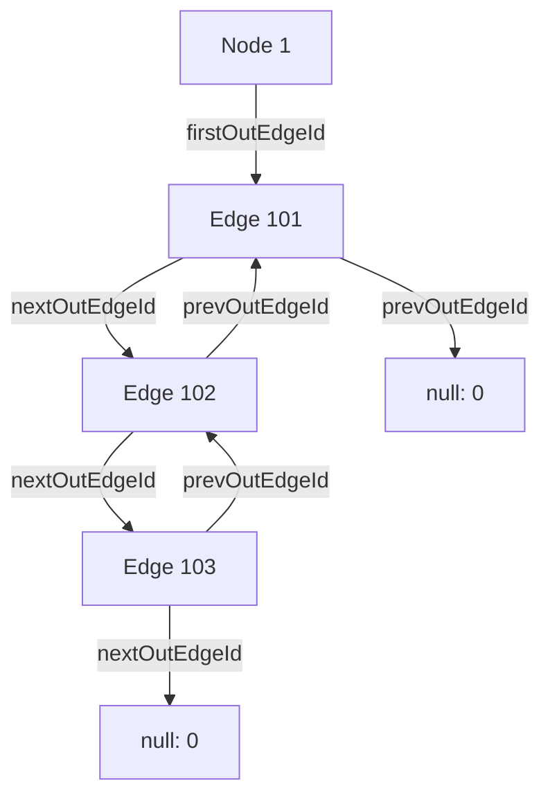
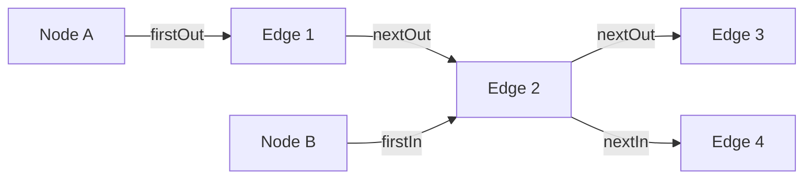
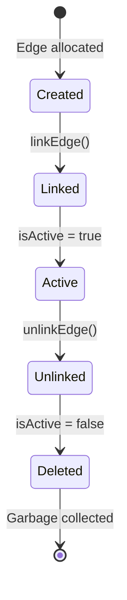
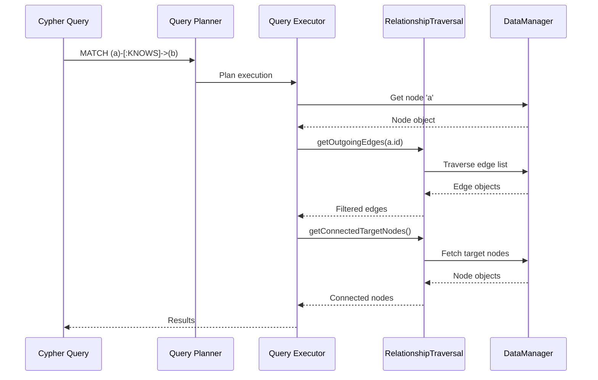
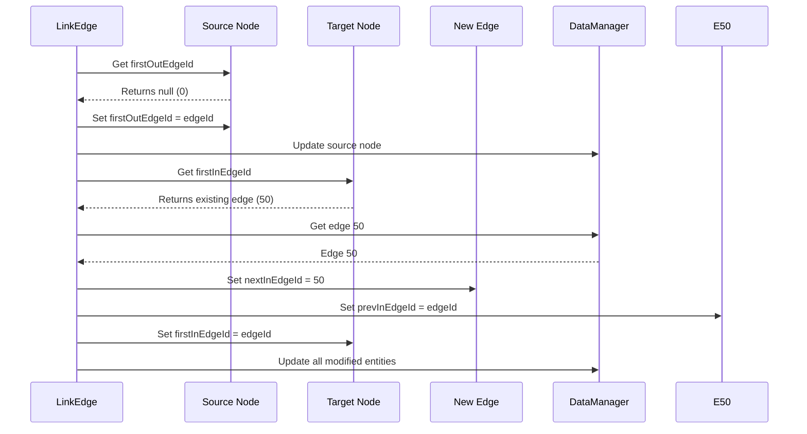

# Relationship Traversal

ZYX implements a high-performance relationship traversal system using a linked-list based adjacency structure. This enables efficient navigation of graph relationships for Cypher queries like `MATCH (a)-[:KNOWS]->(b)` and provides O(1) access to connected nodes and edges.

## Overview

Relationship traversal provides:

- **Linked-list adjacency structure**: Efficient edge storage using doubly-linked lists
- **Bidirectional traversal**: Fast access to both outgoing and incoming edges
- **Connected node retrieval**: Direct access to neighbors without full graph scans
- **Cycle detection**: Automatic detection of corrupted edge chains
- **Active edge filtering**: Automatically skips deleted/inactive edges during traversal
- **O(1) edge linking**: Constant time edge insertion and deletion

## Architecture

### Adjacency Structure

ZYX uses a linked-list based adjacency structure where each node maintains pointers to its first outgoing and incoming edges:

### Bidirectional Edge Linking

Each edge maintains four pointers for traversal in both directions:

**Bidirectional Edge Linking:**
- Node A (Source): outgoing edges list
- Node B (Target): incoming edges list
- Edge 2 appears in both lists for efficient bidirectional traversal

**Key Point**: The same edge (Edge 2) appears in both Node A's outgoing list and Node B's incoming list, enabling efficient bidirectional traversal.

## Data Structures

The traversal system builds on two core data structures stored in `include/graph/storage/Node.hpp` and `include/graph/storage/Edge.hpp`.

### Node Structure

Each node maintains two 8-byte pointers that serve as the heads of its edge lists:

| Field | Type | Purpose |
|-------|------|---------|
| `firstOutEdgeId` | int64_t | Head of the outgoing edge linked list |
| `firstInEdgeId` | int64_t | Head of the incoming edge linked list |

A value of 0 indicates an empty list (no edges in that direction). Together these two pointers account for 16 bytes of per-node traversal overhead.

### Edge Structure

Each edge stores four 8-byte pointers that thread it into two separate doubly-linked lists -- one for the source node's outgoing edges, and one for the target node's incoming edges:

| Field | Type | Purpose |
|-------|------|---------|
| `sourceNodeId` | int64_t | Source node of the relationship |
| `targetNodeId` | int64_t | Target node of the relationship |
| `nextOutEdgeId` | int64_t | Next edge in source's outgoing list |
| `prevOutEdgeId` | int64_t | Previous edge in source's outgoing list |
| `nextInEdgeId` | int64_t | Next edge in target's incoming list |
| `prevInEdgeId` | int64_t | Previous edge in target's incoming list |

The four link pointers (`nextOut`, `prevOut`, `nextIn`, `prevIn`) total 32 bytes of per-edge traversal overhead.

## Edge Lifecycle

An edge moves through a well-defined lifecycle from creation to deletion:

1. **Created**: The edge object is allocated with source and target node IDs assigned, but it is not yet reachable from either node's edge lists.
2. **Linked**: `linkEdge()` inserts the edge into both the source node's outgoing list and the target node's incoming list at head position in O(1) time.
3. **Active**: While `isActive` is true, the edge is returned by traversal operations. It participates normally in queries.
4. **Unlinked**: `unlinkEdge()` removes the edge from both linked lists by bypassing it in the doubly-linked structure in O(1) time, and clears all four link pointers.
5. **Deleted**: The edge is marked inactive (`isActive = false`). It will no longer appear in traversal results and is eligible for garbage collection.

## Core Operations

The `RelationshipTraversal` class (defined in `include/graph/query/RelationshipTraversal.hpp`) provides all traversal and linking operations. It holds a weak reference to the `DataManager` for fetching nodes and edges.

### Get Outgoing Edges

Retrieves all active outgoing edges from a node by traversing the outgoing edge chain:

1. Fetch the node by ID from the `DataManager`.
2. Read the node's `firstOutEdgeId` as the starting point.
3. While the current edge ID is not 0:
   - Check if this edge ID has already been visited. If so, throw a runtime error to signal a corrupted chain (cycle detection).
   - Record the edge ID in a visited set.
   - Fetch the edge from the `DataManager`.
   - If the edge is active (`isActive()`), add it to the result.
   - Advance to `nextOutEdgeId`.
4. Return the collected active edges.

**Characteristics**:
- **Time Complexity**: O(k) where k = number of outgoing edges
- **Space Complexity**: O(k) for the result vector plus O(k) for the cycle detection set
- **Cycle Detection**: Prevents infinite loops on corrupted data
- **Active Filtering**: Automatically excludes deleted edges

### Get Incoming Edges

Retrieves all active incoming edges to a node. The algorithm is identical to `getOutgoingEdges` except it starts from `firstInEdgeId` and follows `nextInEdgeId` pointers instead of `nextOutEdgeId` pointers.

**Characteristics**: Same as `getOutgoingEdges` -- O(k) time and space, with cycle detection and active filtering.

### Get All Connected Edges

Combines outgoing and incoming edges into a single result:

1. Call `getOutgoingEdges(nodeId)` to collect outgoing edges.
2. Call `getIncomingEdges(nodeId)` to collect incoming edges.
3. Concatenate the two vectors and return.

**Use Case**: Finding all relationships connected to a node regardless of direction.

### Get Connected Target Nodes

Retrieves all nodes reachable via outgoing edges:

1. Call `getOutgoingEdges(nodeId)` to get all active outgoing edges.
2. For each edge, read its `targetNodeId` and fetch the corresponding node from the `DataManager`.
3. Return the collected target nodes.

**Use Case**: Cypher queries like `MATCH (a)-[:KNOWS]->(b) RETURN b`.

### Get Connected Source Nodes

Retrieves all nodes that point to this node via incoming edges:

1. Call `getIncomingEdges(nodeId)` to get all active incoming edges.
2. For each edge, read its `sourceNodeId` and fetch the corresponding node from the `DataManager`.
3. Return the collected source nodes.

**Use Case**: Cypher queries like `MATCH (a)-[:KNOWS]->(b) RETURN a` where `b` is fixed.

### Get All Connected Nodes

Retrieves all neighbors from both directions with deduplication:

1. Create an empty `unordered_set<int64_t>` of visited node IDs.
2. For each outgoing edge, extract `targetNodeId`. If the ID has not been seen before, insert it into the set and fetch the node.
3. For each incoming edge, extract `sourceNodeId`. If the ID has not been seen before, insert it into the set and fetch the node.
4. Return all unique neighbor nodes.

**Key Feature**: Deduplication via `unordered_set` ensures that nodes connected by both an outgoing and an incoming edge appear only once in the result.

**Use Case**: Finding all neighbors of a node in undirected traversals.

### Query Flow Diagram

The following diagram shows how the traversal operations compose during a typical Cypher query:

## Edge Linking Operations

### Link Edge

Inserts a new edge into the adjacency structure in O(1) time by always placing it at the head of both the source's outgoing list and the target's incoming list.

**Algorithm**:

For the source node's outgoing list:
1. Fetch the source node and read its current `firstOutEdgeId`.
2. If the list is empty (`firstOutEdgeId` is 0), set `firstOutEdgeId` to the new edge's ID.
3. If the list is non-empty, insert the new edge at the head: set the new edge's `nextOutEdgeId` to the current head, set the current head's `prevOutEdgeId` to the new edge's ID, and update the source node's `firstOutEdgeId` to the new edge.
4. Persist the modified source node and any updated existing edge.

For the target node's incoming list:
1. Fetch the target node and read its current `firstInEdgeId`.
2. If the list is empty, set `firstInEdgeId` to the new edge's ID.
3. If the list is non-empty, insert at the head using the same pattern: wire the new edge's `nextInEdgeId` to the current head, update the current head's `prevInEdgeId`, and set the target's `firstInEdgeId` to the new edge.
4. Persist the modified target node and any updated existing edge.

Finally, persist the new edge itself.

**Characteristics**:
- **Time Complexity**: O(1) -- constant time regardless of graph size
- **Insertion Strategy**: Always insert at head of list (no traversal needed)
- **Doubly-Linked**: Maintains both next and prev pointers for efficient deletion

**Visual Example**:

### Unlink Edge

Removes an edge from both the source's outgoing list and the target's incoming list in O(1) time by taking advantage of the doubly-linked structure.

**Algorithm**:

For the source node's outgoing list:
1. Read the edge's `prevOutEdgeId` and `nextOutEdgeId`.
2. If `prevOutEdgeId` is 0 (the edge is at the head of the list): update the source node's `firstOutEdgeId` to `nextOutEdgeId`.
3. If `prevOutEdgeId` is non-zero (the edge is in the middle or tail): update the previous edge's `nextOutEdgeId` to bypass the removed edge.
4. If `nextOutEdgeId` is non-zero: update the next edge's `prevOutEdgeId` to `prevOutEdgeId`.

For the target node's incoming list, repeat the same bypass logic using `prevInEdgeId` and `nextInEdgeId`:
1. If at head, update the target's `firstInEdgeId`.
2. If in the middle, update the previous edge's `nextInEdgeId`.
3. If a next edge exists, update its `prevInEdgeId`.

Finally, clear all four link pointers on the removed edge to zero.

**Characteristics**:
- **Time Complexity**: O(1) -- constant time
- **Doubly-Linked Benefit**: No traversal needed to find the previous edge
- **Safe Unlinking**: Properly handles head, middle, and tail positions

**Visual Example**:

**Edge Unlinking:**
- Bypass the edge to remove by connecting previous to next
- O(1) operation thanks to doubly-linked list structure

## Integration with Cypher Queries

### Pattern Matching

Relationship traversal is used extensively in Cypher query execution. The direction of the pattern in the query determines which traversal method is used:

**Outgoing traversal** -- `MATCH (a)-[:KNOWS]->(b) RETURN b`:
1. Get node `a`.
2. Call `getOutgoingEdges(a.id)`.
3. Filter edges by type = KNOWS.
4. Collect target nodes from matching edges.

**Incoming traversal** -- `MATCH (a)<-[:KNOWS]-(b) RETURN b`:
1. Get node `a`.
2. Call `getIncomingEdges(a.id)`.
3. Filter edges by type = KNOWS.
4. Collect source nodes from matching edges.

**Bidirectional traversal** -- `MATCH (a)-[:KNOWS]-(b) RETURN b`:
1. Get node `a`.
2. Call `getAllConnectedEdges(a.id)`.
3. Filter edges by type = KNOWS.
4. Extract connected nodes from both directions.

## Performance Characteristics

### Time Complexity

| Operation | Time Complexity | Description |
|-----------|----------------|-------------|
| getOutgoingEdges | O(k) | k = number of outgoing edges |
| getIncomingEdges | O(k) | k = number of incoming edges |
| getAllConnectedEdges | O(k1 + k2) | k1 = outgoing, k2 = incoming |
| getConnectedTargetNodes | O(k) | k = outgoing edges |
| getConnectedSourceNodes | O(k) | k = incoming edges |
| getAllConnectedNodes | O(k1 + k2) | With deduplication |
| linkEdge | O(1) | Constant time insertion |
| unlinkEdge | O(1) | Constant time removal |

### Space Complexity

| Component | Space | Description |
|-----------|-------|-------------|
| Node metadata | 2 x 8 bytes | `firstOutEdgeId`, `firstInEdgeId` |
| Edge metadata | 4 x 8 bytes | `nextOut`, `prevOut`, `nextIn`, `prevIn` |
| Cycle detection | O(k) | `unordered_set` during traversal |
| Result vectors | O(k) | Output edge/node collections |

**Total Per Edge**: 32 bytes for traversal pointers (4 x int64_t)

### Memory Overhead

For a graph with 1 million edges and 100K nodes:

- **Node pointers**: 100K nodes x 2 pointers x 8 bytes = 1.6 MB
- **Edge pointers**: 1M edges x 4 pointers x 8 bytes = 32 MB
- **Total traversal overhead**: approximately 33.6 MB (33.6 bytes per edge on average)

### Strengths and Trade-offs

**Strengths**:
1. **O(1) Edge Operations**: Insertion and deletion are constant time
2. **No Global Scans**: Direct access to connected nodes
3. **Cache Friendly**: Sequential traversal of edge lists
4. **Memory Efficient**: Only 32 bytes per edge for traversal
5. **Scalable**: Performance independent of total graph size

**Trade-offs**:
1. **Pointer Overhead**: 32 bytes per edge for traversal pointers
2. **Dereferencing Cost**: Each edge access requires a pointer chase through the DataManager
3. **No Type Indexing**: Must scan all edges to filter by relationship type
4. **Cycle Detection Overhead**: Adds O(k) space during traversal

### Comparison with Alternatives

| Approach | Edge Access | Memory | Use Case |
|----------|------------|--------|----------|
| **Linked List** (ZYX) | O(k) traversal | 32 bytes/edge | General-purpose graphs |
| Adjacency Matrix | O(1) lookup | O(V squared) | Dense graphs |
| Adjacency Array | O(k) scan | O(V + E) | Static graphs |
| Edge Type Index | O(log n + k) | Additional index | Type-filtered queries |

## Best Practices

1. **Batch Edge Creation**: Create all nodes first, then link edges to minimize updates
2. **Avoid Manual Pointer Manipulation**: Never directly modify edge pointers; always use `linkEdge` and `unlinkEdge`
3. **Filter Early**: Apply edge type filters before fetching connected nodes
4. **Check Active State**: Use `edge.isActive()` to skip deleted edges
5. **Deduplicate**: Use `getAllConnectedNodes()` for undirected traversals

## Limitations

1. **No Edge Type Index**: Must scan all edges to filter by relationship type
2. **Pointer Overhead**: 32 bytes per edge for traversal metadata
3. **Cycle Detection Cost**: Adds runtime overhead during traversal
4. **Sequential Access Only**: No random access to specific edges within a list
5. **Memory Locality**: Edge pointer chasing can cause cache misses

## See Also

- [Storage System](/en/docs/zyx/architecture/storage) - Overall storage architecture
- [Label Index](/en/docs/zyx/algorithms/label-index) - Node label indexing
- [Property Index](/en/docs/zyx/algorithms/property-index) - Property-based indexing
- [Query Optimization](/en/docs/zyx/algorithms/query-optimization) - Query planning and optimization
- [B+Tree Indexing](/en/docs/zyx/algorithms/btree-indexing) - B+Tree structure details
