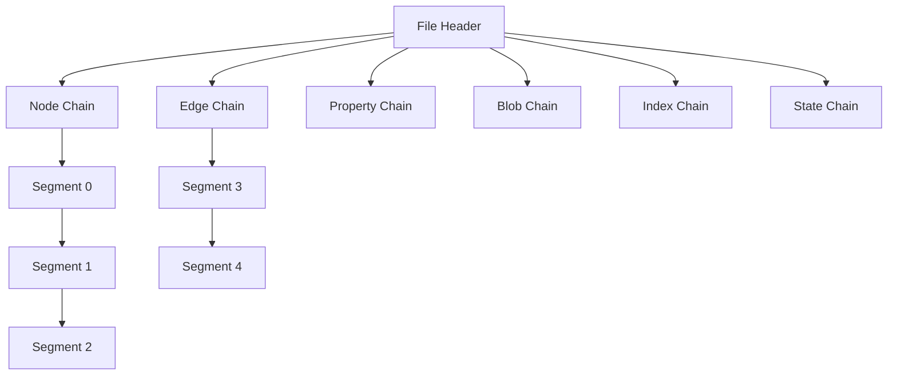
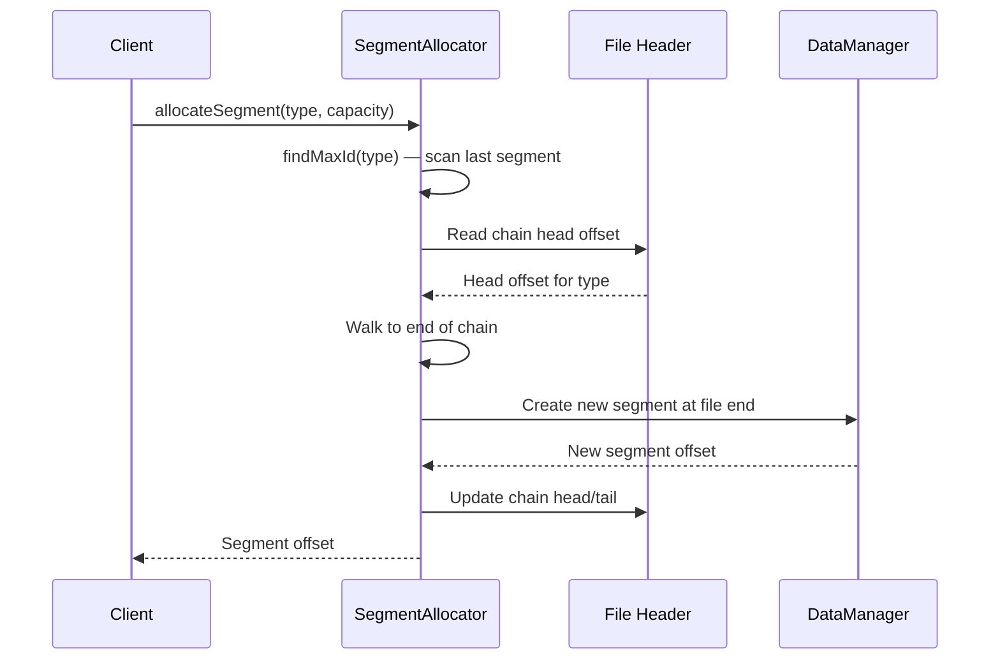
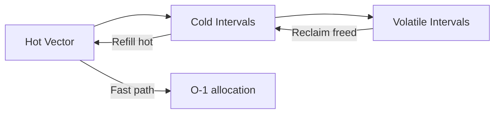

# Segment Allocation

ZYX stores all graph data in fixed-size segments (128 KB by default). Each entity type (Node, Edge, Property, Blob, Index, State) has its own chain of segments. The allocation algorithm manages segment creation, slot assignment via `IDAllocator`, and chain linking through the file header.

## Architecture Overview

The file header stores the head offset for each entity type's chain. Each segment header contains a `nextSegmentOffset` field that links to the next segment in the chain. When a segment fills up, a new segment is allocated and appended to the chain.

## Segment Structure

Each segment has a fixed layout:

| Region | Purpose |
|--------|---------|
| Segment Header (40 bytes) | Entity type, slot count, data usage, next/prev segment offsets, checksum |
| Slot Metadata Array | Per-slot metadata (entity ID, data offset, data size, flags) |
| Data Area | Actual entity data |

The segment header uses CRC32 checksums to detect data corruption. All fields use fixed-size integer types for cross-platform compatibility.

## Allocation Process

When a new entity needs to be stored:

1. **Find maximum ID**: The allocator scans the last segment in the chain to determine the highest allocated entity ID for the given type. This ensures IDs are monotonically increasing.
2. **Allocate new segment**: If the current tail segment is full, a new segment is created at the end of the file with the specified capacity.
3. **Update chain links**: The previous tail segment's `nextSegmentOffset` is updated to point to the new segment. The file header may also be updated if the chain head changes.
4. **Assign slot**: Within a segment with free slots, the `IDAllocator` assigns the next available ID.

## ID Allocation

`IDAllocator` uses a three-tier ID management system:

- **Hot vector**: A pre-allocated block of contiguous IDs. Allocation from the hot vector is O(1) — just increment and return.
- **Cold intervals**: When the hot vector is exhausted, new IDs are sourced from `IntervalSet` — a sorted collection of `[start, end]` ranges. This allows efficient bulk allocation.
- **Volatile intervals**: Freed IDs are returned to volatile intervals for potential reuse. This prevents ID space exhaustion on workloads with heavy creation and deletion.

The `IntervalSet` data structure stores non-overlapping intervals and supports merge/split operations for efficient range management.

## Deallocation

When a segment is deallocated:

1. The segment is marked as inactive in the segment header
2. Its slot in the parent chain is cleared
3. Freed IDs are returned to the `IDAllocator` volatile intervals
4. The file is not truncated — space is available for reuse

Freed slots within a segment are reused by the `IDAllocator` before allocating new segments. When fragmentation exceeds 30%, ZYX can run multi-phase segment compaction to reclaim space — see [Segment Compaction](segment-compaction) for details.

## Cross-Platform Considerations

All on-disk structures use fixed-size types (`int64_t`, `uint32_t`, etc.) and explicit byte ordering. Segment headers include a checksum for integrity verification on load. The `StorageIO` abstraction handles platform differences in file I/O (`pread`/`pwrite` on POSIX, `fstream` fallback elsewhere).

## Source Locations

| Component | Path |
|-----------|------|
| SegmentAllocator | `include/graph/storage/SegmentAllocator.hpp` |
| IDAllocator | `include/graph/core/IDAllocator.hpp` |
| IntervalSet | `include/graph/core/IntervalSet.hpp` |
| StorageHeaders | `include/graph/storage/StorageHeaders.hpp` |
| File Header | `include/graph/storage/FileHeader.hpp` |
| SegmentCompactor | `include/graph/storage/SegmentCompactor.hpp` |
| SpaceManager | `include/graph/storage/SpaceManager.hpp` |
