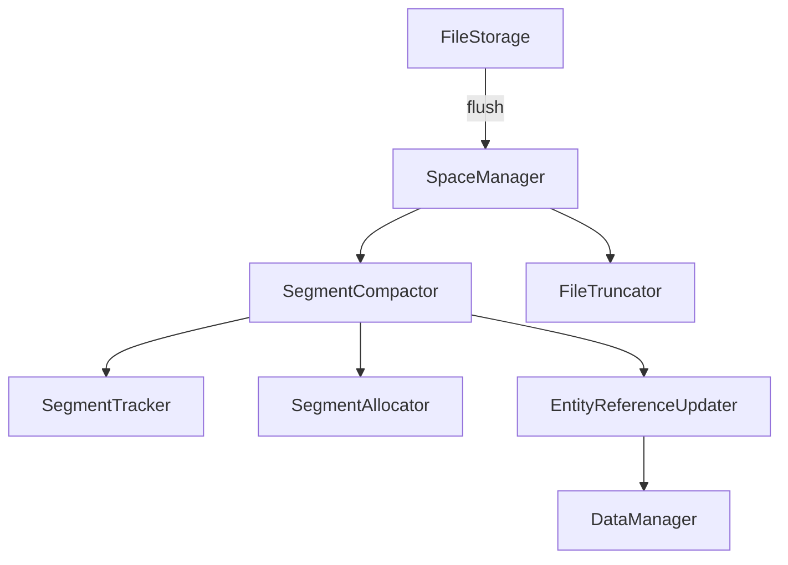
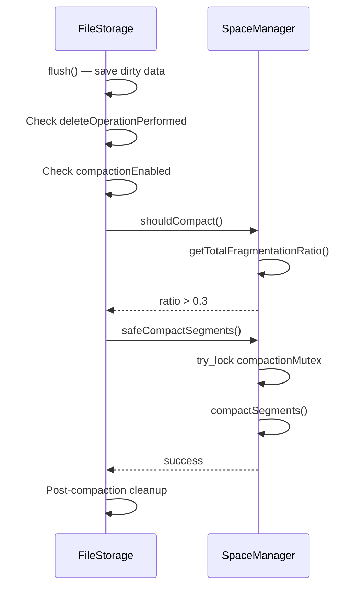

# Segment Compaction

When entities are deleted, their slots are marked inactive but the segment space is not immediately reclaimed. Over time this creates fragmentation. ZYX provides a multi-phase compaction system that reclaims this space when fragmentation exceeds a configurable threshold.

## Architecture

Compaction is coordinated by `SpaceManager`, which orchestrates `SegmentCompactor` and `FileTruncator`. The trigger logic lives in `FileStorage::flush()`.



## Trigger Conditions

Compaction runs automatically after a flush when **all three** conditions are met:

1. **Delete flag set** — At least one delete operation occurred since the last check (`deleteOperationPerformed` atomic flag, set by `DeletionManager`)
2. **Compaction enabled** — The `storage.compaction.enabled` system state key is set to `true` (default: disabled)
3. **Fragmentation threshold exceeded** — `SpaceManager::shouldCompact()` returns `true` when the weighted average fragmentation ratio across all entity types exceeds 30%



`safeCompactSegments()` uses `try_lock` on a dedicated mutex. If another compaction is already in progress, the call returns `false` immediately without blocking.

## Compaction Phases

`SpaceManager::compactSegments()` executes five phases in order:

### Phase 1: Empty Segment Removal

```cpp
compactor_->processAllEmptySegments();
```

Scans every entity type's segment chain and removes segments that contain zero active slots. The segment is unlinked from its chain and the file header is updated.

### Phase 2: Intra-Segment Defragmentation

```cpp
compactor_->compactSegments(type, threshold);
```

For each entity type, walks the segment chain and defragments segments whose fragmentation exceeds the threshold. Active slots are packed toward the beginning of the segment, eliminating gaps left by deleted entities. When an entity's slot position changes within the segment, `EntityReferenceUpdater` updates all references pointing to the old entity ID.

### Phase 3: Inter-Segment Merge

```cpp
compactor_->mergeSegments(type, threshold);
```

Finds pairs of under-utilized segments (below the usage threshold) and merges them. `findCandidatesForMerge()` identifies candidates, then `mergeIntoSegment()` copies active slots from the source segment into the target segment. The source segment is removed from the chain after a successful merge.

### Phase 4: Tail Relocation

```cpp
compactor_->relocateSegmentsFromEnd();
```

Moves segments from the end of the file into free slots earlier in the file. This allows `FileTruncator` to shrink the file afterward. `moveSegment()` copies the segment data and updates the chain pointers via `updateSegmentChain()`.

### Phase 5: Max ID Recalculation

```cpp
compactor_->recalculateMaxIds();
```

After entities have been moved and merged, the maximum allocated ID for each entity type may have changed. This phase scans each chain's last segment to recompute the correct max ID, ensuring that `IDAllocator` assigns new IDs correctly.

## Entity Reference Updates

When compaction moves an entity to a new slot (changing its ID), all references to the old ID must be updated. `EntityReferenceUpdater` handles this per entity type:

| Entity Type | References Updated |
|-------------|-------------------|
| Node | Properties pointing to the node, edges connected to the node |
| Edge | Properties pointing to the edge, source/target node adjacency lists |
| Property | Parent entity's property pointer |
| Blob | Blob chain links (next/prev pointers) |
| Index | Parent/child/sibling pointers in the B+Tree |
| State | State chain next/prev pointers |

The updater operates through `DataManager` to ensure consistency with the caching and transaction layers.

## Configuration

Compaction is controlled by the `storage.compaction.enabled` system state key:

```cypher
// Enable compaction
CALL dbms.setConfigValue('storage.compaction.enabled', true)

// Disable compaction (default)
CALL dbms.setConfigValue('storage.compaction.enabled', false)
```

The key is defined in `SystemStateKeys.hpp` as `Config::STORAGE_COMPACTION_ENABLED`. The `compactionEnabled_` atomic flag in `FileStorage` reflects this value at runtime.

Compaction is disabled by default because it involves entity ID reassignment, which can be expensive on large databases. Enable it for workloads with frequent deletions where disk space reclamation is important.

## Post-Compaction Cleanup

After a successful compaction, `FileStorage` performs these cleanup steps:

1. **Clear cache** — `DataManager::clearCache()` invalidates all cached entities since IDs may have changed
2. **Reset ID allocators** — Each `IDAllocator::resetAfterCompaction()` clears hot/cold vectors so they lazy-load from the new segment state
3. **Rebuild segment indexes** — `SegmentIndexManager::buildSegmentIndexes()` reconstructs the entity-ID-to-segment mapping
4. **Persist headers** — Segment headers are re-persisted, CRCs are recalculated, and the file header is flushed

## Source Locations

| Component | Path |
|-----------|------|
| SpaceManager | `include/graph/storage/SpaceManager.hpp` |
| SegmentCompactor | `include/graph/storage/SegmentCompactor.hpp` |
| EntityReferenceUpdater | `include/graph/storage/EntityReferenceUpdater.hpp` |
| DeletionManager | `include/graph/storage/DeletionManager.hpp` |
| FileTruncator | `include/graph/storage/FileTruncator.hpp` |
| SystemStateKeys | `include/graph/storage/state/SystemStateKeys.hpp` |
| FileStorage (trigger) | `src/storage/FileStorage.cpp` |
