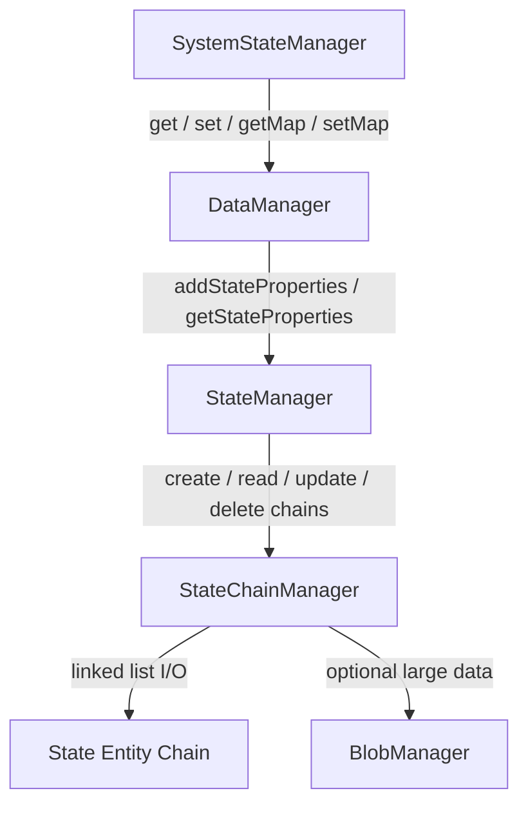
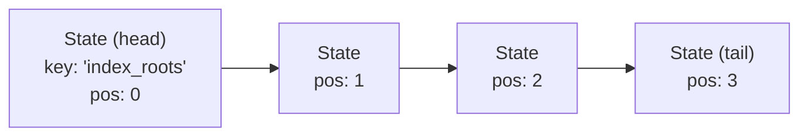
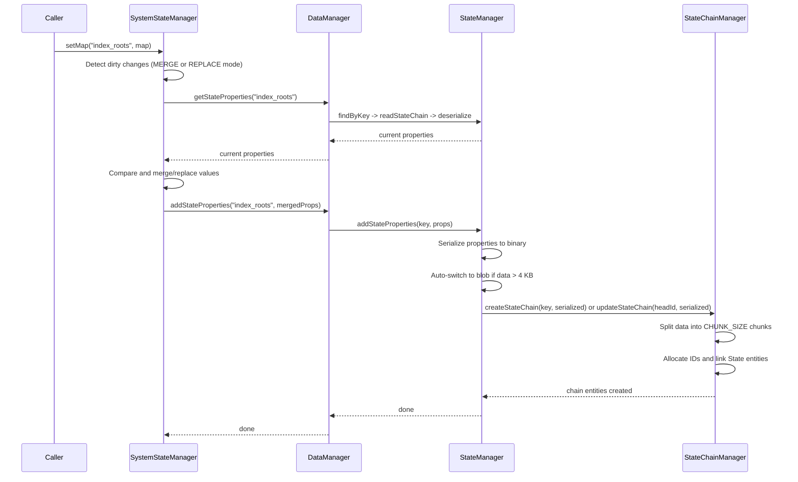
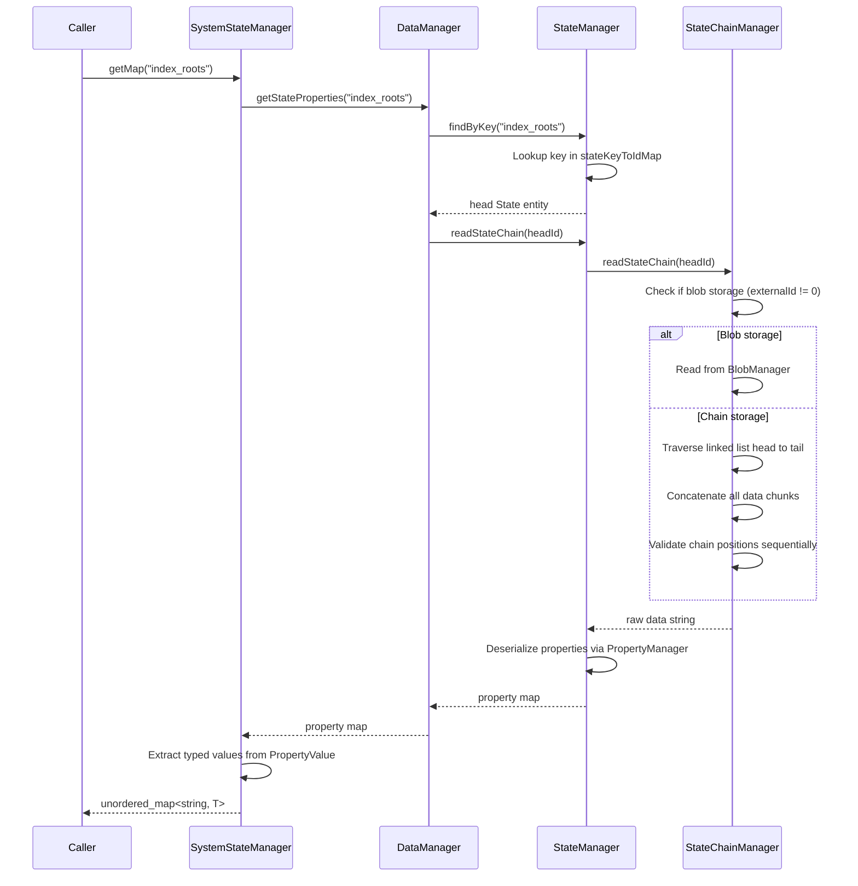
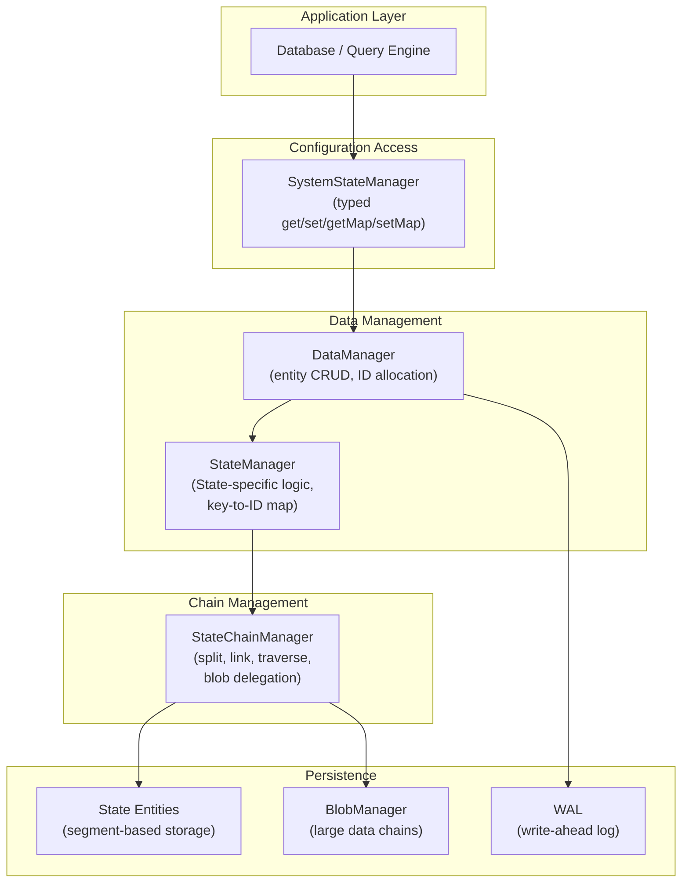

# State Chain Configuration Storage

ZYX stores internal configuration data -- such as B+Tree root IDs, key type mappings, enabled flags, and index metadata -- in **State chains**. A State chain is a linked list of fixed-size State entities managed by `StateChainManager`. A higher-level typed interface, `SystemStateManager`, provides convenient get/set operations for scalars, maps, and mixed-type configurations.

## Overview

The state chain system has three layers:

- **State entities** -- Fixed-size (256-byte) storage records that hold a metadata header plus a small inline data chunk. When data exceeds one chunk, additional State entities are linked together to form a chain.
- **StateChainManager** -- Low-level manager that creates, reads, updates, and deletes chains of State entities. It handles data splitting, chain linking, and optional blob storage delegation.
- **SystemStateManager** -- High-level typed interface that serializes properties, delegates to StateChainManager through DataManager, and exposes `get`/`set`/`getMap`/`setMap` operations for `int64_t`, `bool`, `double`, `std::string`, and vector types.

## State Entity Structure

Each State entity occupies exactly 256 bytes on disk. The layout consists of a metadata header followed by an inline data buffer. The metadata header contains the following fields:

- **id** (int64_t) -- Unique identifier for this State entity.
- **nextStateId** (int64_t) -- ID of the next State in the chain, or 0 if this is the tail.
- **prevStateId** (int64_t) -- ID of the previous State in the chain, or 0 if this is the head.
- **externalId** (int64_t) -- If nonzero, points to the head Blob ID when blob storage mode is used.
- **dataSize** (uint32_t) -- Number of bytes of actual data stored in this entity's chunk.
- **chainPosition** (int32_t) -- Zero-based position of this entity within the chain.
- **key** (char[64]) -- Unique string key identifying the head State entity.
- **isActive** (bool) -- Whether this entity is active (not logically deleted).

The remaining bytes after the metadata form the inline data buffer, whose size is `256 - metadata_size`. This is referred to as `CHUNK_SIZE`.

Only the head entity (chainPosition == 0, prevStateId == 0) carries the key. All subsequent entities in the chain are linked via nextStateId pointers.

## State Chain Layout

When configuration data fits within a single chunk, only one State entity is used. When it exceeds the chunk size, the data is split across multiple entities linked into a chain:

Each entity stores a contiguous slice of the serialized data. During reads, the chain is traversed from head to tail, and all data chunks are concatenated to reconstruct the original data.

For particularly large configurations (over approximately 4 KB after serialization), the system can delegate storage to `BlobManager` instead. In blob mode, the head State entity's `externalId` field points to a blob chain, and no State chaining is needed.

## Write Flow

Writing configuration data through `SystemStateManager.setMap()` follows this sequence:

The key steps are:

1. **Dirty check** -- SystemStateManager loads the current properties and compares them with the incoming data. If nothing changed, no write occurs.
2. **Serialization** -- Properties are serialized using `PropertyManager::serializeProperties` into a binary string.
3. **Auto-blob threshold** -- If the serialized data exceeds 4 KB, the system automatically switches to blob storage mode.
4. **Chain creation or update** -- StateChainManager either creates a new chain (if the key does not exist) or updates an existing chain (deleting old tail entities and writing new ones).
5. **Storage** -- Each State entity is written to disk through DataManager.

## Read Flow

Reading configuration data reconstructs the original properties from the State chain:

The chain traversal validates integrity by checking:

- Each entity is active and has a nonzero ID.
- The `chainPosition` field matches the expected sequential index.
- No circular references exist (tracked via a visited set).

If any of these checks fail, a runtime error is thrown.

## SystemStateManager Typed Access

`SystemStateManager` provides a typed layer on top of the raw State chain storage. It supports two update modes:

- **MERGE** -- Appends or updates individual properties while keeping existing properties unchanged. Used by `set()` for single field updates.
- **REPLACE** -- Deletes the entire existing chain and writes a fresh one with only the new properties. Used by `setMap()` when a full replacement is desired.

The supported types are:

| Type | Usage |
|---|---|
| `int64_t` | Numeric counters, root IDs, segment IDs |
| `bool` | Enabled flags, feature toggles |
| `double` | Floating-point configuration values |
| `std::string` | String configuration values |
| `std::vector<float>` | Vector index embeddings |
| `std::vector<PropertyValue>` | Heterogeneous lists |

When reading, SystemStateManager loads all properties from the chain and uses a type-extraction helper that handles implicit conversions (for example, `bool` values may be stored as `int64_t` 0 or 1).

## Update Operation

Updating an existing State chain involves replacing the old data with new data:

1. **Same-data check** -- StateChainManager reads the current chain and compares the raw bytes with the new data. If identical, no update occurs.
2. **Cleanup old storage** -- If the old chain used blob storage, the blob chain is deleted. If it used internal chaining, all tail entities are deleted.
3. **Setup new storage** -- The new data is split into chunks and a fresh chain is constructed using the same head entity ID.
4. **Apply updates** -- The head entity is updated in place. Any new tail entities are added.

This approach reuses the head entity ID so that external references (such as the key-to-ID map in StateManager) remain valid across updates.

## Layered Architecture

The following diagram shows how the components relate to each other and to the broader storage system:

## Integration with WAL and Transactions

State chain modifications participate in ZYX's standard transaction and durability mechanisms:

- **Write-ahead logging** -- All State entity creates, updates, and deletes are recorded in the WAL before being applied. This ensures that configuration data can be recovered after a crash.
- **Single-writer model** -- ZYX uses a single-writer/multi-reader concurrency model enforced by `std::shared_mutex`. Only one write transaction can be active at a time, so no per-entity conflict detection is needed.
- **Undo log rollback** -- If a write transaction is rolled back, the UndoLog restores the previous state of all modified State entities.

Because the database engine controls when State chains are written (during index creation, schema changes, or configuration updates), these writes always occur within a write transaction. The WAL guarantees that either the full chain update is persisted or none of it is.

## Storage Modes

StateChainManager supports two storage modes, selectable per chain:

**Internal chain mode** (default) -- Data is split into chunks of `CHUNK_SIZE` bytes, and each chunk is stored in a separate State entity linked via `nextStateId`. Suitable for small-to-medium configurations.

**Blob mode** -- Data is stored through `BlobManager`, which manages its own chain of Blob entities optimized for larger payloads. The head State entity's `externalId` field points to the head Blob. This mode is automatically selected when serialized data exceeds 4 KB, or can be explicitly requested.

## Key-to-ID Mapping

StateManager maintains an in-memory `stateKeyToIdMap` that maps string keys to head State entity IDs. This map is populated at startup by scanning all State entities across segments and identifying chain heads (entities with `prevStateId == 0` and a non-empty key).

When a new State chain is created, the map is updated. When a State is deleted, the entry is removed. This allows `findByKey()` lookups in O(1) time without scanning the entire storage.

## Source Locations

| Component | Header |
|---|---|
| State entity | `include/graph/core/State.hpp` |
| StateChainManager | `include/graph/core/StateChainManager.hpp` |
| SystemStateManager | `include/graph/storage/state/SystemStateManager.hpp` |
| StateManager | `include/graph/storage/data/StateManager.hpp` |
| Compression utilities | `include/graph/utils/CompressUtils.hpp` |

## See Also

- [Storage System](/en/docs/zyx/architecture/storage) - Persistent storage and segment format
- [WAL Recovery](/en/docs/zyx/algorithms/wal-recovery) - Write-ahead logging and crash recovery
- [Transactions](/en/docs/zyx/architecture/transactions) - Transaction model and concurrency
