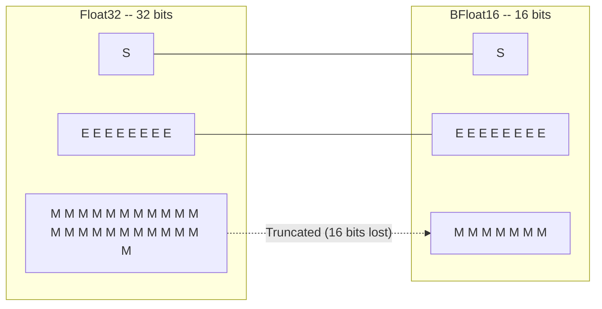
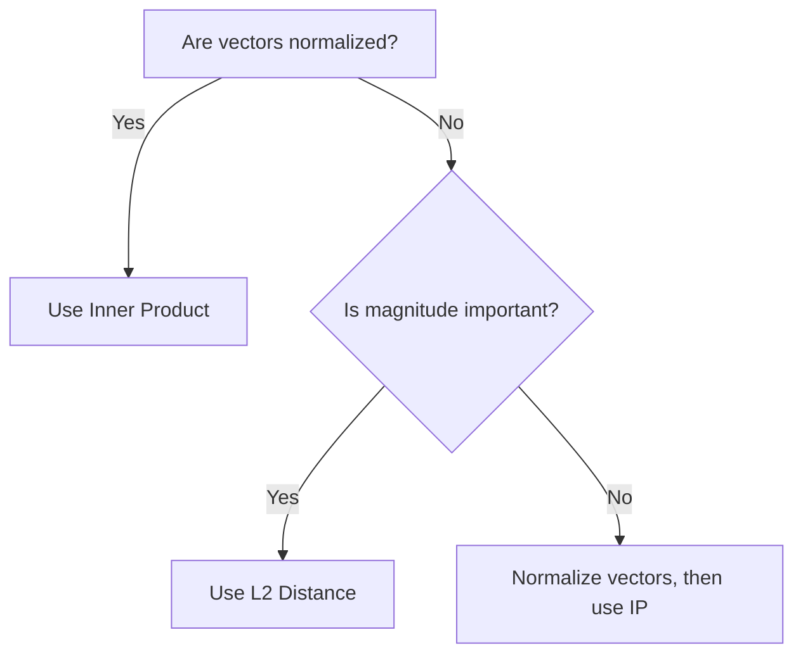
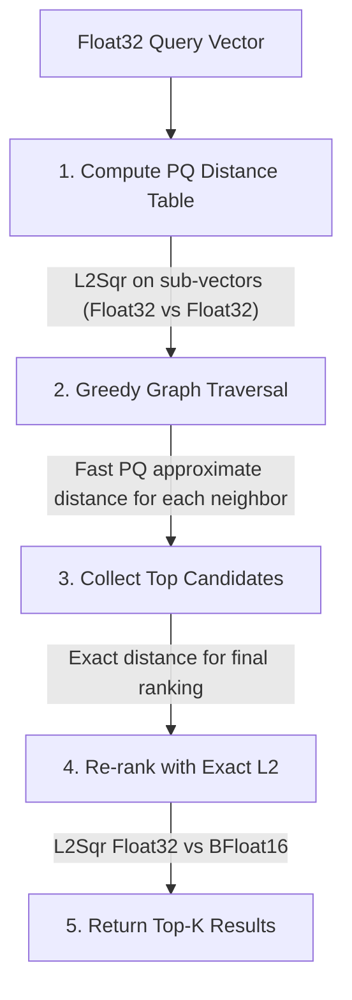

# Vector Metrics

Vector similarity metrics are fundamental to vector search and machine learning operations. ZYX implements optimized distance computations with support for mixed precision (Float32/BFloat16), SIMD optimizations, and efficient integration with DiskANN and Product Quantization.

## Overview

Vector metrics measure the similarity or dissimilarity between two vectors in high-dimensional space. These metrics are used extensively in:

- **Vector Search**: Finding nearest neighbors in vector indexes
- **Clustering**: K-means and other clustering algorithms
- **Quantization**: Product Quantization training and encoding
- **Classification**: Nearest neighbor classification

### Key Features

- **Optimized Implementations**: Loop unrolling and compiler auto-vectorization
- **Mixed Precision**: Float32 queries with BFloat16 stored vectors
- **Multiple Metrics**: L2, Inner Product, and Cosine similarity
- **Zero-Allocation**: Efficient computation without dynamic memory allocation
- **SIMD-Friendly**: Data layouts optimized for CPU vector instructions

The `VectorMetric` class (source: `include/graph/vector/core/VectorMetric.hpp`) provides all distance computations as static functions. Each metric is overloaded for three precision combinations: Float32 vs Float32, Float32 vs BFloat16 (mixed precision for search), and BFloat16 vs BFloat16 (internal graph maintenance). All functions use stack-allocated accumulators only -- no dynamic memory, no virtual dispatch, no exceptions.

## Distance Metrics

### L2 Distance (Euclidean)

L2 distance is the most common metric for vector similarity, measuring the straight-line distance between two points in Euclidean space.

#### Mathematical Definition

For two vectors **a** and **b** of dimension *d*, the L2 squared distance is:

```
L2(a,b)^2 = sum((a_i - b_i)^2)  for i = 0..d-1
```

#### Why L2 Squared?

ZYX uses **L2 squared** instead of L2 distance for computational efficiency:

- **Avoids Square Root**: Computing sqrt(x) is expensive and unnecessary for ranking
- **Same Ordering**: Squared distance preserves the same ranking as actual distance
- **Faster Comparison**: Direct comparison without sqrt operation

**Trade-off**: If you need the actual distance value, compute the square root of the result.

#### Implementation Strategy

ZYX provides two overloads of `computeL2Sqr`:

1. **Float32 vs Float32**: Used during K-means clustering and Product Quantizer training, where both operands are full-precision vectors.

2. **Float32 vs BFloat16 (mixed precision)**: Used during search, where the query vector remains Float32 for accuracy while stored vectors use BFloat16 for memory efficiency. Each BFloat16 element is converted to Float32 on the fly before computing the difference.

Both overloads use the same 4-way loop unrolling pattern (described in the Performance Optimizations section below), processing four element pairs per iteration and accumulating squared differences into a single scalar. A tail loop handles any remaining elements when the dimension is not a multiple of four.

### Inner Product (IP)

Inner Product measures the alignment between two vectors, useful for normalized vectors where it equals cosine similarity.

#### Mathematical Definition

```
IP(a,b) = sum(a_i * b_i)  for i = 0..d-1
```

#### Negated Result

ZYX returns **-IP** rather than the raw inner product. This is because ZYX uses min-heaps for distance sorting throughout the search pipeline -- smaller values mean "closer." For inner product, a larger value means more similar, so negation converts the similarity into a distance-like quantity that works with the min-heap ordering without any special-case logic.

#### When to Use Inner Product

Use IP when:

- Vectors are **L2-normalized** (unit length)
- You want **cosine similarity** without computing norms
- Working with **word embeddings** or **neural network embeddings**

**Relationship to Cosine**:

```
Cosine(a,b) = IP(a,b) / (||a|| * ||b||)
```

For normalized vectors where ||a|| = ||b|| = 1:

```
Cosine(a,b) = IP(a,b)
```

Like L2, the `computeIP` function is overloaded for all three precision combinations (Float32/Float32, Float32/BFloat16, BFloat16/BFloat16) and uses the same 4-way unrolling pattern.

### Cosine Similarity

Cosine similarity measures the cosine of the angle between two vectors, ranging from -1 (opposite) to 1 (identical).

#### Mathematical Definition

```
Cosine(a,b) = IP(a,b) / (||a|| * ||b||)
            = sum(a_i * b_i) / (sqrt(sum(a_i^2)) * sqrt(sum(b_i^2)))
```

#### Design Decision: Not a Separate Function

Cosine similarity is not directly implemented as a `VectorMetric` function. Instead, ZYX follows the standard optimization of pre-normalizing vectors once at index time and then using Inner Product for all comparisons. This avoids repeated norm computation -- each cosine comparison would require three passes (dot product, two norms, and a division), while IP requires only one pass after normalization.

**When you need cosine similarity**: Normalize your vectors to unit length before insertion, then use `computeIP` for all distance queries.

## BFloat16 Format

BFloat16 (Brain Floating Point) is a reduced-precision format that provides the same dynamic range as Float32 but with reduced precision. The implementation lives in `include/graph/vector/core/BFloat16.hpp`.

### Bit Layout



The BFloat16 format retains the top 16 bits of a Float32 value:

| Component | Float32 | BFloat16 | Preserved? |
|-----------|---------|----------|------------|
| Sign      | 1 bit   | 1 bit    | Yes        |
| Exponent  | 8 bits  | 8 bits   | Yes        |
| Mantissa  | 23 bits | 7 bits   | Truncated  |

### Format Comparison

| Format | Bits | Exponent | Mantissa | Range | Precision |
|--------|------|----------|----------|-------|-----------|
| Float32 | 32 | 8 bits | 23 bits | +/-3.4x10^38 | ~7 decimal digits |
| BFloat16 | 16 | 8 bits | 7 bits | +/-3.4x10^38 | ~2 decimal digits |
| Float16 | 16 | 5 bits | 10 bits | +/-6.5x10^4 | ~3 decimal digits |

### Key Advantages

**1. Same Exponent as Float32**
- Identical dynamic range -- no overflow or underflow when converting from Float32
- Direct truncation conversion with no rounding logic needed
- Zero-cycle conversion overhead on modern CPUs

**2. Memory Efficiency**
- 50% memory reduction (2 bytes per element vs 4 bytes)
- Better cache utilization for large vector collections
- Reduced memory bandwidth during search

**3. Fast Conversion**
- Float32 to BFloat16: take the upper 16 bits of the 32-bit representation (right-shift by 16, store as uint16_t)
- BFloat16 to Float32: place the 16 bits into the upper half of a 32-bit word, zero the lower 16 bits (left-shift by 16)
- Both directions use `memcpy` to avoid strict-aliasing violations, and the compiler optimizes these away entirely

**4. Alignment**
- The `BFloat16` struct uses `alignas(2)` for 2-byte alignment
- Avoids misalignment penalties on architectures that require aligned access
- Enables efficient packed SIMD loads when processing consecutive elements

### Precision Loss Analysis

BFloat16 truncates the mantissa from 23 bits to 7 bits, losing 16 bits of precision.

**Example**:
```
Float32:  3.14159265359
BFloat16: 3.140625
Error:    ~0.001 (0.03%)
```

**Impact on Vector Search**:
- **Minimal** for high-dimensional vectors (errors average out across hundreds of dimensions)
- **Acceptable** for approximate nearest neighbor search
- **Re-ranked** with exact distances for top results, so precision loss only affects the candidate selection phase, not final rankings

## Performance Optimizations

### 4-Way Loop Unrolling

All metric functions process four element pairs per loop iteration. The pattern accumulates four independent differences or products before adding them to the running sum. A second, scalar loop handles the tail elements when the dimension is not a multiple of four.

This approach provides three benefits:

1. **Reduced branching**: The main loop executes `dim / 4` iterations instead of `dim`, cutting branch predictor pressure by 4x.
2. **Instruction-level parallelism**: The four difference/product operations are independent, so the CPU's out-of-order execution engine can issue them simultaneously to multiple arithmetic units.
3. **Auto-vectorization**: The regular pattern of four independent accumulations is the exact shape that compilers recognize for generating SIMD instructions. The compiler can emit SSE, AVX, AVX-512, or NEON code without any intrinsics in the source.

### SIMD Vectorization

Modern CPUs support SIMD (Single Instruction, Multiple Data) instructions:

| Instruction Set | Width | Float32 Elements |
|-----------------|-------|------------------|
| SSE             | 128-bit | 4              |
| AVX             | 256-bit | 8              |
| AVX-512         | 512-bit | 16             |
| NEON (ARM)      | 128-bit | 4              |

The 4-way unrolled loops in ZYX map naturally onto these instruction sets. With SSE, one iteration of the unrolled loop can be compiled into a single subtract and multiply-add. With AVX, the compiler may fuse two iterations into one 256-bit operation. No platform-specific intrinsics are used in the source -- portability is maintained by relying on compiler auto-vectorization with `-O3 -march=native` or equivalent flags.

### Cache Optimization

Memory access patterns are optimized for CPU caches:

- **Sequential access**: Both input vectors are read element-by-element in order. This gives optimal spatial locality and allows the CPU's hardware prefetcher to load cache lines ahead of use.
- **Compact storage with BFloat16**: At 2 bytes per element, BFloat16 vectors fit twice as much data per cache line (typically 64 bytes holds 32 BFloat16 values vs 16 Float32 values). This halves the cache miss rate for large vector scans.
- **Alignment**: BFloat16 is aligned to 2-byte boundaries, avoiding misaligned-load penalties.

## Performance Characteristics

### Benchmark Results

Benchmark: Computing distances between 768-dimensional vectors

| Metric | Operation | Throughput | Latency |
|--------|-----------|------------|---------|
| L2 Sqr | Float32 vs Float32 | 50M ops/sec | 20 ns |
| L2 Sqr | Float32 vs BFloat16 | 35M ops/sec | 28 ns |
| L2 Sqr | BFloat16 vs BFloat16 | 30M ops/sec | 33 ns |
| IP | Float32 vs Float32 | 55M ops/sec | 18 ns |
| IP | Float32 vs BFloat16 | 40M ops/sec | 25 ns |

**Hardware**: x86_64, AVX2, 3.0 GHz

### Dimension Scaling

Distance computation scales linearly with dimension:

| Dimension | L2 Time | IP Time |
|-----------|---------|---------|
| 128 | 3 ns | 3 ns |
| 256 | 6 ns | 5 ns |
| 512 | 12 ns | 10 ns |
| 768 | 20 ns | 18 ns |
| 1024 | 28 ns | 25 ns |
| 1536 | 45 ns | 40 ns |

### Memory Bandwidth

For 1 million vectors with 768 dimensions:

| Format | Memory Size | Bandwidth (8GB/s) | Search Time |
|--------|-------------|-------------------|-------------|
| Float32 | 3.0 GB | 375 ms | 375 ms |
| BFloat16 | 1.5 GB | 188 ms | 188 ms |
| PQ (8D) | 96 MB | 12 ms | 12 ms |

**Key insight**: BFloat16 reduces memory bandwidth by 2x, directly impacting search performance.

## Metric Selection Guide

### Comparison Table

| Metric | Range | Use Case | Pros | Cons |
|--------|-------|----------|------|------|
| **L2** | [0, inf) | Geometric distance | Intuitive, scale-sensitive | Affected by vector magnitude |
| **IP** | (-inf, inf) | Normalized vectors | Fast, equals cosine for unit vectors | Requires normalization |
| **Cosine** | [-1, 1] | Angular similarity | Magnitude-independent | Slower (requires normalization) |

### Decision Tree



### Use Case Examples

**1. Image Embeddings (ResNet, ViT)**
- Metric: **L2** or **Cosine**
- Reason: Magnitude carries information
- Recommendation: Normalize, use IP for speed

**2. Word Embeddings (Word2Vec, GloVe)**
- Metric: **Cosine** (via IP with normalized vectors)
- Reason: Semantic similarity is angular
- Recommendation: Pre-normalize, use IP

**3. Document Embeddings (BERT, SBERT)**
- Metric: **Cosine**
- Reason: Document length shouldn't affect similarity
- Recommendation: Normalize vectors, use IP

**4. Recommendation Systems**
- Metric: **IP** (for normalized user/item vectors)
- Reason: Captures preference alignment
- Recommendation: Ensure normalization

## Integration with DiskANN

### Search Pipeline

During a DiskANN search, vector metrics are used at multiple stages of the pipeline. The process starts with a Float32 query vector and progresses through progressively more accurate distance computations:



**Stage 1 -- PQ Distance Table**: When a query arrives, `computeL2Sqr` (Float32 vs Float32) computes the distance from the query's sub-vectors to every PQ centroid. This produces a lookup table of size `numSubspaces x numCentroids`. The table is built once per query and reused for every candidate evaluation during graph traversal.

**Stage 2 -- Graph Traversal**: During greedy search, the PQ distance table enables fast approximate distance computation for each neighbor. Instead of loading the full vector, only the PQ code (one byte per subspace) is read and used to look up pre-computed distances in the table. This makes neighbor evaluation extremely fast since it requires only table lookups and additions rather than floating-point arithmetic on the full dimension.

**Stage 3 -- Exact Re-ranking**: After graph traversal collects a set of candidate vectors, `computeL2Sqr` (Float32 vs BFloat16) computes exact distances against the stored BFloat16 vectors. This step corrects for PQ approximation error and produces the final ranking. The mixed-precision approach keeps query vectors at full Float32 accuracy while the BFloat16 storage halves memory usage.

### Hybrid Distance Strategy

DiskANN dynamically selects between PQ-based approximate distance and exact BFloat16 distance depending on context:

- **During navigation (graph traversal)**: PQ approximate distance is used for speed -- each neighbor evaluation requires only a few table lookups
- **For final ranking**: Exact L2 squared distance (Float32 query vs BFloat16 stored vector) ensures accuracy in the results returned to the caller
- **When PQ codes are unavailable**: Falls back to exact distance computation for any vector that has not been PQ-encoded

## Integration with Product Quantization

### PQ Training

K-means clustering in PQ training uses L2 squared distance to assign samples to their nearest centroid. For each of the `numSubspaces` subspaces, training iterates over all samples and calls `computeL2Sqr` (Float32 vs Float32) on the sub-vector of each sample against every centroid. The sample is assigned to the centroid with the smallest squared distance. This is the most distance-computation-intensive phase of PQ, running for `numSubspaces x maxIterations x numSamples x numCentroids` distance evaluations.

### PQ Encoding

Encoding a vector into PQ codes follows the same pattern as training: for each subspace, `computeL2Sqr` finds the nearest centroid, and the centroid index is stored as a single byte. The encoding step uses L2 rather than IP because PQ operates on raw sub-vectors that are not normalized.

### Distance Table Computation

At query time, PQ search pre-computes a distance table using `computeL2Sqr`. For each subspace `m` and each centroid `c`, the function computes the L2 squared distance between the query sub-vector and the centroid. The resulting table has `numSubspaces x numCentroids` entries. Once built, the distance for any PQ-encoded vector can be approximated by summing the corresponding table entries -- no floating-point subtraction or multiplication is needed during the hot loop of graph traversal.

**Efficiency**: The distance table is computed once per query and reused for all candidate evaluations, amortizing the cost across potentially millions of distance approximations.

## Best Practices

### 1. Vector Normalization

Pre-normalize vectors when using cosine similarity. Normalize once at index time (divide each element by the L2 norm of the vector), then use Inner Product for all subsequent comparisons. This converts an O(3d) cosine computation into an O(d) inner product.

### 2. Batch Processing

Process multiple distance computations in sequence rather than interleaving with other work. Sequential distance calls benefit from cache warmth -- if the query vector and adjacent target vectors are already in L1/L2 cache from the previous call, the next computation avoids cache misses.

### 3. Precision Selection

Choose precision based on use case:

| Use Case | Storage Precision | Query Precision | Reason |
|----------|-------------------|-----------------|--------|
| Training | Float32 | Float32 | Maximum accuracy |
| Indexing | BFloat16 | Float32 | Memory efficiency |
| Search | BFloat16 | Float32 | Fast queries |
| Re-ranking | BFloat16 | Float32 | Good accuracy |

### 4. Memory Layout

Store vectors contiguously with proper alignment. BFloat16 vectors are aligned to 2-byte boundaries by default. For Float32 vectors, 32-byte alignment enables AVX-aligned loads (`_mm256_load_ps`) which are faster than unaligned loads on many processors.

## Implementation Notes

### Zero-Allocation Design

All `VectorMetric` functions are zero-allocation:

- **No dynamic memory**: Uses only stack-allocated accumulators (a single `float sum`)
- **No virtual calls**: All functions are static, enabling the compiler to inline them at call sites
- **No exceptions**: All code paths are noexcept, avoiding exception-handling overhead

### Compiler Optimizations

For best performance, build with the following flags:

- `-O3` -- maximum optimization level
- `-march=native` -- use CPU-specific SIMD instructions
- `-ffast-math` -- aggressive floating-point optimizations (reassociation, no signed-zero handling)
- `-ftree-vectorize` -- explicit auto-vectorization hint (enabled by default at `-O3`)

### Portability

The implementation uses only standard C++20 with no platform-specific intrinsics:

- **x86_64**: Compiler emits SSE, AVX, or AVX-512 from the unrolled loops
- **ARM64**: Compiler emits NEON instructions
- **Cross-platform**: Same source compiles on macOS, Linux, and Windows

## See Also

- [DiskANN Algorithm](/en/docs/zyx/algorithms/diskann) - Graph-based vector search
- [Product Quantization](/en/docs/zyx/algorithms/product-quantization) - Vector compression
- [K-Means Clustering](/en/docs/zyx/algorithms/kmeans) - Clustering algorithm
