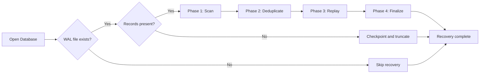
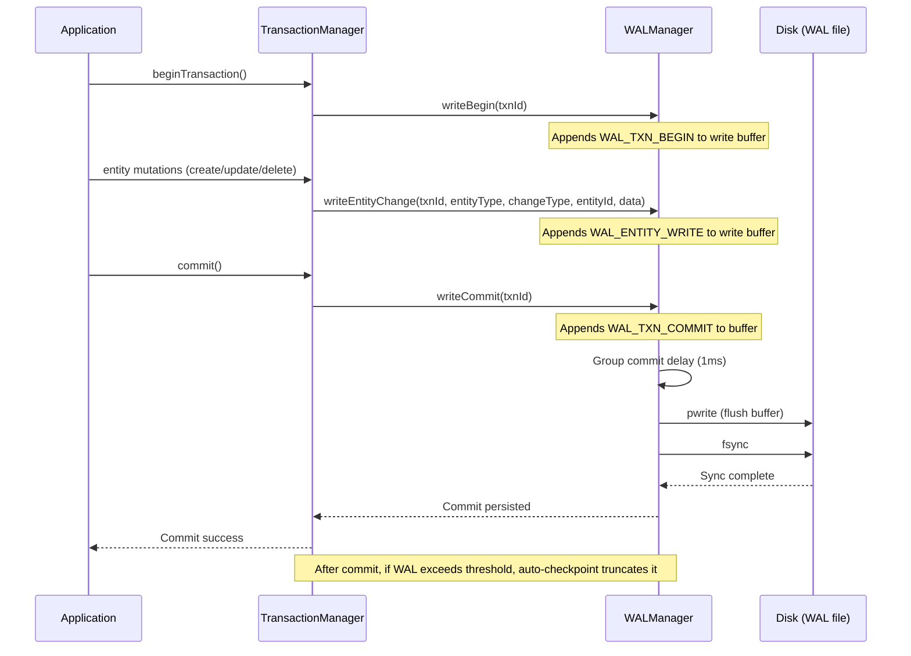
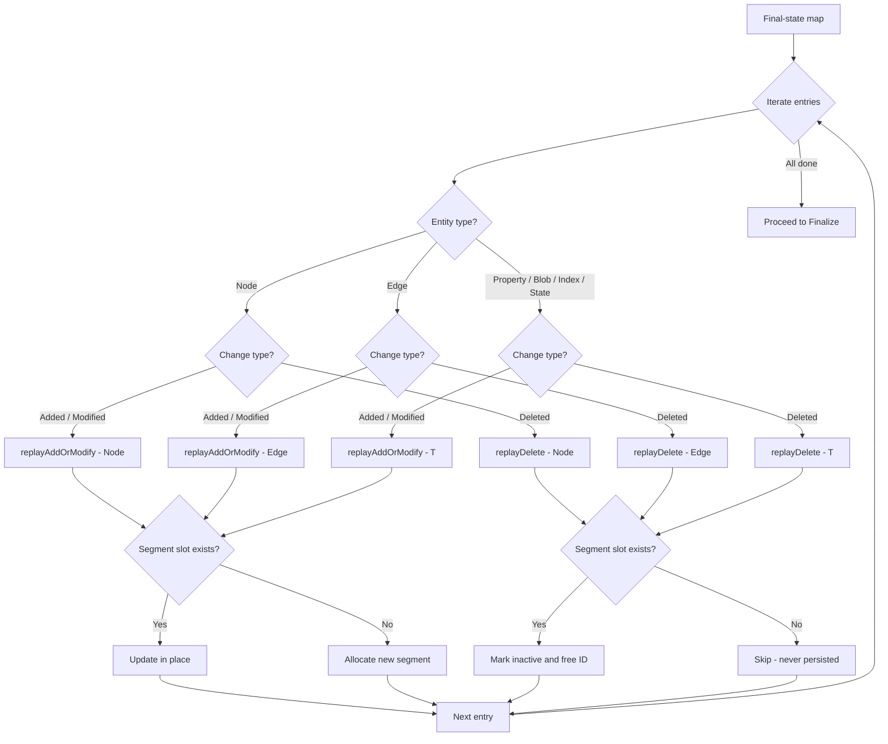
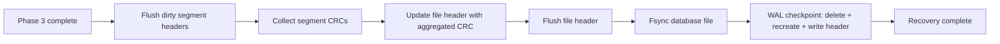

# WAL Recovery Algorithm

The Write-Ahead Log (WAL) recovery algorithm ensures database consistency after system crashes by replaying committed transactions and discarding uncommitted ones.

## Overview

ZYX uses a deferred WAL strategy: the WAL file is not created at database open time. Instead, it is created lazily when the first write transaction begins. If the database only serves read-only transactions (for example, the WASM Playground), the WAL is never created at all.

On database open, if a WAL file already exists on disk, the recovery engine runs a **4-phase algorithm**:

1. **Scan** -- Read all WAL records sequentially from the file, identify committed transactions
2. **Deduplicate** -- Build a last-writer-wins final state map per entity, discarding intermediate updates
3. **Replay** -- Re-apply entity changes to the database file via template-based replay functions
4. **Finalize** -- Persist segment headers, file header, fsync the database file, then truncate the WAL

Recovery is **idempotent**: if the system crashes during replay, the next restart safely re-runs the same 4 phases. The deduplication step ensures that only the final state of each entity is written, regardless of how many intermediate versions existed in the WAL.

## WAL File Format

### File Header

Every WAL file begins with a 32-byte header containing a magic number (`ZYLW`), version number, the database file size at WAL creation time, two salt values, and reserved space. The header is written once when the WAL file is created and validated on every subsequent open.

### Record Types

The WAL stores four record types, expressed as a small enum:

| Type | Value | Description |
|------|-------|-------------|
| `WAL_TXN_BEGIN` | 1 | Marks the start of a transaction |
| `WAL_TXN_COMMIT` | 2 | Marks successful commit of a transaction |
| `WAL_TXN_ROLLBACK` | 3 | Marks transaction rollback |
| `WAL_ENTITY_WRITE` | 4 | An entity-level write operation (create, update, or delete) |

Only transactions that have both a `WAL_TXN_BEGIN` and a `WAL_TXN_COMMIT` record are considered committed and eligible for replay. Transactions with only a `WAL_TXN_BEGIN` (or a `WAL_TXN_ROLLBACK`) are discarded.

### Record Layout

Each WAL record consists of a fixed-size header followed by an optional data payload:

| Field | Size | Description |
|-------|------|-------------|
| `recordSize` | 4 bytes | Total record size including header |
| `txnId` | 8 bytes | Transaction identifier |
| `type` | 1 byte | Record type enum value |
| `checksum` | 4 bytes | CRC32 of the data payload |
| `padding` | 3 bytes | Alignment padding |
| `data` | variable | Payload (present only for `WAL_ENTITY_WRITE`) |

For `WAL_ENTITY_WRITE` records, the data payload begins with an entity payload header:

| Field | Size | Description |
|-------|------|-------------|
| `entityType` | 1 byte | Entity type identifier (Node, Edge, Property, Blob, Index, State) |
| `changeType` | 1 byte | Change kind: Added, Modified, or Deleted |
| `entityId` | 8 bytes | Unique entity identifier |
| `dataSize` | 4 bytes | Size of serialized entity data (0 for deletions) |
| `entityData` | variable | Serialized entity bytes (absent for deletions) |

### Integrity Protection

Every record payload is protected by a CRC32 checksum computed with zlib's `crc32()` function. During recovery, the scan phase verifies each record's checksum. If a checksum mismatch is detected, scanning halts at the last valid record, and the `corrupted` flag is set on the result. Only records successfully validated are passed to the deduplication and replay phases.

## Deferred WAL Creation

The WAL file is created through a two-stage lazy initialization mechanism in the Database class:

1. **Stage 1** (`ensureWALAndTransactionManager`): Called on first transaction begin. If a WAL file already exists on disk (indicating a prior crash), it opens the WAL, runs recovery, and wires the WAL into the storage subsystem. If no WAL file exists, it skips WAL creation entirely -- the `WALManager` pointer remains null.

2. **Stage 2** (`ensureWALForWrites`): Called when the first write transaction begins. If the WAL was not already created in Stage 1, it creates a new WAL file and wires it into both the `TransactionManager` and `DataManager`.

Both stages use `std::call_once` for thread-safe, one-time initialization. Read-only transactions only trigger Stage 1, so a database that is never written to never creates a WAL file.

## WAL Write During Transaction Commit

WAL records are written at three key points during a transaction's lifecycle:

1. **Transaction begin**: A `WAL_TXN_BEGIN` record is written to the WAL write buffer
2. **Entity mutations**: Each entity create, update, or delete writes a `WAL_ENTITY_WRITE` record to the buffer via the DataManager
3. **Transaction commit**: A `WAL_TXN_COMMIT` record is appended, then the entire buffer is flushed to disk with `fsync` before the commit returns

The commit step uses a **group commit** mechanism: the first thread to commit becomes the group leader, waits briefly (configurable, default 1ms) to accumulate commits from other concurrent transactions, then performs a single `flush` + `fsync` that covers all accumulated records. Other committing threads wait on a condition variable until their data has been persisted. This amortizes the cost of `fsync` across multiple transactions.

Rollback records are written with a simple buffer flush (no `fsync`), since uncommitted data does not need to survive a crash.

## 4-Phase Recovery Algorithm

### Phase 1: Scan

The scan phase reads the WAL file sequentially from the first record after the file header. It validates the file header's magic number and version, then iterates through records by reading each record header, verifying its CRC32 checksum, and reading the associated payload data.

The primary output of this phase is a set of committed transaction IDs. A transaction is considered committed if the scan finds at least one `WAL_TXN_COMMIT` record for that transaction ID. All records -- including entity writes from uncommitted transactions -- are collected into a vector for the next phase.

If the WAL file is empty (no records after the header) or contains no committed transactions, the recovery proceeds directly to checkpoint and truncation without replay.

**Key behaviors during scan:**
- If a record header has an invalid size (smaller than the header itself, or extending past end of file), scanning halts and the result is marked as corrupted
- If a CRC32 checksum does not match the computed value, scanning halts at that point
- Only records that pass both size and checksum validation are included in the output

### Phase 2: Deduplicate

The deduplication phase processes all `WAL_ENTITY_WRITE` records that belong to committed transactions and builds a final-state map keyed by `(entityType, entityId)`. For each entity write record, the phase:

1. Checks whether the record's transaction ID is in the committed set -- records from uncommitted or rolled-back transactions are skipped
2. Deserializes the `WALEntityPayload` header from the record's data to extract `entityType`, `changeType`, and `entityId`
3. Constructs an `EntityKey` from the entity type and entity ID
4. Stores the `EntityState` (containing the change type and serialized entity data) in the map, overwriting any previous entry for the same key

The "last-writer-wins" behavior means that if the same entity was modified three times within a single transaction, or across multiple committed transactions, only the final version is preserved for replay. This significantly reduces the amount of work the replay phase must perform and ensures idempotency -- running recovery twice produces the same result.

### Phase 3: Replay

The replay phase iterates over the final-state map and writes each entity change to the database file. For each entry, it dispatches based on the entity type (Node, Edge, Property, Blob, Index, or State) and the change type (Added/Modified vs. Deleted).

**For Add/Modify operations**, the replay logic:
1. Deserializes the entity from the WAL payload using `FixedSizeSerializer`
2. Advances the ID allocator for the entity's type to ensure the entity ID is accounted for (in case the crash lost a counter advance)
3. Checks whether the entity already has a segment slot in the database file
4. If a slot exists, updates the entity in place at the existing segment offset
5. If no slot exists, allocates a new segment and writes the entity

**For Delete operations**, the replay logic:
1. Deserializes the entity from the WAL payload (the before-image)
2. Marks the entity as inactive
3. Looks up the entity's segment slot in the database file
4. If a slot exists, writes the inactive entity in place and frees the entity ID in the allocator
5. If no slot exists, the entity was never persisted to disk, so nothing needs to be done

Both paths use C++ template functions (`replayAddOrModify<T>` and `replayDelete<T>`) that are explicitly instantiated for each of the six entity types, providing type-safe, compile-time dispatched replay without virtual function overhead.

### Phase 4: Finalize

The finalize phase persists all replayed changes and resets the WAL:

1. **Flush dirty segments**: The `SegmentTracker` writes any modified segment headers to disk
2. **Update aggregated CRC**: Collects CRC values for all segments and writes the aggregated checksum to the file header
3. **Flush file header**: Writes the updated file header to disk
4. **Fsync the database file**: Ensures all writes are durable on disk
5. **Checkpoint the WAL**: Closes the WAL file, deletes it, recreates an empty WAL file with a fresh header, and reopens it

After finalization, the database file is in a fully consistent state and the WAL is empty, ready for new transactions.

## Checkpoint and Auto-Truncation

The WAL manager supports automatic checkpointing based on a configurable byte threshold (default 1 MB). After each transaction commit, the `TransactionManager` checks whether the current WAL write offset exceeds this threshold. If it does, a checkpoint is performed: the WAL buffer is flushed and synced, the WAL file is deleted and recreated with a fresh header.

Checkpointing is safe because by the time it runs, all committed transaction data has already been written to the database file by the normal storage path. The WAL is only needed to bridge the gap between a transaction's commit and the eventual flush of dirty segments to disk.

## Performance Characteristics

| Aspect | Detail |
|--------|--------|
| **Scan phase** | O(n) -- single sequential read through the WAL file, where n is the total number of WAL records |
| **Deduplicate phase** | O(n) -- single pass over entity-write records, building an ordered map keyed by (entityType, entityId) |
| **Replay phase** | O(k) -- one disk write per unique entity in the final-state map, where k is the number of deduplicated entries |
| **Finalize phase** | O(s) -- flush dirty segment headers and file header, where s is the number of modified segments |
| **Overall** | O(n + k + s) -- dominated by the scan and replay phases |
| **Idempotency overhead** | Minimal -- deduplication ensures replay only writes the final version of each entity |
| **Group commit** | Amortizes fsync cost across concurrent transactions (configurable delay, default 1ms) |
| **Write buffer** | 64 KB default size; records accumulate in memory before being flushed to disk |
| **Auto-checkpoint** | Triggers when WAL exceeds configurable threshold (default 1 MB) |

## Key Design Properties

- **Write-ahead guarantee**: All WAL records for a transaction are flushed and fsynced to disk before the commit returns to the caller
- **Idempotent recovery**: Safe to run recovery multiple times; the deduplication step ensures only the last version of each entity is replayed
- **Deferred WAL creation**: No WAL file is created until the first write transaction, avoiding unnecessary I/O for read-only workloads
- **CRC32 integrity**: Every record is checksummed; corrupted records halt scanning at the last valid point
- **No undo phase**: Unlike traditional ARIES-style recovery, ZYX does not perform an undo phase. Uncommitted transactions are simply discarded during the deduplication step, since the single-writer model ensures that uncommitted changes are never visible to readers

## Source Locations

| Component | File |
|-----------|------|
| WALManager (write, read, checkpoint) | `src/storage/wal/WALManager.cpp` |
| WAL record serialization and CRC32 | `src/storage/wal/WALRecord.cpp` |
| WAL recovery (4-phase algorithm) | `src/storage/wal/WALRecovery.cpp` |
| WAL record type definitions | `include/graph/storage/wal/WALRecord.hpp` |
| WALManager class declaration | `include/graph/storage/wal/WALManager.hpp` |
| WALRecovery class declaration | `include/graph/storage/wal/WALRecovery.hpp` |
| Deferred WAL creation logic | `src/core/Database.cpp` |
| Transaction commit with group commit | `src/core/TransactionManager.cpp` |

## See Also

- [WAL Implementation](/en/docs/zyx/architecture/wal) -- WAL architecture details
- [Transaction Management](/en/docs/zyx/architecture/transactions) -- Transaction system
- [Storage System](/en/docs/zyx/architecture/storage) -- Persistent storage
