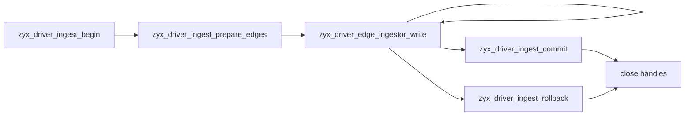

# Driver ABI Arrow Ingest

Driver ABI 1.1 adds a prepared, transactional ingest path based on the Arrow C Data Interface. ZYX only uses the stable `ArrowSchema` and `ArrowArray` ABI declarations and does not require the Apache Arrow runtime.

## Input Schema

Each prepared relationship ingestor accepts one schema:

```text
struct<
  source_id: int64 not null,
  target_id: int64 not null,
  properties: struct<...>
>
```

The relationship type is supplied separately when the ingestor is prepared. Property fields may use Arrow Boolean, signed or unsigned integer, Float32, Float64, UTF-8, List, FixedSizeList, Struct, Map, and Dictionary layouts. Input array buffers remain owned by the caller and only need to remain valid during `zyx_driver_edge_ingestor_write()`.

Map keys must be non-null UTF-8 values and unique within each row. Dictionary encoding is accepted for any supported property type, including map keys.

The caller must still provide physically valid buffers of the sizes implied by the Arrow metadata. The C Data Interface does not carry allocation byte lengths, so no consumer can prove that a raw buffer pointer has enough backing memory.

## Lifecycle



An ingest session owns a bulk write transaction. Commit is WAL-durable while the main database checkpoint may be deferred until `zyx_driver_db_save()` or clean close. Closing an active session rolls it back.

A write failure poisons the complete session. It cannot be committed afterward and must be rolled back or closed. Schema preparation errors happen before a writer is created and do not poison the session.

## Generated IDs

Bulk edge IDs are allocated as one contiguous range. On success, `zyx_driver_id_range_t` contains `first_id` and `count`; input row `i` maps to `first_id + i`. Pass `NULL` for the result when generated IDs are not needed.

## Error Location

Bulk errors can include a zero-based input row and a field path:

```c
int64_t row = zyx_driver_error_row_index(error);
const char *field = zyx_driver_error_field_path(error);
```

`row` is `-1` and `field` is empty when the error is not tied to a particular input value.

## Batch Sizing

Use multiple Arrow record batches in one prepared ingestor instead of one unbounded array. Start with batches in the 32–128 MiB range and tune using application data. The schema and relationship type are compiled once and reused across all batches in the session.

One batch may contain at most 10,000,000 rows and may materialize at most 512 MiB inside the Arrow adapter. A prepared schema may contain at most 4,096 fields across all nesting levels, use at most 1 MiB of copied schema text, and be nested at most 64 levels. Limit violations return `ZYX_DRIVER_OUT_OF_RANGE` before graph writes begin.

The write path decodes Arrow values directly into storage-native property columns. It does not build row maps or an intermediate public `zyx::Value` graph. Endpoint validation also runs before ID allocation, so malformed batches fail without creating partial ID ranges.

The browser Playground intentionally does not export write-side ingest symbols; it continues to use read-only Driver ABI transactions.
