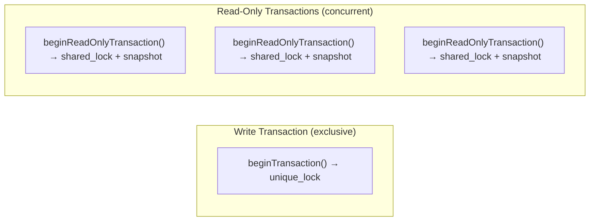

# Transaction API

ZYX supports three ways to use transactions.

## 1. API-Level Explicit Transactions

### Write Transaction

```cpp
zyx::Database db("/path/to/db");

auto tx = db.beginTransaction();

tx.execute("CREATE (n:Person {name: 'Alice'})");
tx.execute("CREATE (n:Person {name: 'Bob'})");
tx.execute(
    "MATCH (a:Person {name: 'Alice'}), (b:Person {name: 'Bob'}) "
    "CREATE (a)-[:KNOWS]->(b)");

tx.commit();
```

The `Transaction` object is **move-only**. If it is destroyed while still active (e.g., by going out of scope), it automatically rolls back.

```cpp
{
    auto tx = db.beginTransaction();
    tx.execute("CREATE (n:Person {name: 'Charlie'})");
    // No commit — tx goes out of scope, auto-rollback
}
```

### Read-Only Transaction

```cpp
auto roTx = db.beginReadOnlyTransaction();

auto result = roTx.execute("MATCH (n:Person) RETURN n.name");
while (result.hasNext()) {
    // Read data with snapshot consistency
    result.next();
}
// roTx auto-rolls back on destruction (read-only rollback is a no-op)
```

Read-only transactions:

- Acquire a **shared lock** — multiple read-only transactions can run concurrently.
- Receive an immutable **snapshot** of the database at the time they begin.
- Cannot execute write operations (enforced at three layers: exec mode, plan flags, data manager guard).

### Transaction Methods

| Method | Signature | Description |
|--------|-----------|-------------|
| `execute` | `Result execute(const string& cypher) const` | Execute a Cypher query within this transaction. |
| `execute` | `Result execute(const string& cypher, const unordered_map<string, Value>& params) const` | Execute a parameterized Cypher query. |
| `commit` | `void commit()` | Commit all changes. After this, `isActive()` returns `false`. |
| `rollback` | `void rollback()` | Roll back all changes. |
| `isActive` | `bool isActive() const` | Whether the transaction is still in progress. |
| `isReadOnly` | `bool isReadOnly() const` | Whether this is a read-only transaction. |

## 2. Cypher Transaction Statements

`BEGIN`, `COMMIT`, and `ROLLBACK` can be issued directly as Cypher:

```cpp
db.execute("BEGIN");
db.execute("CREATE (n:Person {name: 'Alice'})");
db.execute("CREATE (n:Person {name: 'Bob'})");
db.execute("COMMIT");
```

This is convenient for CLI and scripting use cases. Nested transactions are not supported.

## 3. Implicit Transactions

When no explicit transaction is active, `Database::execute()` handles transactions automatically:

- **Read queries** — Execute via a read-only fast path (no write lock, no WAL overhead).
- **Write queries** — Auto-wrapped in a single-statement transaction that commits immediately.

```cpp
// This auto-commmits — no explicit beginTransaction() needed
db.execute("CREATE (n:Person {name: 'Alice'})");

// This uses the read-only fast path
auto result = db.execute("MATCH (n:Person) RETURN n.name");
```

## Concurrency Model



- Only **one write transaction** can be active at a time (`std::shared_mutex` exclusive lock).
- **Multiple read-only transactions** can run concurrently with each other.
- Read-only transactions see a consistent snapshot from the moment they began.

## Error Handling Pattern

```cpp
auto tx = db.beginTransaction();
try {
    tx.execute("CREATE (n:Person {name: 'Alice'})");
    tx.execute("CREATE (n:Person {name: 'Bob'})");
    tx.commit();
} catch (const std::exception& e) {
    // Transaction is automatically rolled back by tx's destructor
    std::cerr << "Transaction failed: " << e.what() << std::endl;
}
```

Methods that can throw:

| Method | Throws on |
|--------|-----------|
| `beginTransaction()` | Storage I/O failure, another write transaction is active |
| `commit()` | WAL sync failure, storage flush failure |
| `execute()` | Parse errors (returned as failed `Result`, not thrown) |

Query execution errors are captured in the `Result` — check `result.isSuccess()` and `result.getError()` rather than relying on exceptions.

## Source Locations

| Component | Path |
|-----------|------|
| Transaction | `include/graph/core/Transaction.hpp` |
| TransactionManager | `include/graph/core/TransactionManager.hpp` |
| Database API | `src/api/DatabaseImpl.cpp` |
