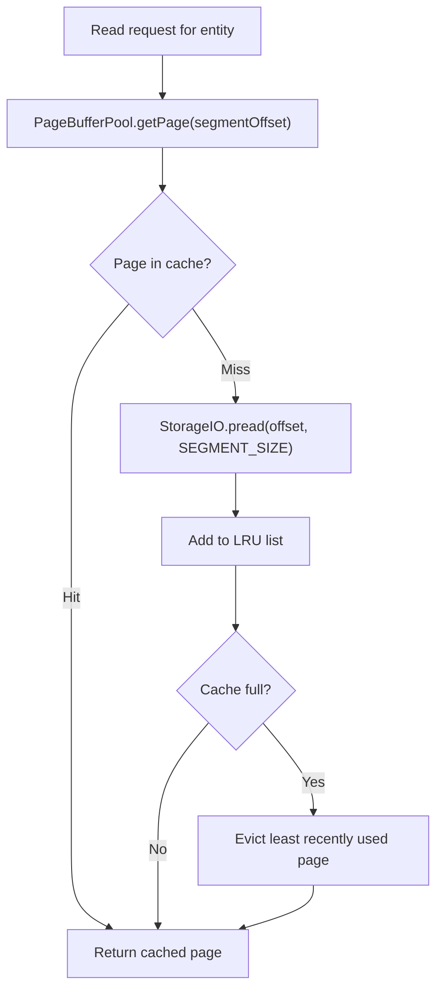
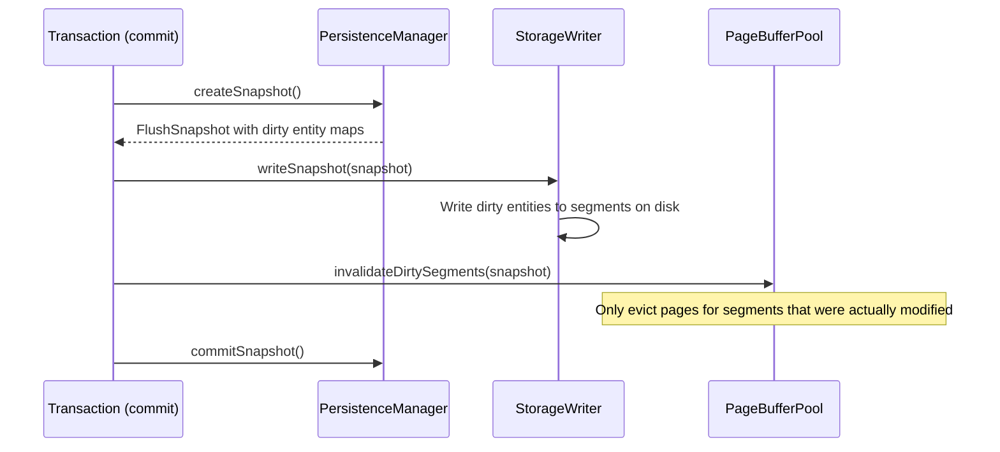
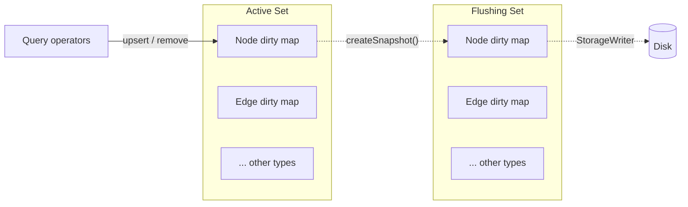

# Cache Management

Caching in ZYX is not a single module — it is a coordinated effort across multiple components:

- **PageBufferPool** — A unified LRU cache operating at the segment level (128 KB per page).
- **DirtyEntityRegistry** — Per-entity-type dirty tracking within `PersistenceManager`.
- **Component-internal caches** — For example, `VectorIndexRegistry` maintains its own cache for vector index structures.

## Design Goals

1. Reduce repeated disk reads for hot segments.
2. Contain write amplification within transaction boundaries.
3. Keep batch write memory usage bounded.

## PageBufferPool

`PageBufferPool` is a segment-level LRU cache shared across all entity types. It stores complete segments (128 KB each) rather than individual entities, which amortizes the overhead of disk seeks.

**Key characteristics:**

- **Thread-safe** — Protected by `std::shared_mutex`; concurrent reads are allowed.
- **Statistics** — Tracks `hits` and `misses` atomically for monitoring.
- **Configurable capacity** — Set at construction time as a number of pages.

## Cache Invalidation

Invalidation is targeted, not wholesale:

After `StorageWriter` flushes dirty entities to disk, `invalidateDirtySegments()` removes only the pages belonging to modified segments. This avoids clearing the entire cache on every commit, preserving hot data that was not part of the transaction.

## Dirty Entity Tracking

`PersistenceManager` maintains six `DirtyEntityRegistry` instances — one per entity type (Node, Edge, Property, Blob, Index, State).

### Double-Buffered Design

When `createSnapshot()` is called:

1. The current active dirty maps are captured into a `FlushSnapshot`.
2. Fresh, empty maps are swapped in as the new active set.
3. New writes from subsequent operations go into the active set without blocking the flush.
4. After `StorageWriter` finishes writing the snapshot to disk, `commitSnapshot()` clears the flushing set.

This double-buffer ensures that read operations can still serve data from the flushing set while the flush is in progress.

### Auto-Flush

`PersistenceManager` monitors the total dirty entity count across all types. When it exceeds a configurable threshold (default 10,000), it invokes a registered callback to trigger an automatic flush. This prevents unbounded memory growth during long-running write transactions.

## Source Locations

| Component | Path |
|-----------|------|
| PageBufferPool | `include/graph/storage/PageBufferPool.hpp` |
| PersistenceManager | `include/graph/storage/PersistenceManager.hpp` |
| DirtyEntityRegistry | `include/graph/storage/DirtyEntityRegistry.hpp` |
| VectorIndexRegistry | `include/graph/vector/VectorIndexRegistry.hpp` |
