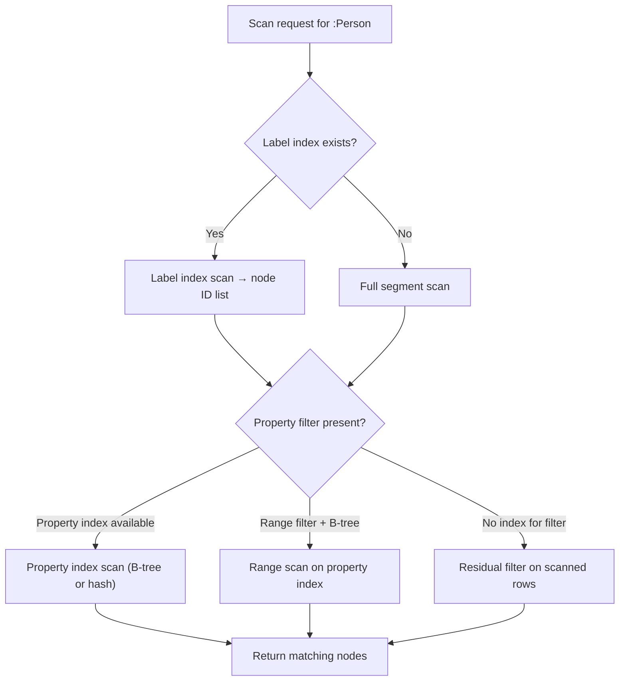

# Optimization Strategies

Performance optimization in ZYX occurs at three layers: logical optimization, physical execution strategy, and storage I/O path.

## Logical Optimization Rules

The optimizer applies rules in a fixed order, iterating until the plan converges or a maximum iteration count is reached:

| Rule | Effect |
|------|--------|
| **PredicateSimplification** | Simplifies boolean expressions (e.g., `true AND x` → `x`, `x OR true` → `true`) |
| **FilterPushdown** | Moves filter predicates closer to scan operators, reducing the number of rows processed downstream |
| **ProjectionPushdown** | Removes columns that are never used in later operators, reducing tuple width |
| **EnhancedIndexSelection** | Evaluates available indexes and selects the most selective one for each scan |
| **JoinReorder** | Reorders join operations to minimize intermediate result sizes |

## Scan Strategy Selection

When `NodeScanOperator` executes, it evaluates available indexes and statistics to choose the optimal access path:

Conditions not absorbed by the chosen index are applied as **residual filters** after the scan.

## Execution-Layer Techniques

### Multi-Label Filtering

When a query specifies multiple labels (e.g., `MATCH (n:A:B)`), the scan operator selects the label with the smallest cardinality as the primary index lookup, then applies the remaining labels as residual filters.

### Batch Entity Loading

`DataManager.bulkLoadEntities()` reads entire segment chains in sequential order, which is significantly faster than per-entity random access. This is used internally during index building and recovery.

### Vector Query Optimization

Vector similarity queries use dedicated operators (`VectorSearchOperator`) that leverage the HNSW index structure for approximate nearest neighbor search, avoiding full-database scans.

### Parallel Execution

When a thread pool is configured, certain operations (parallel segment scans, index building) can distribute work across multiple threads.

## Storage I/O Optimization

### StorageIO Abstraction

`StorageIO` uses platform-native `pread`/`pwrite` syscalls where available (Linux, macOS), falling back to `fstream` seek on platforms without native support. The dual file descriptor model (separate read/write handles) enables concurrent reads without blocking writes.

### PageBufferPool

The segment-level LRU cache avoids redundant disk reads for hot segments. Targeted invalidation (`invalidateDirtySegments`) after flush preserves cache entries for unmodified segments.

### WAL Group Commit

Multiple transaction commits are batched into a single `fsync` call, reducing the most expensive I/O operation from per-transaction to per-group. The default group window is 1 millisecond.

## Source Locations

| Component | Path |
|-----------|------|
| Optimizer | `src/query/optimizer/Optimizer.cpp` |
| Optimizer rules | `include/graph/query/optimizer/Optimizer.hpp` |
| PhysicalPlanConverter | `src/query/planner/PhysicalPlanConverter.cpp` |
| StorageIO | `include/graph/storage/StorageIO.hpp` |
| PageBufferPool | `include/graph/storage/PageBufferPool.hpp` |
