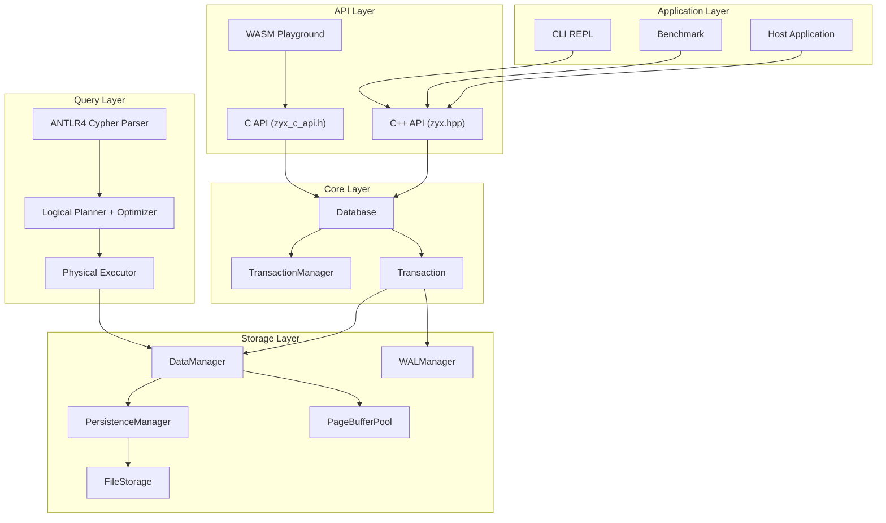
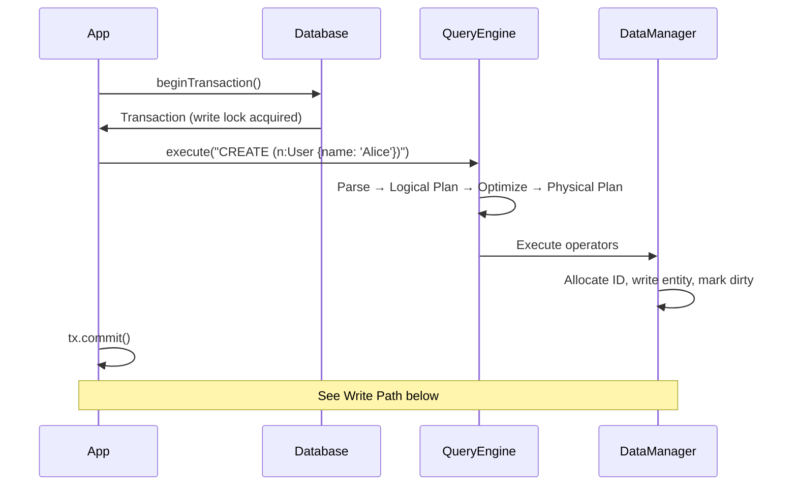
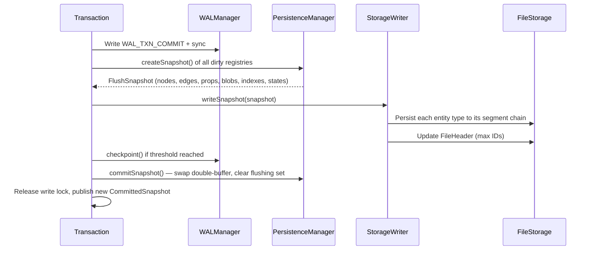
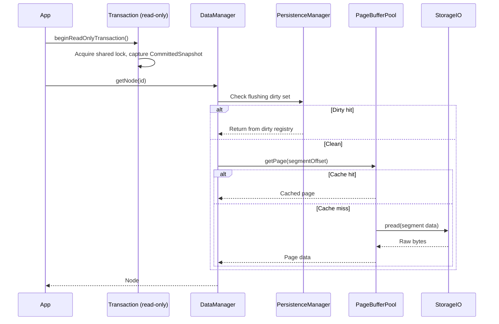

# Architecture Overview

ZYX is an embeddable graph database engine. Its core is an in-process library — no separate server process is required.

## Layered Architecture

**Layer responsibilities:**

- **Application Layer** — CLI tool, benchmark suite, and host applications that embed ZYX.
- **API Layer** — C++ API (`zyx.hpp`), C API (`zyx_c_api.h`), and WASM bindings for browser use.
- **Query Layer** — Cypher text is parsed, planned, optimized, and executed as a pipeline of physical operators.
- **Storage Layer** — `DataManager` orchestrates entity read/write, `PersistenceManager` tracks dirty entities, `FileStorage` manages the segment-based file, `WALManager` handles write-ahead logging, and `PageBufferPool` provides an LRU segment cache.
- **Core Layer** — `Database` is the top-level entry point; `TransactionManager` enforces single-writer/multi-reader concurrency; `Transaction` provides the external handle.

## Key Objects

| Object | Responsibility | Source |
|--------|---------------|--------|
| `graph::Database` | Lifecycle management, lazy initialization of QueryEngine / ThreadPool / WAL | `include/graph/core/Database.hpp` |
| `graph::query::QueryEngine` | Cypher parsing, plan building, and execution | `include/graph/query/api/QueryEngine.hpp` |
| `graph::storage::FileStorage` | Segment-based file layout, flush/save coordination | `include/graph/storage/FileStorage.hpp` |
| `graph::storage::DataManager` | Unified entry point for Node / Edge / Property / Blob / Index / State I/O | `include/graph/storage/data/DataManager.hpp` |
| `TransactionManager` | Single-writer lock, snapshot management, commit / rollback coordination | `include/graph/core/TransactionManager.hpp` |

## Main Execution Paths

### Query Path

### Write Path (commit)

### Read Path

## Design Principles

1. **Embeddable first** — ZYX is a library, not a server. Link directly into your process.
2. **Single-writer / multi-reader** — `std::shared_mutex` gives exclusive write access while allowing concurrent reads.
3. **Segment-based storage** — Fixed-size (128 KB) segments with linked-list chains per entity type.
4. **Lazy initialization** — `QueryEngine`, `ThreadPool`, and `WAL` are created only when first accessed, keeping startup fast.
5. **Double-buffered dirty tracking** — `PersistenceManager` maintains active and flushing dirty maps so reads can proceed during I/O.

## Source Locations

| Component | Header | Implementation |
|-----------|--------|----------------|
| Database | `include/graph/core/Database.hpp` | `src/core/Database.cpp` |
| QueryEngine | `include/graph/query/api/QueryEngine.hpp` | `src/query/` |
| FileStorage | `include/graph/storage/FileStorage.hpp` | `src/storage/` |
| TransactionManager | `include/graph/core/TransactionManager.hpp` | `src/core/TransactionManager.cpp` |
| WAL | `include/graph/storage/wal/WALManager.hpp` | `src/storage/wal/` |
