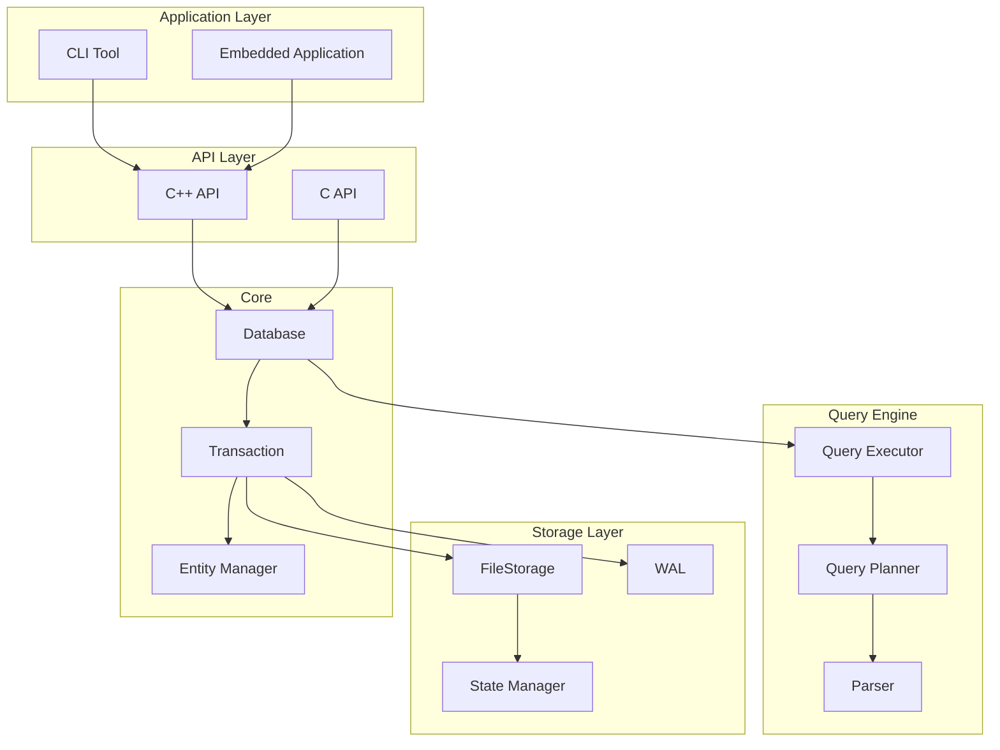
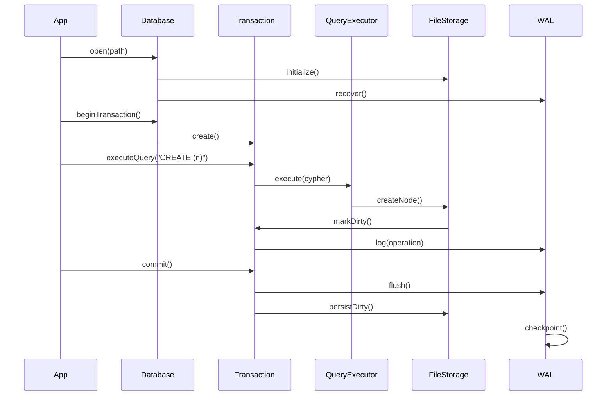

# Architecture Overview

ZYX is a high-performance, embeddable graph database built on a custom storage engine with segment-based architecture.

## System Architecture



**Architecture Layers:**
- **Application Layer**: CLI tool and embedded applications
- **API Layer**: C++ and C APIs for integration
- **Query Engine**: ANTLR4 parser, query planner, and executor
- **Storage Layer**: FileStorage, WAL, and state management
- **Core**: Database, transaction, and entity management

## Key Design Principles

### 1. Embeddable First
ZYX is designed as a library, not a server. Embed directly into your C++ application without external dependencies.

### 2. ACID Compliance
Full transaction support with optimistic concurrency control and Write-Ahead Logging ensures data integrity.

### 3. Custom Storage Engine
Segment-based file format optimized for graph workloads with efficient space management and fast access patterns.

### 4. Extensible
Plugin-based architecture for custom indexes and operators.

## Component Overview

| Component | Description | Location |
|-----------|-------------|----------|
| **Database** | Main entry point, lifecycle management | `graph/core/Database.hpp` |
| **FileStorage** | Segment-based file storage | `graph/storage/FileStorage.hpp` |
| **QueryEngine** | Cypher query execution | `graph/query/QueryEngine.hpp` |
| **Transaction** | ACID transaction management | `graph/core/Transaction.hpp` |
| **WAL** | Write-Ahead Logging | `graph/storage/WAL.hpp` |

## Data Flow



### Flow Explanation

1. **Database Open**: `Database::open()` initializes all storage components
2. **Transaction Start**: Creates isolated context for operations
3. **Query Execution**: Parsed, planned, and executed through operators
4. **Write Operations**: Logged to WAL first, then applied to storage
5. **Commit**: WAL flushed, dirty entities persisted, checkpoint triggered

## Layered Architecture

```
Applications (CLI, Benchmark)
         ↓
   Public API (C++ & C)
         ↓
   Query Engine (Parser → Planner → Executor)
         ↓
   Storage Layer (FileStorage, WAL, State Management)
         ↓
   Core (Database, Transaction, Entity Management)
```

### Application Layer

- **CLI Tool**: Interactive REPL for executing Cypher queries
- **Embedded Applications**: Custom applications using ZYX as a library
- **Benchmark**: Performance testing suite

### API Layer

- **C++ API**: Modern C++20 interface with RAII and type safety
- **C API**: C-compatible interface for FFI bindings
- **Types**: Value system supporting various data types

### Query Engine

- **Parser**: ANTLR4-based Cypher parser with full language support
- **Planner**: Converts parsed Cypher to logical plans with optimization
- **Executor**: Executes physical plans with efficient operators

### Storage Layer

- **FileStorage**: Segment-based file format with compression
- **WAL**: Write-Ahead Logging for durability
- **State Manager**: Version tracking and rollback support

### Core

- **Database**: Lifecycle management and coordination
- **Transaction**: ACID properties and isolation
- **Entity Manager**: Node and relationship management

## Technology Stack

### C++20 Features

ZYX leverages modern C++20 features:

- **Concepts**: Type constraints for template parameters
- **Coroutines**: Efficient async operations (future)
- **Modules**: Faster compilation times (planned)
- **Ranges**: Functional data processing

### Dependencies

| Dependency | Purpose | Version |
|------------|---------|---------|
| **Boost** | Filesystem, system utilities | Latest |
| **zlib** | Compression | 1.2+ |
| **ANTLR4** | Parser generation | 4.13.1 |
| **GoogleTest** | Testing framework | Latest |

## Performance Characteristics

| Operation | Complexity | Notes |
|-----------|------------|-------|
| Create Node | O(1) | Direct segment allocation |
| Create Edge | O(1) | Link to existing nodes |
| Lookup by ID | O(1) | Direct offset calculation |
| Label Scan | O(n) | Scan all nodes with label |
| Property Query | O(1) | With index |
| Property Query | O(n) | Without index |

## Memory Management

### Stack and Heap Allocation

- **Stack**: Small objects, frequent allocations
- **Pool**: Custom allocators for entities
- **Arena**: Temporary query execution data

### Cache Strategy

- **LRU Cache**: Hot entities cached in memory
- **Dirty Tracking**: Modified entities tracked for persistence
- **Eviction Policy**: Configurable cache size limits

## Concurrency Model

### Optimistic Concurrency Control

- **Versioning**: Each entity has a version number
- **Conflict Detection**: Detect concurrent modifications
- **Retry Strategy**: Automatic retry on conflicts

### Isolation Levels

- **Read Committed**: Default isolation level
- **Serializable**: Full isolation (planned)
- **Snapshot Consistency**: Per-transaction views

## Error Handling

### Exception Safety

- **Basic Guarantee**: No resource leaks
- **Strong Guarantee**: Rollback on errors
- **Noexcept**: Critical operations don't throw

### Error Types

- **StorageError**: Disk I/O failures
- **TransactionError**: Transaction conflicts
- **QueryError**: Invalid Cypher syntax
- **ConstraintError**: Violation of constraints

## Extensibility Points

### Custom Indexes

Implement the `Index` interface for custom indexing strategies:

```cpp
class CustomIndex : public Index {
    // Implementation
};
```

### Custom Operators

Extend `Operator` for custom query operations:

```cpp
class CustomOperator : public Operator {
    // Implementation
};
```

### Storage Plugins

Implement storage backend interface for alternative storage:

```cpp
class CustomStorage : public IStorageBackend {
    // Implementation
};
```

## Next Steps

- [Storage System](/en/docs/zyx/architecture/storage) - Deep dive into storage architecture
- [Query Engine](/en/docs/zyx/architecture/query-engine) - How queries are executed
- [Transactions](/en/docs/zyx/architecture/transactions) - Transaction management details
