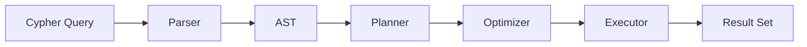
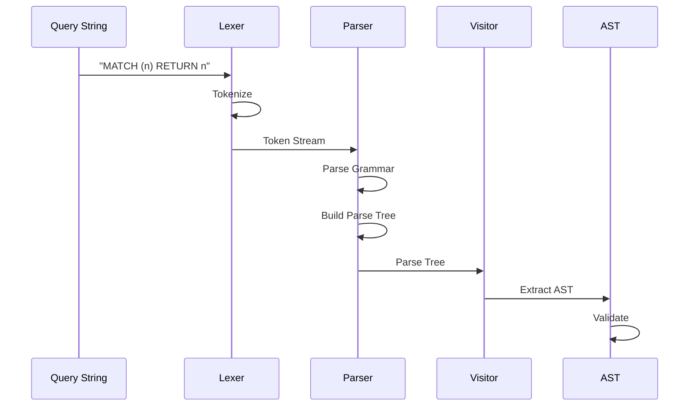
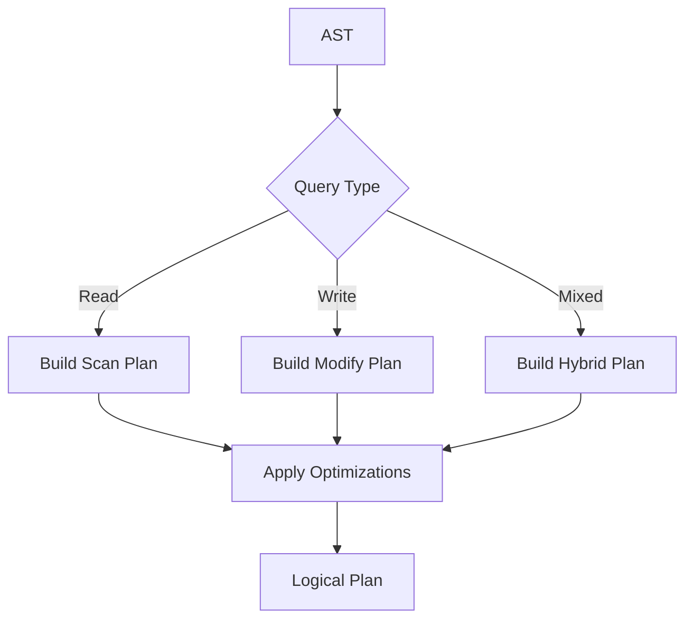
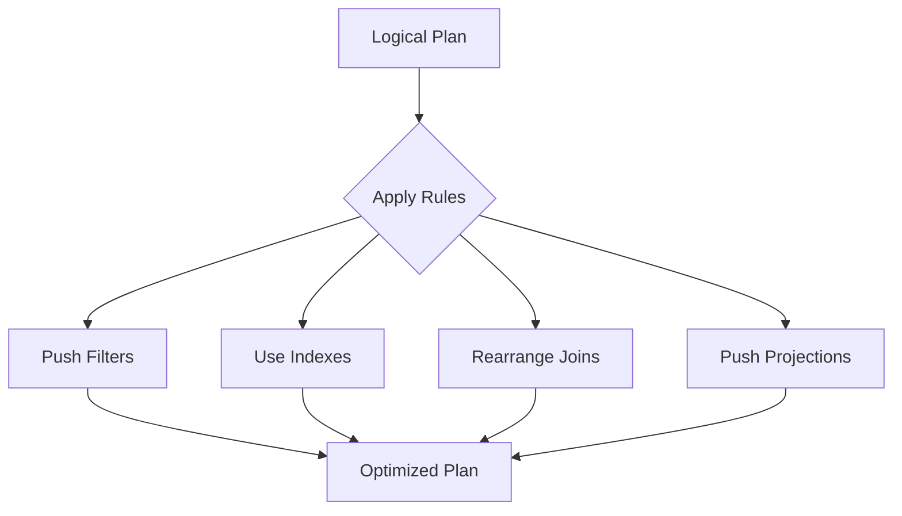
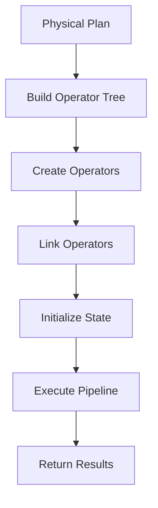
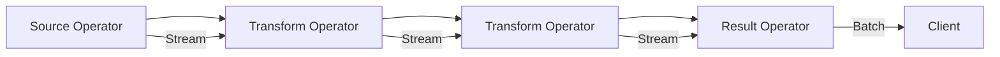

# Query Engine

The ZYX Query Engine processes Cypher queries through a three-stage pipeline: Parser → Planner → Executor.

## Query Pipeline



**Query Pipeline Stages:**
- Parser: ANTLR4-based Cypher parser
- AST: Abstract Syntax Tree
- Planner: Creates logical plan
- Optimizer: Generates physical plan
- Executor: Executes operators
- Result Set: Query results

## Parser

The parser converts Cypher query text into an Abstract Syntax Tree (AST).

### ANTLR4 Grammar

ZYX uses ANTLR4 to generate the parser from grammar files:

- **CypherLexer.g4**: Token definitions
- **CypherParser.g4**: Grammar rules
- **Generated Code**: C++ parser and visitor classes

### Parsing Process



### AST Structure

```cpp
struct Query {
    std::vector<Clause*> clauses;

    // Clauses can be:
    // - MatchClause
    // - CreateClause
    // - ReturnClause
    // - WhereClause
    // - WithClause
    // etc.
};
```

### Supported Cypher Features

::: info Full Cypher Support
ZYX supports the complete Cypher query language with minor exceptions. See the project root directory for details.
:::

**Reading Clauses**:
- `MATCH`: Pattern matching
- `WHERE`: Filtering conditions
- `RETURN`: Result projection
- `ORDER BY`: Sorting
- `LIMIT`/`SKIP`: Pagination
- `WITH`: Query chaining

**Writing Clauses**:
- `CREATE`: Create nodes and relationships
- `MERGE`: Create if not exists
- `DELETE`: Remove nodes/relationships
- `SET`: Update properties
- `REMOVE`: Delete properties

**Clauses Handlers**:
- Located in `src/query/parser/cypher/clauses/`
- Each clause has a dedicated handler class
- Implements visitor pattern for AST traversal

## Query Planner

The planner converts the AST into an optimized logical plan.

### Logical Planning



### Planning Steps

1. **Clause Analysis**: Identify query type and clauses
2. **Pattern Extraction**: Extract graph patterns from MATCH
3. **Plan Building**: Create logical operators
4. **Optimization**: Apply rule-based optimizations

### Logical Operators

| Operator | Description |
|----------|-------------|
| **Scan** | Full table scan |
| **IndexScan** | Index-based lookup |
| **Filter** | Predicate evaluation |
| **Project** | Column selection |
| **Sort** | Ordering |
| **Limit** | Result limiting |
| **Join** | Pattern matching |
| **Aggregate** | Grouping and aggregation |

### Optimization Rules



**Rule Examples**:
- **Filter Pushdown**: Move filters closer to data source
- **Index Selection**: Use indexes when available
- **Join Reordering**: Optimal join order
- **Projection Pruning**: Remove unused columns

## Query Executor

The executor executes the physical plan using efficient operators.

### Physical Operators



### Operator Types

#### Scan Operators

**NodeScanOperator**
```cpp
class NodeScanOperator : public Operator {
    // Scans all nodes with optional label filter
    ResultSet execute() override;
};
```

**EdgeScanOperator**
```cpp
class EdgeScanOperator : public Operator {
    // Scans all edges with optional type filter
    ResultSet execute() override;
};
```

**IndexScanOperator**
```cpp
class IndexScanOperator : public Operator {
    // Uses index for efficient lookup
    ResultSet execute() override;
};
```

#### Modification Operators

**CreateNodeOperator**
```cpp
class CreateNodeOperator : public Operator {
    // Creates new nodes with labels and properties
    ResultSet execute() override;
};
```

**CreateEdgeOperator**
```cpp
class CreateEdgeOperator : public Operator {
    // Creates relationships between nodes
    ResultSet execute() override;
};
```

**DeleteOperator**
```cpp
class DeleteOperator : public Operator {
    // Deletes nodes and relationships
    ResultSet execute() override;
};
```

**MergeNodeOperator**
```cpp
class MergeNodeOperator : public Operator {
    // Creates node if it doesn't exist
    ResultSet execute() override;
};
```

#### Query Operators

**FilterOperator**
```cpp
class FilterOperator : public Operator {
    // Evaluates WHERE clause predicates
    ResultSet execute() override;
};
```

**ProjectOperator**
```cpp
class ProjectOperator : public Operator {
    // Selects and renames columns
    ResultSet execute() override;
};
```

**SortOperator**
```cpp
class SortOperator : public Operator {
    // Implements ORDER BY
    ResultSet execute() override;
};
```

**AggregateOperator**
```cpp
class AggregateOperator : public Operator {
    // Implements GROUP BY and aggregations
    ResultSet execute() override;
};
```

#### Special Operators

**VectorSearchOperator**
```cpp
class VectorSearchOperator : public Operator {
    // Performs vector similarity search
    ResultSet execute() override;
};
```

**TrainVectorIndexOperator**
```cpp
class TrainVectorIndexOperator : public Operator {
    // Trains vector index for faster searches
    ResultSet execute() override;
};
```

### Operator Execution Model



**Pipeline Execution**:
- **Streaming**: Operators pass data through pipeline
- **Lazy Evaluation**: Process only requested rows
- **Batch Processing**: Efficient batch sizes

### Execution Example

Query:
```cypher
MATCH (u:User)
WHERE u.age > 25
RETURN u.name, u.age
ORDER BY u.age DESC
LIMIT 5
```

Execution Plan:
```
1. NodeScanOperator (label: User)
   ↓
2. FilterOperator (u.age > 25)
   ↓
3. ProjectOperator (u.name, u.age)
   ↓
4. SortOperator (u.age DESC)
   ↓
5. LimitOperator (5)
   ↓
6. Result
```

## Expression Evaluation

### Expression Types

- **Literals**: Numbers, strings, booleans
- **Variables**: Query variables (n, r, etc.)
- **Properties**: Property access (n.name)
- **Operators**: Arithmetic, comparison, logical
- **Functions**: Built-in functions

### Expression Evaluator

```cpp
class ExpressionEvaluator {
public:
    Value evaluate(const Expression* expr, const Context& ctx);

private:
    Value evaluateLiteral(const Literal* expr);
    Value evaluateVariable(const Variable* expr);
    Value evaluateProperty(const Property* expr);
    Value evaluateBinaryOp(const BinaryOp* expr);
    Value evaluateFunction(const Function* expr);
};
```

## Result Processing

### ResultSet

```cpp
class ResultSet {
private:
    std::vector<std::string> columns_;
    std::vector<std::vector<Value>> rows_;

public:
    void addColumn(const std::string& name);
    void addRow(const std::vector<Value>& values);
    Value getValue(size_t row, size_t col) const;
};
```

### Value Types

| Type | Description | Example |
|------|-------------|---------|
| **Null** | Null value | `null` |
| **Boolean** | True/false | `true`, `false` |
| **Integer** | 64-bit integer | `42` |
| **Float** | Double precision | `3.14` |
| **String** | UTF-8 string | `"hello"` |
| **List** | Array of values | `[1, 2, 3]` |
| **Node** | Graph node | `(n:User)` |
| **Edge** | Graph edge | `-(n:KNOWS)->` |

## Performance Optimization

### Query Performance Tips

1. **Use Indexes**: Create indexes on frequently queried properties
2. **Filter Early**: Apply filters in WHERE clause
3. **Limit Results**: Use LIMIT to avoid large result sets
4. **Avoid Cross Products**: Ensure patterns are connected
5. **Use PROFILE**: Analyze query execution plan

### Query Profiling

```cypher
PROFILE MATCH (u:User)
WHERE u.age > 25
RETURN u.name, u.age
```

Output includes:
- Operator execution time
- Rows processed per operator
- Memory usage

### Common Patterns

#### Efficient Pattern Matching

```cypher
# Good - Uses index
MATCH (u:User {id: 123}) RETURN u

# Avoid - Full scan
MATCH (u:User) WHERE u.id = 123 RETURN u
```

#### Efficient Filtering

```cypher
# Good - Filter early
MATCH (u:User)
WHERE u.age > 25 AND u.city = 'NYC'
RETURN u

# Avoid - Filter late
MATCH (u:User)
RETURN u
WHERE u.age > 25 AND u.city = 'NYC'
```

## Vector Index Support

ZYX supports vector indexes for similarity search:

### Creating Vector Index

```cypher
CALL vector.create_index('embedding', 1536)
```

### Vector Search

```cypher
CALL vector.search('embedding', [0.1, 0.2, ...], 10)
YIELD node, score
RETURN node.name, score
```

### Training Index

```cypher
CALL vector.train_index('embedding')
```

## Extension Points

### Custom Operators

Implement custom operators for specialized operations:

```cpp
class CustomOperator : public Operator {
public:
    ResultSet execute() override {
        // Custom logic
    }
};
```

### Custom Functions

Add custom Cypher functions:

```cpp
class CustomFunction : public Function {
public:
    Value execute(const std::vector<Value>& args) override {
        // Function implementation
    }
};
```

## Next Steps

- [Transactions](/en/zyx/architecture/transactions) - Transaction management
- [Storage System](/en/zyx/architecture/storage) - How data is stored
- [API Reference](/en/zyx/api/cpp-api) - Programmatic query execution
