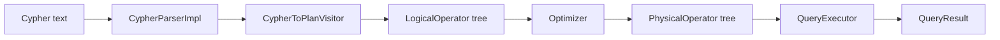
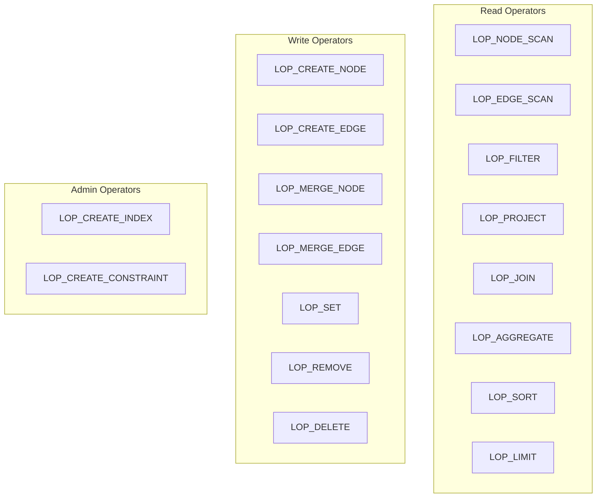
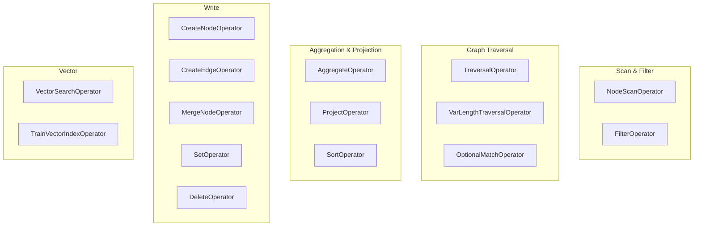
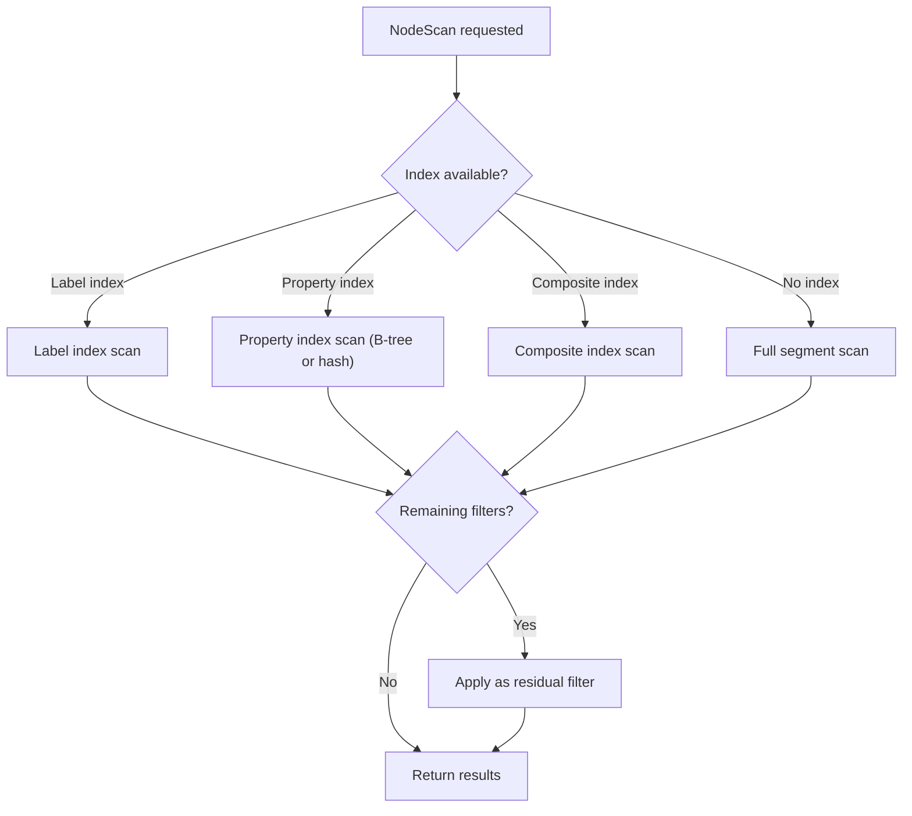

# Query Engine

The query engine is a four-stage pipeline: **Parse → Logical Plan → Optimize → Physical Execution**.

## Pipeline Overview

`QueryEngine` coordinates the entire pipeline. It holds a `QueryPlanner` for building logical plans, an `Optimizer` for rule-based optimization, and a `QueryExecutor` for running physical plans. A `PlanCache` is available for caching compiled plans.

## 1. Parsing

The parser is generated by ANTLR4 from the Cypher grammar:

- **Grammar**: `src/query/parser/cypher/generated/CypherParser.g4` and `CypherLexer.g4`
- **Entry point**: `CypherParserImpl` accepts a query string and produces a parse tree.
- **AST construction**: `CypherToPlanVisitor` walks the parse tree and directly builds a `LogicalOperator` tree — there is no separate AST intermediate representation.

Each Cypher clause has a dedicated handler in `src/query/parser/cypher/clauses/`, implementing the visitor pattern.

### Supported Cypher Clauses

**Reading**: `MATCH`, `OPTIONAL MATCH`, `UNWIND`, `CALL`

**Writing**: `CREATE`, `MERGE`, `SET`, `REMOVE`, `DELETE` / `DETACH DELETE`

**Result**: `RETURN`, `ORDER BY`, `SKIP`, `LIMIT`, `DISTINCT`

**Composition**: `WITH`, `UNION` / `UNION ALL`

**Administration**: Index and constraint DDL, `SHOW INDEX` / `SHOW CONSTRAINT`

**Transaction**: `BEGIN`, `COMMIT`, `ROLLBACK`

## 2. Logical Planning

All clauses are transformed into a tree of `LogicalOperator` nodes (defined in `include/graph/query/logical/LogicalOperator.hpp`).

Operators form a tree where data flows from leaf (scan) operators up through transformation (filter, project) and modification (create, delete) operators.

## 3. Optimization

The optimizer applies a fixed set of rules in order, iterating until convergence or a maximum iteration count:

| Rule | Effect |
|------|--------|
| `PredicateSimplificationRule` | Simplifies boolean expressions (e.g., `true AND x` → `x`) |
| `FilterPushdownRule` | Moves filters closer to data sources to reduce intermediate rows |
| `ProjectionPushdownRule` | Eliminates unused columns early in the pipeline |
| `EnhancedIndexSelectionRule` | Chooses the most selective available index for scan operations |
| `JoinReorderRule` | Reorders joins to minimize intermediate result size |

## 4. Physical Execution

`PhysicalPlanConverter` maps the optimized logical plan to a tree of `PhysicalOperator` instances, which `QueryExecutor` then runs.

### Key Physical Operators

### Scan Strategy Selection

When `NodeScanOperator` executes, it considers available indexes and statistics:

Conditions not absorbed by the chosen index become **residual filters** applied after the scan.

## Expression Evaluation

The expression evaluator handles:

- **Literals** — integers, floats, strings, booleans, null
- **Variables** — query-bound identifiers (`n`, `r`, etc.)
- **Property access** — `n.name`, `r.weight`
- **Binary/unary operators** — arithmetic, comparison, logical (`AND`, `OR`, `NOT`)
- **Function calls** — built-in functions (`count`, `sum`, `avg`, `min`, `max`, `collect`, etc.)

## Result Processing

`QueryResult` contains column names and rows of `Value` objects. Supported value types:

| Type | Description |
|------|-------------|
| Null | Absent value |
| Boolean | `true` / `false` |
| Integer | 64-bit signed integer |
| Float | Double-precision floating point |
| String | UTF-8 string |
| List | Ordered list of values |
| Node | Graph node reference |
| Edge | Graph edge reference |
| Path | Ordered sequence of nodes and edges |

## Source Locations

| Component | Path |
|-----------|------|
| CypherToPlanVisitor | `src/query/parser/cypher/CypherToPlanVisitor.cpp` |
| Clause handlers | `src/query/parser/cypher/clauses/` |
| Optimizer | `src/query/optimizer/Optimizer.cpp` |
| PhysicalPlanConverter | `src/query/planner/PhysicalPlanConverter.cpp` |
| QueryExecutor | `src/query/executor/` |
| LogicalOperator | `include/graph/query/logical/LogicalOperator.hpp` |
| QueryEngine | `include/graph/query/api/QueryEngine.hpp` |
