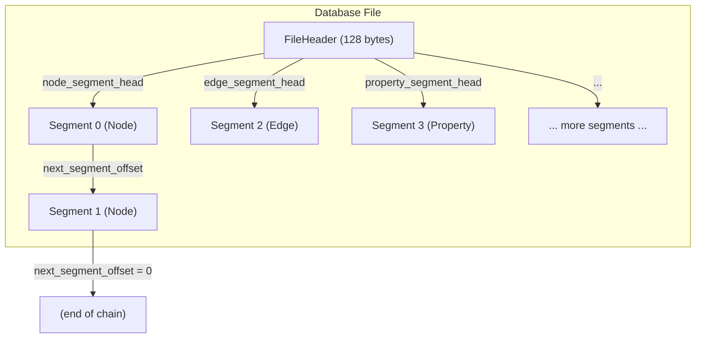
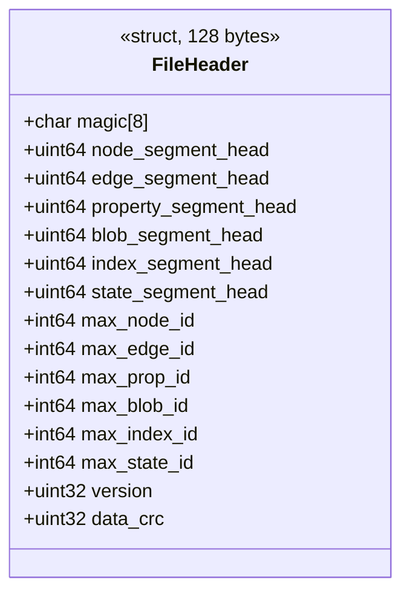
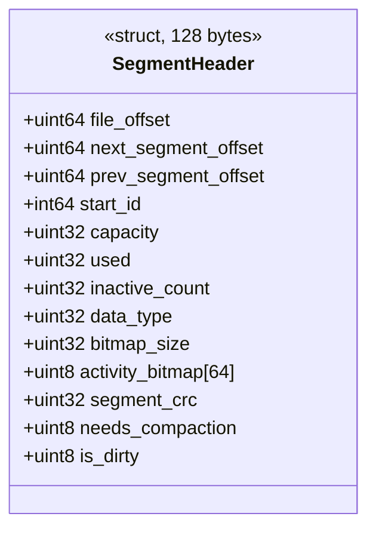
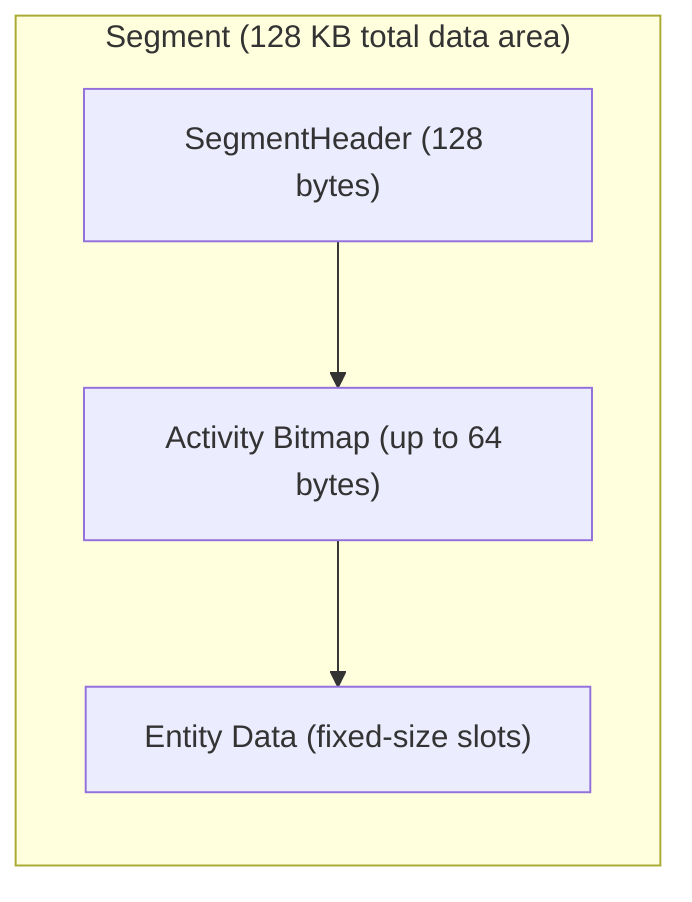
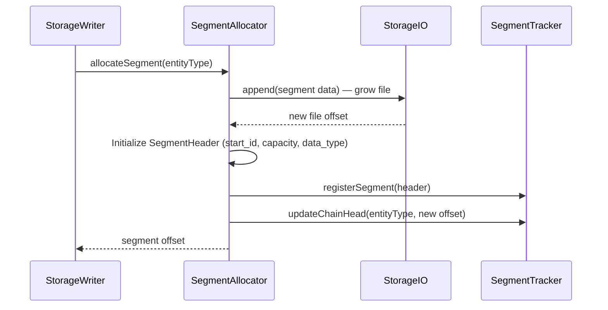
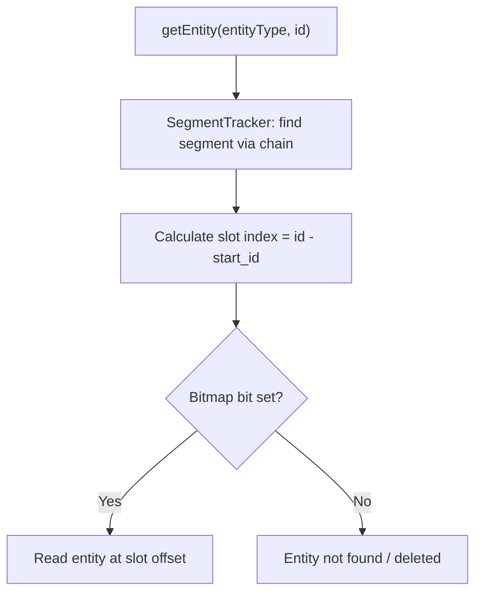

# Segment Format

The underlying storage format is defined in `StorageHeaders.hpp`. The database file is divided into fixed-size segments organized as linked-list chains, one per entity type.

## Constants

| Constant | Value | Description |
|----------|-------|-------------|
| `FILE_HEADER_MAGIC_STRING` | `<ZYX-DB>` | Magic string at file start |
| `STORAGE_PAGE_SIZE` | 4096 bytes | OS page size |
| `SEGMENT_SIZE` | 128 KB (32 pages) | Data area per segment |
| `FILE_HEADER_SIZE` | 128 bytes | File header size (alignment-padded) |
| `SEGMENT_HEADER_SIZE` | 128 bytes | Segment header size (alignment-padded) |
| `MAX_BITMAP_SIZE` | 64 bytes (512 bits) | Activity bitmap capacity |

The actual number of entities per segment depends on the entity type's fixed record size. Segment size constants may change between versions — always refer to the source headers for current values.

## File-Level Structure

Each entity type has its own independent linked list of segments. The `FileHeader` stores the head offset for each chain.

## FileHeader

| Field | Purpose |
|-------|---------|
| `magic` | Validation string: `<ZYX-DB>` |
| `*_segment_head` | File offset of the first segment in each entity type's chain (0 = empty) |
| `max_*_id` | Highest allocated ID for each entity type — used by `IDAllocator` on startup |
| `version` | File format version (currently 3) |
| `data_crc` | CRC32 checksum of the header contents |

## SegmentHeader

| Field | Purpose |
|-------|---------|
| `file_offset` | Self-referencing offset in the file |
| `next_segment_offset` | Next segment in the chain (0 = end) |
| `prev_segment_offset` | Previous segment in the chain (0 = head) |
| `start_id` | The entity ID of the first slot in this segment |
| `capacity` | Total number of entity slots |
| `used` | Number of slots currently occupied |
| `inactive_count` | Number of deleted (tombstoned) slots |
| `data_type` | Entity type stored in this segment |
| `activity_bitmap` | 512-bit bitmap — bit = 1 means slot is active |
| `segment_crc` | CRC32 of segment data for integrity checking |
| `needs_compaction` | Flag set when fragmentation exceeds threshold |
| `is_dirty` | Flag indicating unflushed modifications |

## Segment Internal Layout

Each segment stores entities in fixed-size slots. The slot size depends on the entity type. The activity bitmap tracks which slots are in use:

- Bit `i` = 1 → slot `i` is active (occupied by a live entity)
- Bit `i` = 0 → slot `i` is free (never used or tombstoned)

The bitmap enables:

- **Fast active/free counting** — Popcount on the bitmap gives the active count.
- **Fragmentation detection** — `inactive_count` tracks tombstoned slots. When `inactive_count / capacity` exceeds a threshold, the segment is flagged for compaction.
- **Entity lookup by ID** — Given an entity ID, `start_id` and the bitmap determine the slot index and whether the entity is active.

## Segment Chain Operations

### Allocating a New Segment

### Entity Lookup

## Checksums

Every segment carries a `segment_crc` field computed as CRC32 over the segment data (excluding the checksum field itself). During `FileStorage::verifyIntegrity()`, all segment checksums are validated to detect file corruption.

## Source Locations

| Component | Path |
|-----------|------|
| StorageHeaders | `include/graph/storage/StorageHeaders.hpp` |
| SegmentTracker | `include/graph/storage/SegmentTracker.hpp` |
| SegmentAllocator | `include/graph/storage/SegmentAllocator.hpp` |
