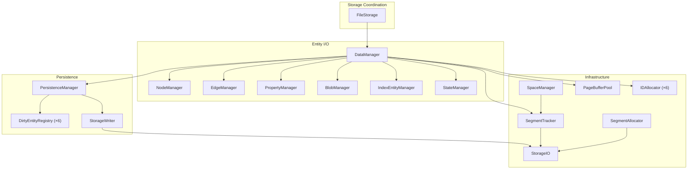
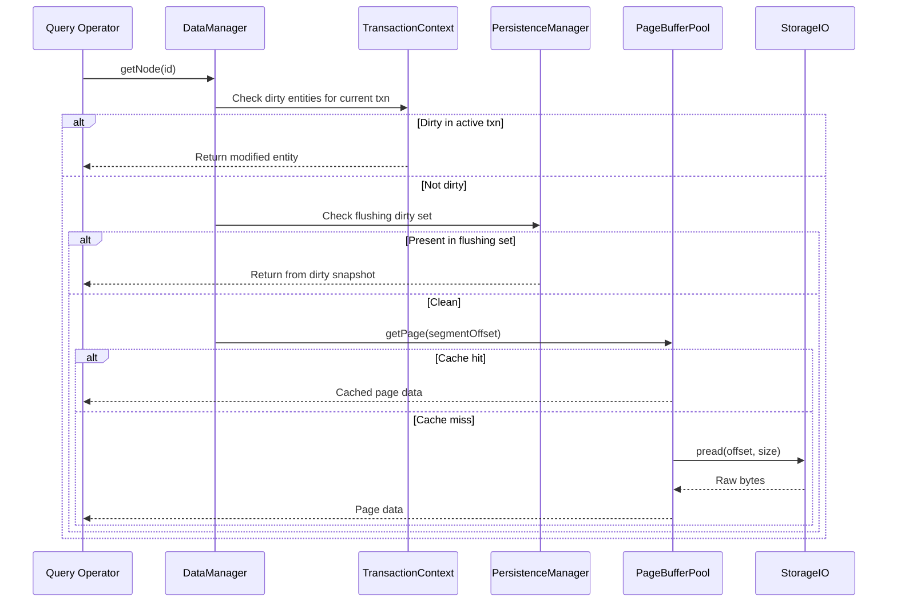
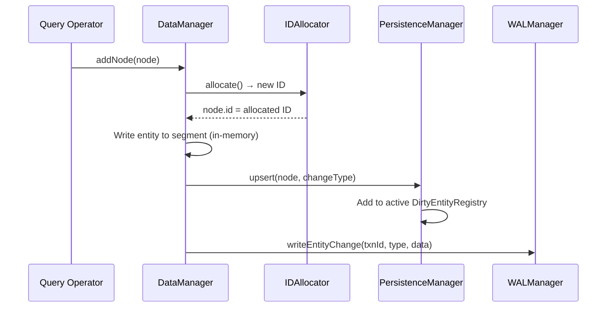
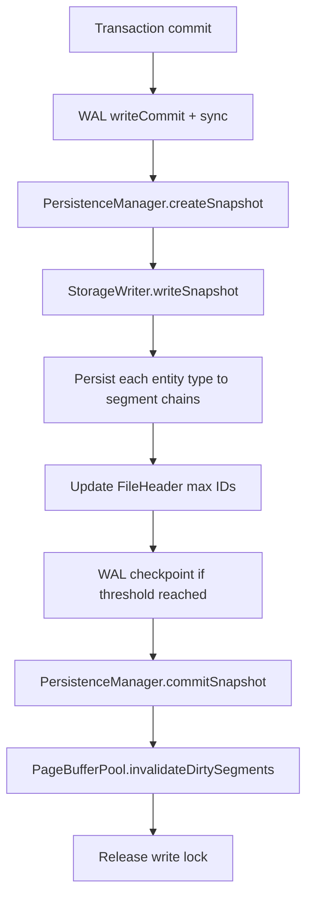

# Storage System

The storage layer is coordinated by `FileStorage`, with `DataManager` handling entity read/write and `SegmentTracker` / `SpaceManager` managing space allocation.

## Component Responsibilities

| Component | Responsibility |
|-----------|---------------|
| **FileStorage** | Opens/closes the database file, initializes all sub-components, coordinates `save()` / `flush()` |
| **DataManager** | Unified facade for all entity types; holds `TransactionContext`, `PageBufferPool`, and per-type managers |
| **PersistenceManager** | Maintains six `DirtyEntityRegistry` instances (one per entity type); triggers auto-flush when dirty count exceeds threshold |
| **StorageWriter** | Writes a `FlushSnapshot` to disk — handles segment allocation, in-place updates, and file truncation |
| **SegmentTracker** | Tracks segment headers and linked-list chains; maps entity IDs to segment offsets via activity bitmaps |
| **IDAllocator** | Per-type ID allocation with a three-tier cache (hot vector, cold intervals, volatile intervals) backed by segment scanning |
| **StorageIO** | Cross-platform I/O abstraction — uses `pread`/`pwrite` where available, falls back to `fstream` seek |

## Entity Types

The system manages six entity types, each with its own segment chain and index structure:

| Type | Description | Segment Chain Head |
|------|-------------|-------------------|
| Node | Graph nodes with labels and property references | `fileHeader.node_segment_head` |
| Edge | Directed edges with type and endpoint references | `fileHeader.edge_segment_head` |
| Property | Key-value property records (inline or blob-backed) | `fileHeader.property_segment_head` |
| Blob | Large binary data (compressed with zlib) | `fileHeader.blob_segment_head` |
| Index | Index metadata and structures | `fileHeader.index_segment_head` |
| State | Internal system state records | `fileHeader.state_segment_head` |

## Read Path

The read path has three levels of lookup:

1. **Transaction context** — If the current transaction has modified the entity, return the in-memory version.
2. **Flushing dirty set** — If `PersistenceManager` has unflushed dirty entities (double-buffer), return from there.
3. **PageBufferPool → disk** — Check the LRU segment cache; on miss, read from disk via `StorageIO`.

## Write Path

Writes are accumulated in memory:

1. `IDAllocator` assigns a unique ID from its tiered cache.
2. The entity is written to the in-memory segment representation.
3. `PersistenceManager.upsert()` adds it to the active dirty registry.
4. A WAL record is appended for durability.

## Flush and Save

When a write transaction commits, `FileStorage::save()` orchestrates persistence:

**Key details:**

- `createSnapshot()` captures the active dirty maps and swaps in fresh ones (double-buffer), so new writes can continue while flushing proceeds.
- `StorageWriter` handles segment allocation for new entities, in-place updates for modifications, and tombstone marking for deletions.
- After flushing, `invalidateDirtySegments()` removes only the affected pages from `PageBufferPool`, avoiding a full cache clear.

## Integrity and Debugging

- **Integrity verification**: `FileStorage::verifyIntegrity()` validates all segment CRCs and cross-references.
- **Debug inspector**: `DatabaseInspector` provides a detailed view of stored entities.
- **REPL `debug` command**: Inspects nodes, edges, properties, blobs, indexes, and states interactively.

## Source Locations

| Component | Path |
|-----------|------|
| FileStorage | `include/graph/storage/FileStorage.hpp` |
| DataManager | `include/graph/storage/data/DataManager.hpp` |
| PersistenceManager | `include/graph/storage/PersistenceManager.hpp` |
| StorageWriter | `include/graph/storage/StorageWriter.hpp` |
| SegmentTracker | `include/graph/storage/SegmentTracker.hpp` |
| IDAllocator | `include/graph/storage/IDAllocator.hpp` |
| StorageIO | `include/graph/storage/StorageIO.hpp` |
| PageBufferPool | `include/graph/storage/PageBufferPool.hpp` |
