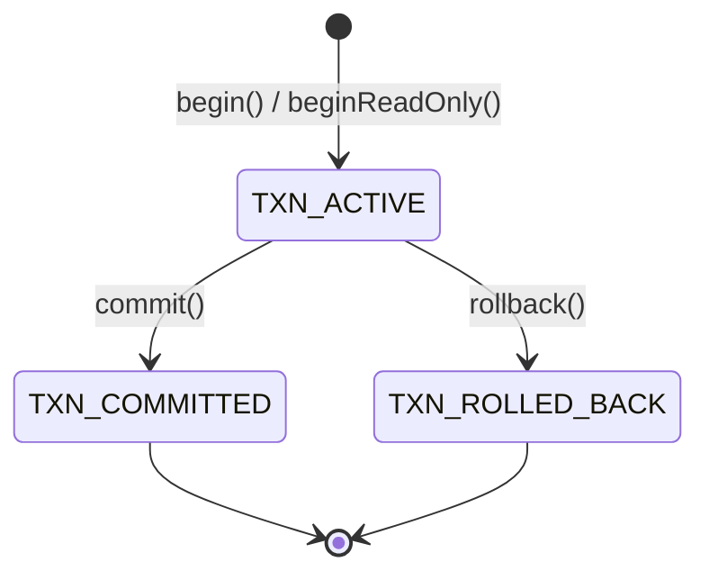
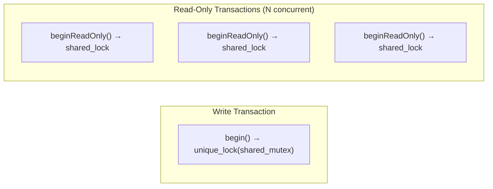
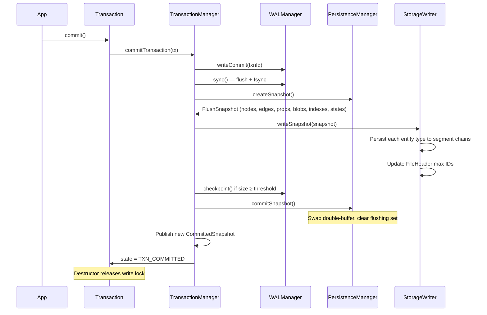
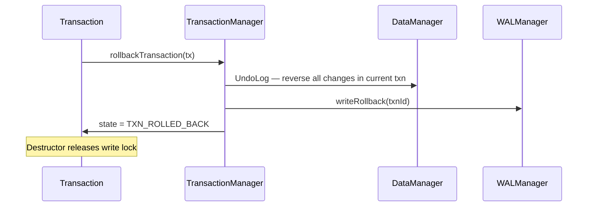
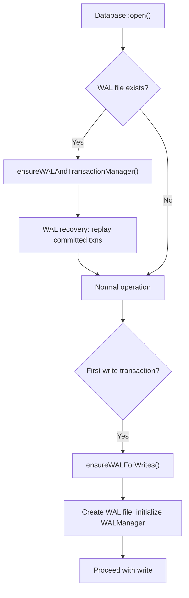

# Transaction Management

Transactions are managed by `TransactionManager`. `Transaction` serves as the external handle with RAII semantics.

## State Machine

`Transaction` is move-only. If a `Transaction` object is destroyed while still `TXN_ACTIVE`, it automatically rolls back.

## Concurrency Strategy

- **Write transactions** — Acquire an exclusive lock (`std::unique_lock<std::shared_mutex>`). Only one write transaction can be active at a time.
- **Read-only transactions** — Acquire a shared lock (`std::shared_lock<std::shared_mutex>`). Multiple read-only transactions can run concurrently with each other, but not while a write transaction holds the exclusive lock.

This single-writer / multi-reader design avoids write-write conflicts entirely and provides snapshot isolation for readers.

## Write Transaction Commit Flow

**Step-by-step:**

1. **WAL commit record** — A `WAL_TXN_COMMIT` record is written and `sync()`'d to disk. This is the point of no return — after this, the transaction is durable even if the process crashes.
2. **Snapshot dirty entities** — `PersistenceManager.createSnapshot()` captures all dirty entities and swaps in fresh registries (double-buffer), allowing new writes to proceed.
3. **Persist to storage** — `StorageWriter` writes each entity type to its segment chain, allocating new segments as needed.
4. **Checkpoint** — If the WAL has grown past the threshold (default 1 MB), a checkpoint truncates it.
5. **Publish snapshot** — A new `CommittedSnapshot` is published for read-only transactions to see.
6. **Release lock** — The write lock is released when the `Transaction` object is destroyed.

## Rollback Flow

On rollback, the `UndoLog` in `TransactionContext` reverses every operation recorded during the transaction (add → remove, update → restore, delete → re-insert). A `WAL_TXN_ROLLBACK` record is written, and the write lock is released.

## WAL Initialization (Two-Phase)

ZYX defers WAL creation until it is actually needed:

This two-phase approach means read-only workloads never incur the overhead of WAL file creation.

## Read-Only Transactions

Read-only transactions receive an immutable `CommittedSnapshot` captured at the moment the transaction begins. They are guaranteed a consistent view of the database throughout their lifetime, without being affected by concurrent write transactions.

Three-layer read-only enforcement prevents any data mutation:

1. **ExecMode** — The query engine rejects write operations in read-only mode.
2. **QueryPlan flags** — The plan itself is marked read-only.
3. **DataManager guard** — The data layer rejects any write calls from a read-only transaction.

## Source Locations

| Component | Path |
|-----------|------|
| Transaction | `include/graph/core/Transaction.hpp` |
| TransactionManager | `include/graph/core/TransactionManager.hpp` |
| CommittedSnapshot | `include/graph/storage/SnapshotManager.hpp` |
| PersistenceManager | `include/graph/storage/PersistenceManager.hpp` |
