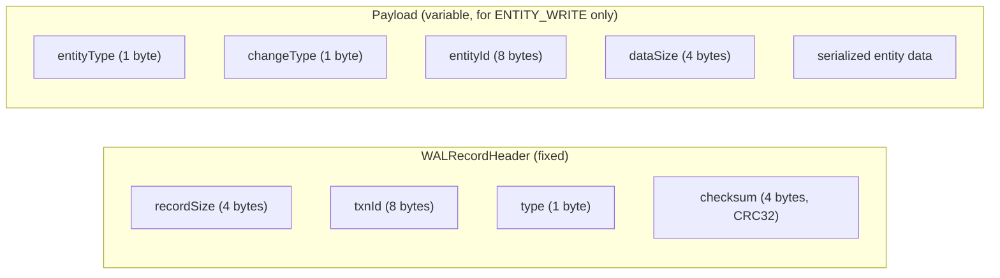
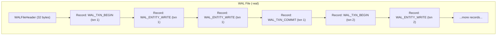
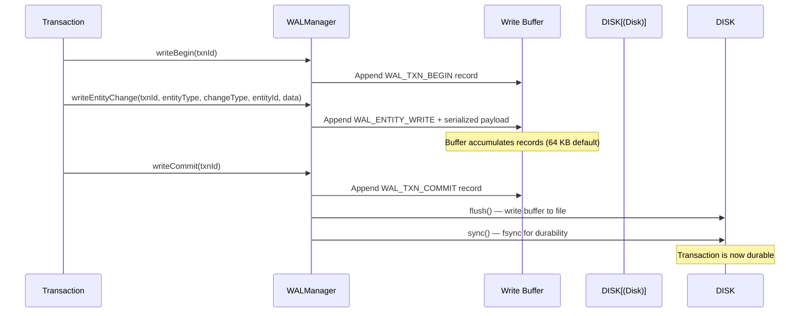
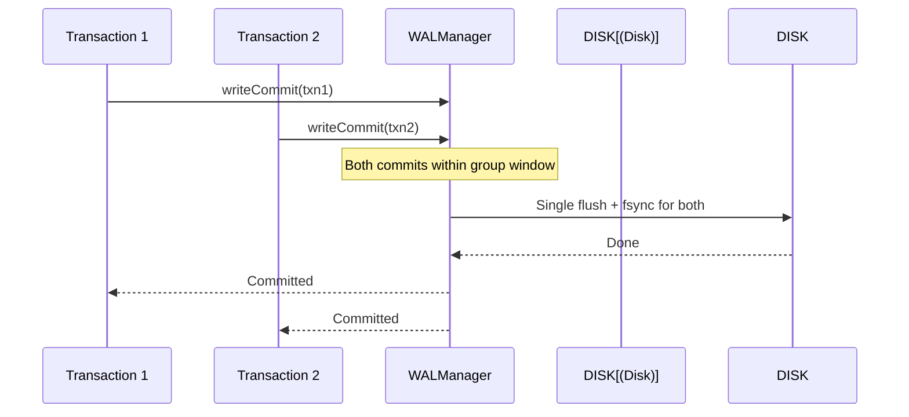
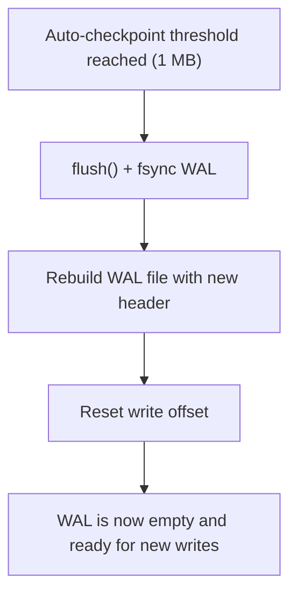
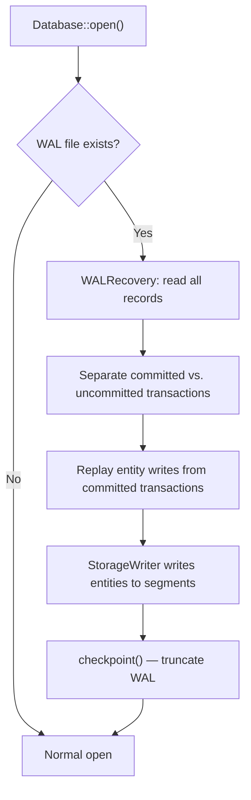

# WAL Implementation

The Write-Ahead Log is managed by `WALManager`. The WAL file is stored at `<db_path>-wal` alongside the main database file.

## Why WAL?

The WAL guarantees **durability** — once a transaction's commit record is written and `sync()`'d to the WAL file, the transaction's changes survive any subsequent process crash. On restart, `WALRecovery` replays committed-but-unflushed entity writes to restore the database to a consistent state.

## Record Types

`WALRecordType` defines four record types:

| Type | Value | Purpose |
|------|-------|---------|
| `WAL_TXN_BEGIN` | 1 | Marks the start of a transaction |
| `WAL_TXN_COMMIT` | 2 | Marks successful commit (point of no return) |
| `WAL_TXN_ROLLBACK` | 3 | Marks rollback (ignore this transaction on recovery) |
| `WAL_ENTITY_WRITE` | 4 | Records an entity change (create, update, or delete) |

### Record Format

Each WAL record consists of a fixed header followed by optional payload:

The CRC32 checksum covers all data after the header, providing integrity verification on recovery.

## WAL File Structure

`WALFileHeader` (32 bytes) contains:

| Field | Description |
|-------|-------------|
| `magic` | `0x5A594C57` ("ZYLW") — validates this is a ZYX WAL file |
| `version` | WAL format version |
| `dbFileSize` | Database file size at WAL creation time |
| `salt1`, `salt2` | Random values for integrity checks |

## Write Mechanism

**Key details:**

- **In-memory buffer** — `writeBuffer_` accumulates records in memory (default 64 KB). This batches small writes into larger I/O operations.
- **Buffer-full flush** — When the buffer exceeds its capacity, it is flushed to disk (without `fsync`) to free memory.
- **Commit-time sync** — On `writeCommit()`, the buffer is flushed and `fsync`'d. This is the durability guarantee.
- **Group commit** — When multiple transactions commit concurrently, `WALManager` uses a microsecond-scale delay window (default 1 ms) to batch multiple commit records into a single `fsync`.

## Group Commit

Group commit reduces the number of `fsync` calls — the most expensive I/O operation — by batching multiple transaction commits into a single disk sync.

## Checkpoint

Checkpointing truncates the WAL after all dirty data has been persisted to the main database file:

The auto-checkpoint threshold is configurable (default 1 MB). Checkpoints are also triggered during database close to ensure a clean shutdown.

## Recovery

When the database opens and detects an existing WAL file, recovery is performed:

**Recovery process:**

1. Read all WAL records sequentially.
2. Identify transactions that have a `WAL_TXN_COMMIT` record — these are committed.
3. For each committed transaction, replay its `WAL_ENTITY_WRITE` records via `StorageWriter`.
4. Transactions without a commit record are considered uncommitted and are ignored.
5. After replay, perform a checkpoint to truncate the WAL.

The WAL file is created lazily — only when the first write transaction actually needs it. Read-only workloads never create a WAL file.

## Source Locations

| Component | Path |
|-----------|------|
| WALManager | `include/graph/storage/wal/WALManager.hpp` |
| WALRecord | `include/graph/storage/wal/WALRecord.hpp` |
| WALRecovery | `src/storage/wal/WALRecovery.cpp` |
| Database (WAL init) | `src/core/Database.cpp` |
