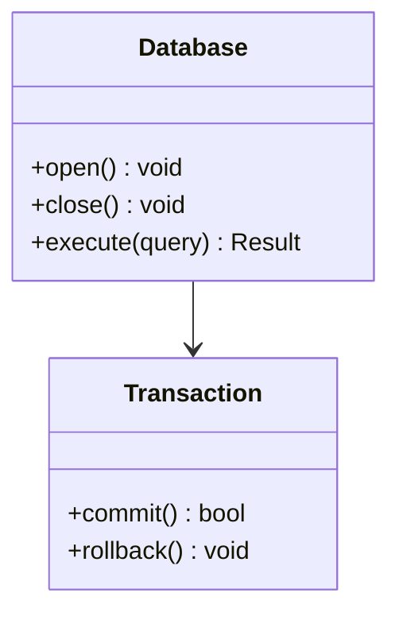

# Documentation Standards

Clear, comprehensive documentation is essential for ZYX's usability and maintainability. This guide outlines documentation standards.

## Documentation Types

### 1. Code Comments

#### File Headers

Every source file should have a descriptive header:

```cpp
/**
 * @file Database.cpp
 * @brief Implementation of the Database class
 *
 * This file implements the core Database class which provides
 * the main interface for database operations including opening,
 * closing, and transaction management.
 *
 * @author ZYX Contributors
 * @date 2024
 */
```

#### Class Documentation

```cpp
/**
 * @class Database
 * @brief Main database interface for graph operations
 *
 * The Database class provides the primary interface for working with
 * ZYX graph databases. It manages database lifecycle, coordinates
 * between storage and query engines, and provides transaction support.
 *
 * Example usage:
 * @code
 * auto db = Database::open("/path/to/database");
 * auto result = db->execute("MATCH (n) RETURN n");
 * db->close();
 * @endcode
 */
class Database {
    // ...
};
```

#### Method Documentation

```cpp
/**
 * @brief Opens an existing database
 *
 * Opens the database at the specified path. The database must already
 * exist or a DatabaseNotFoundException will be thrown.
 *
 * @param path Filesystem path to the database directory
 * @return Unique pointer to the opened Database instance
 *
 * @throws DatabaseNotFoundException if database doesn't exist
 * @throws DatabaseLockException if database is locked by another process
 * @throws IOException if filesystem error occurs
 *
 * @par Example
 * @code
 * try {
 *     auto db = Database::open("/data/mydb");
 *     // Use database
 * } catch (const DatabaseNotFoundException& e) {
 *     std::cerr << "Database not found" << std::endl;
 * }
 * @endcode
 */
static std::unique_ptr<Database> open(const std::string& path);
```

### 2. API Documentation

#### Public API Headers

Public API documentation should be comprehensive and include:

| Section | Description |
|---|---|
| Purpose | What the API does |
| Parameters | Input parameters with types and constraints |
| Return values | What is returned and possible values |
| Exceptions | What errors can be thrown |
| Examples | Usage examples |
| Thread safety | Whether operations are thread-safe |
| Performance | Performance characteristics |

```cpp
/**
 * @brief Execute a Cypher query
 *
 * Executes the given Cypher query string and returns the result.
 * The query is executed in a new auto-commit transaction.
 *
 * @param cypher Cypher query string to execute
 * @return Result object containing query results
 *
 * @throws ParseException if query syntax is invalid
 * @throws ExecutionException if query execution fails
 * @throws ConstraintViolationException if constraints are violated
 *
 * @par Thread Safety
 * This method is thread-safe. Multiple threads can execute queries
 * concurrently.
 *
 * @par Performance
 * Query execution time depends on query complexity. Simple lookups
 * typically complete in < 1ms. Complex pattern matching may take
 * longer.
 *
 * @par Example
 * @code
 * auto result = db->execute("MATCH (n:Person) RETURN n.name");
 * for (const auto& row : result) {
 *     std::cout << row["n.name"].asString() << std::endl;
 * }
 * @endcode
 */
Result execute(const std::string& cypher);
```

### 3. User Documentation

User documentation should be tutorial and example-driven. Write step-by-step guides with runnable code samples at every stage.

Conceptual documentation should explain ideas clearly with diagrams. Use Mermaid diagrams (see Visual Diagram Standards below) to illustrate architectures, state machines, and data flows.

### 4. Architecture Documentation

Architecture documentation describes how components fit together. Each component overview should include:

- **Key responsibilities** — what the component does
- **Implementation location** — source file paths
- **Dependencies** — what other components it relies on

## Documentation Structure

### Directory Organization

| Directory | Purpose |
|---|---|
| `user-guide/` | User-facing guides (quick-start, operations, transactions) |
| `api/` | API reference (C++, C API, types, errors) |
| `architecture/` | Architecture deep-dives (storage, query engine, WAL) |
| `contributing/` | Contributor guides (setup, testing, doc standards) |

## Writing Guidelines

### Style

1. **Use clear, simple language** — avoid jargon when possible
2. **Be concise** — get to the point quickly
3. **Use active voice** — "Create a database" not "A database can be created"
4. **Break into sections** — use headings to organize content
5. **Include examples** — show, don't just tell

### Code Blocks

Always use syntax-highlighted code blocks with a language tag:

- C++ code: use `cpp`
- Shell commands: use `bash`
- Cypher queries: use `cypher`
- Plain text / configs: no language tag

### Admonition Blocks

Use `:::` blocks to call out important information:

:::tip Best Practice
Always close databases when done to release resources.
:::

:::warning
Deleting nodes with `DELETE` on a connected node causes an error. Use `DETACH DELETE` instead.
:::

:::danger
Never modify the database files directly while the database is open.
:::

Available types:

| Type | Use for |
|---|---|
| `:::info` | Supplementary notes and clarifications |
| `:::tip` | Best practices and shortcuts |
| `:::warning` | Potential pitfalls and caveats |
| `:::danger` | Destructive or irreversible actions |

### Tables

Use tables for structured information:

| Method | Description | Thread-Safe |
|---|---|---|
| `open()` | Opens existing database | No |
| `create()` | Creates new database | No |
| `execute()` | Executes query | Yes |

## Visual Diagram Standards

:::danger Critical Rules
These rules apply to ALL diagrams in ZYX documentation. Violations will be caught in review.
:::

### 1. No ASCII Art

Absolutely NO hand-drawn ASCII art diagrams using box-drawing characters (`┌│└─/\` etc.).

- **Why**: ASCII art is difficult to maintain, error-prone, and renders poorly on different devices
- **Always use**: Mermaid diagrams instead

### 2. Color Restrictions — Professional Grayscale Only

| Category | What to use |
|---|---|
| Preferred | No color styling at all (default black/white) |
| Allowed | Subtle grays: `fill:#f0f0f0`, `fill:#e0e0e0`, `fill:#d0d0d0` |
| Forbidden | Any colors: `fill:#90EE90`, `fill:#e1f5ff`, `fill:#ff0`, `fill:lightblue`, etc. |

Colorful diagrams appear unprofessional, may not print well, and can be distracting.

### 3. Mermaid Diagram Types

| Purpose | Mermaid type |
|---|---|
| Class hierarchies / data structures | `classDiagram` |
| Processes and flows | `flowchart TD` or `flowchart LR` |
| State machines | `stateDiagram-v2` |
| Interactions / message passing | `sequenceDiagram` |
| Database schemas | `erDiagram` |

### 4. Diagram Clarity

- Keep diagrams simple and focused
- Avoid excessive detail or visual noise
- Ensure text is readable and labels are clear
- Use consistent styling across all documentation

### Example — Clean Mermaid Diagram



## Code Example Standards

1. **Real Code Only** — all code examples MUST come from actual implementation
   - Forbidden: hypothetical code, pseudo-code, "simplified" examples
   - Required: copy directly from source files
   - Include file paths for context (e.g., `See: include/graph/core/Database.hpp:123-145`)

2. **Code Accuracy**
   - Verify all examples compile and work
   - Keep examples up-to-date with code changes
   - Include necessary headers and context

3. **Code Formatting**
   - Use proper language tags: `cpp`, `bash`, `cypher`
   - Include helpful comments
   - Keep examples focused and concise

## Bilingual Documentation Requirements

### Parallel Structure

- English files: `docs/apps/docs/content/docs/en/...`
- Chinese files: `docs/apps/docs/content/docs/zh/...`
- Mirror directory structure exactly, same filenames in both languages

### Translation Quality

- **Forbidden**: machine translation (Google Translate, DeepL, etc.)
- **Required**: technically accurate human translation
- Use proper technical terminology
- Maintain consistency with existing translations

### Synchronization

- Both versions must be updated together
- Maintain parallel structure and content
- Cross-references must work in both languages

### Navigation Configuration

- Keep frontmatter metadata (`category`, `order`, project fields) complete
- Keep sidebar structure synchronized across both locales
- Use consistent link text (translated appropriately)

## Documentation Review Checklist

Before submitting documentation changes:

**Visual Standards:**
- [ ] No ASCII art diagrams present
- [ ] All Mermaid diagrams use only black/white/gray colors
- [ ] Diagrams are clean and professional
- [ ] Diagrams render correctly in the documentation site

**Content Standards:**
- [ ] Code examples are from actual implementation
- [ ] Code examples include file paths/references
- [ ] Both English and Chinese versions exist
- [ ] Both versions are synchronized
- [ ] Translation is technically accurate (not machine-translated)

**Technical Standards:**
- [ ] All links and cross-references work
- [ ] NexDoc metadata is complete and ordering behaves as expected
- [ ] Diagrams use appropriate Mermaid types
- [ ] Code blocks have correct language tags
- [ ] Tables are properly formatted
- [ ] Spelling and grammar checked

## Review Process

### Updating Documentation

When making code changes:

1. **Update code comments** — keep them in sync with code
2. **Update API docs** — document new APIs or changes
3. **Update examples** — ensure examples still work
4. **Update diagrams** — reflect architectural changes

## Tools

| Tool | Purpose |
|---|---|
| **Doxygen** | API documentation from code comments |
| **NexDoc** (`docs/apps/docs`) | User and architecture documentation |
| **Mermaid** | Text-based diagrams |
| **PlantUML** | Complex UML diagrams |

### Link Checking

```bash
cd docs/apps/docs && bun run check:links
```

## Best Practices

1. **Document as you code** — write documentation alongside code, not as an afterthought
2. **Keep examples working** — test all code examples to ensure they work as documented
3. **Use version-specific docs** — maintain documentation for different versions when needed
4. **Get feedback** — have users review documentation for clarity and completeness
5. **Document decisions** — record important architectural decisions and their rationale

## Metrics

Track documentation quality:

| Metric | Description |
|---|---|
| Coverage | Percentage of APIs documented |
| Accuracy | Percentage of examples that work |
| Completeness | All concepts documented |
| Clarity | User comprehension scores |

## See Also

- [Development Setup](../contributing/development-setup) — getting started
- [Code Style](../contributing/code-style) — coding standards
- [Writing Tests](../contributing/writing-tests) — test documentation
