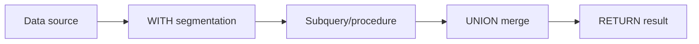

# Advanced Queries

This page covers the core constructs for composing complex query pipelines.



## WITH — Pipeline Boundary

`WITH` splits a query into stages, each with independent filtering and projection:

```cypher
MATCH (p:Person)
WITH p, p.age AS age
WHERE age >= 30
RETURN p.name, age
ORDER BY age DESC;
```

:::info
After `WITH`, only the listed variables remain available in subsequent stages. Unlisted variables are discarded.
:::

## UNION / UNION ALL

Combine results from multiple structurally identical queries:

```cypher
MATCH (n:Person) RETURN n.name AS name
UNION ALL
MATCH (n:Company) RETURN n.name AS name;
```

| Type | Behavior |
|---|---|
| `UNION` | Deduplicated merge |
| `UNION ALL` | Keep all rows (including duplicates) |

## UNWIND — Expand into Rows

Expand a list into multiple rows — commonly used as a data source for batch operations:

```cypher
UNWIND [1, 2, 3] AS x
RETURN x, x * 10;
```

## CALL Subquery and Transactional Batching

```cypher
MATCH (n:Input)
CALL {
  WITH n
  CREATE (:Output {v: n.val})
} IN TRANSACTIONS OF 1000 ROWS
RETURN n.val;
```

:::tip
`IN TRANSACTIONS OF N ROWS` commits in batches of N rows, ideal for large-volume writes. See [Batch Operations](batch-operations).
:::

## LOAD CSV

Ingest CSV files directly within a query:

```cypher
LOAD CSV WITH HEADERS FROM 'file:///tmp/users.csv' AS row
RETURN row.name, row.age;
```

Custom field delimiter (e.g., TSV):

```cypher
LOAD CSV WITH HEADERS FROM 'file:///tmp/users.tsv' AS row FIELDTERMINATOR '\t'
RETURN row.name;
```

## Built-in Procedures

### Config & Stats

| Procedure | Description |
|---|---|
| `dbms.listConfig()` | List all configuration items |
| `dbms.getConfig(key)` | Get a specific config value |
| `dbms.setConfig(key, value)` | Set a configuration item |
| `dbms.showStats()` | View database statistics |
| `dbms.resetStats()` | Reset statistics counters |

### Vector Index

| Procedure | Description |
|---|---|
| `db.index.vector.queryNodes(idx, k, vec)` | Vector nearest-neighbor search |
| `db.index.vector.train(idx)` | Train a vector index |

### Graph Algorithms

| Procedure | Description |
|---|---|
| `algo.shortestPath(startId, endId)` | Shortest path |

### GDS Graph Algorithms

GDS (Graph Data Science) procedures use a named projection pattern: project a subgraph first, then run algorithms.

| Procedure | Parameters | Description |
|---|---|---|
| `gds.graph.project(name, label, type, weight?)` | Projection name, node label, edge type, optional weight property | Create graph projection |
| `gds.graph.drop(name)` | Projection name | Drop graph projection |
| `gds.pageRank.stream(name, maxIter?, damping?)` | Projection name, optional iterations, optional damping factor | PageRank |
| `gds.wcc.stream(name)` | Projection name | Weakly Connected Components |
| `gds.betweenness.stream(name, samplingSize?)` | Projection name, optional sampling size | Betweenness Centrality |
| `gds.closeness.stream(name)` | Projection name | Closeness Centrality |
| `gds.shortestPath.dijkstra.stream(name, startId, endId)` | Projection name, source ID, target ID | Dijkstra shortest path |

## EXPLAIN / PROFILE

Two key tools for query tuning:

| Command | Purpose |
|---|---|
| `EXPLAIN` | View the logical plan structure without executing |
| `PROFILE` | Execute the query and return actual timing and row counts per step |


