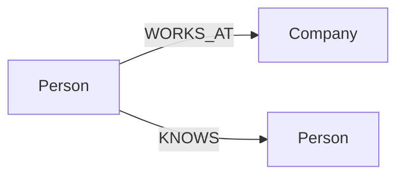

# Basic Operations



## Create

```cypher
CREATE (p:Person {name: 'Alice', age: 30});
CREATE (c:Company {name: 'ZYX'});
MATCH (p:Person {name: 'Alice'}), (c:Company {name: 'ZYX'})
CREATE (p)-[:WORKS_AT {since: 2026}]->(c);
```

## Read

```cypher
MATCH (p:Person) RETURN p.name, p.age ORDER BY p.age DESC;
MATCH (p:Person)-[r:WORKS_AT]->(c:Company)
RETURN p.name, c.name, r.since;
```

## Update

```cypher
MATCH (p:Person {name: 'Alice'})
SET p.age = 31, p.city = 'Shanghai';

MATCH (p:Person {name: 'Alice'})
SET p:Employee;

MATCH (p:Person {name: 'Alice'})
REMOVE p.city;

MATCH (p:Person)
SET p += {active: true, source: 'import-1'};
```

## Delete

Delete relationship only:

```cypher
MATCH (:Person {name: 'Alice'})-[r:WORKS_AT]->(:Company)
DELETE r;
```

Delete node with attached edges:

```cypher
MATCH (p:Person {name: 'Alice'})
DETACH DELETE p;
```

## Indexes and Constraints

```cypher
CREATE INDEX person_name_idx FOR (n:Person) ON (n.name);
SHOW INDEXES;
DROP INDEX person_name_idx;
```

```cypher
CREATE CONSTRAINT person_email_unique FOR (n:Person)
REQUIRE n.email IS UNIQUE;
SHOW CONSTRAINT;
DROP CONSTRAINT person_email_unique;
```

## Vector Index (if your workload includes embeddings)

```cypher
CREATE VECTOR INDEX doc_vec_idx ON :Doc(embedding)
OPTIONS {dimension: 4, metric: 'COSINE'};

CALL db.index.vector.queryNodes('doc_vec_idx', 5, [0.1, 0.2, 0.3, 0.4])
YIELD node, score
RETURN node, score;
```

## Which Operation Pattern to Choose

| Goal | Recommended Pattern |
|---|---|
| Insert small amount of graph data | `CREATE` in REPL or script |
| Upsert entity by key | `MERGE` + `ON CREATE/ON MATCH SET` |
| Remove connected node safely | `DETACH DELETE` |
| Enforce data quality | `CREATE CONSTRAINT` |
| Accelerate equality/range lookup | `CREATE INDEX` |
| ANN retrieval | `CREATE VECTOR INDEX` + `db.index.vector.queryNodes` |
