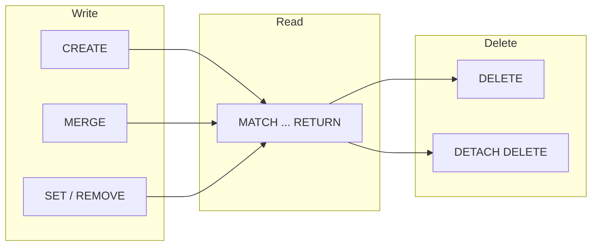

# Basic Operations

This page covers the most common graph operations in ZYX, organized by CRUD flow.



## Create Nodes and Relationships

```cypher
CREATE (p:Person {name: 'Alice', age: 30});
CREATE (c:Company {name: 'ZYX'});
MATCH (p:Person {name: 'Alice'}), (c:Company {name: 'ZYX'})
CREATE (p)-[:WORKS_AT {since: 2026}]->(c);
```

:::tip Idempotent Writes
For "create if not exists, update if exists" semantics, use `MERGE` instead of `CREATE`. See [Cypher Basics](cypher-basics).
:::

## Read

```cypher
MATCH (p:Person) RETURN p.name, p.age ORDER BY p.age DESC;
MATCH (p:Person)-[r:WORKS_AT]->(c:Company)
RETURN p.name, c.name, r.since;
```

## Update Properties and Labels

| Operation | Syntax |
|---|---|
| Set properties | `SET p.age = 31, p.city = 'Shanghai'` |
| Add label | `SET p:Employee` |
| Remove property | `REMOVE p.city` |
| Merge properties | `SET p += {active: true}` |

:::info
`SET p += {...}` is a merge operation — it only overwrites the specified keys without affecting other properties.
:::

## Delete

| Target | Statement |
|---|---|
| Relationship only | `DELETE r` |
| Node with all attached edges | `DETACH DELETE p` |

:::warning
`DELETE` on a node that still has relationships will cause an error. Use `DETACH DELETE` to remove the node and all its relationships together.
:::

## Indexes

### Property Index

```cypher
CREATE INDEX person_name_idx FOR (n:Person) ON (n.name);
SHOW INDEXES;
DROP INDEX person_name_idx;
```

### Vector Index

For embedding-based nearest-neighbor search (e.g., RAG scenarios):

```cypher
CREATE VECTOR INDEX doc_vec_idx ON :Doc(embedding)
OPTIONS {dimension: 4, metric: 'COSINE'};

CALL db.index.vector.queryNodes('doc_vec_idx', 5, [0.1, 0.2, 0.3, 0.4])
YIELD node, score
RETURN node, score;
```

## Constraints

ZYX supports the following constraint types on both nodes and edges:

| Constraint | Semantics |
|---|---|
| `IS UNIQUE` | Property value must be unique |
| `IS NOT NULL` | Property must not be null |
| `NODE KEY` | Composite unique key (nodes only) |
| `IS ::TYPE` | Property type constraint (e.g., `IS ::BOOLEAN`, `IS ::INTEGER`) |

```cypher
CREATE CONSTRAINT person_email_unique FOR (n:Person)
REQUIRE n.email IS UNIQUE;

CREATE CONSTRAINT user_age_not_null FOR (n:Person)
REQUIRE n.age IS NOT NULL;

CREATE CONSTRAINT rel_since_type FOR ()-[r:WORKS_AT]-()
REQUIRE r.since IS ::INTEGER;
```

:::tip
A unique constraint automatically creates an index. Creating an index on frequently queried properties can significantly improve `MATCH` performance.
:::

## Operation Selection Cheat Sheet

| Goal | Recommended Pattern |
|---|---|
| Insert small amount of graph data | `CREATE` in REPL or script |
| Upsert entity by key | `MERGE` + `ON CREATE/ON MATCH SET` |
| Remove connected node safely | `DETACH DELETE` |
| Enforce data quality | `CREATE CONSTRAINT` |
| Accelerate equality/range lookup | `CREATE INDEX` |
| ANN retrieval | `CREATE VECTOR INDEX` + `db.index.vector.queryNodes` |
