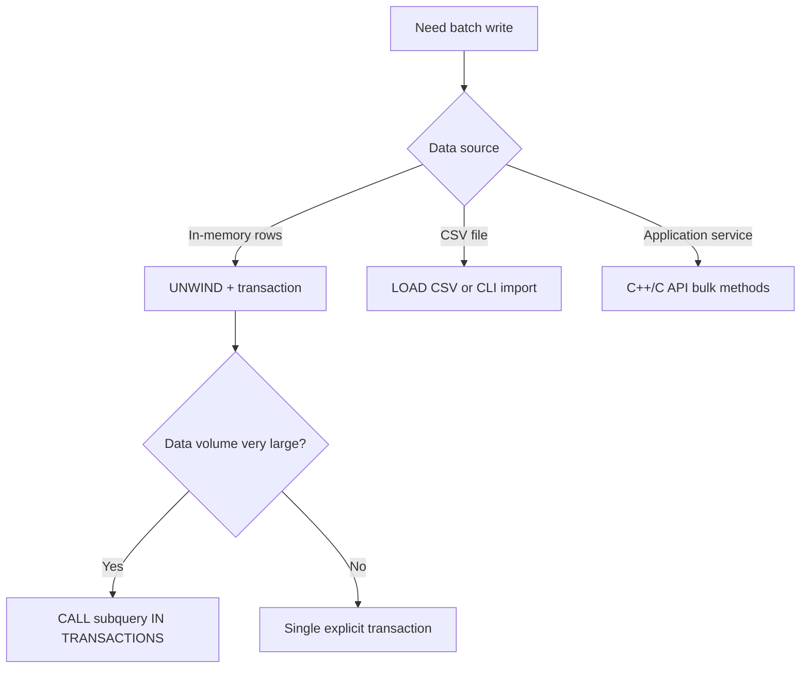

# Batch Operations

## Strategy Selection



## Pattern A: UNWIND + Explicit Transaction

```cypher
BEGIN;
UNWIND [
  {name: 'u1', age: 20},
  {name: 'u2', age: 21}
] AS row
CREATE (:User {name: row.name, age: row.age});
COMMIT;
```

## Pattern B: Subquery Transaction Batching

```cypher
UNWIND $rows AS row
CALL {
  WITH row
  MERGE (:User {name: row.name})
} IN TRANSACTIONS OF 1000 ROWS
RETURN count(*) AS processed;
```

## Pattern C: Script Execution

```bash
./buildDir/apps/cli/zyx database exec ./demo.graph ./batch.cypher
```

Use this when you need repeatable operational runs or CI-style seeding.

## Pattern D: Native Bulk APIs (Service Side)

Prefer native APIs for extreme throughput:

- `Database::createNodes(...)`
- `Database::createNodeRetId(...)`
- `Database::createEdgeById(...)`

## Operational Checklist

- Define a clear batch size and commit cadence.
- Log successful/failed batch ranges for restartability.
- Keep idempotent keys for replay safety (`MERGE` where needed).
- Run integrity verification query after each major batch.
