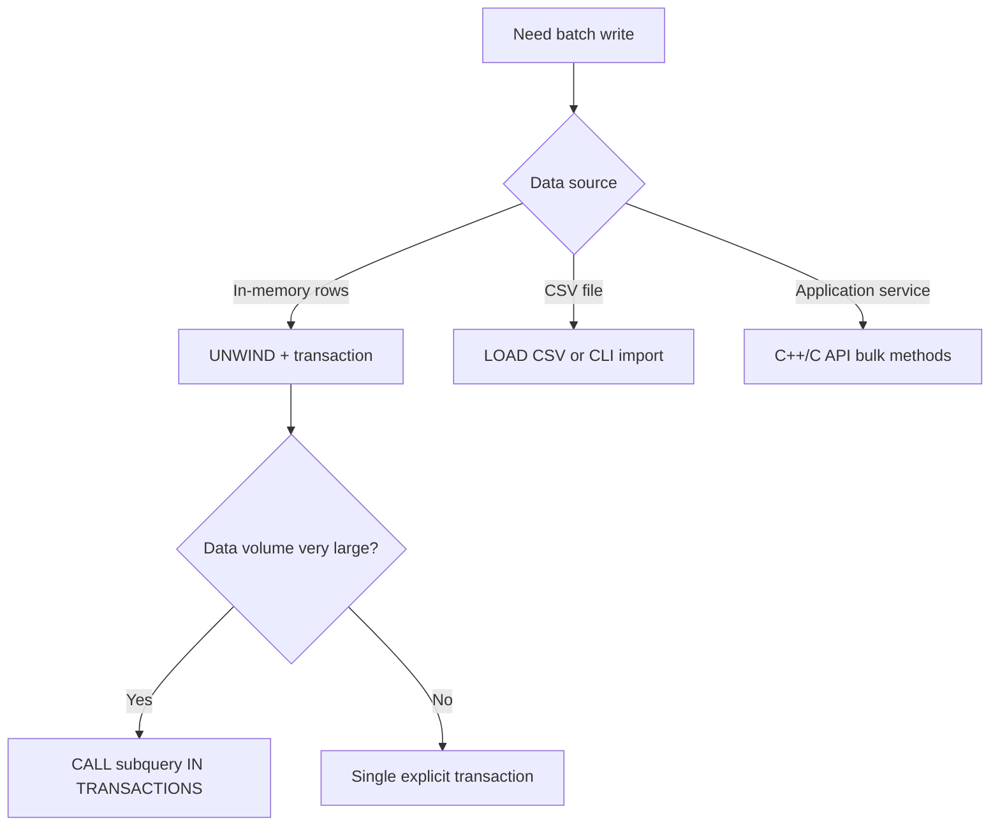

# Batch Operations

## Strategy Selection



## Pattern A: UNWIND + Explicit Transaction

Best for medium-scale writes when data is already in memory as a list:

```cypher
BEGIN;
UNWIND [
  {name: 'u1', age: 20},
  {name: 'u2', age: 21}
] AS row
CREATE (:User {name: row.name, age: row.age});
COMMIT;
```

## Pattern B: Subquery Transaction Batching

Best for large-scale writes with automatic batch commits:

```cypher
UNWIND $rows AS row
CALL {
  WITH row
  MERGE (:User {name: row.name})
} IN TRANSACTIONS OF 1000 ROWS
RETURN count(*) AS processed;
```

:::info
`IN TRANSACTIONS OF N ROWS` splits data into batches of N rows, each committed independently. A failed batch does not affect already-completed batches.
:::

## Pattern C: Script Execution

Best for repeatable operational runs or CI-style seeding:

```bash
zyx database exec ./demo.graph ./batch.cypher
```

## Pattern D: Native Bulk APIs

Prefer native C++ APIs for extreme throughput:

| Method | Description |
|---|---|
| `Database::createNodes(label, propsList)` | Batch-create nodes with the same label |
| `Database::createNodeRetId(label, props)` | Create a node and immediately return its internal ID |
| `Database::createEdgeById(srcId, dstId, type, props)` | Create an edge by ID directly, O(1) complexity |

:::tip
`createEdgeById` bypasses query parsing and index lookups, directly creating edges by internal ID — the most efficient way to create edges.
:::

## Operational Checklist

- Define a clear batch size and commit cadence
- Log successful/failed batch ranges for restartability
- Keep idempotent keys for replay safety (`MERGE` where needed)
- Run integrity verification query after each major batch
