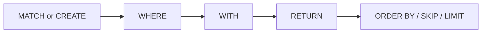

# Cypher Basics

ZYX uses Cypher as its graph query language. This page outlines the available clauses, expressions, and functions.

## Query Pipeline

A typical Cypher query follows this pipeline:



:::info
Not all clauses are required — a minimal query can be just `RETURN`. The diagram above shows the typical composition order.
:::

## Clause Families

| Family | Clauses |
|---|---|
| Read | `MATCH`, `OPTIONAL MATCH`, `WHERE`, `RETURN` |
| Write | `CREATE`, `MERGE`, `SET`, `REMOVE`, `DELETE`, `DETACH DELETE` |
| Result shaping | `DISTINCT`, `ORDER BY`, `SKIP`, `LIMIT` |
| Composition | `WITH`, `UNION`, `UNION ALL`, `UNWIND`, `FOREACH` |
| Procedures/subqueries | `CALL ...`, `CALL { ... }`, `CALL { ... } IN TRANSACTIONS` |
| Data loading & inspection | `LOAD CSV`, `EXPLAIN`, `PROFILE` |
| Admin DDL | `CREATE/DROP INDEX`, `CREATE/DROP CONSTRAINT`, `SHOW INDEXES`, `SHOW CONSTRAINT` |

## Patterns and Expressions

| Construct | Syntax | Description |
|---|---|---|
| Node | `(n)`, `(n:Label)`, `(n {k: v})` | Variable, label, and properties can be freely combined |
| Relationship | `-[r:REL]->`, `-[:REL]->`, `-[:REL]-` | Directed or undirected |
| Multi-label | `(n:Person:Employee)` | Match nodes with all listed labels |
| Variable-length | `[:REL*1..3]` | 1 to 3 hops |
| Map projection | `n {.name, .age, score: expr, .*}` | Selectively project node properties |
| List comprehension | `[x IN list WHERE cond \| expr]` | Filter and transform lists |
| Pattern comprehension | `[(n)-[:KNOWS]->(m) \| m.name]` | Project pattern matches into a list |

## Operators and Predicates

| Category | Operators |
|---|---|
| Arithmetic | `+ - * / % ^` |
| Comparison | `= <> != < <= > >=` `IN` `BETWEEN ... AND ...` |
| Boolean | `AND OR XOR NOT` |
| String | `STARTS WITH` `ENDS WITH` `CONTAINS` `=~` |
| Null | `IS NULL` `IS NOT NULL` |
| Conditional | `CASE WHEN ... THEN ... ELSE ... END` |

## Built-in Function Groups

| Group | Functions |
|---|---|
| Aggregation | `count`, `sum`, `avg`, `min`, `max`, `collect` (all support `DISTINCT`), `stDev`, `stDevP`, `percentileDisc`, `percentileCont` |
| String | `toString`, `upper`/`toUpper`, `lower`/`toLower`, `trim`, `lTrim`, `rTrim`, `left`, `right`, `substring`, `replace`, `split`, `reverse`, `length` |
| Math | `abs`, `ceil`, `floor`, `round`, `sqrt`, `sign`, `log`, `log10`, `exp`, `pow`, `sin`, `cos`, `tan`, `asin`, `acos`, `atan`, `atan2`, `rand`, `pi`, `e` |
| List | `size`, `range`, `head`, `tail`, `last`, `reverse` |
| Conversion | `toInteger`, `toFloat`, `toBoolean` |
| Temporal | `date`, `datetime`, `duration` |
| Introspection | `id`, `labels`, `type`, `keys`, `properties` |
| Path | `nodes(path)`, `relationships(path)`, `length(path)`, `shortestPath(...)` |
| Quantifier | `all`, `any`, `none`, `single` |
| Utility | `coalesce`, `timestamp`, `randomUUID`, `exists((pattern))`, `reduce(...)` |

## Temporal Types

ZYX supports three temporal types: **Date**, **DateTime**, and **Duration**.

### Creating Temporal Values

```cypher
// Current date and time
RETURN date() AS today, datetime() AS now

// From ISO strings
RETURN date("2024-01-15") AS d,
       datetime("2024-01-15T13:45:30") AS dt,
       duration("P1Y2M3DT4H5M6S") AS dur

// From component maps
RETURN date({year: 2024, month: 1, day: 15}) AS d,
       datetime({year: 2024, month: 1, day: 15, hour: 13, minute: 45, second: 30}) AS dt,
       duration({years: 1, months: 2, days: 3, hours: 4}) AS dur
```

### Temporal Arithmetic

| Expression | Result Type | Description |
|---|---|---|
| `date + duration` | Date | Add duration to date |
| `datetime + duration` | DateTime | Add duration to datetime |
| `date - duration` | Date | Subtract duration from date |
| `datetime - duration` | DateTime | Subtract duration from datetime |
| `date - date` | Duration | Difference between two dates |
| `datetime - datetime` | Duration | Difference between two datetimes |
| `duration + duration` | Duration | Sum two durations |
| `duration - duration` | Duration | Difference between two durations |

### Component Access

```cypher
WITH date("2024-06-15") AS d
RETURN d.year, d.month, d.day

WITH datetime("2024-06-15T13:45:30") AS dt
RETURN dt.year, dt.month, dt.day, dt.hour, dt.minute, dt.second

WITH duration("P1Y2M3DT4H5M6S") AS dur
RETURN dur.months, dur.days
```

## Statistical Aggregation

In addition to the basic aggregation functions, ZYX supports statistical aggregates:

```cypher
// Sample and population standard deviation
MATCH (s:Student)
RETURN stDev(s.score) AS sampleStdDev,
       stDevP(s.score) AS populationStdDev

// Discrete percentile (returns actual value from the set)
MATCH (p:Person)
RETURN percentileDisc(p.age, 0.5) AS medianAge

// Continuous percentile (linear interpolation)
MATCH (p:Person)
RETURN percentileCont(p.score, 0.75) AS p75Score
```

| Function | Description |
|---|---|
| `stDev(expr)` | Sample standard deviation (Welford's algorithm). Returns NULL if n < 2. |
| `stDevP(expr)` | Population standard deviation. Returns NULL if n < 1. |
| `percentileDisc(expr, p)` | Discrete percentile — returns the value at rank `floor(p * (n-1))`. |
| `percentileCont(expr, p)` | Continuous percentile — linear interpolation between adjacent values. |

## Parameterized Queries

```cypher
MATCH (u:User {name: $name})
WHERE u.age >= $minAge
RETURN u.name, u.age;
```

:::tip Production Recommendation
Use parameter APIs to prevent Cypher injection and improve plan cache hit rates:
- C++: `Database::execute(query, params)`
- C API: `zyx_execute_params(...)`
:::

## Capability Boundary

Feature boundary and unsupported list are maintained in [`UNSUPPORTED_CYPHER_FEATURES.md`](https://github.com/nexepic/zyx/blob/main/UNSUPPORTED_CYPHER_FEATURES.md).
