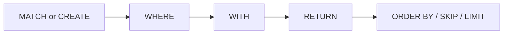

# Cypher Basics



## Clause Families

| Family | Clauses |
|---|---|
| Read | `MATCH`, `OPTIONAL MATCH`, `WHERE`, `RETURN` |
| Write | `CREATE`, `MERGE`, `SET`, `REMOVE`, `DELETE`, `DETACH DELETE` |
| Result shaping | `DISTINCT`, `ORDER BY`, `SKIP`, `LIMIT` |
| Composition | `WITH`, `UNION`, `UNION ALL`, `UNWIND`, `FOREACH` |
| Procedures/subqueries | `CALL ...`, `CALL { ... }`, `CALL { ... } IN TRANSACTIONS` |
| Data loading & inspection | `LOAD CSV`, `EXPLAIN`, `PROFILE` |
| Admin DDL | `CREATE/DROP INDEX`, `CREATE/DROP CONSTRAINT`, `SHOW INDEXES`, `SHOW CONSTRAINT` |

## Pattern and Expression Building Blocks

- Node patterns: `(n)`, `(n:Label)`, `(n {k: v})`
- Relationship patterns: `(a)-[:REL]->(b)`, `(a)-[r:REL]->(b)`, `(a)-[:REL]-(b)`
- Multi-label node pattern: `(n:Person:Employee)`
- Variable-length pattern: `[:REL*1..3]`

## Operators and Predicates

- Arithmetic: `+ - * / % ^`
- Comparison: `= <> != < <= > >=`, `IN`, `BETWEEN`
- Boolean: `AND OR XOR NOT`
- String predicates: `STARTS WITH`, `ENDS WITH`, `CONTAINS`, regex `=~`
- Null checks: `IS NULL`, `IS NOT NULL`
- Conditional: `CASE WHEN ... THEN ... ELSE ... END`

## Built-in Function Groups

| Group | Representative Functions |
|---|---|
| String | `toString`, `upper`, `lower`, `trim`, `substring`, `replace`, `split` |
| Math | `abs`, `ceil`, `floor`, `round`, `sqrt`, `sign` |
| List | `size`, `range`, `head`, `tail`, `last`, `reverse` |
| Conversion | `toInteger`, `toFloat`, `toBoolean` |
| Introspection | `id`, `labels`, `type`, `keys`, `properties` |
| Quantifier | `all`, `any`, `none`, `single` |
| Utility | `coalesce`, `timestamp`, `randomUUID` |

## Parameterized Query Pattern

```cypher
MATCH (u:User {name: $name})
WHERE u.age >= $minAge
RETURN u.name, u.age;
```

Use parameter APIs for production workloads:

- C++: `Database::execute(query, params)`
- C API: `zyx_execute_params(...)`

## Capability Boundary

Feature boundary and unsupported list are maintained in repository root `UNSUPPORTED_CYPHER_FEATURES.md`.
