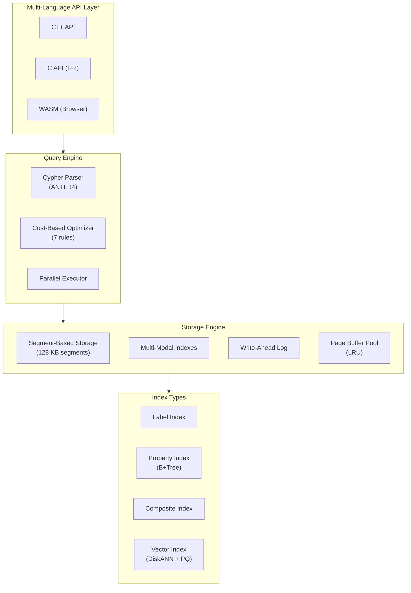
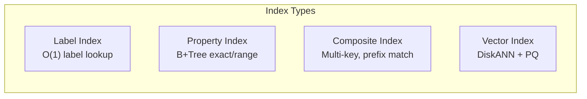
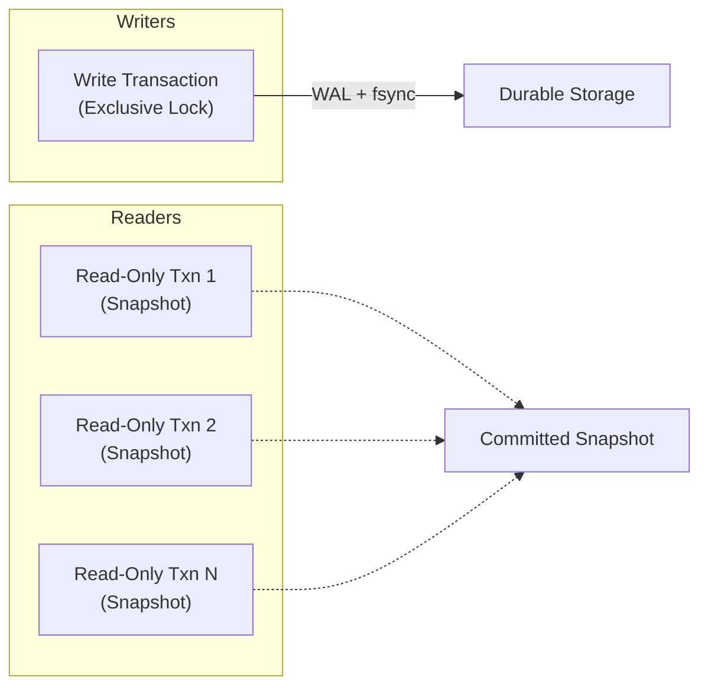
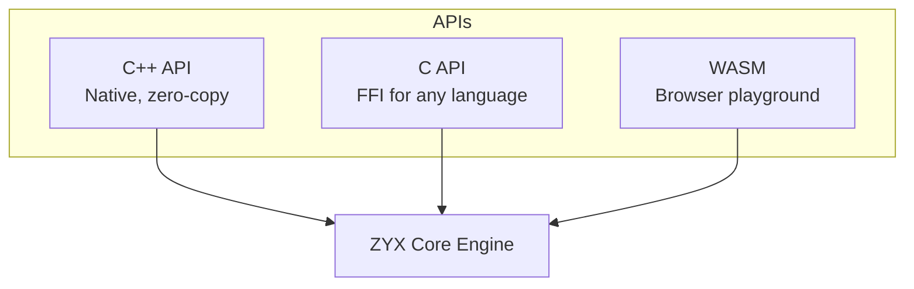

# Features

ZYX is a high-performance, embeddable graph database engine written in C++20. It runs as an in-process library with zero network overhead, supports Cypher queries, ACID transactions, vector search, and graph analytics — all in a single-file database.

:::info What "Embedded" Means
ZYX links directly into your application as a library (like SQLite for graphs). There is no separate server process, no TCP connections, and no deployment infrastructure. Open a file, run queries, close — that's it.
:::

## Architecture at a Glance



## Core Capabilities

### Single-File Embedded Database

| Feature | Detail |
|---------|--------|
| Deployment | Zero-config — one database file, no server process |
| Storage format | Segment-based with CRC32 checksums and zlib compression |
| Segment size | 128 KB fixed-size segments, linked-list chains per entity type |
| File I/O | Cross-platform `pread`/`pwrite` (POSIX) with `fstream` fallback (Windows) |
| Integrity | `verifyIntegrity()` validates CRC on every segment |
| Compaction | Optional background segment compaction |

### Cypher Query Language

ZYX implements a broad subset of the Cypher query language, covering read, write, DDL, and administrative operations.

**Read clauses**: `MATCH`, `OPTIONAL MATCH`, `WHERE`, `RETURN`, `ORDER BY`, `SKIP`, `LIMIT`, `DISTINCT`

**Write clauses**: `CREATE`, `MERGE` (with `ON CREATE SET` / `ON MATCH SET`), `SET`, `REMOVE`, `DELETE`, `DETACH DELETE`

**Composition**: `WITH`, `UNION` / `UNION ALL`, `UNWIND`, `FOREACH`, `CALL { subquery }`, `CALL { ... } IN TRANSACTIONS`

**Data loading**: `LOAD CSV` / `LOAD CSV WITH HEADERS` with `FIELDTERMINATOR`

**Diagnostics**: `EXPLAIN` (logical plan), `PROFILE` (execution with timing)

```cypher
// Pattern matching with variable-length paths
MATCH (a:Person)-[:KNOWS*1..3]->(b:Person)
WHERE a.name = "Alice"
RETURN b.name, length(shortestPath((a)-[*]-(b))) AS distance

// Map projection and list comprehension
MATCH (n:User)
RETURN n {.name, .email, friends: [(n)-[:KNOWS]->(f) | f.name]}
```

:::tip
Feature boundary and unsupported list are maintained in [`UNSUPPORTED_CYPHER_FEATURES.md`](https://github.com/nexepic/zyx/blob/main/UNSUPPORTED_CYPHER_FEATURES.md).
:::

### Rich Data Type System

ZYX supports a comprehensive set of property types:

| Type | Description | Cypher Example |
|------|-------------|----------------|
| Boolean | `true` / `false` | `SET n.active = true` |
| Integer | 64-bit signed | `SET n.age = 30` |
| Double | IEEE 754 double | `SET n.score = 95.5` |
| String | UTF-8 | `SET n.name = "Alice"` |
| List | Heterogeneous | `SET n.tags = ["a", "b"]` |
| Map | String-keyed | `SET n.meta = {k: "v"}` |
| Date | Calendar date | `RETURN date("2024-01-15")` |
| DateTime | Timestamp (ms) | `RETURN datetime()` |
| Duration | ISO 8601 duration | `RETURN duration("P1Y2M")` |
| Float Vector | Embedding vector | Used for vector index search |

Temporal types support arithmetic (`date + duration`, `date - date`) and component access (`d.year`, `dt.hour`).

### Multi-Modal Indexing



| Index Type | Use Case | Cypher |
|------------|----------|--------|
| Label | Fast node/edge lookup by label | `CREATE INDEX FOR (n:Person) ON (n.name)` |
| Property (B+Tree) | Exact match and range scan | `CREATE INDEX FOR (n:Person) ON (n.age)` |
| Composite | Multi-property lookup, prefix match | `CREATE INDEX FOR (n:Person) ON (n.lastName, n.firstName)` |
| Vector (DiskANN) | Approximate nearest neighbor search | `CREATE VECTOR INDEX movie_emb FOR (n:Movie) ON (n.embedding) OPTIONS {dimension: 128, metric: "Cosine"}` |

### Vector Search

ZYX includes a production-grade vector search engine based on the DiskANN algorithm with Product Quantization (PQ) compression.

| Feature | Detail |
|---------|--------|
| Algorithm | DiskANN — navigable small-world graph with alpha-based pruning |
| Distance metrics | L2 (Euclidean), Inner Product, Cosine |
| Storage | BFloat16 (2 bytes/dim, 50% compression vs float32) |
| Quantization | Product Quantization with 256 centroids per subspace |
| Auto-training | PQ codebook auto-trains at configurable threshold (default: 2000 vectors) |
| Hybrid search | PQ for graph navigation, raw BFloat16 for final re-ranking |

```cypher
// Create a vector index
CREATE VECTOR INDEX movie_emb FOR (n:Movie) ON (n.embedding)
OPTIONS {dimension: 128, metric: "Cosine"}

// Search for similar vectors (Top-10)
CALL db.index.vector.queryNodes("movie_emb", 10, $queryVector)
YIELD node, score
RETURN node.title, score
```

### Graph Data Science (GDS)

Built-in graph algorithms accessible through Cypher procedures:

| Algorithm | Procedure | Description |
|-----------|-----------|-------------|
| PageRank | `gds.pageRank.stream` | Iterative importance scoring |
| Connected Components | `gds.wcc.stream` | Union-Find weakly connected components |
| Betweenness Centrality | `gds.betweenness.stream` | Brandes algorithm with optional sampling |
| Closeness Centrality | `gds.closeness.stream` | BFS-based closeness |
| Dijkstra Shortest Path | `gds.shortestPath.dijkstra.stream` | Weighted shortest path |
| Shortest Path | `algo.shortestPath` | Unweighted BFS shortest path |

```cypher
// Project a graph, run PageRank, and return top nodes
CALL gds.graph.project("social", "Person", "KNOWS")
YIELD graphName

CALL gds.pageRank.stream("social", {maxIterations: 20, dampingFactor: 0.85})
YIELD nodeId, score
RETURN nodeId, score ORDER BY score DESC LIMIT 10
```

### ACID Transactions



| Property | Implementation |
|----------|---------------|
| **Atomicity** | UndoLog reverses all changes on rollback |
| **Consistency** | Constraints validated on every insert/update/delete |
| **Isolation** | Single-writer / multi-reader; read-only transactions get immutable snapshots |
| **Durability** | WAL with `fsync` on commit; group commit with 1 ms batching window |

:::info WAL Efficiency
WAL file creation is deferred until the first write transaction. Read-only workloads never touch the WAL file. Auto-checkpoint triggers at 1 MB threshold (configurable).
:::

### Schema Constraints

| Constraint | Syntax | Description |
|------------|--------|-------------|
| Unique | `CREATE CONSTRAINT ... IS UNIQUE` | Enforce uniqueness on one or more properties |
| Not Null | `CREATE CONSTRAINT ... IS NOT NULL` | Enforce property presence |
| Type | `CREATE CONSTRAINT ... IS ::TYPE` | Enforce property value type |
| Node Key | `CREATE CONSTRAINT ... IS NODE KEY` | Composite unique + not-null |

Constraints are validated on insert, update, and delete. Existing data is validated when the constraint is created.

### Query Optimizer

The cost-based optimizer applies up to 7 rules in a fixed-point iteration loop:

| Rule | Effect |
|------|--------|
| Predicate Simplification | Constant folding, duplicate elimination, trivial filter removal |
| Filter Pushdown | Push WHERE predicates closer to scan operators |
| Projection Pushdown | Reduce column width early in the pipeline |
| Index Selection | Cost-based choice: full scan, label scan, property scan, range scan, composite scan |
| Join Reorder | Greedy left-deep reorder by cardinality estimate |
| Sort Elimination | Remove redundant sort when index returns sorted order |
| Limit Pushdown | Push LIMIT below non-DISTINCT projections |

:::tip
Use `EXPLAIN` to view the optimized logical plan without executing, or `PROFILE` to see operator-level timing after execution.
:::

### Built-in Functions

ZYX provides a comprehensive set of built-in functions across multiple categories:

| Category | Functions |
|----------|-----------|
| Aggregation | `count`, `sum`, `avg`, `min`, `max`, `collect`, `stDev`, `stDevP`, `percentileDisc`, `percentileCont` |
| Math | `abs`, `ceil`, `floor`, `round`, `sqrt`, `sign`, `log`, `log10`, `exp`, `pow`, `rand`, `pi`, `e` |
| Trigonometric | `sin`, `cos`, `tan`, `asin`, `acos`, `atan`, `atan2` |
| String | `toString`, `upper`/`toUpper`, `lower`/`toLower`, `trim`, `lTrim`, `rTrim`, `left`, `right`, `substring`, `replace`, `split`, `reverse`, `length` |
| Temporal | `date`, `datetime`, `duration` |
| List | `size`, `range`, `head`, `tail`, `last`, `reverse` |
| Conversion | `toInteger`, `toFloat`, `toBoolean` |
| Quantifier | `all`, `any`, `none`, `single` |
| Utility | `coalesce`, `timestamp`, `randomUUID`, `exists`, `reduce` |

### Parallel Execution

ZYX includes a built-in thread pool for parallel query execution:

| Component | Parallelization |
|-----------|-----------------|
| Query operators | NodeScan, Filter, Sort run in parallel |
| Batch writes | `FileStorage::save()` parallel segment preparation |
| PQ training | K-means training across subspaces |
| Vector search | DiskANN re-ranking and PQ distance computation |

```cypher
// Configure thread pool size at runtime
CALL dbms.setConfig("thread.pool.size", 8)
```

:::info WASM Mode
When compiled to WebAssembly, ZYX automatically runs in single-threaded mode. No configuration needed.
:::

### Runtime Configuration

| Config Key | Description |
|------------|-------------|
| `query.timeout_ms` | Per-query execution timeout |
| `query.max_memory_mb` | Per-query memory limit |
| `query.max_var_length_depth` | Max depth for variable-length traversal |
| `query.slow_log.enabled` | Enable slow query logging |
| `query.slow_log.threshold_ms` | Slow query threshold |
| `thread.pool.size` | Thread pool size (0 = auto) |
| `storage.compaction.enabled` | Enable segment compaction |

```cypher
-- View all configuration
CALL dbms.listConfig

-- Set a timeout of 5 seconds
CALL dbms.setConfig("query.timeout_ms", 5000)

-- View query statistics
CALL dbms.showStats
```

## Multi-Language API

ZYX provides three API surfaces to fit different use cases:



### C++ API

Native API with `std::variant`-based value types, RAII transaction management, and parameterized queries.

```cpp
#include <zyx/zyx.hpp>

zyx::Database db("./my.zyx");
db.open();

// Parameterized query
auto result = db.execute(
    "CREATE (n:Person {name: $name, age: $age}) RETURN n",
    {{"name", std::string("Alice")}, {"age", int64_t(30)}});

// Transaction with auto-rollback on scope exit
auto txn = db.beginTransaction();
txn.execute("CREATE (:Person {name: 'Bob'})");
txn.execute("CREATE (:Person {name: 'Charlie'})");
txn.commit();  // Or let destructor rollback

db.close();
```

### C API

Plain-C API for FFI integration with Python, Rust, Go, or any language with C interop. Includes list/map builders for complex parameter types.

```c
#include <zyx/zyx_c_api.h>

ZYXDB_T* db = zyx_open("./my.zyx");
ZYXResult_T* res = zyx_execute(db, "MATCH (n:Person) RETURN n.name");

while (zyx_result_next(res)) {
    const char* name = zyx_result_get_string(res, 0);
    printf("%s\n", name);
}
zyx_result_close(res);
zyx_close(db);
```

### WebAssembly

ZYX compiles to WebAssembly via Emscripten, enabling a browser-based Cypher playground. Read-only transactions enforce safety in the browser environment.

## Cross-Platform Support

| Platform | Status | Notes |
|----------|--------|-------|
| macOS | Supported | Native `pread`/`pwrite` |
| Linux | Supported | Native `pread`/`pwrite` |
| Windows | Supported | `fstream` fallback I/O, enum prefixes avoid macro conflicts |
| Browser (WASM) | Supported | Single-threaded, read-only playground |

Build system: **Meson** + **Conan** + **Ninja**. Tests: **Google Test** with 95%+ coverage target.
