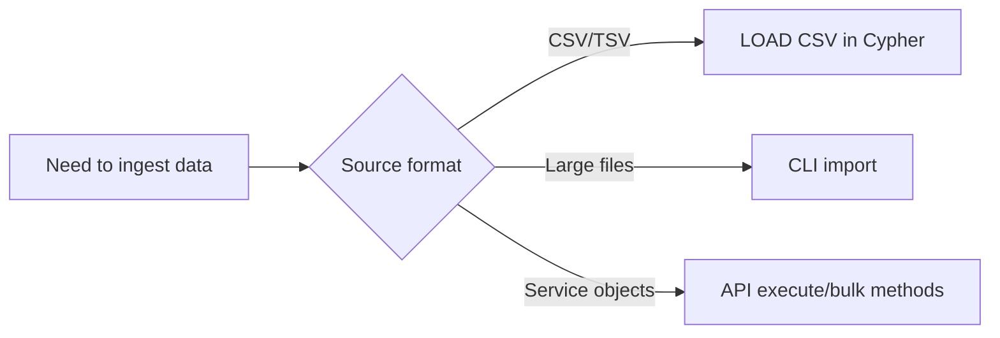
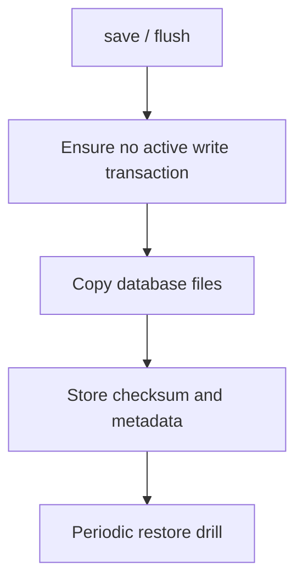

# Import & Export

## Capability Matrix

| Task | Built-in Path | Notes |
|---|---|---|
| Query-time CSV ingest | `LOAD CSV` / `LOAD CSV WITH HEADERS` | Supports `FIELDTERMINATOR` |
| Bulk file ingest | CLI `import` command | CSV and JSONL file modes |
| Result export | API-level result iteration | App writes CSV/JSON/Parquet |
| Physical backup | `save` + copy DB files | Keep no active writes during snapshot |

## Import Decision Flow



## Path 1: LOAD CSV

Ingest CSV within the Cypher query pipeline — suitable for small to medium files:

```cypher
LOAD CSV WITH HEADERS FROM 'file:///tmp/users.csv' AS row
MERGE (:User {name: row.name})
RETURN count(*) AS imported;
```

## Path 2: CLI Bulk Import

Dedicated import command for large file bulk loading:

```bash
zyx import \
  --database ./demo.zyx \
  --nodes ./nodes.csv \
  --relationships ./rels.csv \
  --format auto \
  --array-delimiter ';' \
  --skip-bad-entries
```

### Supported File Formats

#### CSV (Neo4j-compatible headers)

Node file example:

```csv
:name:STRING,:ID,:LABEL,:age:INT
"Alice",p1,"Person;Employee",30
"Bob",p2,"Person",25
```

Relationship file example:

```csv
:START_ID,:END_ID,:TYPE,:since:INT
p1,p2,KNOWS,2026
```

#### JSONL

```json
{"_id": "p1", "_labels": ["Person"], "name": "Alice", "age": 30}
{"_id": "p2", "_labels": ["Person"], "name": "Bob", "age": 25}
```

### Import Command Options

| Option | Description |
|---|---|
| `--database, --db <path>` | Database path (required) |
| `--nodes <files>` | Node data files (required) |
| `--relationships <files>` | Relationship data files (optional) |
| `--format <auto\|csv\|jsonl>` | File format (default: `auto`) |
| `--array-delimiter <char>` | Array value delimiter (default: `;`) |
| `--skip-bad-entries` | Skip malformed rows instead of failing |

:::tip
Use `--skip-bad-entries` to tolerate minor format issues during import. Check the log after import to confirm the number of skipped rows.
:::

## Path 3: Export and Backup

### Query Result Export

Iterate query results through C++ / C API. The application layer decides the output format.

### Physical Backup Workflow



:::warning Backup Consistency
No active write transactions must exist before physical backup. Run `save` and pause writes before copying files.
:::
