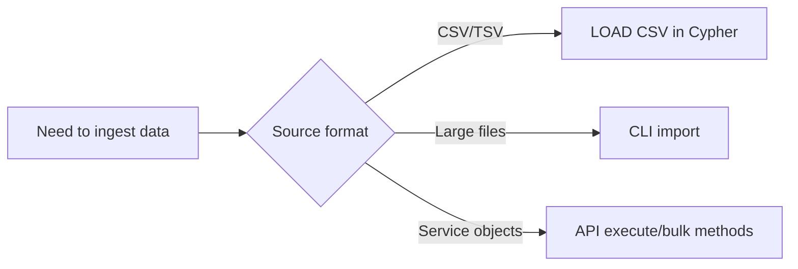
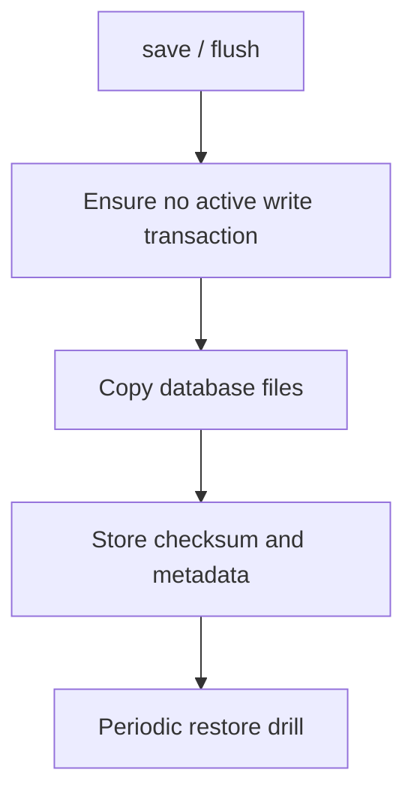

# Import & Export

## Capability Matrix

| Task | Built-in Path | Notes |
|---|---|---|
| Query-time CSV ingest | `LOAD CSV` / `LOAD CSV WITH HEADERS` | Supports `FIELDTERMINATOR` |
| Bulk file ingest | CLI `import` command | CSV and JSONL file modes |
| Result export | API-level result iteration | App writes CSV/JSON/Parquet |
| Physical backup | `save` + copy DB files | Keep no active writes during snapshot |

## Import Decision Flow



## Path 1: LOAD CSV in Query Pipeline

```cypher
LOAD CSV WITH HEADERS FROM 'file:///tmp/users.csv' AS row
MERGE (:User {name: row.name})
RETURN count(*) AS imported;
```

## Path 2: CLI Bulk Import Command

```bash
./buildDir/apps/cli/zyx import \
  --database ./demo.graph \
  --nodes ./nodes.csv \
  --relationships ./rels.csv \
  --format auto \
  --array-delimiter ';' \
  --skip-bad-entries
```

CSV mode understands Neo4j-style headers such as:

- Node: `:ID`, `:LABEL`, `name:STRING`, `age:INT`
- Relationship: `:START_ID`, `:END_ID`, `:TYPE`, `since:INT`

JSONL mode currently prioritizes reserved keys (`_id`, `_labels`, `_start`, `_end`, `_type`) for graph mapping.

## Path 3: Export and Backup

- Export query results through C++/C API result iteration.
- For physical backup:
  1. `save` (or API `save()`) and stop writes.
  2. Copy database files.
  3. Restore by replacing files before next open.


