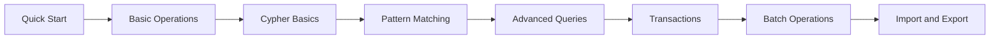
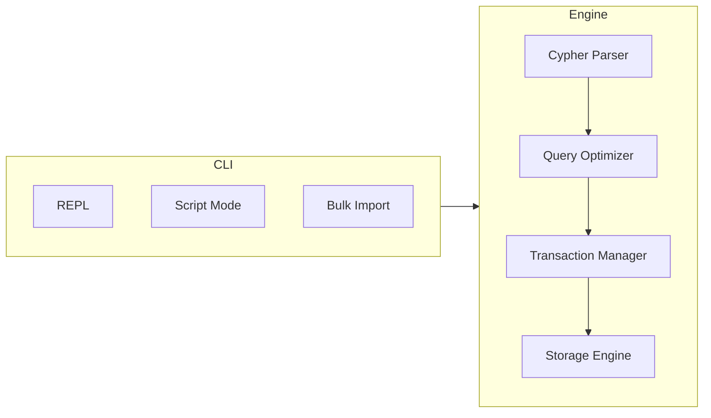

# User Guide

This guide is for end users of ZYX. It focuses on how to use the product effectively, not on source code internals.

:::info
ZYX is an embedded graph database engine with a CLI-first workflow and Cypher query support. If you need to embed ZYX into your own C/C++ application, refer to the C/C++ API documentation.
:::

## Recommended Path

| Step | Document | Focus |
|---|---|---|
| 1 | [Quick Start](quick-start) | Install CLI, open DB, run first queries |
| 2 | [Basic Operations](basic-operations) | CRUD, indexes, constraints |
| 3 | [Cypher Basics](cypher-basics) | Clause model and expression surface |
| 4 | [Pattern Matching](pattern-matching) | Directed/undirected and variable-length patterns |
| 5 | [Advanced Queries](advanced-queries) | WITH/UNION/UNWIND/CALL/LOAD CSV |
| 6 | [Transactions](transactions) | Explicit transaction boundaries and rollback |
| 7 | [Batch Operations](batch-operations) | Large writes/import strategy |
| 8 | [Import & Export](import-export) | Data movement and backup runbook |

## Current Product Profile

- **CLI-first workflow**: REPL interactive mode, script execution, and bulk import command
- **Cypher query language**: Read/write clauses, subqueries, `LOAD CSV`, and admin DDL
- **Multi-modal queries**: Graph queries + vector search + GDS graph algorithm procedures
- **ACID transactions**: Single-writer/multi-reader concurrency model with WAL-backed durability

## Conventions Used in This Guide

:::tip CLI Convention
CLI command examples use `zyx`. If your executable is not on `PATH`, replace `zyx` with the actual path (for example `./zyx` or `./buildDir/apps/cli/zyx`).
:::

- Queries in the REPL execute immediately when terminated with `;`, or on an empty line
- Each Cypher statement runs as an implicit transaction by default (auto-commits on success, auto-rolls back on failure); use `BEGIN` / `COMMIT` / `ROLLBACK` for explicit transaction boundaries
- Feature boundary source of truth: [`UNSUPPORTED_CYPHER_FEATURES.md`](https://github.com/nexepic/zyx/blob/main/UNSUPPORTED_CYPHER_FEATURES.md)
