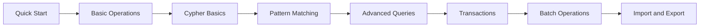

# User Guide

This guide is written for product users who care about using ZYX effectively, not internal source code details.

## Recommended Path

| Step | Document | Focus |
|---|---|---|
| 1 | [Quick Start](quick-start) | Build, open DB, run first queries |
| 2 | [Basic Operations](basic-operations) | CRUD, indexes, constraints |
| 3 | [Cypher Basics](cypher-basics) | Clause model and expression surface |
| 4 | [Pattern Matching](pattern-matching) | Directed/undirected and variable-length patterns |
| 5 | [Advanced Queries](advanced-queries) | WITH/UNION/UNWIND/CALL/LOAD CSV |
| 6 | [Transactions](transactions) | Explicit transaction boundaries and rollback |
| 7 | [Batch Operations](batch-operations) | Large writes/import strategy |
| 8 | [Import & Export](import-export) | Data movement and backup runbook |

## Current Product Profile

- CLI-first workflow: REPL, script mode, and bulk import command.
- Cypher coverage includes read/write clauses, subqueries, `LOAD CSV`, and admin DDL.
- Hybrid capability for graph + vector + GDS procedures.
- ACID transactions with WAL-backed durability.

## Conventions Used in This Guide

- CLI executable path: `./buildDir/apps/cli/zyx`
- Most query examples are intended for REPL and end with `;`
- Transaction statements are `BEGIN` / `COMMIT` / `ROLLBACK`
- Feature boundary source of truth: repository root `UNSUPPORTED_CYPHER_FEATURES.md`
